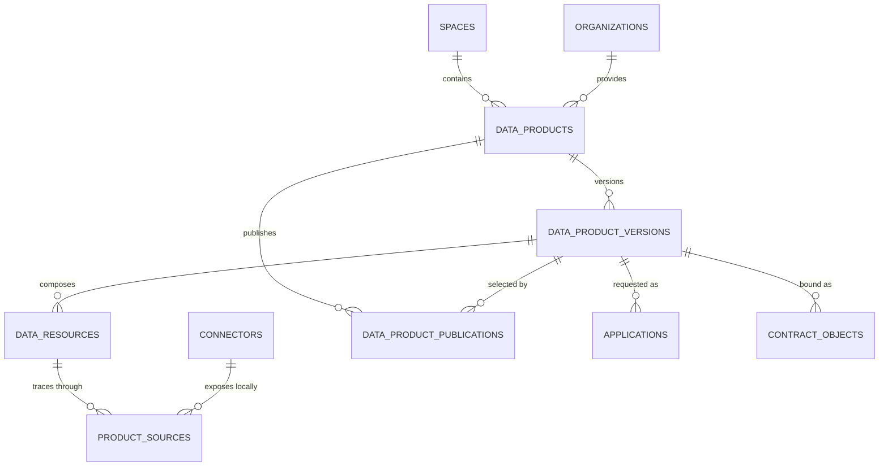
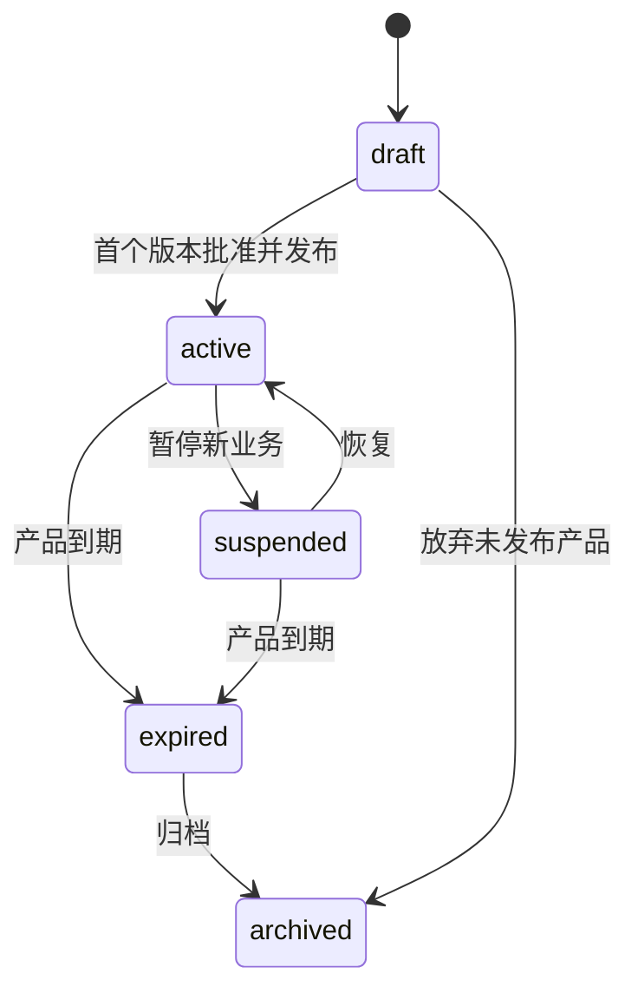
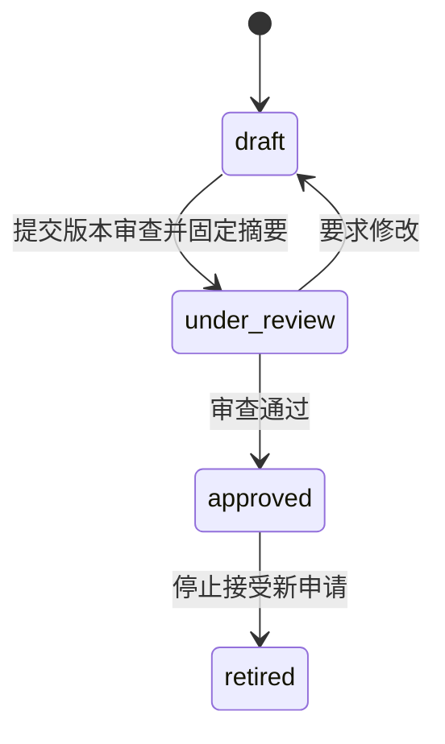
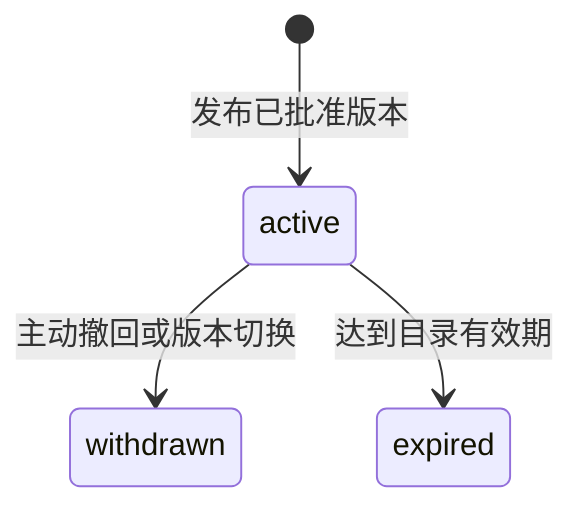

# Phase 2-B.2.3 Catalog / DataProduct 领域模型

## 1. 设计目标

Catalog 的职责不是保存医院数据库或原始医疗文件，而是把医院可提供的数据能力封装成可发现、可申请、可签约、可追溯的产品版本。

本设计回答五个问题：

1. 哪个逻辑产品长期存在？
2. 本次申请针对哪个不可变版本？
3. 该版本由哪些逻辑数据资源组成？
4. 每个资源通过哪些 Connector 追溯到本地来源？
5. 提供方随版本声明了哪些默认使用边界？

本阶段只冻结领域模型，不生成 ORM、migration、API 或前端代码。

## 2. 冻结结论

Catalog 由五个持久化对象和一个版本内值对象构成：

| 对象 | 类型 | 核心职责 |
|---|---|---|
| `DataProduct` | 聚合根 | 产品的稳定逻辑身份和提供方责任。 |
| `DataProductVersion` | 不可变版本聚合 | 固定内容范围、质量、资源组成、来源摘要和默认策略。 |
| `DataResource` | 版本内实体 | 表达 WSI、影像序列、临床表、标注、随访等逻辑资源组件。 |
| `DataProductSource` | 关系实体 | 将一个 DataResource 追溯到 Connector 本地资源别名和来源摘要。 |
| `DataProductPublication` | 目录事实 | 指明哪个已批准版本当前可被目录发现和申请。 |
| `DefaultPolicyTemplate` | DataProductVersion 内的不可变值对象 | 表达提供方默认允许、禁止和要求；不是可直接执行的 Contract Policy。 |

不单独建立 `PolicyTemplate` 表。V1 将规范化模板快照和摘要固定在 DataProductVersion 内，防止共享模板后续修改而改变历史版本语义。如果未来出现跨产品模板治理、模板审批和复用需求，再独立评审模板目录。

## 3. 总体关系



`DefaultPolicyTemplate` 是 DataProductVersion 的组成值，不单独画成共享实体。ProductSource 的数据库表名可继续使用 `product_sources`，领域类名使用 `DataProductSource`。

## 4. DataProduct

### 4.1 定义

DataProduct 是长期存在的产品逻辑身份，例如“鼻咽癌数字病理多模态研究数据产品”。它不是数据库表、文件目录或某次固定数据快照。

### 4.2 字段

| 字段 | 类型 | 说明 |
|---|---|---|
| `id` | uuid | 产品稳定 ID。 |
| `space_id` | uuid | 所属可信数据空间。 |
| `provider_organization_id` | uuid | 对产品内容、来源和授权负责的组织。 |
| `product_code` | text | Space 内稳定业务编码。 |
| `name` | text | 当前展示名称。 |
| `description` | text | 面向目录发现的非版本化产品说明。 |
| `product_type` | text | `controlled_compute`、`api`、`file`、`model_service` 等交付形态。 |
| `domain` | text | `digital_pathology`、`medical_imaging`、`clinical_data`、`multimodal` 等。 |
| `lifecycle_status` | text | `draft`、`active`、`suspended`、`expired`、`archived`。 |
| `is_demo` | boolean | 演示标识。 |
| 通用审计列 | - | `created_at/by`、`updated_at`、`row_version`。 |

### 4.3 不变量

- `(space_id, product_code)` 唯一。
- provider organization 必须是该 Space 内已准入且持有 `provider` 角色的参与方。
- DataProduct 不保存 `current_version_id`；当前目录版本由 DataProductPublication 表达，避免 Product ↔ Version 循环外键。
- 产品存在版本后不得物理删除。
- 名称和目录说明可调整，但内容、资源和使用条件变化必须创建新版本。

## 5. DataProductVersion

### 5.1 定义

DataProductVersion 是某一时点产品内容和使用边界的不可变快照，也是 Application、ContractObject 和后续 Compute 输入的实际业务标的。

### 5.2 字段

| 字段 | 类型 | 说明 |
|---|---|---|
| `id` | uuid | 版本 ID。 |
| `space_id` | uuid | 冗余空间键，用于隔离、查询和未来 RLS；必须与产品一致。 |
| `data_product_id` | uuid | 所属逻辑产品。 |
| `version_no` | integer | 产品内单调递增的内部版本号。 |
| `version_label` | text | `v1.0` 等展示标签，不作为排序依据。 |
| `status` | text | `draft`、`under_review`、`approved`、`retired`。 |
| `content_summary` | text | 版本内容、目标用途和边界摘要。 |
| `scope_metadata` | jsonb | 病种、时间范围、病例规模和人群摘要，不含个体记录。 |
| `linkage_metadata` | jsonb | 多模态资源间的匿名关联规则，不保存患者标识。 |
| `quality_report` | jsonb | 版本级完整性、一致性、代表性、偏倚和适用边界汇总。 |
| `classification_level` | text | 版本内最高分类分级结果。 |
| `default_use_mode` | text | `controlled_compute`、受控 API 等默认使用模式。 |
| `default_policy_template` | jsonb | 规范化默认策略模板快照。 |
| `default_policy_digest` | text | 默认策略规范化摘要。 |
| `provenance_summary` | jsonb | 采集、治理、去标识化和版本形成过程摘要。 |
| `snapshot_digest` | text | 版本整体规范化摘要。 |
| `approved_at/by` | timestamptz / uuid | 批准信息。 |
| `created_at/by` | timestamptz / uuid | 创建信息。 |

### 5.3 摘要层级

```text
ProductSource.source_digest → DataResource.resource_digest ─┐
                                                            ├→ DataProductVersion.snapshot_digest
DefaultPolicyTemplate.default_policy_digest ────────────────┘
```

`snapshot_digest` 至少覆盖：版本号、内容和范围摘要、linkage metadata、质量报告、分类分级、默认使用模式、默认策略摘要，以及按稳定顺序排列的所有 DataResource 摘要。它不是原始医疗数据的哈希清单。

### 5.4 不可变规则

- `draft` 可编辑；`under_review` 内容锁定。需要按审查意见修改时，先退回 `draft` 并关闭本轮审查结论，再修改并重新计算全部摘要。
- 进入 `under_review` 前必须生成所有 Source、Resource、Policy 和 Version 摘要。
- `approved` 后禁止原地修改版本内容、资源、来源、质量、分类分级、默认策略和任何摘要。
- `approved → retired` 只改变可用状态，不改变历史内容。
- 任何新增病例、来源变化、资源格式变化、质量修订或默认策略变化都必须创建新版本。
- `retired` 版本不能接受新申请，但历史申请、合约、任务和审计仍能引用。

数据库实现时，领域服务是主控制点，最小数据库权限或触发器作为不可变性的纵深防御。

## 6. DataResource

### 6.1 定义与粒度

DataResource 是一个产品版本中的逻辑资源组件，不是单个患者、单张切片或单个文件。正确粒度示例：

- “鼻咽癌队列 HE WSI 集合”；
- “去标识化临床变量表”；
- “治疗与随访结局表”；
- “专家区域标注集合”；
- “胸部 CT DICOM 检查集合”。

平台保存资源描述和摘要，不保存 WSI、DICOM、患者行或真实存储路径。

### 6.2 字段

| 字段 | 类型 | 说明 |
|---|---|---|
| `id` | uuid | 版本内资源 ID。 |
| `space_id` | uuid | 冗余空间键；必须与版本一致。 |
| `data_product_version_id` | uuid | 所属产品版本。 |
| `resource_code` | text | 版本内稳定组件编码，如 `wsi_he`、`clinical_core`。 |
| `name` | text | 人类可读资源名称。 |
| `resource_type` | text | `image_collection`、`tabular`、`annotation_set`、`api_resource` 等结构类型。 |
| `modality` | text | `wsi`、`ct`、`mri`、`clinical`、`followup` 等医学模态。 |
| `format` | text | `DICOM-WSI`、`DICOM`、`Parquet`、`FHIR` 等规范或格式。 |
| `schema_metadata` | jsonb | 字段、标签、单位、编码体系和结构描述。 |
| `scope_metadata` | jsonb | 资源级规模、时间和覆盖范围摘要。 |
| `quality_report` | jsonb | 资源级完整性、缺失、图像质量和标注一致性指标。 |
| `classification_level` | text | 资源分类分级。 |
| `resource_digest` | text | 资源描述和全部来源摘要的规范化摘要。 |
| `position_no` | integer | 稳定展示与摘要排序。 |
| `created_at/by` | timestamptz / uuid | 创建信息。 |

### 6.3 不变量

- `(data_product_version_id, resource_code)` 唯一。
- `(data_product_version_id, position_no)` 唯一。
- DataResource 生命周期继承 DataProductVersion，不另设独立状态机。
- 版本进入 `under_review` 后，Resource 必须存在摘要且至少有一个有效来源。
- 版本级 `classification_level` 不得低于任一资源的分类等级。
- 详细 schema 和质量事实以 DataResource 为准；DataProductVersion 的 quality report 是汇总视图，不能出现相互矛盾的手工副本。

## 7. DataProductSource

### 7.1 定义

DataProductSource 将版本内 DataResource 追溯到一个 Connector 的本地资源。它只保存本地别名和摘要，不保存中央可访问路径或凭据。

### 7.2 字段

| 字段 | 类型 | 说明 |
|---|---|---|
| `data_resource_id` | uuid | 所属逻辑资源。 |
| `connector_id` | uuid | 来源连接器注册。 |
| `local_resource_alias` | text | Connector 可解析的本地别名，不是平台文件路径。 |
| `source_digest` | text | 本地来源快照摘要。 |
| `source_role` | text | `primary`、`secondary`。 |
| `source_snapshot_at` | timestamptz | 本地来源快照形成时间。 |

主键建议为 `(data_resource_id, connector_id, local_resource_alias)`。

### 7.3 不变量

- DataResource、所属版本、所属产品和 Connector 必须属于同一 Space。
- Connector owner 默认应为产品 provider organization；多中心联合产品允许其他已准入 provider 贡献，但必须存在明确联合授权证据。
- Connector 必须具备与资源封装或发布相匹配的有效能力。
- 一个 DataResource 可由多个 Connector 联合贡献；一个 Connector 也可贡献多个 DataResource。
- Source 变化会改变 Resource digest，并进一步改变 Version snapshot digest，因此必须产生新版本。

## 8. DefaultPolicyTemplate

### 8.1 定义

DefaultPolicyTemplate 是提供方随产品版本发布的默认使用边界，是不可变值对象，不是最终授权，也不是可直接下发到 Connector 的执行策略。

建议结构：

| 字段 | 含义 |
|---|---|
| `template_version` | 模板结构版本。 |
| `allowed_purposes` | 默认允许的用途词表，如科研、模型验证。 |
| `permitted_actions` | `compute`、受控查询等允许动作。 |
| `prohibited_actions` | 原始数据导出、再分发、个体识别等禁止动作。 |
| `environment_requirements` | 受控环境、连接器能力和区域限制。 |
| `output_rules` | 允许制品类型、出域审查和统计披露要求。 |
| `default_duration` | 默认有效期。 |
| `default_run_limit` | 默认执行次数。 |
| `retention_and_deletion` | 中间结果保留与销毁要求。 |
| `obligations` | 日志、成果回传、署名或通知义务。 |
| `review_requirements` | 伦理、数据提供方和结果出域审查要求。 |

### 8.2 从模板到可执行策略

```text
Space 强制规则
        +
DataProductVersion 默认策略模板
        +
Application 请求与审批结论
        ↓
ContractRevision 内绑定主体和标的的 Policy
        ↓
PolicyExecutionBinding 下发至 Connector
```

- Application 可以请求模板允许范围内的具体使用，也可以提出例外并触发额外审查。
- Contract Policy 必须绑定具体 ContractParty、ContractObject、动作、约束和执行节点。
- 模板不能直接授权访问，Contract 也不能削弱空间强制规则、法律、伦理或分类分级要求。
- 合约生成时复制模板快照并具体化，不保存指向可变模板的运行时引用。

## 9. DataProductPublication

### 9.1 定义

Publication 独立表达“哪个已批准版本当前在目录生效”。它解决目录当前版本问题，同时避免 DataProduct 保存 `current_version_id` 形成循环外键。

### 9.2 字段

| 字段 | 类型 | 说明 |
|---|---|---|
| `id` | uuid | 发布记录 ID。 |
| `space_id` | uuid | 所属空间。 |
| `data_product_id` | uuid | 逻辑产品。 |
| `data_product_version_id` | uuid | 被发布的明确版本，必须属于该产品。 |
| `status` | text | `active`、`withdrawn`、`expired`。 |
| `visibility` | text | `space`、`restricted`、`invitation_only`。 |
| `published_at/by` | timestamptz / uuid | 发布时间和发布人。 |
| `withdrawn_at/by` | timestamptz / uuid | 撤回信息。 |
| `withdrawal_reason` | text | 撤回原因。 |

### 9.3 不变量

- 只有 `approved` DataProductVersion 可以发布。
- 每个 DataProduct 最多一个 `active` Publication。
- 每个 DataProductVersion 最多一个 `active` Publication。
- Publication 必须使用 `(data_product_id, data_product_version_id)` 复合外键确认版本属于产品。
- 切换当前版本必须在一个事务中撤回旧 Publication 并激活新 Publication。
- 撤回不删除版本，也不影响已签署合约对该版本的追溯；是否继续未完成申请由后续业务规则明确处理。

## 10. 状态机

### 10.1 DataProduct



`active` 表示产品业务身份有效；是否存在当前可申请版本仍以 active Publication 为准。

### 10.2 DataProductVersion



审查拒绝记录在 ReviewTask；版本返回 draft 修改或另建版本，不增加含义模糊的 `rejected` 长期状态。

### 10.3 DataProductPublication



## 11. 完整生命周期

1. provider 在目标 Space 创建 DataProduct 逻辑身份。
2. 创建 draft DataProductVersion。
3. 为版本定义一个或多个 DataResource。
4. 每个 DataResource 通过 DataProductSource 绑定 Connector 本地资源别名。
5. 生成 Source digest、Resource digest、默认策略 digest 和 Version snapshot digest。
6. 提交产品版本审查；审查覆盖来源、质量、分类分级、策略和医疗适用边界。
7. 审查通过后版本进入 approved，并冻结版本及其全部组成对象。
8. 创建 active Publication，使版本进入目录并可被申请。
9. Application 固定引用 DataProductVersion；后续 ContractObject 同时保存版本 ID 和 snapshot digest。
10. 范围、来源、质量或策略变化时创建下一版本，不覆盖旧版本。
11. 新版本发布时原子撤回旧 Publication；旧版本按需要进入 retired，但历史证据继续保留。

## 12. 与下游模块的关系

### 12.1 Connector

- ProductSource 只能引用已注册的 Connector。
- Connector 的空间、所有组织、核验状态和能力必须满足版本封装要求。
- 平台只保存 Connector 本地别名；真实资源解析和使用控制留在连接器侧。

### 12.2 Application

- Application 只能申请一个明确的、已批准且当前允许申请的 DataProductVersion。
- 不允许只引用 DataProduct，否则审批期间产品当前版本变化会改变申请标的。
- 建议下游数据库设计为 Application 增加 `requested_product_snapshot_digest`，用于提交时证据固定；这需要在实现 Applications 前更新冻结设计。

### 12.3 Contract

- ContractObject 必须引用明确 DataProductVersion，并保存 `product_snapshot_digest` 和人类可读名称快照。
- 默认策略模板只是输入；最终 Policy 必须绑定 ContractParty、ContractObject 和执行条件。
- 合约不得通过引用“最新产品版本”自动漂移。

### 12.4 Compute

- ComputeJob 只能通过 active ContractRevision 和 ContractObject 使用固定产品版本。
- JobInput 应验证产品版本、合约标的和 Connector 属于同一 Space，并保存策略与算法摘要。
- Compute 不直接读取 Catalog 中的地址；实际资源由授权后的 Connector 解析本地别名。

## 13. 医疗产品适配

| 产品方向 | 典型 DataResource | 来源 Connector | 关键质量维度 |
|---|---|---|---|
| 数字病理 | WSI 集合、IHC、标注、病理报告、随访表 | 病理 Connector、临床 Connector | 扫描质量、染色批次、组织完整性、标注一致性。 |
| 医学影像 | CT/MRI/PET 检查集合、报告、分割标注、结局表 | PACS/影像 Connector、临床 Connector | DICOM 完整性、层厚、设备/协议分布、序列缺失。 |
| 临床数据 | FHIR/API 资源、去标识化临床表、检验、治疗与结局 | HIS/LIS/EMR Connector | 字段完整性、编码标准、时间一致性、缺失与偏倚。 |
| 多模态 | 上述多个资源的版本内组合 | 多个已授权 Connector | 匿名关联覆盖率、模态配对率、时间窗一致性。 |

同一产品版本可以包含多个 DataResource；不能把每位患者、每张 WSI 或每个 DICOM 文件建成一条 DataResource。

## 14. 演示实例

```text
DataProduct
  鼻咽癌数字病理多模态研究数据产品（演示）
  └── DataProductVersion v1.0
      ├── DataResource wsi_he
      │   └── ProductSource → 病理 Connector / npc_wsi_snapshot_v1
      ├── DataResource clinical_core
      │   └── ProductSource → 临床 Connector / npc_clinical_snapshot_v1
      ├── DataResource outcome_followup
      │   └── ProductSource → 临床 Connector / npc_outcome_snapshot_v1
      ├── DefaultPolicyTemplate
      │   ├── permit: controlled_compute
      │   ├── deny: raw_export, re_identification, redistribution
      │   └── require: ethics_review, output_review, audit_logging
      └── DataProductPublication: active / space visibility
```

演示实例只表达产品元数据和流转逻辑，不代表真实医院授权、真实病例或真实可信计算能力。

## 15. 对现有数据库冻结设计的修订影响

本领域冻结不应直接生成 migration。审查通过后，需先更新 `docs/Phase2-database-design.md` 的 Catalog 部分：

1. Catalog 从原四表调整为五表，新增 `data_resources`；项目冻结表总数由 33 变为 34。
2. `product_sources` 的父对象从 DataProductVersion 改为 DataResource。
3. `data_product_versions.schema_metadata` 的资源级职责迁移到 DataResource；版本保留 `linkage_metadata` 和总体范围/质量摘要。
4. `default_policy_template_ref` 改为版本内 `default_policy_template jsonb + default_policy_digest text`，不建立可变共享引用。
5. DataProduct 增加非版本化 `description`。
6. DataResource 与 ProductSource 的摘要必须纳入 Version snapshot digest。
7. Applications 设计需评审增加提交时产品摘要字段。
8. Publication 的复合外键和部分唯一索引保持不变。

只有这份变更清单完成数据库级字段、FK、索引和删除策略复核后，才进入 Catalog ORM 与 migration。

## 16. 验收清单

- [x] DataProduct 与数据库表、文件目录概念分离。
- [x] DataProductVersion 是申请与合约引用的明确不可变标的。
- [x] DataResource 与来源 Connector 分离。
- [x] 支持一个资源多来源、一个 Connector 多资源。
- [x] 默认策略模板与可执行 Contract Policy 分离。
- [x] Publication 独立表达当前目录版本。
- [x] 支持数字病理、医学影像、临床数据和多模态产品。
- [x] 中央平台不保存患者级数据、真实路径或密钥。
- [x] 明确列出对现有数据库冻结设计的变更，不直接写代码。
