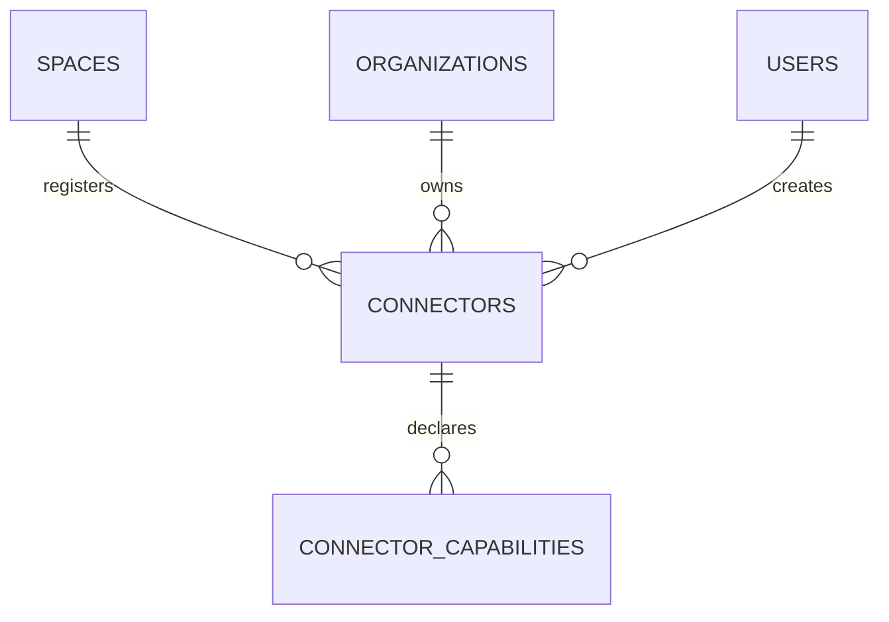

# Phase 2-B.2.2-B Connector 数据库模型

## 1. 交付范围

本阶段把冻结设计中的 Connector 域映射为两张 PostgreSQL 表：

- `connectors`：组织在指定可信数据空间内的技术节点注册；
- `connector_capabilities`：该注册节点声明或已核验的可检索技术能力。

本阶段不包含 ConnectorStatusHistory、连接器角色表、Catalog、DataProduct、Contract、Compute、API、CRUD、真实心跳接收或策略执行。

## 2. Connector 的边界

Connector 不是用户账号，也不是医院本身。它是组织内部系统接入某个可信数据空间的规范化技术节点，例如病理节点、影像节点或临床数据节点。



业务角色与技术能力分开：

- `provider`、`consumer`、`service_provider`、`operator` 属于 SpaceParticipantRole；
- `product_publish`、`policy_execute`、`compute` 等属于 ConnectorCapability；
- 本模型没有使用一个 Connector `type` 字段混合这两类事实。

## 3. connectors

| 字段 | 类型 | 约束 | 说明 |
|---|---|---|---|
| `id` | uuid | PK | 平台内连接器注册 ID。 |
| `space_id` | uuid | FK → spaces, RESTRICT | 注册所在空间。 |
| `owner_organization_id` | uuid | FK → organizations, RESTRICT | 节点所属组织。 |
| `external_connector_id` | text | NULL | 外部基础设施中的物理节点标识。 |
| `name` | text | NOT NULL | 空间内展示名称。 |
| `verification_status` | varchar(16) | CHECK | `pending`、`verified`、`failed`、`revoked`。 |
| `runtime_status` | varchar(16) | CHECK | `unknown`、`online`、`degraded`、`offline`、`maintenance`。 |
| `endpoint_metadata` | jsonb | NOT NULL | 协议和地址引用等扩展元数据，不得存私钥。 |
| `certificate_fingerprint` | text | NULL | 证书指纹或外部凭证引用。 |
| `last_heartbeat_at` | timestamptz | NULL | 最近心跳时间。 |
| `last_policy_ack_at` | timestamptz | NULL | 最近策略回执时间。 |
| `is_demo` | boolean | NOT NULL | 演示数据标识。 |
| `created_at` / `created_by` | timestamptz / uuid | NOT NULL | 创建审计信息。 |
| `updated_at` | timestamptz | NOT NULL | 更新时间。 |
| `row_version` | integer | CHECK ≥ 1 | 后续乐观锁版本。 |

约束和索引：

- `(space_id, external_connector_id)` 部分唯一索引，仅覆盖非空 external ID；
- `(space_id, owner_organization_id, name)` 唯一，防止同一组织在同一空间重名；
- `(space_id, verification_status, runtime_status)`，用于空间节点治理；
- `(owner_organization_id, runtime_status)`，用于组织节点运维；
- `(space_id, last_heartbeat_at)` 部分索引，仅覆盖 `degraded`、`offline`；
- `created_by`。

身份核验状态与运行状态必须分开。一台节点可以“身份已核验但当前离线”，也可以“在线但尚未通过身份核验”；单一 `status` 无法准确表达。

## 4. connector_capabilities

| 字段 | 类型 | 约束 | 说明 |
|---|---|---|---|
| `connector_id` | uuid | 复合 PK，FK → connectors, CASCADE | 所属连接器注册。 |
| `capability_code` | text | 复合 PK | 可检索能力编码。 |
| `capability_version` | text | 复合 PK | 能力协议或实现版本。 |
| `status` | varchar(16) | CHECK | `declared`、`verified`、`disabled`。 |
| `parameters` | jsonb | NOT NULL | 不稳定的能力扩展参数。 |
| `verified_at` | timestamptz | NULL | 能力核验时间。 |

复合主键允许同一能力并存不同版本，但不允许同一连接器重复声明相同能力版本。索引 `(capability_code, status, connector_id)` 支持策略编排按能力发现节点。

能力码保留为可扩展业务编码，没有在本阶段建立全局能力目录。后续进入真实互操作前，需要冻结能力词表、协议版本与参数 JSON Schema。

## 5. 多空间注册语义

单条 Connector 记录只属于一个 Space。同一物理节点接入多个空间时，使用相同 `external_connector_id` 建立多条空间级注册记录：

```text
物理节点 physical-node-001
├── Space A 注册：独立核验状态、运行状态、能力与策略回执
└── Space B 注册：独立核验状态、运行状态、能力与策略回执
```

因此 external ID 只在单个 Space 内唯一，而不是全平台唯一。这与冻结领域模型“每个空间的能力适配和准入状态独立记录”一致。

## 6. 领域服务不变量

数据库只负责结构完整性。后续 ConnectorRegistrationService 至少要在同一事务中校验：

1. `owner_organization_id` 是目标 Space 的有效 SpaceParticipant；
2. 参与关系处于 `admitted`；
3. 已接受当前空间规则版本；
4. 需要发布、计算或策略执行时，组织的参与角色与 ConnectorCapability 都满足动作要求；
5. 只有 `verified` 且运行状态符合策略的节点可以实际接收策略或任务。

这些规则涉及多表和时序，不能伪装成单行 CHECK。当前还没有 API 可以绕过或执行这些服务。

## 7. 安全与审计边界

- `endpoint_metadata` 只能保存协议、地址引用和非敏感扩展信息，不保存私钥、口令或患者数据；该限制需由后续输入模型和密钥管理集成执行。
- `certificate_fingerprint` 是指纹或外部凭证引用，不是证书私钥。
- 本阶段没有新增 ConnectorStatusHistory。未来状态变化统一写入 append-only AuditEvent，避免出现两套相互竞争的历史证据源。
- 删除 Connector 时能力行可 CASCADE；已参与产品、合约、任务或审计后，领域服务应禁止物理删除并改用 `revoked`/离线状态。

## 8. 已验证与未实现

已覆盖：

- typed declarative ORM 映射；
- 两表增量 Alembic migration；
- 一个组织在同一空间注册多个 Connector；
- 同一外部物理节点标识跨空间独立注册；
- 同一空间外部标识唯一约束；
- Connector 状态 CHECK；
- ConnectorCapability 复合主键和反向关系；
- SQLite 异步快速测试与可选 PostgreSQL 专用库集成测试入口；
- PostgreSQL 离线 upgrade/downgrade SQL 与部分索引生成。

尚未覆盖：

- Connector 注册、核验、吊销和心跳领域服务；
- 参与方资格与 Connector 所有权的跨表事务校验；
- mTLS、证书签发、轮换或密钥管理；
- 真实策略下发、能力探测和履约回执；
- AuditEvent 写入；
- 真实 PostgreSQL 16 运行验证（当前机器无 PostgreSQL/Docker）。

SQLite 测试只验证 ORM 关系和通用约束，不替代 PostgreSQL 集成测试。
