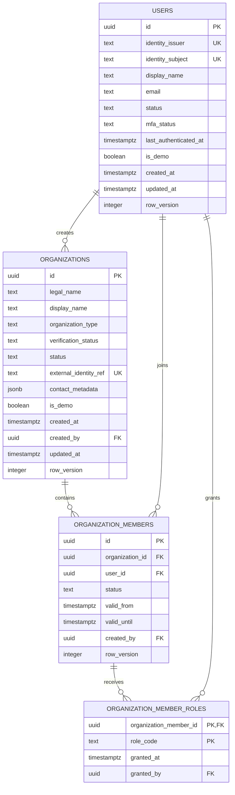

# MedTrust Space Phase 2-B.2.1 Identity 数据库模型

文档版本：v0.1  
日期：2026-07-22  
状态：已实现，待真实 PostgreSQL 16 集成验证

## 1. 范围

本阶段只实现已冻结 Identity 域的四张表：

1. `organizations`
2. `users`
3. `organization_members`
4. `organization_member_roles`

不建立全局 `roles` 或 `permissions` 表。用户权限来自“用户—组织成员关系—组织角色”，后续还要叠加 SpaceParticipant 角色和对象属性检查。单独建立全局 Permission 目录既不能表达数据产品归属，也不能完成 ABAC。

## 2. ER 关系

## 3. 表说明

### 3.1 organizations

表示医院、科研机构、AI 企业、服务方或空间运营方。组织类型不是其在某次业务中的永久角色。

关键约束：

- UUID 主键由应用生成，不使用自增 ID。
- `organization_type`、`verification_status`、`status` 使用文本列和 CHECK。
- `external_identity_ref` 非空时唯一。
- 不使用通用 `deleted_at`；退出使用 `withdrawn`。
- `contact_metadata` 为 JSONB 扩展信息，禁止存患者数据。

### 3.2 users

表示自然人登录主体，不保存全局 `organization_id` 或 `role`。

关键约束：

- `(identity_issuer, identity_subject)` 唯一，电子邮件不作为身份主键。
- 邮件只建立非空小写表达式索引，不强制全局唯一。
- 用户不物理删除，停用使用 `disabled`。

### 3.3 organization_members

连接 User 与 Organization；同一用户可以加入多个组织，但同一组织内只有一条成员关系。

关键约束：

- `(organization_id, user_id)` 唯一。
- 组织、用户、创建人外键均使用 RESTRICT。
- 有效期结束必须晚于开始；成员退出使用 `removed`。

### 3.4 organization_member_roles

表示成员在指定组织中的角色，不表示空间角色或无条件权限。

V1 组织角色：

- `provider_data_admin`
- `provider_output_reviewer`
- `consumer_researcher`
- `consumer_ai_developer`
- `contract_signer`
- `connector_operator`
- `auditor`

主键为 `(organization_member_id, role_code)`。角色是成员关系的组成部分，因此成员关系物理清理时可以 CASCADE；角色授予人使用 RESTRICT。

`space_operator` 不在此表中，后续归入 `space_participant_roles`。

## 4. 时间、状态与删除

- 所有业务时间使用 `timestamptz`，应用生成 UTC 时间；PostgreSQL 按绝对时间存储。
- 可变根对象使用 `row_version`，首版从 1 开始。
- Organization、User 和已生效 Membership 不通过业务 API 物理删除。
- 当前阶段没有 AuditEvent 表，因此角色撤销审计在 Audit 域实现后补齐；不能用业务表的 `last_action` 代替审计事件。

## 5. ORM 与 Migration

- ORM：SQLAlchemy 2.0 `Mapped[...]` + `mapped_column()` typed declarative。
- Schema：业务表统一位于 `medtrust`。
- Migration：`20260722_0001_identity` 先创建 schema 和 organizations，再创建 users、补 organizations.created_by 外键，最后创建成员与角色表。
- Downgrade：逆序删除四张表；保留 `medtrust` schema，避免与 Alembic/后续模块产生不安全的级联删除。

## 6. 验证边界

本阶段测试覆盖：

- 异步 Session 创建 Organization、User、OrganizationMember 和角色。
- ORM 关系可读取。
- 重复 `(organization_id, user_id)` 被拒绝。
- Alembic revision 能生成 PostgreSQL 离线升级/降级 SQL。

当前开发机没有 Docker、PostgreSQL 16 二进制或服务，因此不能诚实宣称已执行真实 `alembic upgrade head`。SQLite 异步测试只用于快速验证 ORM 关系和通用约束；Phase 2-B.2.1 的剩余集成门槛是在 PostgreSQL 16 上执行 upgrade → 写入 → downgrade → upgrade。

仓库已提供 `tests/integration/test_identity_postgresql.py`。只有显式设置 `MEDTRUST_TEST_DATABASE_URL` 时才运行，并在事务中写入后回滚；测试库必须先执行当前 Alembic migration。
