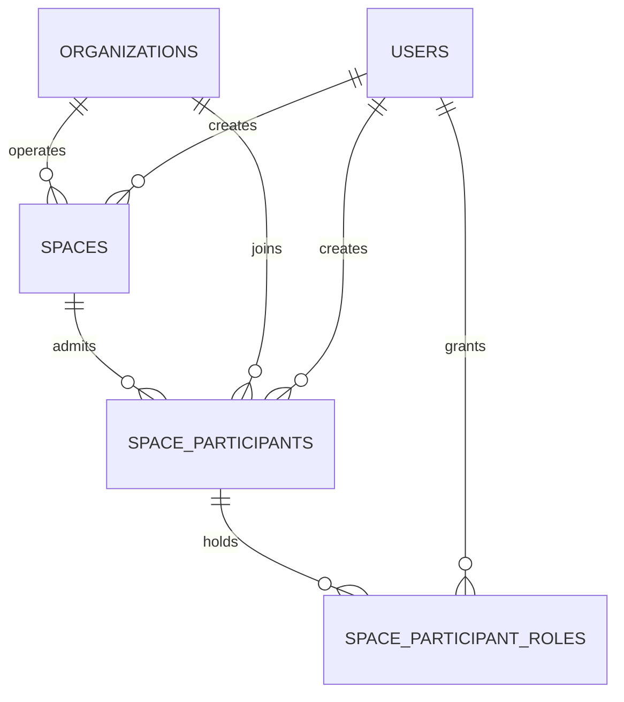

# Phase 2-B.2.2-A Spaces 数据库模型

## 1. 交付范围

本阶段把冻结设计中的 Space 聚合映射为三张 PostgreSQL 表：

- `spaces`：可信数据空间的治理根；
- `space_participants`：组织加入指定空间的参与关系；
- `space_participant_roles`：参与关系在该空间内承担的一个或多个角色。

本阶段不包含 Connector、数据产品、合约、API、CRUD、全局角色目录或授权服务。

## 2. 关系模型

`Organization` 与 `Space` 是多对多关系，由 `SpaceParticipant` 显式承载准入状态、规则接受版本和空间内角色。用户不直接获得空间角色。

## 3. spaces

| 字段 | 类型 | 约束 | 说明 |
|---|---|---|---|
| `id` | uuid | PK | 应用生成的空间 ID。 |
| `code` | text | NOT NULL, UNIQUE | 不随展示名称变化的稳定编码。 |
| `name` | text | NOT NULL | 空间展示名称。 |
| `space_type` | varchar(16) | CHECK | `industry`、`enterprise`、`city`。 |
| `operator_organization_id` | uuid | FK → organizations, RESTRICT | 空间唯一治理责任主体。 |
| `status` | varchar(16) | CHECK | `draft`、`active`、`suspended`、`closed`。 |
| `ruleset_version` | text | NOT NULL | 当前共识规则版本。 |
| `classification_scheme_version` | text | NOT NULL | 当前数据分类分级规则版本。 |
| `default_retention_policy` | jsonb | NOT NULL | 默认保留规则扩展文档，不承载权限事实。 |
| `is_demo` | boolean | NOT NULL | 演示数据标识。 |
| `created_at` / `created_by` | timestamptz / uuid | NOT NULL | 创建审计信息。 |
| `updated_at` | timestamptz | NOT NULL | 更新时间。 |
| `row_version` | integer | CHECK ≥ 1 | 后续乐观锁版本。 |

索引：

- `code` 唯一约束；
- `(operator_organization_id, status)`；
- `(space_type, status)`；
- `created_by`。

空间不物理删除，终态使用 `closed`，以保留后续产品、合约和审计引用的稳定根。

## 4. space_participants

| 字段 | 类型 | 约束 | 说明 |
|---|---|---|---|
| `id` | uuid | PK | 参与关系 ID。 |
| `space_id` | uuid | FK → spaces, RESTRICT | 所属空间。 |
| `organization_id` | uuid | FK → organizations, RESTRICT | 参与组织。 |
| `admission_status` | varchar(16) | CHECK | `applied`、`reviewing`、`admitted`、`rejected`、`suspended`、`exited`。 |
| `ruleset_accepted_version` | text | NULL | 组织已接受的共识规则版本。 |
| `admitted_at` | timestamptz | NULL | 准入时间。 |
| `suspended_at` | timestamptz | NULL | 暂停时间。 |
| `created_at` / `created_by` | timestamptz / uuid | NOT NULL | 创建审计信息。 |
| `updated_at` | timestamptz | NOT NULL | 更新时间。 |
| `row_version` | integer | CHECK ≥ 1 | 后续乐观锁版本。 |

约束和索引：

- `(space_id, organization_id)` 唯一，防止同一组织重复加入同一空间；
- `(organization_id, admission_status)`，支持查询组织参与的空间；
- `(space_id, admitted_at)` 部分索引，仅覆盖 `admission_status='admitted'`；
- `created_by`。

一个组织可以通过不同的参与关系加入多个空间。角色、准入状态和规则接受版本都属于该参与关系，不回填到 Organization。

## 5. space_participant_roles

| 字段 | 类型 | 约束 | 说明 |
|---|---|---|---|
| `space_participant_id` | uuid | 复合 PK，FK → space_participants, CASCADE | 角色所属参与关系。 |
| `role_code` | varchar(32) | 复合 PK，CHECK | `provider`、`consumer`、`service_provider`、`operator`。 |
| `granted_at` / `granted_by` | timestamptz / uuid | NOT NULL | 授予审计信息。 |

同一参与关系可持有多个角色；复合主键防止重复授予同一角色。反向索引 `(role_code, space_participant_id)` 支持按角色查询参与方。

本阶段没有建立全局 `SpaceRole` 表。角色码是冻结的 V1 参与方分类，不代表最终操作权限；具体动作仍需结合用户的组织成员身份、空间状态、参与方准入状态、对象归属和后续 Policy 进行 ABAC 判断。

## 6. 运营方的双层语义

`spaces.operator_organization_id` 和参与方角色 `operator` 同时存在，但用途不同：

- 前者回答“谁对该空间的治理与运营负责”，是 Space 聚合的稳定责任主体；
- 后者回答“该组织在这个空间里以什么参与身份行动”，属于空间授权上下文。

数据库本批不使用跨表 CHECK 或触发器强制两者一致。后续创建/激活空间的领域服务必须在同一事务中确保：

1. 运营组织存在有效的 SpaceParticipant；
2. 该参与关系已准入；
3. 已接受当前 `ruleset_version`；
4. 持有 `operator` 角色。

这样避免把跨表业务规则伪装成单行约束，也为未来运营主体移交保留明确的事务边界。

## 7. 已验证与未实现

已覆盖：

- typed declarative ORM 映射；
- 三表增量 Alembic migration；
- 同一组织加入多个空间；
- 同一空间参与关系持有多个角色；
- 重复参与关系和非法角色被数据库约束拒绝；
- SQLite 异步快速测试与可选 PostgreSQL 专用库集成测试入口；
- PostgreSQL 离线 upgrade/downgrade SQL 生成。

尚未覆盖：

- Space 状态转换服务和并发锁；
- 运营方与 operator 参与角色的事务一致性校验；
- 用户到组织、空间和对象的授权决策；
- AuditEvent 写入；
- 真实 PostgreSQL 16 运行验证（当前机器无 PostgreSQL/Docker）。

SQLite 测试只验证 ORM 关系和通用约束，不替代 PostgreSQL 集成测试。
