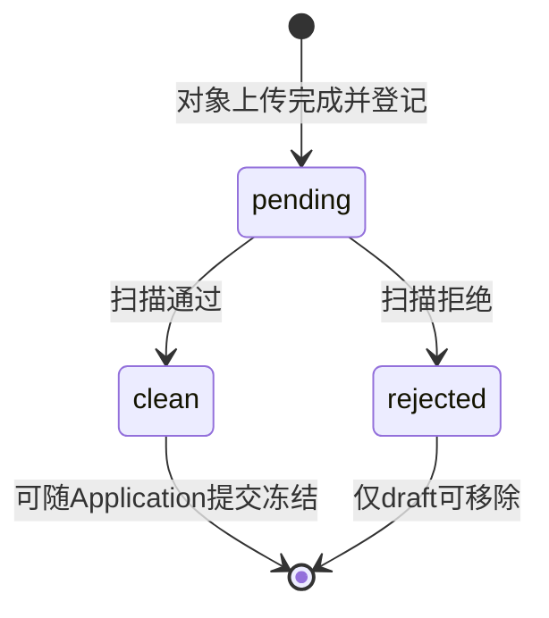

# MedTrust Space Phase 2-B.3-B2 Application 扩展 ORM 前冻结检查

文档版本：v1.0  
日期：2026-07-22  
状态：Go，可进入三表 ORM + Migration  
设计输入：`docs/Phase2-B3-application-extension-model.md`  
数据库基线：`docs/Phase2-database-design-v3.md`  
当前 Alembic head：`20260722_0005`

## 1. 审查结论

结论：**Go**。

Application 扩展三表可以进入 ORM + Migration：

1. `application_requested_actions`；
2. `application_requested_output_types`；
3. `application_attachments`。

本次冻结没有增加第四张扩展表，也没有引入 `UsageIntent`、`ExpectedOutput`、附件状态历史或扫描任务空壳。当前17张 ORM 表在完成三表实现后应精确增加为20张。

本次审查同时否决了三项容易造成长期混乱的方案：

- 数据库存储值不使用大写枚举，继续采用项目统一的小写 `snake_case`；
- Attachment 不使用混合上传、扫描、授权可用性和删除语义的单状态机；
- `requires_manual_review` 不允许由申请方写入，也不在读取时按当前规则临时计算。

## 2. 最终对象与表映射

| 领域对象 | 表 | 聚合归属 |
|---|---|---|
| `ApplicationRequestedAction` | `application_requested_actions` | Application 组成对象。 |
| `ApplicationRequestedOutputType` | `application_requested_output_types` | Application 组成对象。 |
| `ApplicationAttachment` | `application_attachments` | Application 组成对象。 |

三者都属于 Application 整体，不属于单个 ApplicationItem。它们只描述申请内容，不构成获批权限。

## 3. 命名与持久化格式

### 3.1 通用规则

- 数据库值和 API 枚举值：小写 `snake_case`；
- Python 领域类：PascalCase；
- 中文名称：只用于 UI 标签和文档；
- 已提交 Snapshot 固定数据库编码，不固定中文展示文案；
- ORM 后若需修改编码，必须通过显式 migration 和兼容映射，不能原地改字符串。

### 3.2 Action 最终词表

| action_code | 中文标签 | 说明 |
|---|---|---|
| `ai_training` | AI训练 | 训练或微调模型。 |
| `model_validation` | 模型验证 | 验证预登记的已有模型。 |
| `research_analysis` | 科研分析 | 统计或探索性科研分析。 |
| `drug_development` | 药物研发 | 药物研发相关的数据分析。 |

冻结时将上一版领域文档的 `drug_research` 统一修正为 `drug_development`。两者不得并存，也不提供别名写入；UI 如需兼容旧演示数据，只能在读取层映射。

### 3.3 Output 最终词表

| output_type | 中文标签 | 默认风险基线 |
|---|---|---|
| `aggregate_statistics` | 汇总统计结果 | 条件性人工审核。 |
| `model_artifact` | 模型制品 | 必须人工审核。 |
| `feature_dataset` | 特征数据集 | 必须人工审核。 |
| `risk_scoring_model` | 风险评分模型 | 必须人工审核。 |

不采用 `feature_data` 或 `risk_score_model` 等近义编码，避免同一输出出现多个持久化名称。

### 3.4 Attachment 类型词表

| attachment_type | 中文标签 |
|---|---|
| `research_protocol` | 研究方案 |
| `ethics` | 伦理材料 |
| `authorization` | 授权材料 |
| `algorithm_document` | 算法说明 |
| `compliance_evidence` | 合规证明 |
| `other` | 其他材料 |

`other` 不是默认兜底。已有明确类别时必须使用明确类别，避免审核规则无法判断材料是否齐全。

## 4. ApplicationRequestedAction 冻结

### 4.1 字段

| 字段 | 类型 | 冻结约束 |
|---|---|---|
| `application_id` | UUID | FK → `applications.id`，NOT NULL。 |
| `action_code` | text | 受控词表，NOT NULL。 |
| `parameters` | JSONB | NOT NULL，默认 `{"schema_version":"1.0"}`，必须为 object。 |

### 4.2 键与索引

- PK：`(application_id, action_code)`；
- INDEX：`(action_code, application_id)`；
- Application 删除使用 `ON DELETE CASCADE`，仅服务于受控 draft 清理；
- 不增加无业务价值的单独 UUID、产品版本 FK 或 created/updated 时间列。

### 4.3 parameters 边界

parameters 至少包含字符串 `schema_version`。各 action_code 使用独立 JSON schema。

允许保存：

- 训练、验证或分析方法的结构化描述；
- 评价指标名称；
- 研究阶段和分析模式；
- 不涉及身份或资源定位的运行参数。

禁止保存：

- 用户代码或可执行脚本；
- 患者信息；
- WSI、PACS 或 Connector 本地地址；
- Token、密钥或访问凭据；
- `NaN`、`Infinity` 等非标准 JSON 数值。

### 4.4 不变量

1. 每份可提交 Application 至少一个 Action；
2. 同一 Application 内 action_code 不重复；
3. Action 作用于整份 Application；
4. Action 不得扩大 ApplicationItem.requested_scope；
5. submitted 后禁止 INSERT、UPDATE、DELETE；
6. Contract 只能保留或删除获批 Action，不能新增。

## 5. ApplicationRequestedOutputType 冻结

### 5.1 字段

| 字段 | 类型 | 冻结约束 |
|---|---|---|
| `application_id` | UUID | FK → `applications.id`，NOT NULL。 |
| `output_type` | text | 受控词表，NOT NULL。 |
| `requires_manual_review` | boolean | NOT NULL，系统派生、持久化。 |

### 5.2 键与索引

- PK：`(application_id, output_type)`；
- INDEX：`(output_type, application_id)`；
- Application 删除使用 `ON DELETE CASCADE`，仅服务于 draft 清理；
- 不增加自由 JSON 参数列，输出格式和释放约束后续进入 Contract Policy。

### 5.3 requires_manual_review 决策

该字段看似可以实时计算，但冻结结论是：**保留并持久化**。

原因：

- Review 必须知道提交时平台作出的风险判断；
- 规则升级后不能改变历史 ApplicationSnapshot 的含义；
- Artifact 后续需要知道申请时是否已声明人工审核基线；
- 查询审核队列不应依赖每次重新执行策略引擎。

写入规则：

1. API 创建/修改 DTO 不暴露该字段；
2. draft 阶段由策略服务派生；
3. submit 时根据最新适用规则强制重新计算并覆盖 draft 值；
4. 任何规则要求人工审核时，最终值必须为 `true`；
5. submitted 后由数据库 draft-only 触发器冻结。

ApplicationSnapshot 中每个 requested output 除 boolean 外，还必须保存 `review_rule_digest`。该摘要记录本次派生使用的规则集合；它只进入不可变 Snapshot，不为三表增加字段。

### 5.4 不变量

1. 每份可提交 Application 至少一个 RequestedOutputType；
2. 同一 Application 内 output_type 不重复；
3. Output 必须与 RequestedAction 相容；
4. 患者级记录、原始 WSI、原始影像和临床明细不进入V1词表；
5. Contract 只能收窄获批 Output；
6. Artifact 类型必须属于 active Contract Policy 允许范围；
7. 风险标记或 Policy 要求人工审核时不得绕过 output_review。

## 6. ApplicationAttachment 冻结

### 6.1 字段

| 字段 | 类型 | 冻结约束 |
|---|---|---|
| `id` | UUID | PK。 |
| `application_id` | UUID | FK → `applications.id`，NOT NULL。 |
| `attachment_type` | text | 受控词表，NOT NULL。 |
| `display_name` | text | NOT NULL，非空。 |
| `storage_ref` | text | NOT NULL，非空，不透明逻辑对象引用。 |
| `content_digest` | text | NOT NULL，`sha256:` + 64位小写十六进制。 |
| `size_bytes` | bigint | NOT NULL，CHECK `>= 0`。 |
| `scan_status` | text | `pending`、`clean`、`rejected`；默认 `pending`。 |
| `created_at` | timestamptz | NOT NULL。 |
| `created_by` | UUID | FK → `users.id`，RESTRICT。 |

不新增 `updated_at`：附件内容不原地覆盖。draft 替换文件时创建新行并删除旧行。

### 6.2 键与索引

- UNIQUE：`(application_id, content_digest)`；
- INDEX：`(application_id, attachment_type)`；
- INDEX：`(scan_status, application_id)`，用于待扫描和提交前检查；
- 同一 attachment_type 允许多份材料，不设 `(application_id, attachment_type)` 唯一约束。

### 6.3 状态机结论

不采用：

```text
UPLOADED → SCANNING → AVAILABLE → REJECTED → DELETED
```

该序列混合了四个不同维度：

- `UPLOADED`：对象存储写入状态；
- `SCANNING`：扫描任务运行状态；
- `AVAILABLE`：业务授权投影；
- `DELETED`：记录保留策略。

V1 只在 Attachment 上保存扫描结论：



补充规则：

- 对象上传完成、大小和摘要核验通过后才创建 Attachment 行；
- `pending` 同时覆盖排队和扫描中，V1 不提前创建 ScanJob；
- “available”由 `scan_status=clean`、Application/Contract状态和查看权限联合投影；
- submitted 后不允许 deleted，历史证据必须保留；
- 若未来需要扫描重试、引擎版本和扫描报告，再引入独立 AttachmentScan 证据对象，不扩张 scan_status。

### 6.4 存储边界

- PostgreSQL 不存附件二进制；
- `storage_ref` 是稳定逻辑对象ID，不是物理磁盘路径或签名URL；
- Snapshot 不保存 storage_ref；
- 对象存储迁移通过逻辑引用映射完成，不修改历史 Attachment；
- MinIO 密钥、临时下载URL和扫描内部路径不得进入数据库或Snapshot。

### 6.5 提交条件

1. 所有随申请提交的 Attachment 必须为 `clean`；
2. 必需类型由 Action、Output、产品策略、组织类型和Space规则计算；
3. 缺少必需材料时拒绝提交；
4. `rejected` 材料不能保留在待提交集合；
5. 扫描通过不代表伦理或合规内容有效，语义有效性由Review判断。

## 7. 字段冗余检查

| 字段/候选字段 | 结论 | 理由 |
|---|---|---|
| `requires_manual_review` | 保留 | 系统派生但需要固定历史判断和队列投影。 |
| `review_rule_digest`表列 | 不增加 | 只需在提交Snapshot固定，不参与draft查询。 |
| Action/Output单独UUID | 不增加 | `(application_id, code)`已是稳定自然主键。 |
| Action/Output created_at | 不增加 | draft组成对象，提交后由Snapshot固定；未来Audit记录动作。 |
| Attachment updated_at | 不增加 | 内容不覆盖，替换创建新行。 |
| Attachment media_type | 暂不增加 | V1业务约束不依赖客户端声明MIME；对象存储/扫描层维护。 |
| Attachment storage_ref | 保留 | 定位受控对象。 |
| Attachment content_digest | 保留 | 证明内容完整性，与storage_ref职责不同。 |
| Attachment `available` | 不增加 | 可用性是授权投影，不是附件固有状态。 |
| Attachment `deleted` | 不增加 | draft直接清理，submitted禁止删除。 |

## 8. Snapshot canonicalization 冻结

### 8.1 manifest 内容

Snapshot必须固定：

- Application头；
- 按position_no排序的ApplicationItem；
- RequestedAction；
- RequestedOutputType及系统派生风险结果；
- Attachment稳定元数据和内容摘要。

不包含：

- storage_ref；
- 对象存储凭据或URL；
- 患者数据；
- 用户代码；
- Connector本地资源地址。

### 8.2 数组排序

| 数组 | 排序键 |
|---|---|
| `items` | `position_no`升序；唯一约束保证无并列。 |
| `requested_actions` | `action_code`按Unicode码点升序。 |
| `requested_output_types` | `output_type`按Unicode码点升序。 |
| `attachments` | `attachment_type`、`content_digest`升序。 |

### 8.3 输出条目

```json
{
  "output_type": "aggregate_statistics",
  "requires_manual_review": false,
  "review_rule_digest": "sha256:..."
}
```

### 8.4 附件条目

```json
{
  "attachment_type": "research_protocol",
  "display_name": "研究方案.pdf",
  "content_digest": "sha256:...",
  "size_bytes": 102400,
  "scan_status": "clean"
}
```

### 8.5 JSON规范化

继续沿用B1已实现规则，避免无必要地改变历史摘要算法：

1. UTF-8编码；
2. 对象键排序；
3. `ensure_ascii=false`；
4. 分隔符为`,`和`:`，不输出冗余空白；
5. 禁止NaN和Infinity；
6. 数组先按本节业务键排序；
7. 摘要为`sha256:`加64位小写十六进制。

顶层数组在B1已经存在，本阶段填充原空数组，Snapshot `schema_version`继续为`1.0`。若未来改变键名、排序或数值规范化算法，必须升级schema_version，不能静默改变摘要。

## 9. 提交时机与事务

提交命令必须在一个事务中执行：

```text
锁定draft Application
  → 加载并排序Items/Actions/Outputs/Attachments
  → 校验Action参数schema
  → 重新派生requires_manual_review与规则摘要
  → 校验附件类型、摘要、对象存在性和clean状态
  → 校验必需材料矩阵
  → 构建完整manifest并计算digest
  → Application进入submitted
  → 创建唯一不可变Snapshot
```

提交失败时不保留半提交状态或Snapshot。B1已冻结的“draft不得提前创建Snapshot”规则继续生效。

## 10. 数据库保护冻结

三张表都需要Application draft-only数据库触发器：

- INSERT/UPDATE/DELETE前读取父Application.status；
- 仅父状态为draft时允许；
- 父Application FK级联删除时允许子行清理；
- submitted及后续状态拒绝所有变更；
- 不能只靠ORM before_flush，因为直接SQL可能绕过。

额外CHECK：

- Action/Output/Attachment词表CHECK；
- JSONB必须为object；
- parameters.schema_version存在且为字符串；
- display_name、storage_ref、content_digest非空；
- size_bytes大于等于0；
- scan_status词表CHECK；
- digest格式CHECK。

ORM metadata中的PostgreSQL专用`jsonb_typeof`规则不能污染SQLite建表；JSONB形状CHECK只进入PostgreSQL migration，SQLite快速测试由领域服务覆盖。

## 11. 与Review关系冻结

- ReviewTask目标仍是完整ApplicationSnapshot；
- 不为Action、Output或Attachment分别创建ReviewTask；
- application_precheck检查词表、参数、风险派生、材料完整性和扫描状态；
- provider_review检查产品策略、requested_scope、输出风险和材料语义；
- ReviewDecision只针对Snapshot digest；
- 结果出域审核仍属于Artifact的output_review。

Review创建服务使用既有复合证据关系：

```text
(application_id, application_snapshot_id, target_digest)
  → application_snapshots(application_id, id, snapshot_digest)
```

## 12. 与Contract关系冻结

- approved ApplicationSnapshot是Contract创建输入；
- 每个ApplicationItem映射为一个ContractObject；
- RequestedAction映射为Policy候选允许操作；
- RequestedOutputType映射为允许输出及审查义务；
- Attachment digest作为签约依据，不复制附件内容；
- Contract不反向修改Application或Snapshot。

Contract执行“子集原则”：

```text
ContractObjects ⊆ Approved ApplicationItems
Contract Actions ⊆ Approved RequestedActions
Contract Outputs ⊆ Approved RequestedOutputTypes
Contract Constraints ≥ Application请求约束强度
```

任何新增标的、Action、Output或更宽松限制都必须重新申请和审核。

## 13. 删除与保留策略

- draft Application删除可由FK CASCADE清理Action/Output/Attachment元数据；
- Attachment对象存储删除不依赖数据库事务，后续由受控清理任务处理孤儿对象；
- submitted后组成行和Attachment内容必须保留；
- Snapshot继续RESTRICT且不可更新/删除；
- rejected/withdrawn Application不物理删除；
- Contract或Review引用Snapshot，不引用可删除的draft组成行。

## 14. ORM阶段必须覆盖的测试

### Action

1. 四个合法词表值可创建；
2. 大写或未知action_code拒绝；
3. 同一Application重复action_code拒绝；
4. parameters非object或缺少schema_version拒绝；
5. submitted后增删改拒绝。

### Output

1. 四个合法output_type可创建；
2. 未知或近义旧编码拒绝；
3. 同一Application重复output_type拒绝；
4. API不能提交requires_manual_review；
5. submit重新派生并覆盖draft风险值；
6. submitted后增删改拒绝。

### Attachment

1. 六个合法attachment_type可创建；
2. content_digest重复拒绝；
3. 同类型多附件允许；
4. 非法digest、负size和未知scan_status拒绝；
5. pending/rejected附件阻止提交；
6. 非扫描服务修改scan_status拒绝；
7. submitted后修改或删除拒绝。

### Snapshot与PostgreSQL

1. 不同插入顺序生成相同manifest和digest；
2. Action/Output/Attachment变化会改变digest；
3. storage_ref变化不进入Snapshot digest；
4. review_rule_digest进入Snapshot；
5. 直SQL绕过ORM修改submitted组成行被触发器拒绝；
6. 0006 upgrade/downgrade真实运行；
7. 完整回归保持Catalog/Application B1约束。

## 15. 实现范围冻结

下一阶段仅允许：

- 三张typed ORM表；
- Application关系扩展；
- Application提交服务读取、校验、排序和快照扩展；
- 一个增量Alembic revision；
- ORM快速测试和PostgreSQL集成测试；
- 对称upgrade/downgrade。

下一阶段禁止：

- ReviewTask/ReviewDecision ORM；
- Contract或Policy ORM；
- Application HTTP API；
- MinIO真实上传接口；
- 扫描引擎或AttachmentScan表；
- Artifact、Compute、Audit实现；
- 修改B1已批准的Application状态机。

## 16. Go条件核对

| 检查项 | 结果 |
|---|---|
| 三对象与三物理表一一对应 | 通过 |
| Action最终词表无别名冲突 | 通过，统一为`drug_development` |
| Output最终词表无近义重复 | 通过 |
| 唯一约束和索引明确 | 通过 |
| Attachment状态轴单一 | 通过，仅扫描状态 |
| requires_manual_review归属明确 | 通过，系统派生并持久化 |
| Snapshot排序和digest输入明确 | 通过 |
| Review只审核Snapshot | 通过 |
| Contract只收窄不扩大 | 通过 |
| 字段冗余已检查 | 通过 |
| ORM/migration尚未生成 | 通过 |

## 17. 结论

Phase 2-B.3-B2 ORM前冻结检查通过，可以进入三表ORM + Migration。

冻结后的申请证据链为：

```text
Application
  → ApplicationItem(s)
  → RequestedAction(s)
  → RequestedOutputType(s)
  → Attachment(s)
  → canonical ApplicationSnapshot
  → Review
  → Contract / Policy
```

进入ORM阶段后不得再临时改变枚举编码、Attachment状态语义、Snapshot排序或Contract子集原则；若确需修改，先回到冻结文档评审。
