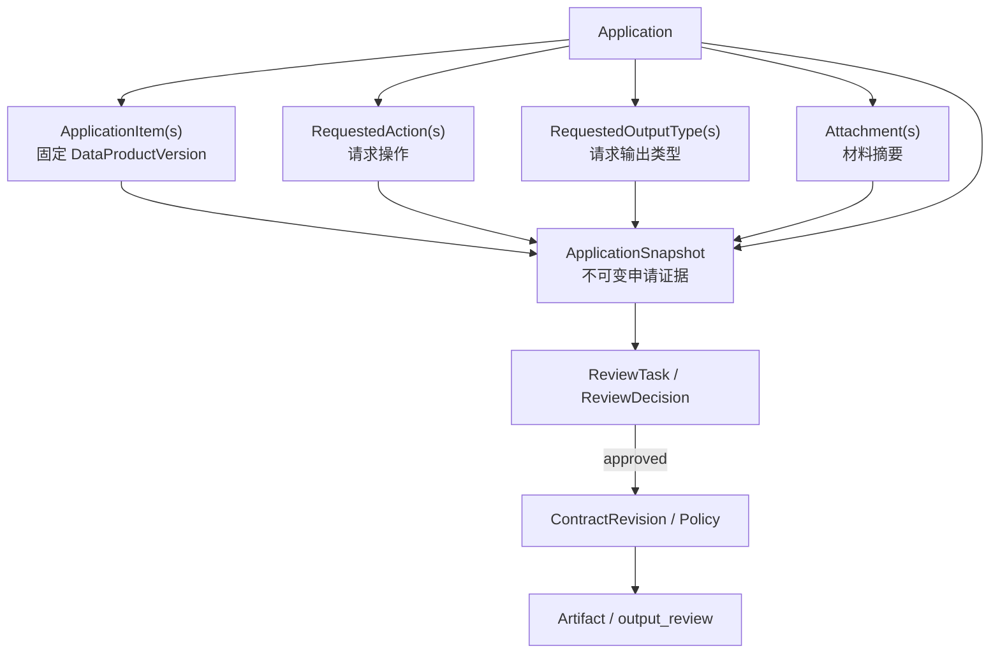
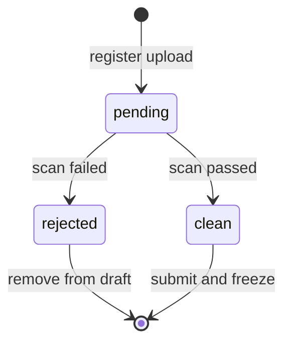

# MedTrust Space Phase 2-B.3-B2 Application 扩展领域模型

文档版本：v1.0  
日期：2026-07-22  
状态：领域设计完成，待评审  
前置实现：`20260722_0005_applications`  
结构基线：`docs/Phase2-database-design-v3.md`

## 1. 设计结论

Phase 2-B.3-B2 补齐 Application 聚合的三类申请内容：

1. `ApplicationRequestedAction`：申请方拟对数据产品执行什么操作；
2. `ApplicationRequestedOutputType`：申请方希望产生什么类型的输出；
3. `ApplicationAttachment`：支撑申请与审核的材料元数据和内容摘要。

它们分别映射到 v3 已冻结的三张物理表：

| 领域对象 | 物理表 |
|---|---|
| `ApplicationRequestedAction` | `application_requested_actions` |
| `ApplicationRequestedOutputType` | `application_requested_output_types` |
| `ApplicationAttachment` | `application_attachments` |

本设计不另外创建 `UsageIntent` 或 `ExpectedOutput` 平行表。`UsageIntent` 是 RequestedAction 的业务含义；“ExpectedOutput”容易被误解为已获准输出，因此领域名称明确保留 `Requested`。

本阶段只设计领域对象，不生成 ORM、migration、API、Review、Contract 或前端代码。

## 2. 五个容易混淆的概念

| 概念 | 回答的问题 | 是否构成授权 |
|---|---|---|
| `Application.purpose` | 为什么使用数据？ | 否，属于业务目的叙述。 |
| RequestedAction | 准备对数据执行什么操作？ | 否，属于申请内容。 |
| RequestedOutputType | 希望产生什么结果类型？ | 否，属于申请内容。 |
| Contract Policy | 最终允许、禁止和必须履行什么？ | 是，合约生效后才可执行。 |
| Artifact | 实际计算产生了什么？ | 否，默认隔离，仍需策略校验和结果审查。 |

申请获批只表示可以进入合约协商，不直接赋予数据访问、计算或结果出域权限。

## 3. 聚合关系



三类扩展对象属于 Application 整体，不在每个 ApplicationItem 下重复。V1 中一份申请只包含同一 Space、同一 Provider 的产品版本，因此一组用途、动作和输出约束可以共同审核。未来只有出现明确的产品级差异需求时，才评估 item-level override。

## 4. ApplicationRequestedAction

### 4.1 定义

描述申请方计划在受控环境中执行的操作。它把自由文本 `purpose` 转化为可校验、可审核、可映射到 Contract Policy 的结构化请求。

RequestedAction 不是执行权限，也不是算法代码。它只声明意图。

### 4.2 字段

| 字段 | 类型 | 说明 |
|---|---|---|
| `application_id` | UUID | 所属 Application。 |
| `action_code` | text | 受控动作编码。 |
| `parameters` | JSON object | 动作参数，必须符合对应 action schema。 |

主键为 `(application_id, action_code)`。同一 Application 内，同一动作只能出现一次；需要多个配置时合并进参数对象，若研究目的实质不同则拆分为新 Application。

### 4.3 V1 动作编码

| action_code | 中文含义 | 参数重点 |
|---|---|---|
| `ai_training` | 训练或微调 AI 模型 | 训练方式、验证方案、是否需要多次运行。 |
| `model_validation` | 验证预登记的已有模型 | 验证设计、主要指标、外部验证方式。 |
| `research_analysis` | 科研统计或探索性分析 | 分析类别、聚合粒度、主要研究问题。 |
| `drug_development` | 药物研发相关分析 | 研究阶段、分析模式、目标或结局类型。 |

动作参数至少包含：

```json
{
  "schema_version": "1.0"
}
```

各 action_code 使用独立参数 schema。参数中不得保存用户代码、访问凭据、患者标识、真实 WSI 地址或 Connector 本地资源定位符。

### 4.4 规则

1. draft Application 至少包含一个 RequestedAction 才能提交；
2. action_code 必须来自空间启用的受控词表；
3. parameters 必须为 JSON object，并通过对应 schema 校验；
4. RequestedAction 作用于整份 Application，不扩大任何 ApplicationItem.requested_scope；
5. action 必须与 Application.purpose 和预登记算法信息相容；
6. submitted 后禁止 INSERT、UPDATE、DELETE；
7. 动作能否执行，最终仍取决于 approved Review、active Contract Policy 和 Connector 执行条件。

## 5. ApplicationRequestedOutputType

### 5.1 定义

描述申请方希望从受控计算环境中产生或申请出域的结果类别。

它表达的是请求，不是允许清单。即使 Application 获批，实际 Artifact 也默认隔离；只有 active Contract Policy 允许且必要 output_review 通过后，结果才可能被释放。

### 5.2 字段

| 字段 | 类型 | 说明 |
|---|---|---|
| `application_id` | UUID | 所属 Application。 |
| `output_type` | text | 受控输出类型。 |
| `requires_manual_review` | boolean | 平台派生的风险标记，不由申请方直接决定。 |

主键为 `(application_id, output_type)`。

### 5.3 V1 输出类型

| output_type | 中文含义 | 默认人工审核 |
|---|---|---|
| `aggregate_statistics` | 汇总统计、指标和不可识别聚合结果 | 条件性；仍需小样本和泄露规则校验。 |
| `model_artifact` | 模型权重、参数或封装模型制品 | 是。 |
| `feature_dataset` | 派生特征矩阵或中间特征制品 | 是。 |
| `risk_scoring_model` | 风险评分模型或评分规则 | 是。 |

`risk_scoring_model` 不等于患者级风险评分明细。患者级结果、原始 WSI、原始影像、临床明细和可重识别记录不属于 V1 可请求输出类型。

### 5.4 风险标记归属

`requires_manual_review` 不能由申请方自行勾选。它由服务端根据以下输入计算并冻结：

1. 输出类型风险登记；
2. DataProductVersion 默认策略；
3. 数据分类分级；
4. Space 治理规则；
5. RequestedAction 和 requested_scope。

申请方只选择 `output_type`。若任何规则要求人工审核，最终值必须为 `true`，不能被低风险规则覆盖。

### 5.5 规则

1. draft Application 至少包含一个 RequestedOutputType 才能提交；
2. output_type 必须来自受控词表；
3. submitted 后禁止 INSERT、UPDATE、DELETE；
4. RequestedOutputType 必须与 RequestedAction 相容；
5. Contract 只能保持或收窄输出范围，不能新增未获批输出类型；
6. Artifact 类型必须是 active Contract Policy 允许范围的子集；
7. `requires_manual_review=true` 或 Policy 指定人工复核时，Artifact 不得绕过 output_review。

V1 不给 RequestedOutputType 增加自由 JSON 参数。输出格式、阈值、小样本抑制、导出次数等执行约束应进入 Contract Policy，避免把申请意图与最终授权规则混为一体。

## 6. ApplicationAttachment

### 6.1 定义

保存申请材料的元数据、对象存储引用和内容完整性摘要。PostgreSQL 不保存附件二进制内容。

### 6.2 字段

| 字段 | 类型 | 说明 |
|---|---|---|
| `id` | UUID | 附件标识。 |
| `application_id` | UUID | 所属 Application。 |
| `attachment_type` | text | 受控附件类别。 |
| `display_name` | text | 面向审核者的文件名称。 |
| `storage_ref` | text | 对象存储内部引用，不是公开 URL。 |
| `content_digest` | text | 文件内容摘要，V1 使用 SHA-256。 |
| `size_bytes` | bigint | 文件字节数，必须大于等于 0。 |
| `scan_status` | text | `pending`、`clean`、`rejected`。 |
| `created_at` | timestamptz | 上传记录创建时间。 |
| `created_by` | UUID | 上传用户。 |

### 6.3 V1 附件类型

| attachment_type | 用途 |
|---|---|
| `research_protocol` | 研究方案、统计分析计划或验证方案。 |
| `ethics` | 伦理审批、伦理豁免或适用性说明。 |
| `authorization` | 数据使用授权或合作授权材料。 |
| `algorithm_document` | 算法说明、版本、输入输出和风险说明。 |
| `compliance_evidence` | 机构资质、合规承诺或安全能力证明。 |
| `other` | 其他经平台允许的补充材料。 |

相较 v3 文本示例，本设计显式增加 `research_protocol` 和 `compliance_evidence` 两个受控编码，以避免把医疗申请的核心材料长期塞入 `other`。这不改变表结构，但进入 ORM 前应同步词表冻结说明。

### 6.4 存储与完整性边界

- `storage_ref` 只保存不透明对象标识，不保存签名下载地址、密钥或外网 URL；
- Snapshot 固定 `attachment_type`、`display_name`、`content_digest`、`size_bytes` 和提交时扫描状态；
- Snapshot 不固定 `storage_ref`，以允许对象存储迁移而不改变历史申请证据；
- 同一 Application 内 `content_digest` 唯一；同一 attachment_type 可以有多个附件；
- 附件展示和下载必须经过授权服务生成短期访问能力，不能直接暴露 MinIO 凭据。

### 6.5 生命周期



内容字段在创建后不原地覆盖。draft 阶段替换文件时创建新 Attachment，并移除旧引用；只有扫描服务可以改变 scan_status。Application 提交后，Attachment 行禁止 UPDATE/DELETE。

### 6.6 提交要求

1. 所有已包含附件必须为 `clean`；
2. 必需附件集合由 Action、Output、产品策略、组织类型和 Space 规则共同计算；
3. 缺少必需附件时不得提交；
4. `content_digest`、实际对象大小和存储对象必须一致；
5. 病毒扫描通过只证明文件安全性检查通过，不证明伦理或合规内容有效；
6. 材料语义有效性由 Application Review 判断。

## 7. ApplicationSnapshot 集成

当前 B1 Snapshot manifest 已预留三个空数组。B2 落库后继续使用 `schema_version=1.0`，无需改变顶层结构，只把占位数组填充为稳定排序内容。

### 7.1 规范化结构

```json
{
  "requested_actions": [
    {
      "action_code": "model_validation",
      "parameters": {"schema_version": "1.0"}
    }
  ],
  "requested_output_types": [
    {
      "output_type": "aggregate_statistics",
      "requires_manual_review": false
    }
  ],
  "attachments": [
    {
      "attachment_type": "research_protocol",
      "display_name": "研究方案.pdf",
      "content_digest": "sha256:...",
      "size_bytes": 102400,
      "scan_status": "clean"
    }
  ]
}
```

### 7.2 稳定排序

- actions：按 `action_code`；
- outputs：按 `output_type`；
- attachments：按 `attachment_type`、`content_digest`；
- JSON 对象键继续使用规范化排序和无冗余空白序列化。

### 7.3 提交事务

```text
验证 Application / Item
  → 验证 Action 词表与参数 schema
  → 派生 Output 人工审核标记
  → 验证附件要求、摘要和 clean 状态
  → 构造完整 manifest
  → 计算 snapshot_digest
  → Application 进入 submitted
  → 写入不可变 ApplicationSnapshot
```

上述动作必须位于同一数据库事务。ReviewTask 只能引用该 Snapshot，不能重新读取后续变化的 draft 内容。

## 8. 与 Review 的关系

Review 不直接审核三张可变草稿表，而审核完整 ApplicationSnapshot。

### 8.1 平台预审

重点检查：

- 申请主体和 Space 参与资格；
- Action/Output 是否来自受控词表且相互一致；
- 参数 schema 是否完整；
- 必需附件是否齐全、摘要一致且扫描通过；
- 伦理、授权和合规材料是否需要提供方进一步审核；
- 申请方是否试图请求患者级明细或原始数据输出。

### 8.2 提供方审核

重点检查：

- RequestedAction 是否符合产品默认策略和数据用途边界；
- requested_scope 是否为产品版本允许范围的子集；
- RequestedOutputType 的泄露风险和人工审查要求；
- 研究方案、伦理和算法材料是否支持所述目的；
- 申请期限、运行次数和算法摘要是否合理。

### 8.3 证据绑定

Application ReviewTask 继续使用：

```text
(application_id, application_snapshot_id, target_digest)
  → ApplicationSnapshot(application_id, id, snapshot_digest)
```

不为每个 Action、Output 或 Attachment 单独建立 ReviewTask。Reviewer 的批准或拒绝针对完整申请证据；结果出域审核仍属于 Artifact 域。

## 9. 与 Contract 的关系

Application 获批后，Contract 创建服务消费 approved ApplicationSnapshot，而不是当前草稿表。

| Application 证据 | Contract 映射 |
|---|---|
| ApplicationItem | 每个 Item 映射为一个 ContractObject，固定具体 DataProductVersion。 |
| RequestedAction | 转为 Policy 的候选允许操作，并可增加禁止或义务约束。 |
| RequestedOutputType | 转为允许输出类型、结果审核和释放条件。 |
| Attachment digest | 作为签约依据或证据引用，不复制附件二进制。 |
| Snapshot digest | 固定 Contract 来源申请证据。 |

Contract 必须满足“只收窄、不扩张”：

1. 不得增加 Application 未申请或 Review 未批准的 Action；
2. 不得增加未批准的 OutputType；
3. 可以减少 Action、Output 或 ContractObject；
4. 可以增加更严格的时长、次数、环境、审核、销毁和审计义务；
5. 协商若需要扩大范围，必须创建并重新审核新的 Application，而不是修改 Snapshot。

## 10. 权限边界

| 操作 | 允许主体 |
|---|---|
| 编辑 Action/Output | draft 阶段的申请组织授权成员。 |
| 登记 Attachment | draft 阶段的申请组织授权成员。 |
| 更新 scan_status | 平台扫描服务，不是普通申请用户。 |
| 派生 requires_manual_review | 平台策略服务。 |
| 提交并生成 Snapshot | 申请组织具备提交权限的成员。 |
| 查看完整附件 | 被授权的预审/提供方审核成员。 |
| 创建 Contract | approved 后的 Contract 领域服务。 |

申请方不得审批自己的申请，也不得自行把输出标记为“无需人工审核”。Provider 不能修改申请内容，只能围绕固定 Snapshot 作出审核决定。

## 11. 医疗场景示例

```text
Application
名称：鼻咽癌复发风险模型验证（演示）

Item
└── 鼻咽癌数字病理多模态研究数据产品 v1.0

RequestedAction
└── model_validation
    └── 预登记模型摘要、外部验证设计、主要指标

RequestedOutputType
├── aggregate_statistics
└── risk_scoring_model

Attachments
├── research_protocol：验证方案.pdf
├── ethics：伦理豁免说明.pdf
└── algorithm_document：模型说明.pdf
```

该申请没有请求原始 WSI、患者级风险评分或临床明细导出。即使申请最终 approved，实际模型制品仍需 Contract Policy 允许，并在 Artifact 阶段接受结果审查。

## 12. 生命周期与不变量

### draft

- 可增删 Action、Output 和 Attachment；
- Attachment 内容替换采用新行，不原地覆盖；
- scan_status 可由扫描服务从 pending 推进到 clean/rejected；
- 尚无 Snapshot 和 ReviewTask。

### submit

- 至少一个 Item、一个 Action、一个 Output；
- Action 参数合法；
- Output 风险标记由平台重新计算；
- 所有附件 clean 且必需材料齐全；
- 三类对象全部进入规范化 Snapshot；
- 同事务生成 Snapshot 并进入 submitted。

### submitted 及以后

- 三类扩展对象禁止新增、修改和删除；
- Review 只引用 Snapshot；
- 修改需求通过克隆新 Application 重新提交；
- approved 只允许创建 Contract，不直接使用数据；
- rejected/withdrawn 记录继续保留。

## 13. 未来审计事件

B2 实现后应产生但本阶段不落库的事件包括：

- `application.action_added` / `application.action_removed`；
- `application.output_requested` / `application.output_removed`；
- `application.attachment_registered`；
- `application.attachment_scan_completed`；
- `application.extension_validation_failed`；
- `application.snapshot_created`。

事件不得记录附件内容、患者数据、存储凭据或签名下载 URL。

## 14. 数据库影响

本设计沿用 v3 的三张扩展表，不增加新的物理表，也不改变 v3 的 37 表目标总数。

进入 ORM 前需要确认的同步点：

1. attachment_type 受控词表加入 `research_protocol` 和 `compliance_evidence`；
2. `requires_manual_review` 明确为服务端派生字段；
3. 三张表都加入 draft-only 数据库保护；
4. Snapshot manifest 从空数组改为真实、稳定排序内容；
5. 提交服务增加 Action/Output/Attachment 完整性校验；
6. Review 和 Contract 仍不在 B2 migration 中创建。

当前实际 metadata 为 17 表。未来 B2 ORM 若严格新增上述三表，metadata 将变为 20 表；这只是 37 表目标设计的分批实现进度，不代表最终系统只有 20 表。

## 15. ORM 前验收清单

- [ ] 接受 RequestedAction 是申请意图，不是执行权限。
- [ ] 接受 RequestedOutputType 是请求，不是允许输出清单。
- [ ] `requires_manual_review` 由平台派生，申请方不可控制。
- [ ] Action/Output 属于整份 Application，不按 Item 重复。
- [ ] Attachment 二进制不进入 PostgreSQL，storage_ref 不进入 Snapshot。
- [ ] 所有 included Attachment 提交前必须 clean。
- [ ] 必需附件集合由规则计算，不用一个全局硬编码清单覆盖全部场景。
- [ ] Snapshot 按稳定顺序包含全部 Action、Output 和 Attachment 摘要。
- [ ] ReviewTask 审核完整 Snapshot，不审核可变草稿行。
- [ ] Contract 只能收窄获批范围，扩大范围必须重新申请。
- [ ] 结果出域审核继续留在 Artifact 域。
- [ ] 本阶段未生成 ORM、migration、API、Review 或 Contract 代码。

## 16. 结论

Application 扩展模型已经能够完整回答：

```text
谁申请
  → 申请哪些固定产品版本
  → 为什么使用
  → 准备执行什么动作
  → 希望产生什么输出
  → 提交了哪些支撑材料
  → 审核者看到的完整证据摘要是什么
```

下一步不是直接实现 Review。应先对本文进行设计审查；通过后执行一次 B2 ORM 前冻结检查，再增量实现三张表、扩展提交快照和 PostgreSQL 不可变保护。B2 实库验证通过后，才进入 Phase 2-B.4 Reviews。
