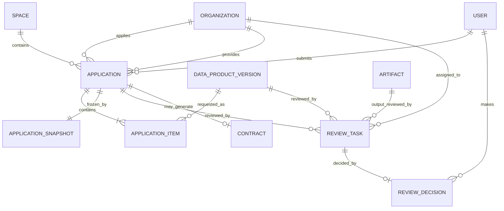
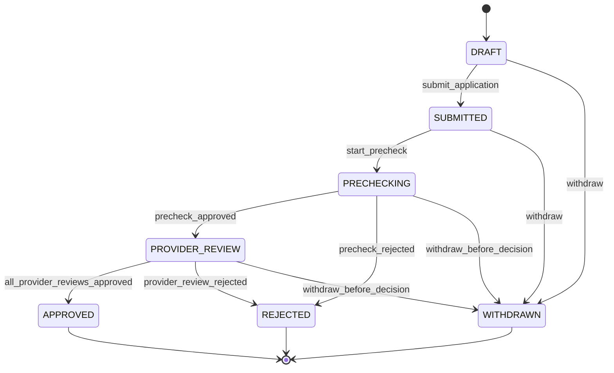

# MedTrust Space Phase 2-B.3 Application 领域模型

> 状态：设计冻结候选稿（不包含 ORM、migration 或 API）  
> 日期：2026-07-22  
> 适用范围：医疗可信数据空间中的数据产品使用申请、平台预审与数据提供方审核

## 1. 目标与边界

Application 域负责回答四个问题：

1. 哪个已准入组织申请使用哪些明确的数据产品版本；
2. 申请用途、算法、期限、次数和期望输出是什么；
3. 提交时看到的产品内容与申请正文如何形成不可变证据；
4. 平台运营方和数据提供方如何独立审核并形成可追溯决定。

本阶段只冻结领域模型，不生成数据库表、ORM、migration、CRUD 或前端改动。

本域不负责：

- 数据产品及其版本的创建和发布；
- 数字合约正文、签署和执行策略；
- ComputeJob 的调度或算法执行；
- Artifact 的内容检查、出域授权和下载；
- 真实伦理审查系统、电子签名或医院内部 OA 集成。

Application 获批只表示“允许进入合约阶段”，不表示申请方已经获得数据访问权，也不允许直接创建 ComputeJob。

## 2. 对原始建议的三项修正

### 2.1 多资源不等于多产品

WSI、临床变量、治疗信息和随访数据，通常是同一个 `DataProductVersion` 下的多个 `DataResource`：

```text
鼻咽癌数字病理多模态研究数据产品 v1.0
├── WSI 图像资源
├── 临床变量资源
├── 治疗信息资源
└── 随访资源
```

这些资源不应拆成四个 `ApplicationItem`。只有申请确实包含多个独立 `DataProductVersion` 时，才创建多个 ApplicationItem。

### 2.2 V1 支持多产品，但不支持跨提供方打包

V1 允许一次 Application 包含多个产品版本，但所有 Item 必须：

- 属于同一个 Space；
- 来自同一个数据提供方组织；
- 使用兼容的受控使用模式；
- 能够进入同一份合约系列。

跨提供方申请必须拆成多份 Application。否则，一家医院拒绝、另一家医院批准时，申请状态、合同签署方和策略执行边界都会变得含糊。

未来若确需跨提供方协同，应增加独立的“联合申请批次”作为上层协调对象，而不是放宽 Application 聚合边界。

### 2.3 结果审核不属于 Application 生命周期

`output_review` 审核的是 Compute 产生的 Artifact，不是原始 Application。

- Application 域创建 `application_precheck` 和 `provider_review`；
- Compute/Artifact 域以后创建 `output_review`；
- 两者复用 Reviews 模块中的 ReviewTask/ReviewDecision，但状态互不耦合。

因此，Application 获批不会等待尚未发生的结果出域审核。

## 3. 聚合边界与设计结论

### 3.1 Application 聚合

Application 是一次完整使用意图的稳定业务身份，也是事务一致性边界。

聚合内部包含：

- 一个 Application；
- 一个或多个 ApplicationItem；
- 提交时生成的一个 ApplicationSnapshot；
- 请求动作、输出类型和附件引用。

提交操作必须在一个事务内完成：

1. 校验申请方、产品版本、Publication 与提供方；
2. 规范化申请正文和全部 Item；
3. 生成 ApplicationSnapshot 和 digest；
4. 将 Application 从 `DRAFT` 推进为 `SUBMITTED`；
5. 写入 outbox/audit 事件。

### 3.2 Reviews 聚合

ReviewTask 是独立工作项，不属于 Application 聚合内部。这样产品上架审核、申请审核和 Artifact 出域审核可共享同一套任务队列，而不会反向依赖 Applications 模块。

ReviewDecision 是追加式决定记录。最终决定提交后不可原地覆盖；纠错必须创建补充 ReviewTask，并保留原决定。

### 3.3 为什么不使用一个 approve 字段

平台预审与提供方审核具有不同责任主体、处理时限和证据要求。Application 的最终状态必须由领域服务汇总必要 ReviewTask，而不是由页面直接修改。

## 4. 核心对象

### 4.1 Application

### 定义

申请组织在一个可信数据空间内提出的一次受控使用请求。它保存稳定业务身份、申请主体、使用意图和汇总状态，不直接复制产品名称或数据资源明细。

### 建议字段

| 字段 | 类型/形式 | 说明 |
|---|---|---|
| `id` | UUID | 主键。 |
| `space_id` | UUID | 所属 Space。 |
| `application_number` | text | 空间内可读且唯一的申请编号。 |
| `applicant_organization_id` | UUID | 申请组织。 |
| `applicant_user_id` | UUID | 发起用户。 |
| `provider_organization_id` | UUID | V1 单一数据提供方；提交后冻结。 |
| `purpose` | text | 明确、具体的使用目的。 |
| `legal_or_ethics_basis` | text/null | 合规、授权或伦理依据摘要。 |
| `algorithm_name` | text | 预登记算法名称。 |
| `algorithm_version` | text | 预登记算法版本。 |
| `algorithm_digest` | text | 预登记算法包或规范摘要。 |
| `requested_duration_seconds` | bigint | 请求授权期限，必须大于 0。 |
| `requested_run_limit` | integer | 请求运行次数，必须大于 0。 |
| `status` | enum/text | 见第 6 节。 |
| `submitted_at` | timestamptz/null | 首次完成提交的时间。 |
| `decided_at` | timestamptz/null | 最终批准或拒绝时间。 |
| `withdrawn_at` | timestamptz/null | 撤回时间。 |
| `decision_summary` | text/null | 汇总说明，不代替 ReviewDecision。 |
| `created_at/by` | timestamptz/UUID | 创建信息。 |
| `updated_at` | timestamptz | 更新时间。 |
| `row_version` | integer | 乐观锁。 |
| `is_demo` | boolean | 演示数据标识。 |

### 关系

- 属于一个 Space、一个申请组织和一个 V1 提供方组织；
- 包含一个或多个 ApplicationItem；
- 提交后拥有一个不可变 ApplicationSnapshot；
- 被零个或多个 ReviewTask 审核；
- 获批后最多生成一个 Contract 系列，创建命令必须幂等。

### 不变量

1. 申请组织必须是当前 Space 的有效 `data_consumer` 或兼容参与方；
2. 提供方必须是同一 Space 的有效 `data_provider`；
3. 申请组织和提供方组织不得相同，V1 不支持自供自审场景；
4. 至少包含一个 ApplicationItem；
5. 提交后正文、Item、动作、输出类型和附件不得原地覆盖；
6. `APPROVED` 只允许生成 Contract，不直接授予资源访问权限。

### 4.2 ApplicationItem

### 定义

一次 Application 中的一个明确产品版本标的。Item 引用 `DataProductVersion`，而不是可变化的 DataProduct 或具体 DataResource。

### 建议字段

| 字段 | 类型/形式 | 说明 |
|---|---|---|
| `id` | UUID | 主键。 |
| `application_id` | UUID | 所属 Application。 |
| `position_no` | integer | 稳定展示与摘要排序序号。 |
| `space_id` | UUID | 冗余空间键，用于复合 FK 拒绝跨空间引用。 |
| `data_product_version_id` | UUID | 固定产品版本。 |
| `requested_product_snapshot_digest` | text | 提交时必须等于 Version.snapshot_digest。 |
| `requested_policy_digest` | text | 提交时默认策略摘要。 |
| `requested_scope` | JSONB/value object | 对版本内资源或字段范围的收窄选择；不得扩大版本默认边界。 |
| `created_at` | timestamptz | 创建时间。 |

### 约束

- 同一 Application 不得重复引用同一 DataProductVersion；
- `position_no` 在 Application 内唯一；
- Item、Version、Application 必须属于同一 Space；
- Version 必须处于允许申请的状态，并存在 active Publication；
- Version 所属 DataProduct 的提供方必须等于 Application.provider_organization_id；
- `requested_scope` 只能从产品版本已有 DataResource/字段范围中做子集选择；
- 提交后 Item 与全部摘要不可修改或删除。

### 关于资源选择

如果申请只使用产品版本中的 WSI 和临床变量、暂不使用随访数据，应在该 Item 的 `requested_scope` 中表达，而不是重复创建 Product 或 Item。

### 4.3 ApplicationSnapshot

### 定义

提交时申请正文的规范化、不可变证据。它同时固定申请头、全部 Item、动作、输出类型和附件摘要，解决“审核者看到的内容后来发生变化”的问题。

### 建议字段

| 字段 | 类型/形式 | 说明 |
|---|---|---|
| `id` | UUID | 主键。 |
| `application_id` | UUID | V1 与 Application 一对一。 |
| `schema_version` | text | 快照规范版本。 |
| `manifest` | JSONB | 规范化申请清单，不含原始医疗数据。 |
| `snapshot_digest` | text | 对规范化 manifest 计算的摘要。 |
| `captured_at` | timestamptz | 提交时刻。 |
| `captured_by` | UUID | 执行提交的用户。 |

### manifest 最小内容

- Space、申请组织、提供方和申请编号；
- purpose、合规依据摘要；
- 算法名称、版本和 digest；
- 期限、运行次数；
- 按 position_no 稳定排序的 Item、Version ID、产品摘要、策略摘要和请求范围；
- 请求动作和输出类型；
- 按稳定顺序排列的附件类型与 content digest。

### 设计边界

- 快照不复制患者数据、WSI 地址或 Connector 本地资源定位符；
- `snapshot_digest` 是申请整体摘要，不能替代 Item 的产品版本摘要；
- V1 被退回或拒绝后如需修改，应克隆为新 Application，而不是覆盖快照；因此 V1 一对一即可；
- 若未来要支持同一申请多次补件重提，再升级为一对多快照修订，不在 V1 提前实现。

### 4.4 ReviewTask

### 定义

由 Reviews 模块管理的独立工作项，描述“谁应在何时审核哪个不可变目标”。

### 建议字段

| 字段 | 类型/形式 | 说明 |
|---|---|---|
| `id` | UUID | 主键。 |
| `space_id` | UUID | 所属 Space。 |
| `review_type` | enum/text | `application_precheck`、`provider_review`；共享模块还支持 `product_review`、`output_review`。 |
| `application_id` | UUID/null | 申请审核目标。 |
| `data_product_version_id` | UUID/null | 产品上架审核目标。 |
| `artifact_id` | UUID/null | 结果出域审核目标。 |
| `assignee_organization_id` | UUID | 责任组织。 |
| `assignee_user_id` | UUID/null | 领取后的具体处理人。 |
| `task_status` | enum/text | `PENDING`、`CLAIMED`、`DECIDED`、`CANCELLED`。 |
| `sequence_no` | integer | 审核顺序。 |
| `is_required` | boolean | 是否为状态推进的必要任务。 |
| `target_digest` | text | Application 审核时等于 ApplicationSnapshot.snapshot_digest。 |
| `due_at` | timestamptz/null | 截止时间。 |
| `claimed_at` | timestamptz/null | 领取时间。 |
| `decided_at` | timestamptz/null | 最终决定时间。 |
| `created_at/by` | timestamptz/UUID | 创建信息。 |

### 为什么不把 Review 状态直接定义为 PENDING/APPROVED/REJECTED

`PENDING` 是任务生命周期状态，`APPROVED/REJECTED` 是决定结果，把两者放在一个字段会混淆“已领取但未决定”和“已经决定”。因此：

- ReviewTask 用 `PENDING/CLAIMED/DECIDED/CANCELLED`；
- ReviewDecision 用 `APPROVED/REJECTED`；
- 页面可以把两者投影成用户熟悉的“待审/已通过/已拒绝”。

这比在 ReviewTask 上同时保存 status 和 decision 更清晰，也是对数据库冻结 v2 的一项待同步修订。

### 目标约束

ReviewTask 的 Application、DataProductVersion、Artifact 三个目标外键必须恰好一个非空；V1 不使用无法建立真实 FK 的 `target_type + target_id`。

### 4.5 ReviewDecision

### 定义

授权审核人对一个 ReviewTask 作出的追加式最终决定。

### 建议字段

| 字段 | 类型/形式 | 说明 |
|---|---|---|
| `id` | UUID | 主键。 |
| `review_task_id` | UUID | 所属任务。 |
| `decision` | enum/text | V1 仅 `APPROVED` 或 `REJECTED`。 |
| `reason_code` | text/null | 结构化原因。拒绝时必填。 |
| `comment` | text/null | 人工意见。 |
| `decided_by_user_id` | UUID | 实际决定人。 |
| `decided_for_organization_id` | UUID | 决定人代表的责任组织。 |
| `decided_at` | timestamptz | 决定时间。 |
| `target_digest` | text | 再次固定被审目标摘要。 |
| `evidence` | JSONB/value object | 可选的演示证据引用，不含敏感原文。 |

### 不变量

- 一个 ReviewTask 最多一个最终 ReviewDecision；
- 决定人与代表组织必须具有该任务所需的有效成员和空间权限；
- 决定的 target_digest 必须等于任务 target_digest；
- 决定提交后不可 UPDATE/DELETE；
- 如需纠错，取消后续流程并创建新的补充 ReviewTask，不覆盖历史决定。

## 5. 对象关系



关键关系：

| 关系 | V1 基数与约束 |
|---|---|
| Application—ApplicationItem | 一对多，至少一个 Item。 |
| ApplicationItem—DataProductVersion | 多对一，每个 Item 固定一个版本。 |
| Application—ApplicationSnapshot | 一对一，提交时创建。 |
| Application—ReviewTask | 一对多，至少平台预审和提供方审核各一项。 |
| ReviewTask—ReviewDecision | 零或一；只有完成决定后存在。 |
| Application—Contract | 零或一；只有 APPROVED 可创建。 |

## 6. Application 状态机

### 6.1 状态

| 状态 | 含义 |
|---|---|
| `DRAFT` | 申请方可编辑，尚未形成提交证据。 |
| `SUBMITTED` | 已生成 ApplicationSnapshot，等待平台建立/启动预审。 |
| `PRECHECKING` | 平台运营方进行完整性、准入、用途和材料预审。 |
| `PROVIDER_REVIEW` | 平台预审通过，数据提供方审核用途与默认策略兼容性。 |
| `APPROVED` | 所有必要审核通过，可幂等创建 Contract 草案。 |
| `REJECTED` | 任一必要审核拒绝，终态。 |
| `WITHDRAWN` | 申请方在最终决定前主动撤回，终态。 |

### 6.2 状态图



### 6.3 命令、前置条件与事件

| 命令 | 执行主体 | 关键前置条件 | 结果事件 |
|---|---|---|---|
| `create_application` | 有效空间使用方成员 | 申请方准入有效 | `application.created` |
| `add_application_item` | 申请方 | DRAFT；同空间、同提供方；Version 可申请 | `application.item_added` |
| `submit_application` | 申请方 | 内容完整；摘要匹配；Publication active；附件扫描通过 | `application.submitted` |
| `start_precheck` | 空间运营方 | SUBMITTED；快照存在；幂等创建预审任务 | `application.precheck_started` |
| `decide_review_task` | 授权审核人 | Task 未决定；摘要匹配；无利益冲突 | `review.decided` |
| `advance_application_review` | 领域服务 | 按顺序汇总全部必要决定 | `application.provider_review_started`、`application.approved` 或 `application.rejected` |
| `withdraw_application` | 申请方 | 尚未最终决定，且未生成 Contract | `application.withdrawn` |
| `create_contract_from_application` | 合约服务 | APPROVED；幂等键未消费 | `contract.created_from_application` |

Application 状态不能由通用 `PATCH status` 接口修改。

## 7. 审核编排

### 7.1 平台预审

平台运营方负责：

- 申请组织和用户是否为有效空间参与者；
- 申请用途是否具体，材料是否完整；
- 伦理/授权材料是否满足演示规则；
- 算法摘要、请求动作、输出类型、期限和次数是否完整；
- 全部 Item 是否仍匹配提交快照。

平台预审不代替医院对数据使用目的和风险的判断。

### 7.2 提供方审核

V1 只有一个 provider organization，因此创建一个必要的 provider_review 任务。提供方负责：

- 使用目的与数据产品默认策略是否兼容；
- 请求范围是否是产品版本范围的子集；
- 输出类型和人工审核要求是否合理；
- 算法与运行次数是否可接受；
- 是否存在利益冲突或禁止用途。

### 7.3 结果出域审核

结果出域审核在 ComputeJob 产生 Artifact 后创建：

```text
ComputeJob
  → Artifact(quarantined)
  → ReviewTask(output_review)
  → ReviewDecision
  → ArtifactGrant
```

它复用 Reviews 模块，但不回写或重新打开 Application。

## 8. 权限与利益冲突规则

采用“空间角色 + 组织关系 + 对象属性”的 RBAC + ABAC 判定：

| 操作 | 最低规则 |
|---|---|
| 创建/编辑申请 | 用户是 applicant organization 的有效成员，组织在 Space 中有 consumer 角色。 |
| 提交申请 | 同上；所有 Item 可申请，附件扫描通过。 |
| 平台预审 | 用户是 operator organization 的有效成员并有 application_previewer 权限。 |
| 提供方审核 | 用户是 provider organization 的有效成员并有 application_reviewer 权限。 |
| 领取审核任务 | 用户组织必须等于 task.assignee_organization_id。 |
| 作出决定 | 领取人或明确授权人；不得属于 applicant organization。 |
| 撤回 | applicant organization 的申请管理员；尚无最终决定或合约。 |

后端必须重新校验所有规则，前端隐藏按钮不能作为授权控制。

## 9. 提交快照与摘要规则

### 9.1 两层摘要

| 摘要 | 固定内容 | 用途 |
|---|---|---|
| `ApplicationItem.requested_product_snapshot_digest` | 单个 DataProductVersion | 证明申请的是哪个版本内容。 |
| `ApplicationSnapshot.snapshot_digest` | 完整申请 manifest | 证明审核的是哪一份完整申请。 |

两者不可合并：单个产品摘要不能证明用途、算法、期限和多个 Item 的组合没有变化。

### 9.2 规范化要求

- 明确 manifest schema_version；
- 对 Item、动作、输出类型和附件按稳定键排序；
- 统一空值、时间、数值和枚举序列化；
- digest 算法和编码必须带版本；
- 不把展示名称作为唯一证据，始终保留 ID 和 digest；
- 审核任务必须保存 ApplicationSnapshot digest，而不是重新读取可变草稿。

## 10. 关键业务不变量

1. Application 的全部 Item 必须引用具体 DataProductVersion，禁止只引用 DataProduct 或“最新版本”。
2. Application、Item、Version、Publication、申请方、提供方必须处于同一 Space。
3. 提交时每个 Version 必须允许新申请并存在 active Publication。
4. V1 全部 Item 必须属于同一个 provider organization。
5. WSI、临床、随访等同一版本内资源不能被误建为多个产品 Item。
6. 提交后 Application 聚合和 Snapshot 不可覆盖；需要修改时克隆新申请。
7. 平台预审和提供方审核由不同责任上下文完成；申请方不能审批自己。
8. ReviewDecision 只能追加，不能覆盖或删除。
9. Application 最终状态只能由领域服务汇总必要 ReviewDecision 得出。
10. `APPROVED` 不授予访问权；只有已签署且 active 的 Contract/Policy 才能授权 Compute。
11. Publication 后续撤回不改变历史 ApplicationSnapshot，但 Contract 创建前必须再次进行风险检查。
12. 重复提交、建任务、决定和建合约命令必须通过 idempotency key 去重。

## 11. 并发、幂等与失败处理

### 11.1 并发控制

- Application 使用 `row_version` 做乐观锁；
- 提交事务锁定 Application，并重新校验 Item 与 Publication；
- ReviewTask 领取使用条件更新，防止两人同时领取；
- 一个任务的最终 ReviewDecision 由唯一约束保证只能成功一次；
- Application 状态汇总与 ReviewDecision 写入处于同一事务或通过可靠 outbox 串联。

### 11.2 幂等键

至少覆盖：

- 提交申请；
- 建立预审/提供方审核任务；
- 提交审核决定；
- 从 approved Application 创建 Contract。

### 11.3 失败与撤销

- 审核拒绝保留决定和目标摘要，不删除申请；
- 撤回后取消未决定的 ReviewTask，不删除已形成的决定；
- Contract 已创建后不允许撤回 Application；后续处理进入 Contract 的终止/撤销语义；
- 产品 Publication 在提交后撤回时，历史证据仍保留，是否继续签约由风险规则决定并记录事件。

## 12. 与上下游模块的关系

### 12.1 Catalog

- ApplicationItem 直接引用 DataProductVersion；
- 提交时核对 Version snapshot digest 和 active Publication；
- requested_scope 只能收窄 DataResource 范围；
- Application 不读取 Connector 内部真实资源地址。

### 12.2 Contract

V1 一份 approved Application 生成一个 Contract 系列：

- 每个 ApplicationItem 映射为一个 ContractObject；
- ContractObject 保存版本 ID、产品名称快照和产品 digest；
- ApplicationSnapshot 为合约提案提供申请证据；
- 默认策略只作为协商输入，最终执行规则由 Contract Policy 表达；
- Contract 建立后不可因 Catalog 当前 Publication 变化而自动漂移。

### 12.3 Compute 与 Artifact

- ComputeJob 不直接引用 ApplicationItem；
- Job 通过 active ContractRevision 和 ContractObject 使用固定版本；
- Artifact 默认隔离，出域前由 output_review 和 ArtifactGrant 控制；
- 结果审核不会修改 Application 的 APPROVED 状态。

### 12.4 Audit

至少记录：

- Application 创建、Item 增删、提交、撤回；
- Snapshot 生成及 digest；
- ReviewTask 创建、领取、取消；
- ReviewDecision 提交；
- Application 状态汇总；
- Contract 创建请求与结果；
- 所有拒绝、越权、摘要不匹配和幂等冲突。

## 13. 医疗场景示例

### 13.1 单产品、多资源（推荐主链）

```text
申请：鼻咽癌复发风险模型验证
Applicant：AI 企业（演示）
Provider：肿瘤研究医院（演示）

ApplicationItem 1
└── 鼻咽癌数字病理多模态研究数据产品 v1.0
    ├── WSI
    ├── 临床变量
    └── 随访结局

requested_scope：WSI + 临床变量 + 随访结局
```

这是一项 ApplicationItem，不是三项。

### 13.2 同一提供方、多产品

```text
Application
├── Item 1：鼻咽癌数字病理研究产品 v1.0
└── Item 2：鼻咽癌 MRI 影像研究产品 v2.1
```

两项产品属于同一 Space、同一医院提供方，可经一次平台预审、一次提供方审核，并在获批后映射为同一 ContractRevision 下的两个 ContractObject。

### 13.3 跨提供方请求

医院 A 的病理产品和医院 B 的影像产品必须拆成两份 Application。未来可由“联合申请批次”在上层关联，但各医院保留独立决定与合约。

## 14. 对数据库冻结 v2 的影响

本设计不是对 v2 的零改动延伸。进入 ORM 前必须单独执行 Application 数据库冻结同步。

### 14.1 建议新增

- `application_items`；
- `application_snapshots`；
- `review_decisions`。

### 14.2 建议调整

- 从 `applications` 移除单一 `data_product_version_id`；
- 从 `applications` 移除单一 `requested_product_snapshot_digest`，迁移到 ApplicationItem；
- `applications` 增加 V1 `provider_organization_id`；
- `applications.status` 从笼统 `under_review` 细化为 `prechecking` 与 `provider_review`；
- `review_tasks` 将任务生命周期与决定结果分离，最终意见迁入 ReviewDecision；
- `contracts.application_id` 的“一申请一合约系列”约束可继续保留，因为 V1 禁止跨提供方打包；
- ContractObject 从 ApplicationItem 一一生成，但不需要反向 FK 到 ApplicationItem，避免不必要循环。

### 14.3 现有表的保留

- `application_requested_actions`、`application_requested_output_types`、`application_attachments` 继续保留；
- 它们属于 Application 整体请求，不在每个 Item 重复；
- 若未来不同产品需要不同动作，再引入 item-level overrides，而不是在 V1 预先复杂化。

若上述三张表全部落库且不删除现有关系表，候选总表数将由 34 增至 37。最终表数、复合 FK、唯一约束和迁移顺序仍必须在新的数据库冻结文档中重新计算；本文件不修改当前 34 表 v2 基线。

## 15. V1 与未来能力边界

| 能力 | V1 | 未来 |
|---|---|---|
| 单申请多产品 | 同空间、同提供方 | 可由联合申请批次协调跨提供方 |
| 申请补件 | 拒绝/撤回后克隆新申请 | 多快照修订与 request_changes |
| 审核阶段 | 平台预审、提供方审核 | 伦理委员会、数据治理委员会等可配置编排 |
| 审核决定 | APPROVED/REJECTED | 条件批准、补件、会签和法定签章 |
| 结果审核 | Artifact 阶段复用 Reviews | 自动泄露检测、多级出域审查 |
| 身份 | 组织/空间成员和演示权限 | OIDC/IAM、机构证书和真实授权委托 |

## 16. ORM 前验收清单

- [ ] 明确接受“多 DataResource 不等于多 ApplicationItem”。
- [ ] 明确接受 V1 同一 Application 仅含同一提供方的产品版本。
- [ ] ApplicationItem 只引用具体 DataProductVersion，并保存产品摘要。
- [ ] ApplicationSnapshot 覆盖申请头、Item、动作、输出和附件摘要。
- [ ] ApplicationSnapshot 不包含患者数据或真实资源地址。
- [ ] 平台预审与提供方审核责任主体明确且不可自审。
- [ ] ReviewTask 生命周期与 ReviewDecision 结果分离。
- [ ] 结果出域审核留在 Artifact 域，不进入 Application 状态机。
- [ ] APPROVED 只允许进入 Contract，不授予数据访问权。
- [ ] 多 Item 可无歧义映射为同一 ContractRevision 下多个 ContractObject。
- [ ] 数据库冻结 v2 在 ORM 前另行同步并重新计算表数。
- [ ] 本阶段未生成 ORM、migration、API 或业务 CRUD。

## 17. 结论

Application 域可以进入下一轮数据库冻结同步，但不能直接按当前 34 表 v2 生成 ORM。核心原因不是模型不稳定，而是本轮正式引入了“同一提供方多产品申请”和“独立 ReviewDecision”，两者都改变了既有表结构。

冻结后的主链为：

```text
Applicant Organization
  → Application
  → ApplicationItem(s) / concrete DataProductVersion(s)
  → ApplicationSnapshot
  → Platform Precheck
  → Provider Review
  → Approved Application
  → Contract / ContractObject(s)
```

这条链保持了“产品版本固定、申请证据固定、审核责任分离、批准不等于访问”的可信数据空间边界。
