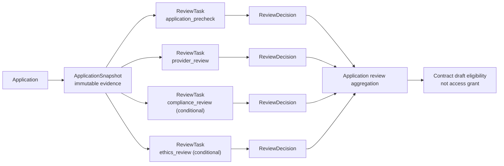
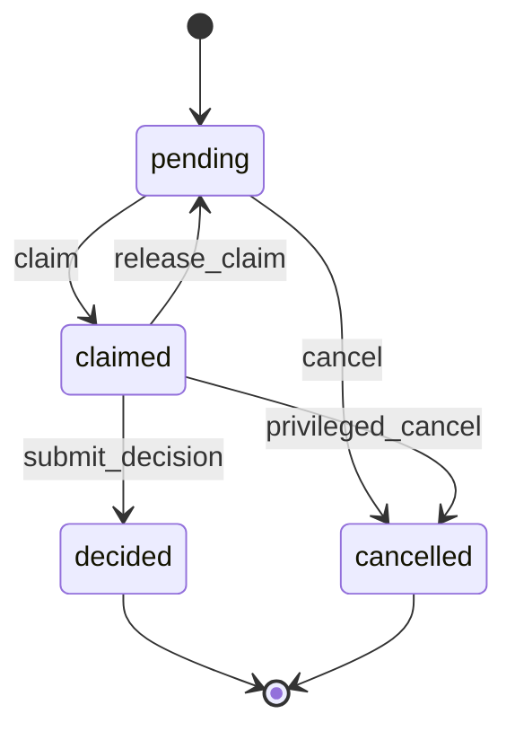
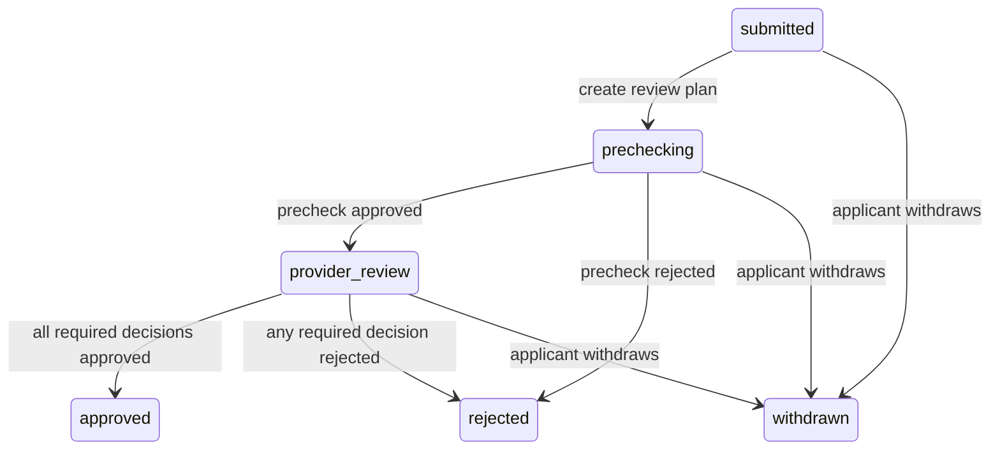

# MedTrust Space Phase 2-B.4 Review 领域模型

> 状态：领域设计已通过，尚未生成 ORM、migration 或 API  
> 适用范围：ApplicationSnapshot 的平台预审、数据提供方审核及条件触发的合规/伦理审核  
> 非目标：Contract、Compute、Artifact 出域审核、Audit 实现、通用规则引擎、外部伦理系统接入

## 1. 结论

Review 域采用两个持久化核心对象：

1. `ReviewTask`：描述谁应在何时审核哪一份不可变证据；
2. `ReviewDecision`：记录授权审核人对该任务提交的唯一、不可覆盖的最终结论。

本阶段不把 Review 做成 Application 上的 `approve=true`，也不把审核结论混入任务状态。Application 只保存汇总状态；权威审核事实来自 `ReviewTask + ReviewDecision + ApplicationSnapshot`。

本设计对初始建议作两项必要修正：

- `ReviewTask` 不使用 `approved/rejected/returned` 作为状态；这些是业务结论，不是任务生命周期；
- V1 不允许同一 ApplicationSnapshot 先被拒绝、再被批准。补件意味着申请内容发生变化，必须形成新的 ApplicationSnapshot 和新的 ReviewTask，原决定永久保留。

## 2. 设计目标

Review 域回答五个问题：

1. 审核的是哪一份不可变申请证据？
2. 为什么触发这类审核？
3. 哪个组织、哪个用户有权审核？
4. 审核结论是什么，依据是什么？
5. 多项审核如何汇总为 Application 的下一状态？

Review 域不回答：

- 数据是否已经可访问；
- Contract 是否已签署或生效；
- Connector 是否已执行策略；
- ComputeJob 是否可以运行；
- Artifact 是否可以出域。

`Application approved` 只表示可以进入 Contract 草案阶段，不产生数据访问权。

## 3. 统一语言

| 术语 | 定义 |
| --- | --- |
| 审核目标 | 本阶段固定为一份 `ApplicationSnapshot`。 |
| 任务生命周期 | 待领取、已领取、已决定、已取消。 |
| 审核结论 | 对任务作出的 `approved` 或 `rejected` 最终决定。 |
| 审核计划 | 根据 Snapshot、空间规则和责任组织生成的一组必要 ReviewTask。V1 不单独建表。 |
| 路由规则摘要 | 证明某任务为何被创建、由谁负责的规则版本摘要。 |
| 决定摘要 | 对 ReviewDecision 规范化内容计算的 SHA-256，不等于申请 Snapshot 摘要。 |
| 补件 | 对原申请内容作出修改并重新提交；V1 产生新的 Application 和 Snapshot。 |

## 4. 聚合与依赖方向



依赖方向保持单向：

- Reviews 引用 ApplicationSnapshot；
- Application 不保存单一 `review_task_id` 或 `review_decision_id`；
- Contract 后续查询获批 Application 及其决定证据，不反向改写 ReviewDecision；
- Artifact 出域审核未来复用 Reviews 能力，但不回写或重新打开 Application 审核。

## 5. ReviewTask

### 5.1 定义

`ReviewTask` 是一个可领取、可决定、可取消的审核工作项。它固定审核目标、责任组织、任务类型、执行顺序和路由依据，不保存批准或拒绝结论。

### 5.2 字段候选

| 字段 | 类型 | 约束 | 说明 |
| --- | --- | --- | --- |
| `id` | uuid | PK | 任务标识。 |
| `space_id` | uuid | FK, NOT NULL | 审核发生的可信空间。 |
| `review_type` | varchar(32) | CHECK, NOT NULL | 审核类型。 |
| `application_id` | uuid | FK, NOT NULL | 被审申请。 |
| `application_snapshot_id` | uuid | FK, NOT NULL | 被审不可变快照。 |
| `target_digest` | text | NOT NULL | `sha256:<64 hex>`；必须等于 Snapshot digest。 |
| `assignee_organization_id` | uuid | FK, NOT NULL | 审核责任组织，创建后不可修改。 |
| `assignee_user_id` | uuid | FK, NULL | 领取任务的具体用户。 |
| `task_status` | varchar(16) | CHECK, NOT NULL | `pending/claimed/decided/cancelled`。 |
| `sequence_no` | smallint | CHECK, NOT NULL | 审核屏障顺序。V1 使用 10、20。 |
| `is_required` | boolean | NOT NULL | 是否影响 Application 汇总结论。V1 只创建必要任务。 |
| `routing_rule_digest` | text | NOT NULL | `sha256:<64 hex>`；创建任务所依据的规则和路由配置摘要。 |
| `due_at` | timestamptz | NULL | 处理时限。 |
| `claimed_at` | timestamptz | NULL | 领取时间。 |
| `decided_at` | timestamptz | NULL | 决定时间。 |
| `cancelled_at` | timestamptz | NULL | 取消时间。 |
| `cancel_reason` | varchar(64) | NULL | 取消原因编码。 |
| `created_by` | uuid | FK, NOT NULL | 创建任务的系统主体或用户。 |
| `created_at` | timestamptz | NOT NULL | UTC 创建时间。 |
| `row_version` | integer | NOT NULL | 乐观并发控制。 |

证据关系采用复合外键：

```text
(application_id, application_snapshot_id, target_digest)
    -> application_snapshots(application_id, id, snapshot_digest)
```

这可防止任务引用另一申请的 Snapshot，或在引用正确 Snapshot ID 时伪造 digest。

### 5.3 审核类型

Application 首期冻结四种类型：

| `review_type` | 是否必有 | 责任组织 | 审核重点 |
| --- | --- | --- | --- |
| `application_precheck` | 是 | Space operator | 主体准入、材料完整、版本可申请、风险路由是否完整。 |
| `provider_review` | 是 | Application provider organization | 数据用途、最小必要性、产品策略、提供方责任。 |
| `compliance_review` | 条件触发 | 空间配置的已准入合规责任组织 | 合规依据、敏感等级、跨主体使用边界。 |
| `ethics_review` | 条件触发 | 空间配置的已准入伦理责任组织 | 研究方案、伦理材料及医学研究适当性。 |

条件审核不是“可选意见”。命中规则时，任务即为 required；未命中时不创建任务。V1 不创建不影响结果的 advisory task。

`product_review` 和 `output_review` 属于共享 Reviews 模块的未来目标类型，不进入本轮 Application ORM 范围。`output_review` 必须等 Artifact 表存在后再增量启用真实外键。

### 5.4 责任组织解析

责任组织不能由普通申请方或页面任意传入：

- `application_precheck` 固定为 `Space.operator_organization_id`；
- `provider_review` 固定为 `Application.provider_organization_id`；
- `compliance_review`、`ethics_review` 从服务端空间审核路由配置解析，且组织必须是该 Space 的 admitted participant；
- 如果 Snapshot 风险规则要求合规或伦理审核，但空间没有配置合格责任组织，则审核计划创建失败，不得静默跳过。

当前 Spaces 域尚未持久化合规/伦理路由配置。V1 Demo 可使用服务端种子配置；进入生产设计前应在治理域冻结可审计的空间审核路由对象。本阶段不新增该对象或表。

## 6. ReviewTask 状态机



状态含义：

| 状态 | 含义 | 数据约束 |
| --- | --- | --- |
| `pending` | 尚未被具体用户领取。 | `assignee_user_id/claimed_at/decided_at/cancelled_at` 均为空。 |
| `claimed` | 已由责任组织内的授权用户领取。 | `assignee_user_id`、`claimed_at` 非空。 |
| `decided` | 已写入唯一最终 ReviewDecision。 | `decided_at` 非空且存在 Decision。 |
| `cancelled` | 因申请撤回、上游拒绝或管理性终止而关闭。 | `cancelled_at/cancel_reason` 非空且不存在 Decision。 |

补充规则：

- `approved/rejected` 不属于 ReviewTask 状态；
- “逾期”是 `due_at < now()` 且任务仍为 `pending/claimed` 的查询投影，不增加 `expired` 状态；
- `release_claim` 只能在尚无 Decision 时执行，并清空用户和领取时间；
- 普通 reviewer 不能取消任务；取消由 Application 编排服务或被授权的空间运营管理命令执行；
- `decided` 与 `cancelled` 是终态，不允许原地重开。

## 7. ReviewDecision

### 7.1 定义

`ReviewDecision` 是审核人针对一个 ReviewTask 提交的最终、追加式证据记录。这里的“追加式”指只能 INSERT、不能 UPDATE/DELETE；每个任务最多一条最终决定。

### 7.2 字段候选

| 字段 | 类型 | 约束 | 说明 |
| --- | --- | --- | --- |
| `id` | uuid | PK | 决定标识。 |
| `review_task_id` | uuid | FK, UNIQUE, NOT NULL | 一个任务最多一条最终决定。 |
| `decision` | varchar(16) | CHECK, NOT NULL | `approved/rejected`。 |
| `reason_code` | varchar(64) | 条件必填 | 拒绝时必填。 |
| `comment` | text | NULL | 审核说明，不承载结构化策略。 |
| `decided_by_user_id` | uuid | FK, NOT NULL | 必须是当前领取人。 |
| `decided_for_organization_id` | uuid | FK, NOT NULL | 必须等于任务责任组织。 |
| `target_digest` | text | NOT NULL | `sha256:<64 hex>`；必须等于 ReviewTask target digest。 |
| `evidence` | jsonb | NOT NULL | 结构化证据引用，不保存附件二进制或患者数据。 |
| `remediation` | varchar(32) | NULL | 如 `clone_and_resubmit`；不改变拒绝结论。 |
| `decision_digest` | text | UNIQUE, NOT NULL | `sha256:<64 hex>`；规范化决定证据的 SHA-256。 |
| `decided_at` | timestamptz | NOT NULL | UTC 决定时间。 |
| `created_at` | timestamptz | NOT NULL | 与决定时间一并固定。 |

决定证据至少包含：

```json
{
  "schema_version": "1.0",
  "review_task_id": "uuid",
  "review_type": "provider_review",
  "target_digest": "sha256",
  "decision": "rejected",
  "reason_code": "missing_ethics_material",
  "remediation": "clone_and_resubmit",
  "evidence_refs": ["attachment-digest-or-rule-digest"],
  "decided_by_user_id": "uuid",
  "decided_for_organization_id": "uuid",
  "decided_at": "UTC ISO-8601"
}
```

对 canonical JSON 使用 UTF-8、键排序、紧凑分隔符、禁止 NaN/Infinity 后计算 SHA-256。

### 7.3 决定词表

V1 只保留：

- `approved`
- `rejected`

不新增持久化 `returned`。原因是当前 Application 采用“一份申请一份提交 Snapshot”的模型。所谓退回补件会改变附件、用途或输出请求，不能继续沿用原 Snapshot 的审核结论。

界面可以把以下拒绝展示为“退回补件”：

```text
decision = rejected
reason_code = missing_ethics_material
remediation = clone_and_resubmit
```

但底层证据仍是对旧 Snapshot 的最终拒绝。申请方复制申请、补齐材料并重新提交后，系统生成新的 Application、Snapshot、Task 和 Decision。

如果未来必须支持同一申请内多轮补件，应先引入 ApplicationRevision/多 Snapshot 模型；不能只给 ReviewDecision 增加 `returned` 就声称支持多轮审核。

## 8. 审核计划与顺序

### 8.1 计划生成

`start_application_review(application_id)` 执行：

1. 锁定 Application；
2. 验证状态为 `submitted` 且存在唯一 Snapshot；
3. 验证 Snapshot digest、附件扫描状态和产品版本可申请性；
4. 根据 Snapshot 中的 Action、Output、Attachment、敏感等级和规则摘要派生必要审核类型；
5. 解析每类任务的责任组织；
6. 在同一事务创建全部 required ReviewTask；
7. 将 Application 推进为 `prechecking`；
8. 写入 outbox 事件，Audit 在后续阶段消费。

该命令必须幂等。相同 Application、Snapshot 和 review type 不得重复创建活动任务。

### 8.2 顺序屏障

V1 使用两个屏障：

```text
sequence 10
  application_precheck

sequence 20（可并行）
  provider_review
  compliance_review（条件）
  ethics_review（条件）
```

- 只有当前最小未完成 sequence 的任务可被领取；
- 预审通过后，Application 进入 `provider_review`，sequence 20 解锁；
- sequence 20 的任务可以并行；
- 任何 required 任务拒绝，Application 进入 `rejected`，其余未决定任务被取消；
- 全部 required 任务批准，Application 进入 `approved`。

## 9. Application 状态汇总



汇总规则：

| 条件 | Application 状态 | 后续动作 |
| --- | --- | --- |
| 审核计划已创建 | `prechecking` | 只开放 sequence 10。 |
| 平台预审批准 | `provider_review` | 开放 sequence 20。 |
| 任一 required 决定拒绝 | `rejected` | 取消其余开放任务。 |
| 全部 required 决定批准 | `approved` | 仅获得创建 Contract draft 的资格。 |
| 申请方撤回 | `withdrawn` | 取消所有未决定任务，保留既有决定。 |

`applications.decision_summary` 只是列表查询投影，不是权威决定。它必须由 Review 汇总服务更新，页面不得直接 PATCH。

## 10. 命令与不变量

### 10.1 `claim_review_task`

前置条件：

- Task 为 `pending`；
- Task 属于当前可执行 sequence；
- 用户是 assignee organization 的 active member；
- 用户持有该 review type 所需的上下文角色；
- 用户及其组织不是申请方；
- 用户未违反职责分离规则。

并发领取使用条件更新或 `SELECT ... FOR UPDATE`，只能一个用户成功。

### 10.2 `release_review_task`

- 仅当前领取人或授权管理员可执行；
- Task 必须为 `claimed` 且尚无 Decision；
- 状态回到 `pending`，清空领取人和领取时间；
- 释放动作后续进入 AuditEvent，不删除历史操作事实。

### 10.3 `submit_review_decision`

在单一事务中：

1. 锁定 ReviewTask；
2. 验证状态为 `claimed`；
3. 验证提交用户等于 `assignee_user_id`；
4. 验证用户组织、空间成员资格、角色和职责分离；
5. 验证 target digest 未变化；
6. 规范化决定证据并计算 digest；
7. 插入唯一 ReviewDecision；
8. 将 Task 更新为 `decided`；
9. 汇总 Application 状态；
10. 生成 outbox 事件。

不得先更新 Application，再异步补写 Decision；这会产生没有权威决定的“已批准申请”。

### 10.4 `cancel_review_task`

只允许：

- Application 已撤回；
- 上游 required Task 已拒绝；
- 空间运营方执行有理由编码的管理性终止。

已决定任务不能取消。需要纠正错误决定时，不修改原记录；应终止下游流程并走受控纠错流程。

## 11. 权限与职责分离

Review 使用 RBAC + ABAC：

### RBAC

- 平台预审：空间运营方内的 `application_previewer`；
- 提供方审核：数据提供组织内的 `application_reviewer`；
- 合规审核：配置责任组织内的 `compliance_reviewer`；
- 伦理审核：配置责任组织内的 `ethics_reviewer`。

这些是用户在组织/空间上下文中的能力，不创建全局 Role 表。

### ABAC

每次命令还必须检查：

- Space 与组织参与关系均有效；
- Task 的 assignee organization 与用户当前组织上下文一致；
- applicant organization 不能审核自己的申请；
- provider review 的责任组织必须等于申请中的 provider organization；
- precheck 与后续 required review 不得由同一用户作出决定；
- 任务目标 digest、路由规则 digest 和当前序列均匹配；
- 被暂停的组织、空间或用户不能领取或决定任务。

即使 operator organization 与 provider organization 相同，平台预审和提供方审核也必须由两个不同用户完成。若无法满足，空间配置不具备该申请的审核条件。

## 12. 不可变与纠错边界

### 12.1 不可变对象

- ApplicationSnapshot：创建后不可 UPDATE/DELETE；
- ReviewDecision：创建后不可 UPDATE/DELETE；
- 已决定 ReviewTask 的目标、责任组织、类型、规则摘要和时序不可修改；
- Decision digest 和 target digest 不可重算覆盖。

### 12.2 不接受的模型

以下流程不成立：

```text
同一 ApplicationSnapshot
  -> Decision 1: rejected
  -> Decision 2: approved
```

它会让同一证据同时拥有冲突的最终结论，也无法说明第二次批准依据了什么新材料。

正确流程：

```text
Application A / Snapshot A
  -> ReviewTask A
  -> rejected（历史保留）

clone + supplement

Application B / Snapshot B
  -> ReviewTask B
  -> approved
```

V1 可以在应用服务中记录 `source_application_id` 作为复制来源，但这属于下一次 Application 数据库冻结同步，不应偷偷塞进 ReviewDecision。

### 12.3 管理性纠错

如果错误来自 reviewer 操作，而不是申请材料变化：

- 不覆盖原决定；
- 立即阻断尚未生效的 Contract 或后续流程；
- 记录管理性纠错事件；
- 是否引入 `supersedes_review_task_id` 和专门纠错任务，留到 Audit/治理设计统一冻结。

V1 不伪造“修改决定”按钮。

## 13. Review 与 Contract 的边界

Review approved 只证明：

- 某份 Snapshot 已完成必要审核；
- 允许基于该证据起草 Contract；
- Contract 可以开始协商。

Contract 后续必须：

1. 引用 approved ApplicationSnapshot；
2. 引用必要 ReviewDecision 的 digest 集合；
3. 只能收窄申请中的 Action、Output 和数据产品版本；
4. 不能新增未申请或未批准的用途、输出或数据版本；
5. 经双方签署并 active 后，才可能成为 Compute/Connector 的执行依据。

Review 域不自动创建合同、不签署合同，也不授予下载、查询或计算权限。

## 14. 合规与伦理 V1 边界

V1 只模型化：

- 审核类型；
- 条件触发；
- 责任组织；
- 任务领取与决定；
- 证据引用和决定摘要。

V1 不实现：

- 通用规则表达式语言；
- 自动法律结论；
- 外部伦理委员会系统同步；
- 电子签章或 CA；
- IRB 编号真实性核验；
- 医疗机构真实组织和患者数据。

不创建 `ReviewPolicy` 表。Snapshot 已保存申请风险派生结果和规则 digest；ReviewTask 新增 `routing_rule_digest`，足以支持 V1 的可追溯编排。可复用规则目录在空间治理能力成熟后单独设计。

## 15. 并发、幂等与失败处理

| 场景 | 处理 |
| --- | --- |
| 两人同时领取同一任务 | 条件更新，只有一个成功。 |
| 同一命令重复创建审核计划 | 唯一约束与幂等键返回已有任务。 |
| 同一任务并发提交两个决定 | `review_task_id` UNIQUE，只有一个成功。 |
| Decision 插入成功但 Application 汇总失败 | 必须在同一事务回滚；事件使用事务 outbox。 |
| 必需合规/伦理责任组织缺失 | 审核计划创建失败，不跳过该任务。 |
| 上游拒绝时下游任务已存在 | 取消尚未决定的下游任务，保留全部历史。 |
| Application 撤回与 reviewer 决定并发 | 锁定 Application/Task，按先提交事务决定结果，另一方重读后返回冲突。 |

## 16. 医疗场景示例

申请：AI 企业申请“鼻咽癌数字病理多模态研究数据产品 v1.0”，动作是 `ai_training`，请求输出 `model_artifact`，并提交研究方案和伦理材料摘要。

审核计划：

```text
Snapshot digest: S1

sequence 10
  application_precheck
  assignee: Space operator

sequence 20
  provider_review
  assignee: 演示数据提供组织

  ethics_review
  assignee: 演示伦理责任组织
  trigger: model_artifact + 医疗高敏数据
```

如果伦理材料缺失：

```text
ethics ReviewDecision
  decision = rejected
  reason_code = missing_ethics_material
  remediation = clone_and_resubmit

Application A -> rejected
```

申请方补齐材料后复制为 Application B，生成 Snapshot S2。S1 的拒绝决定继续存在；S2 重新走完整审核。系统不会把 S1 改成已批准。

## 17. 数据库冻结影响

本设计不能直接按当前 v3 生成 ORM。下一步必须先同步数据库冻结设计，至少处理：

1. `review_type` 增加 `compliance_review`、`ethics_review`；
2. ReviewTask 增加 `routing_rule_digest` 和 `cancel_reason`；
3. 明确 V1 Decision 仍只有 `approved/rejected`，不增加 `returned`；
4. 冻结 `remediation` 词表及拒绝时的条件约束；
5. 冻结审核计划唯一约束和顺序索引；
6. 冻结责任组织复合完整性及用户领取/决定的服务不变量；
7. 明确首期 migration 只启用 ApplicationSnapshot 目标，还是同时启用既有 Product target；
8. 决定是否在 Application 增加 `source_application_id` 支持可追溯复制。

若只调整 Reviews 字段和词表、不新增治理路由表，v3 的逻辑总表数仍为 37。生产级空间审核路由持久化会另行增加治理对象，不能在 ORM 阶段临时添加。

## 18. 后续实现验收条件

进入 Review ORM 前，数据库冻结文档必须覆盖：

- [ ] Task 生命周期与 Decision 结论分离；
- [ ] Task 只能引用同一 Application 的 Snapshot 与 digest；
- [ ] 一个 Task 最多一条最终 Decision；
- [ ] Decision UPDATE/DELETE 被数据库拒绝；
- [ ] 两人并发领取只有一个成功；
- [ ] 并发决定只有一个成功；
- [ ] applicant organization 不能审核自己的申请；
- [ ] provider review 只能分配给 provider organization；
- [ ] precheck 和后续 required review 不能由同一用户决定；
- [ ] 必需责任组织缺失时审核计划失败；
- [ ] 上游拒绝会取消未决定的下游任务；
- [ ] 全部 required 决定批准才汇总为 Application approved；
- [ ] approved Application 不产生访问授权；
- [ ] 同一 Snapshot 不允许拒绝后覆盖为批准；
- [ ] 本阶段未引入 Contract、Compute、Artifact、Audit 或规则引擎代码。

## 19. 最终结论

Phase 2-B.4 Review 领域模型可以进入数据库冻结同步，但不应直接进入 ORM。

稳定主线为：

```text
ApplicationSnapshot
  -> required ReviewTask plan
  -> immutable ReviewDecision
  -> Application aggregate result
  -> Contract draft eligibility
```

该模型保留了申请证据、审核责任、最终结论和后续合约之间的边界，也避免把可信审核退化为普通 OA 的“批准按钮”。
