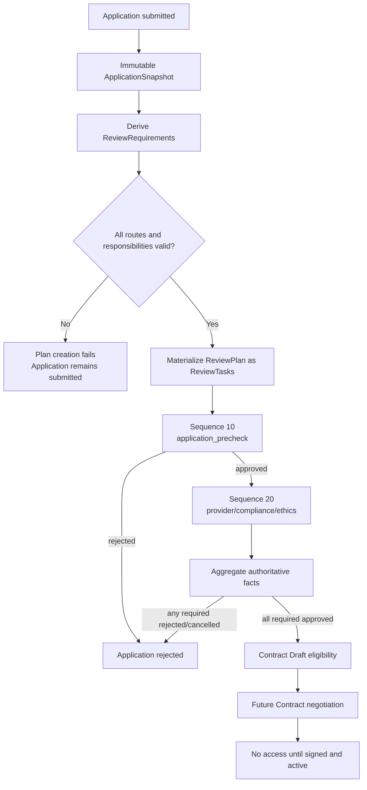

# MedTrust Space Phase 2-B.4-C Review 编排与 Application 汇总模型

> 日期：2026-07-22  
> 状态：领域设计完成，待审查  
> 前置基线：Review ORM `20260722_0007`  
> 本阶段边界：只设计，不生成 ORM、migration、Contract、Compute 或 API 代码

## 1. 结论先行

Review 编排首期采用三个领域概念，但不新增三张表：

| 概念 | 形态 | 是否新增持久化表 | 权威性 |
| --- | --- | --- | --- |
| `ReviewRequirement` | 规则派生值对象 | 否 | 生成计划前的规范化输入。 |
| `ReviewPlan` | 命令结果与不可变结构视图 | 否 | 由同一 Snapshot 的 ReviewTask 集合物化。 |
| `ApplicationReviewSummary` | 可重建查询投影 | 否 | 不是授权事实，不是 Contract 输入的唯一来源。 |

权威事实仍然只有：

```text
ApplicationSnapshot
  + ReviewTask
  + ReviewDecision
  + Application lifecycle state
```

`applications.decision_summary` 只用于列表展示。即使它写着“全部通过”，Contract 也必须重新读取权威事实并计算准入证据。

本阶段不接受以下模型：

```text
任意一个 ReviewDecision = approved
  -> Application 获得访问权限
```

正确边界：

```text
全部 required ReviewTask 对同一 Snapshot 完成并 approved
  -> Application approved
  -> 形成 Contract Draft eligibility evidence
  -> 仍无下载、查询、计算或 Connector 调用权限
```

## 2. 为什么不新增 Summary 表

如果新建可编辑的 `application_review_summaries` 表，会出现两个真相源：

```text
ReviewDecision: ethics_review = rejected

ApplicationReviewSummary: approved_for_contract
```

系统无法判断哪个结论有效，也可能让 Contract 读取过时汇总。

因此 V1 使用以下原则：

1. 汇总结果按需从 Task/Decision 重算；
2. 页面可缓存投影，但缓存可随时删除重建；
3. `decision_summary` 不参与授权判断；
4. Contract handoff 在同一事务或同一一致性快照中重新计算；
5. 将来如果数据量要求物化，应使用可重建 read model 或 materialized view，不把它升级成新的审核证据。

## 3. 总体流程



## 4. ReviewRequirement

### 4.1 定义

`ReviewRequirement` 表示规则系统针对一份固定 Snapshot 派生出的“一项必须审核什么、由谁负责、位于哪个顺序屏障”的规范化值。

它不是 ReviewTask，也不是数据库记录。只有整份要求集合验证通过后，才转换为 ReviewTask。

### 4.2 字段

```text
ReviewRequirement
  snapshot_id
  target_digest
  review_type
  sequence_no
  is_required
  assignee_organization_id
  routing_rule_digest
  requirement_key
```

`requirement_key` 的规范形式：

```text
<snapshot_id>:<review_type>
```

V1 同一 Snapshot 每种 review type 最多一项要求，与数据库 UNIQUE `(application_snapshot_id, review_type)` 一致。

### 4.3 派生输入

要求派生只读取可验证输入：

- ApplicationSnapshot 中的 Action、Requested Output、附件摘要及申请主体；
- Snapshot 固定的 DataProductVersion ID 与版本摘要；
- 不可变 DataProductVersion 的分类等级与默认策略摘要；
- Space 当前规则版本和参与组织配置；
- 服务端审核路由规则版本；
- 组织和空间当前有效状态。

页面参数、用户自报的 `requires_manual_review=false` 或 `decision_summary` 不能作为跳过审核依据。

### 4.4 V1要求类型

| review type | 触发方式 | sequence | 责任组织 |
| --- | --- | ---: | --- |
| `application_precheck` | 始终 | 10 | Space operator organization。 |
| `provider_review` | 始终 | 20 | Application provider organization。 |
| `compliance_review` | 空间规则条件触发 | 20 | 配置的 admitted 合规责任组织。 |
| `ethics_review` | 空间规则条件触发 | 20 | 配置的 admitted 伦理责任组织。 |

合规和伦理任务不是由代码作出法律或伦理结论。规则只能决定“必须交给有资格的主体人工审核”，不能自动宣称申请合规或通过伦理。

### 4.5 条件审核规则边界

规则可以考虑：

- 数据分类等级；
- 请求动作，如 AI 训练、模型验证、科研分析或药物研发；
- 请求输出，如模型制品、特征数据或风险评分模型；
- 使用期限和运行次数；
- 研究方案、伦理材料或合规材料是否存在；
- 数据提供方、申请方和空间运营方是否跨组织。

但规则结果只能是：

```text
require human review of type X
```

不能是：

```text
legally compliant = true
ethics approved = true
```

## 5. ReviewPlan

### 5.1 定义

`ReviewPlan` 是一个 Snapshot 对应的完整 required requirement 集合。V1 不建计划表；计划由创建后结构不可变的 ReviewTask 集合物化。

```text
ReviewPlan(Snapshot S1)
  = all ReviewTasks where application_snapshot_id = S1
```

Task 状态、领取用户和处理时间会变化，但不改变计划结构。

### 5.2 canonical plan document

按 `sequence_no`、`review_type`、`assignee_organization_id` 排序：

```json
{
  "schema_version": "1.0",
  "aggregation_algorithm": "review-orchestration-v1",
  "application_id": "uuid",
  "application_snapshot_id": "uuid",
  "target_digest": "sha256:<64hex>",
  "requirements": [
    {
      "review_type": "application_precheck",
      "sequence_no": 10,
      "is_required": true,
      "assignee_organization_id": "uuid",
      "routing_rule_digest": "sha256:<64hex>"
    }
  ]
}
```

规范化 JSON 计算：

```text
review_plan_digest = sha256(canonical plan document)
```

plan digest 不包含：

- Task status；
- assignee user；
- claimed/decided/cancelled timestamps；
- ReviewDecision；
- 页面展示名称。

因此处理过程不会改变计划身份。

### 5.3 V1持久化边界

当前 `review_tasks` 已保存组成计划所需的结构字段和每项 `routing_rule_digest`，所以不新增 `review_plans` 表。

限制必须明确：当前尚无独立、持久化的完整规则目录或 plan-created AuditEvent。V1 依赖受控计划生成服务的原子性来证明要求集合完整。进入生产设计前，需要在治理/Audit阶段选择以下一种持久化证据：

1. 事务 outbox 中的 `review.plan_created` 事件；
2. 可审计规则目录及 ruleset version；
3. 经评审后新增不可变计划证据对象。

不能在本阶段临时加表，也不能声称当前已经完成生产级计划存证。

## 6. 计划生成命令

### 6.1 `start_application_review`

单一数据库事务：

1. `SELECT ... FOR UPDATE` 锁定 Application；
2. 要求 Application status=`submitted`；
3. 加载唯一 ApplicationSnapshot 并核对 digest；
4. 验证 Space active、附件扫描状态、数据产品版本和发布状态；
5. 派生并规范化全部 ReviewRequirement；
6. 解析每项责任组织；
7. 验证责任组织是 admitted SpaceParticipant；
8. 验证责任组织不是 applicant organization；
9. 验证职责分离在当前空间具备可行人员条件；
10. 计算 plan digest；
11. 一次性创建全部 required ReviewTask；
12. 将 Application 更新为 `prechecking`；
13. 生成未来 outbox 事件描述；
14. 提交事务。

任何一步失败：

- 不保留部分 Task；
- Application 保持 `submitted`；
- 不进入 prechecking；
- 不静默跳过 compliance/ethics requirement。

### 6.2 幂等规则

重复调用时：

| 现状 | 处理 |
| --- | --- |
| Application submitted，尚无 Task | 正常生成计划。 |
| Application prechecking/provider_review，Task集合与重算结构一致 | 返回既有计划和 digest，不重复插入。 |
| 只存在部分 expected Task | 报告 `review_plan_incomplete`，不得自动补写后继续。 |
| 已存在Task但结构或routing digest不同 | 报告 `review_plan_conflict`，进入治理处理。 |
| Application已终态 | 返回冲突，不重开旧Snapshot。 |

部分计划属于不一致状态，不是普通重试场景。自动追加缺失任务可能把新规则混入旧证据。

## 7. Sequence屏障

### 7.1 当前开放序列

```text
open_sequence = minimum sequence_no among required tasks
                that are not successfully approved
```

更严格地说，Task 可领取必须同时满足：

1. Task status=`pending`；
2. Application 处于与该 sequence 相符的状态；
3. 所有更小 sequence 的 required Task 均为 `decided`；
4. 这些上游 Task 的唯一 Decision 均为 `approved`；
5. 当前 sequence 没有 required rejected/cancelled；
6. 用户通过组织成员、上下文能力和职责分离检查。

“上游已终态”不等于“上游已通过”。上游 rejected 或 cancelled 时不得开放下一序列。

### 7.2 两阶段状态

```text
sequence 10
  application_precheck

sequence 20
  provider_review
  compliance_review (conditional)
  ethics_review (conditional)
```

- 计划创建成功：Application `submitted -> prechecking`；
- sequence 10 approved：`prechecking -> provider_review`；
- sequence 10 rejected：`prechecking -> rejected`；
- sequence 20 可并行领取和决定；
- 任一 required sequence 20 rejected：Application `provider_review -> rejected`；
- 全部 required sequence 20 approved：Application `provider_review -> approved`。

## 8. ApplicationReviewSummary

### 8.1 定义

`ApplicationReviewSummary` 是根据一个 Application 及其唯一 Snapshot 的权威审核事实计算出的读模型。

它不接受独立写入命令，不拥有自己的生命周期状态机，也不能覆盖 Application、Task 或 Decision。

### 8.2 字段

```text
ApplicationReviewSummary
  application_id
  application_snapshot_id
  snapshot_digest
  review_plan_digest
  required_review_count
  pending_count
  claimed_count
  approved_count
  rejected_count
  cancelled_count
  current_sequence
  outcome
  contract_draft_eligible
  blocker_codes[]
  required_decision_digests[]
  aggregation_algorithm_version
  eligibility_digest
  computed_at
```

### 8.3 outcome词表

| outcome | 含义 | Contract draft eligible |
| --- | --- | --- |
| `not_started` | submitted但尚无完整审核计划。 | 否 |
| `in_review` | 已创建计划，仍有开放Task。 | 否 |
| `approved_for_contract` | 所有required Task均有approved Decision。 | 是 |
| `blocked` | required Task被拒绝、管理性终止或计划不一致。 | 否 |
| `withdrawn` | Application已撤回。 | 否 |

`configuration_error` 不作为稳定业务 outcome。它是计划创建命令失败结果；此时 Application 仍是 submitted，Summary 为 `not_started`，并通过错误码说明缺失路由或职责分离能力。

### 8.4 blocker codes

首期包括：

```text
review_plan_missing
review_plan_incomplete
review_plan_conflict
required_review_pending
required_review_rejected
required_review_cancelled
application_withdrawn
administrative_termination
snapshot_mismatch
decision_evidence_mismatch
```

## 9. 汇总算法

### 9.1 输入

同一一致性快照中读取：

- Application；
- 唯一 ApplicationSnapshot；
- 该 Snapshot 的全部 ReviewTask；
- 每个 Task 的零或一条 ReviewDecision。

不得读取以下字段作为权威输入：

- `applications.decision_summary`；
- 前端缓存；
- 页面角色选择；
- 单一 Decision；
- 当前产品展示版本。

### 9.2 决策顺序

按优先级计算：

1. Application withdrawn → `withdrawn`；
2. Snapshot缺失或digest不匹配 → `blocked`；
3. 计划缺失/不完整/冲突 → `not_started`或`blocked`；
4. 任一 required Decision rejected → `blocked`；
5. 任一 required Task cancelled → `blocked`；
6. 存在 pending/claimed required Task → `in_review`；
7. 每个 required Task 均为decided且Decision approved → `approved_for_contract`；
8. 其他组合 → `blocked`并报告一致性错误。

### 9.3 取消语义

| cancel reason | 汇总含义 |
| --- | --- |
| `application_withdrawn` | outcome=`withdrawn`。 |
| `upstream_rejected` | outcome=`blocked`，权威拒绝来自上游Decision。 |
| `administrative_termination` | outcome=`blocked`，不得视为approved。 |

required Task 被取消永远不能计入 approved_count。

### 9.4 Application状态投影

| 权威审核事实 | Application目标状态 |
| --- | --- |
| 完整计划已创建 | `prechecking` |
| sequence 10全部approved | `provider_review` |
| 任一required rejected | `rejected` |
| required Task管理性终止 | `rejected`或治理阻断；V1进入Contract前必须冻结最终映射 |
| 全部required approved | `approved` |
| applicant撤回 | `withdrawn` |

这里保留一个明确冻结项：现有 Application 没有 `administratively_blocked` 状态，而 ReviewTask 支持 `administrative_termination`。进入汇总服务实现前必须二选一：

1. 将管理性终止映射为现有 `rejected`，并把权威原因保留在Task取消事实/Audit；
2. 在新的Application数据库冻结版本中增加专门状态。

本阶段不擅自修改状态词表。无论选哪种，Contract eligibility 都必须为 false。

## 10. Decision提交与汇总事务

`submit_review_decision_and_aggregate`：

1. 锁定 Application；
2. 按 `(sequence_no, id)` 锁定该Snapshot全部required Task；
3. 定位当前Task并验证claimed、领取人、组织、角色、sequence和digest；
4. 验证职责分离；
5. 插入唯一ReviewDecision；
6. Task转为decided；
7. 重算ApplicationReviewSummary；
8. 根据汇总推进Application；
9. rejected时取消其余未决定Task；
10. 生成未来outbox事件；
11. 提交事务。

当前 `submit_review_decision` 只完成步骤5和6。Phase 2-B.4-C 是对后续编排服务的设计，不表示步骤1—11已经实现。

## 11. 职责分离

### 11.1 基本规则

- applicant organization不能承担本申请任何审核；
- provider review责任组织必须等于provider organization；
- application precheck责任组织必须等于Space operator；
- reviewer必须是责任组织active member并持有对应上下文能力；
- sequence 10决定用户不能决定同一申请任何sequence 20 required Task；
- operator与provider为同一组织时，仍须不同用户完成两个阶段；
- suspended/disabled/exited主体不能领取或决定。

### 11.2 计划阶段可行性

计划生成不提前绑定具体assignee user，但必须验证当前配置理论上能满足职责分离：

- 责任组织存在；
- 组织已准入Space；
- 至少存在所需能力配置；
- operator=provider时存在两个可分离的授权主体或明确的跨组织审核安排。

实际领取时再次检查成员状态和职责分离，防止计划创建后组织状态变化。

## 12. Contract Draft Eligibility

### 12.1 正向判定

只有全部条件同时成立才为true：

```text
Application.status == approved
AND Snapshot exists and digest matches
AND ReviewPlan is complete and conflict-free
AND every required Task.status == decided
AND every required Task has exactly one Decision
AND every required Decision.decision == approved
AND no required Task is cancelled
AND all target digests match the same Snapshot
AND aggregation algorithm version is recognized
```

任何“没有发现拒绝”的情况都不能推导为批准。资格必须由完整的正向证据得到。

### 12.2 Eligibility Evidence Bundle

Contract Draft未来应接收规范化证据包：

```json
{
  "schema_version": "1.0",
  "aggregation_algorithm_version": "review-orchestration-v1",
  "space_id": "uuid",
  "application_id": "uuid",
  "application_snapshot_id": "uuid",
  "snapshot_digest": "sha256:<64hex>",
  "review_plan_digest": "sha256:<64hex>",
  "required_decisions": [
    {
      "review_task_id": "uuid",
      "review_type": "provider_review",
      "sequence_no": 20,
      "assignee_organization_id": "uuid",
      "decision_digest": "sha256:<64hex>",
      "decided_at": "UTC ISO-8601"
    }
  ],
  "outcome": "approved_for_contract",
  "computed_at": "UTC ISO-8601"
}
```

按review type、sequence、task id稳定排序后计算：

```text
eligibility_digest = sha256(canonical eligibility evidence bundle)
```

### 12.3 Evidence Bundle不包含

- 下载地址；
- MinIO storage key；
- Connector访问凭据；
- Compute运行令牌；
- 用户会话；
- 数据明文；
- Contract签署状态。

它只证明“可以起草合同”，不证明合同已经签署、生效或可执行。

## 13. Contract边界

未来Contract必须：

1. 固定同一ApplicationSnapshot；
2. 固定eligibility digest及required decision digest集合；
3. 只能收窄申请中的DataProductVersion、Action、Output、期限、次数和环境；
4. 不得增加未申请或未审核的用途和输出；
5. 双方签署且Contract active后，才可能成为受控计算或Connector策略的输入；
6. 即使Contract active，也仍需运行时策略、环境和输出审查。

Review编排不创建、签署或激活Contract。

## 14. 并发、锁和失败恢复

### 14.1 固定锁顺序

```text
Application
  -> ApplicationSnapshot
  -> ReviewTasks ordered by sequence_no, id
  -> ReviewDecision insert
  -> Application projection update
  -> future outbox
```

所有编排命令遵守相同顺序，避免决定、撤回和汇总反向加锁。

### 14.2 并发场景

| 场景 | 处理 |
| --- | --- |
| 重复启动审核计划 | Application行锁 + Task UNIQUE；返回同一计划。 |
| 两人领取同一Task | 条件更新/row_version，只有一个成功。 |
| 同一Task并发决定 | Decision task UNIQUE，只有一个成功。 |
| sequence 20多个Task并行决定 | 允许；Application行锁串行汇总。 |
| 最后两个approved同时提交 | 后提交事务重读后得到相同approved汇总。 |
| 一个approved和一个rejected同时提交 | rejected优先形成blocked；另一事务重读并停止下游。 |
| 撤回与决定并发 | Application行锁决定提交顺序；后提交方返回冲突。 |
| 汇总失败 | Decision、Task状态、Application投影和outbox全部回滚。 |

### 14.3 不允许异步补汇总

以下流程不安全：

```text
commit ReviewDecision
  -> later background job updates Application
```

它会产生Decision已经存在但Application仍显示旧状态的窗口，也可能让Contract读取不一致状态。Decision、Task终态和Application汇总必须处于同一事务；异步事件只用于通知和审计消费。

## 15. 医疗演示场景

申请：AI企业申请“鼻咽癌数字病理多模态研究数据产品v1.0”，请求`ai_training`，输出`model_artifact`，并提交研究方案与伦理材料摘要。

计划：

```text
sequence 10
  application_precheck -> Space operator

sequence 20
  provider_review -> 演示医院
  compliance_review -> 演示合规组织
  ethics_review -> 演示伦理组织
```

场景A：四项全部approved：

```text
ApplicationReviewSummary.outcome = approved_for_contract
contract_draft_eligible = true
```

平台仍不显示“可下载数据”，只显示“可发起数字合约草案”。

场景B：伦理审核rejected：

```text
reason_code = missing_ethics_material
remediation = clone_and_resubmit
```

Application进入rejected，其余开放任务取消；原Snapshot和Decision永久保留。申请方补件后创建新Application和新Snapshot，不修改旧决定。

## 16. V1不实现

- ReviewRequirement数据库表；
- ReviewPlan数据库表；
- ApplicationReviewSummary权威表；
- 通用规则表达式引擎；
- 自动法律或伦理结论；
- 外部伦理委员会接口；
- Contract ORM或状态机；
- Compute、Connector运行时授权；
- Audit/outbox持久化；
- Review API；
- 前端真实状态写入。

## 17. 后续实现前冻结项

进入编排服务代码前必须确认：

1. `administrative_termination` 最终映射为Application `rejected`，还是新增治理阻断状态；
2. 合规/伦理责任组织配置由哪个治理对象提供；
3. 上下文reviewer能力如何绑定OrganizationMember与Space；
4. plan digest是否在outbox/Audit阶段持久化；
5. `review-orchestration-v1` canonical JSON格式与排序；
6. Application汇总事务是否扩展现有`submit_review_decision`，还是由独立应用服务编排；
7. `decision_summary`的人类可读格式和更新规则；
8. Contract领域如何固定eligibility evidence bundle。

## 18. 验收矩阵

- [ ] 同一Snapshot始终派生precheck和provider requirement；
- [ ] 条件规则命中时创建compliance/ethics requirement；
- [ ] 必需责任组织缺失时不生成部分计划；
- [ ] 重复启动计划返回相同Task集合和plan digest；
- [ ] 部分既有Task被识别为计划不一致；
- [ ] sequence 10未全部approved时sequence 20不可领取；
- [ ] cancelled/rejected上游不解锁下一sequence；
- [ ] 同一用户不能决定precheck和sequence 20 required Task；
- [ ] 任一required rejected时Application拒绝；
- [ ] 任一required cancelled时Contract eligibility=false；
- [ ] 全部required approved才产生正向eligibility bundle；
- [ ] 修改`decision_summary`不能改变eligibility；
- [ ] Eligibility Bundle不包含凭据、数据路径或执行令牌；
- [ ] 未生成Contract、Compute或Connector执行命令。

## 19. 最终结论

Phase 2-B.4-C 将审核编排冻结为：

```text
Immutable Snapshot
  -> derived ReviewRequirements
  -> atomic ReviewPlan materialized as ReviewTasks
  -> immutable ReviewDecisions
  -> rebuildable ApplicationReviewSummary
  -> canonical Contract Draft eligibility evidence
  -> no data access grant
```

三个设计对象成立，但都不应在本阶段机械新增为表。ReviewTask/ReviewDecision继续是审核事实，Summary是投影，Contract eligibility是经过完整正向校验得到的证据包。
