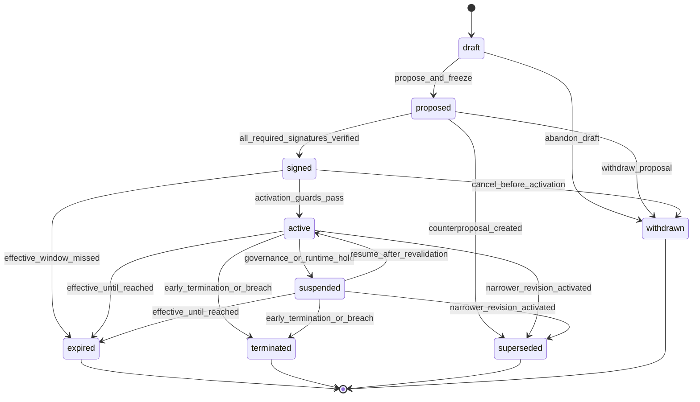
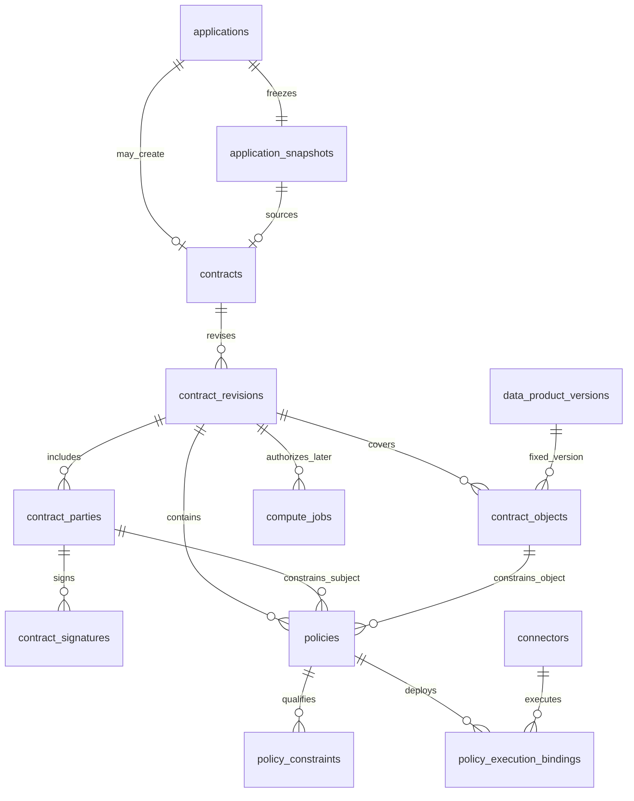

# Phase 2-B.5 Contract 领域模型

状态：**领域设计完成，等待数据库冻结同步；本阶段未生成 ORM、migration、API 或执行代码。**

## 1. 目标与边界

Contract 域负责把已经通过审核的 ApplicationSnapshot 转换为结构化、可签署、可验证，并可在后续编译为运行时使用控制的约束。

```text
ApplicationSnapshot
  -> Review Eligibility Evidence
  -> Contract stable series
  -> immutable ContractRevision
  -> ContractParty / ContractObject / Policy
  -> verified signatures
  -> active revision
  -> runtime policy evaluation
```

Contract 不负责：

- 重新审批 Application；
- 存储或交付原始医疗数据；
- 直接执行 AI 代码；
- 直接释放 Artifact；
- 代替真实 CA、电子签名或法律意见；
- 因一个按钮点击就给 Connector 下发访问凭据。

本阶段继续沿用既有八对象结构，不机械增表：

```text
Contract
ContractRevision
ContractParty
ContractSignature
ContractObject
Policy
PolicyConstraint
PolicyExecutionBinding
```

---

## 2. 对原建议的关键修正

### 2.1 Contract 与 Revision 分层

`Contract` 是一份 approved Application 对应的稳定协议系列，不保存正文、当前状态或当前 Revision 指针。

`ContractRevision` 才是可签署、可激活的不可变内容版本。签署方、标的、Policy 和执行绑定都属于具体 Revision。

### 2.2 `signed` 与 `active` 的归属

保留 signed 与 active 的业务区分，但它们属于 `ContractRevision` 状态：

- `signed`：所有必需签署方已对同一 Revision content digest 完成有效签署；
- `active`：在 signed 基础上，生效时间、参与主体、Policy 和 Connector 绑定等当前守卫也全部成立。

Contract 系列页面可显示 `negotiating/signed/active`，但这是从 Revision 集合计算的投影，不在 Contract 再保存第二份状态。

### 2.3 协商不原地修改 proposed Revision

V1 采用：

```text
draft 可编辑
proposed 后内容冻结
任何反提案创建新 Revision
```

不采用“negotiating 状态下继续改同一行正文”。否则一方已经审阅或签署的内容会在原 ID 下漂移。

### 2.4 Revision 不能成为扩权工具

用户示例中的“v2 增加模型验证”只有在原 ApplicationSnapshot 已请求且 Review 已批准 `model_validation` 时才可能成立。

V1 进一步冻结为单调收窄：新 Revision 不得比上一 signed/active Revision 更宽。需要新增用途、输出、版本、算法、时长或次数时，创建新 Application 并重新审核。

---

## 3. 聚合边界

### 3.1 聚合根

`Contract` 是聚合根，负责：

- 一份 Application 最多一个 Contract 系列；
- 固定来源 ApplicationSnapshot 与 Eligibility Evidence；
- 协调 Revision 编号和并发创建；
- 保证最多一个候选协商 Revision；
- 保证最多一个 active/suspended Revision；
- 提供系列级查询和终止入口。

### 3.2 Revision 内容聚合

一份 ContractRevision 的签署内容包括：

```text
Revision terms
  + source evidence references
  + effective window
  + ContractParty set
  + ContractObject set
  + Policy set
  + PolicyConstraint set
  + immutable PolicyExecutionBinding specifications
```

签名记录和部署状态不是正文内容本身，但必须绑定该正文 digest。

### 3.3 聚合外事实

以下状态由其他域拥有：

- Application 与 Review 历史；
- Organization/SpaceParticipant 当前状态；
- DataProductVersion 和 Connector 当前状态；
- ComputeJob 运行状态；
- Artifact 与结果出域审核；
- AuditEvent/OutboxEvent。

Contract 通过 ID、digest 和运行时守卫引用这些事实，不反向改写它们。

---

## 4. Contract

### 4.1 定义

一个 approved Application 的稳定合约系列。它证明“这些 Revision 属于同一份申请产生的协商和履约历史”。

### 4.2 关键字段

| 字段 | 含义 |
| --- | --- |
| `id` | 稳定 Contract ID。 |
| `space_id` | 所属可信数据空间。 |
| `application_id` | 来源 approved Application；V1 唯一。 |
| `application_snapshot_id` | 被审核的不可变申请快照。 |
| `application_snapshot_digest` | 来源快照摘要。 |
| `eligibility_digest` | Phase 2-B.4-D 冻结的 Contract Draft eligibility digest。 |
| `eligibility_evidence` | 稳定 Eligibility Evidence 内容；不含凭据和运行令牌。 |
| `contract_number` | 空间内稳定业务编号。 |
| `created_at/by` | 创建证据。 |
| `row_version` | Revision 创建与并发协调。 |

### 4.3 不保存

- `status`；
- `current_revision_id`；
- 当前 Policy 指针；
- 数据集名称作为权威引用；
- 签署完成时间；
- Connector 凭据；
- Compute 令牌。

当前状态由 Revision 集合投影，当前 Revision 由唯一性和 revision number 查询，不建立双向指针。

### 4.4 不变量

1. `application_id` V1 全局唯一，一份 Application 最多一个 Contract 系列；
2. Contract 与 Application、Snapshot、Eligibility Evidence 必须同 Space；
3. eligibility digest 创建后不可修改；
4. Application/Review 后续历史不因 Contract 暂停或终止而改写；
5. Contract 不直接授予访问权。

---

## 5. ContractRevision

### 5.1 定义

一份可被各方审阅、签署和激活的完整协议内容快照。

### 5.2 关键字段

| 字段 | 含义 |
| --- | --- |
| `id` | Revision ID。 |
| `contract_id` | 所属 Contract 系列。 |
| `revision_no` | 系列内单调递增编号。 |
| `supersedes_revision_id` | 可选；本次修订替代的旧 Revision。 |
| `name` / `summary` | 人类可读标题和摘要。 |
| `terms_schema_version` | 结构化条款版本。 |
| `status` | Revision 生命周期状态。 |
| `signing_mode` | `demo`、`peer_to_peer`、`platform_mediated`、`multi_party`。 |
| `effective_from/until` | 生效窗口。 |
| `handoff_guard_digest` | 创建/提议时当前有效性守卫证据摘要。 |
| `content_digest` | 完整可签内容的 canonical digest。 |
| `proposed_at` | 内容冻结并开始签署的时间。 |
| `signed_at` | 全部必需签署完成时间。 |
| `activated_at` | 激活时间。 |
| `suspended_at` | 最近暂停时间。 |
| `ended_at` | 到期、终止、撤回或被替代时间。 |
| `created_at/by` | 创建证据。 |

### 5.3 Revision 状态词表

```text
draft
proposed
signed
active
suspended
expired
terminated
superseded
withdrawn
```

### 5.4 状态机



### 5.5 不可变边界

#### draft

- 可以编辑条款、Party、Object、Policy、Constraint 和绑定规格；
- 不允许签名；
- content digest 可以重算；
- 可以仅在无下游证据时清理。

#### proposed 及以后

以下内容全部不可原地修改：

- 来源 Application/Eligibility Evidence；
- effective window；
- Party 集合；
- Object 集合；
- Policy 与 Constraint；
- 必需绑定规格；
- content digest。

需要修改时创建新 Revision，旧 Revision 保留。

### 5.6 同时存在规则

一个 Contract 系列可以同时存在：

- 一个 active 或 suspended Revision；
- 一个新的 draft 或 proposed 候选 Revision。

新 Revision 激活前，旧 active Revision 继续有效。新 Revision 激活事务中，旧 active/suspended Revision 转为 superseded。

---

## 6. ContractParty

### 6.1 定义

固定某个 Revision 中参与协议并可能承担签署、义务或执行责任的组织快照。

### 6.2 角色

```text
provider
consumer
service_provider
operator_witness
```

### 6.3 关键字段

| 字段 | 含义 |
| --- | --- |
| `id` | Party ID。 |
| `contract_revision_id` | 所属 Revision。 |
| `organization_id` | 可验证组织引用。 |
| `party_role` | 本 Revision 内角色。 |
| `signing_order` | 签署顺序。 |
| `is_required` | 是否必须签署。 |
| `party_name_snapshot` | 签约时组织名称。 |
| `identity_snapshot` | 最小必要身份/资质摘要，不含无关敏感信息。 |

### 6.4 V1 必需方

- provider：必须等于 Application provider organization；
- consumer：必须等于 Application applicant organization；
- service provider：只有实际承担受控执行职责时出现；
- operator witness：由 Space 规则决定是否出现和是否必签。

Party 角色本身不授予数据使用权。权限仍由 Policy、Revision active 状态和运行时守卫共同判定。

---

## 7. ContractSignature

### 7.1 定义

一个授权用户代表 ContractParty 对特定 Revision content digest 作出的追加式签署事实。

### 7.2 关键字段

| 字段 | 含义 |
| --- | --- |
| `id` | Signature ID。 |
| `contract_party_id` | 被代表的 Party。 |
| `signer_user_id` | 实际签署用户。 |
| `signature_type` | V1 `demo`；未来 `electronic/external_reference`。 |
| `signature_value_ref` | 演示签名证据或外部引用，不保存私钥。 |
| `signed_content_digest` | 必须等于所属 Revision content digest。 |
| `authority_snapshot` | 签署时用户代表该组织的授权摘要。 |
| `verification_status` | V1 写入时必须为 `verified`。 |
| `signed_at/verified_at` | 签署和核验时间。 |

### 7.3 V1 演示边界

- 明确显示“演示签署”，不声称 CA 或法律效力；
- 签名行 append-only，不允许 UPDATE/DELETE；
- 一个必需 Party 对同一 content digest 最多一个有效签名；
- 签署用户必须是该组织 active member并具有空间上下文 `contract_signer` 能力；
- consumer 不能代替 provider 签署，operator 不能默认代签任何一方；
- 所有必需签名必须指向同一 Revision digest。

真实 CA 接入、证书吊销列表和可信时间戳需要独立设计。证书后续撤销不能重写历史签名，应产生治理事件并暂停/终止 Revision。

---

## 8. ContractObject

### 8.1 定义

某个 Revision 内被授权使用的明确 DataProductVersion 标的及其收窄范围。

### 8.2 关键字段

| 字段 | 含义 |
| --- | --- |
| `id` | Object ID。 |
| `contract_revision_id` | 所属 Revision。 |
| `data_product_version_id` | 固定具体版本。 |
| `product_snapshot_digest` | 必须等于申请时保存的版本摘要。 |
| `product_name_snapshot` | 人类可读历史证据。 |
| `authorized_scope` | 从 ApplicationItem.requested_scope 收窄后的结构化范围。 |
| `authorized_scope_digest` | 范围摘要。 |
| `position_no` | 多标的稳定顺序。 |

### 8.3 映射规则

```text
ApplicationItem 0..n
  -> selected ContractObject 1..n
```

允许少选，不允许新增：

- Object 的 Version ID 必须出现在 ApplicationSnapshot items；
- product digest 必须与 Snapshot 一致；
- authorized scope 必须是 requested scope 的子集；
- V1 至少一个 Object；
- 不保存真实 WSI 路径、患者列表、PACS 地址或访问凭据。

不需要反向保存 `application_item_id`。Version ID、位置、scope 和 digest 已能形成签约证据，避免不必要的数据库耦合。

---

## 9. Policy

### 9.1 定义

Policy 是 Revision 内绑定明确主体、标的和执行动作的机器可解释规则。

它不是：

- DataProductVersion 默认模板；
- Application 请求；
- ReviewDecision；
- Connector 凭据；
- 独立于 Revision 的可变授权记录。

### 9.2 关键字段

| 字段 | 含义 |
| --- | --- |
| `id` | Policy ID。 |
| `contract_revision_id` | 所属 Revision。 |
| `policy_code` | Revision 内稳定编码。 |
| `policy_type` | `permission/prohibition/obligation`。 |
| `effect` | `permit/deny/require`。 |
| `subject_contract_party_id` | 受约束 Party，且必须属于同一 Revision。 |
| `contract_object_id` | 目标 Object，且必须属于同一 Revision。 |
| `action_code` | 受控执行动作。 |
| `priority` | 冲突排序；V1仍以deny-overrides为最终规则。 |
| `policy_digest` | Policy及稳定Constraint摘要。 |

### 9.3 不保存独立生命周期

Policy 不单独使用 `draft/effective/superseded/revoked` 作为权威状态。

```text
Policy executable
  = Revision.status == active
  AND required bindings accepted
  AND current runtime guards pass
```

这样避免 Revision active 与 Policy effective 形成双重真相源。Policy 内容随 Revision 冻结；停止执行通过 Revision suspension/termination、Binding撤销和运行时守卫表达。

### 9.4 执行动作词表

Application Action 是业务用途，Policy Action 是执行动作，两者不直接复用同一个字符串。

V1 Policy action codes：

```text
read_catalog_metadata
execute_controlled_compute
export_artifact
export_raw_data
reidentify_subject
redistribute_data
retain_intermediate
delete_intermediate
write_audit_log
```

### 9.5 Application Action 映射

| Application action | Policy执行映射 |
| --- | --- |
| `ai_training` | permit `execute_controlled_compute`，constraint purpose=`ai_training`。 |
| `model_validation` | permit `execute_controlled_compute`，constraint purpose=`model_validation`。 |
| `research_analysis` | permit `execute_controlled_compute`，constraint purpose=`research_analysis`。 |
| `drug_development` | permit `execute_controlled_compute`，constraint purpose=`drug_development`。 |

算法名称、版本和 digest 必须由 ApplicationSnapshot 固定并进入 Policy Constraint；不能在运行任务时临时换算法。

### 9.6 V1 默认禁止

无论申请方是否在页面提出，V1至少生成：

```text
deny export_raw_data
deny reidentify_subject
deny redistribute_data
```

其中原始 WSI、临床明细和患者级记录都属于 raw data，不得以 Artifact 名义绕过禁止。

### 9.7 输出规则

ApplicationRequestedOutputType 只形成候选输出集合。Contract Policy 可以少选，但不能新增：

```text
aggregate_statistics
model_artifact
feature_dataset
risk_scoring_model
```

即便 Policy permit `export_artifact`：

- Artifact 初始仍隔离；
- 类型必须在允许集合内；
- Policy要求时必须完成 output review；
- 只有未来 ArtifactGrant 才授权实际接收者和具体Artifact；
- Contract 不能预先授权尚未产生的任意结果出域。

---

## 10. PolicyConstraint

### 10.1 定义

Policy 的类型化条件。关键条件必须可查询，不能全部塞进自然语言或一个无结构 JSON。

### 10.2 V1 constraint names

| constraint | 示例 | 收窄规则 |
| --- | --- | --- |
| `purpose_code` | `in [ai_training]` | 必须是Application已审Action子集。 |
| `algorithm_digest` | `eq sha256:...` | 必须等于ApplicationSnapshot算法摘要。 |
| `environment_mode` | `eq controlled_compute` | V1固定受控计算。 |
| `run_count` | `lte 10` | 不得超过Application请求及产品默认上限。 |
| `effective_until` | `before timestamp` | 不得超过申请时长和上游限制。 |
| `output_type` | `in [aggregate_statistics]` | 必须是已审请求输出子集。 |
| `output_review_required` | `eq true` | 只能保持或增强审核要求。 |
| `retention_seconds` | `lte 86400` | 取更严格保留期限。 |
| `region` | `in [approved-region]` | 不能放宽空间/产品地域要求。 |
| `network_zone` | `eq trusted-sandbox` | 固定运行边界。 |
| `audit_level` | `gte full` | 日志义务不可弱化。 |

### 10.3 类型化值

`value` 可以使用 JSONB 承载布尔、数值、字符串或字符串数组，但必须由 `constraint_name + operator` 决定允许的数据类型。

V1 operators：

```text
eq
in
lte
gte
before
after
```

不在V1实现任意表达式、脚本或用户提供的策略代码。

---

## 11. PolicyExecutionBinding

### 11.1 定义

记录一个 Policy 被分配到哪个 Connector 执行，以及节点是否接受该策略规格。

### 11.2 内容与运行状态分离

签署内容包含：

- Policy ID/digest；
- Connector ID；
- execution role；
- required 标志。

运行状态不进入 Revision content digest：

```text
pending
accepted
rejected
revoked
```

以及：

- deployed_at；
- acknowledged_at；
- receipt_digest；
- rejection_reason。

状态变化不能修改 Policy、Connector ID 或 execution role。

### 11.3 不变量

- Connector必须属于同一Space和相应组织；
- Connector当前能力必须满足Policy action/environment；
- 所有required Binding accepted后才可激活Revision；
- Binding revoked或Connector失效会阻止新Job，并可能触发Revision suspended；
- 切换Connector改变签署执行边界，V1要求新Revision，不在已签Revision上换ID。

---

## 12. Policy 合成算法

### 12.1 输入

```text
Space mandatory rules
DataProductVersion default policy snapshots
Approved ApplicationSnapshot
Review Eligibility Evidence
Negotiated narrowing
```

### 12.2 合成原则

```text
permitted scope
  = intersection(
      product permitted scope,
      approved application request,
      negotiated scope
    )

prohibitions
  = union(
      space prohibitions,
      product prohibitions,
      negotiated prohibitions
    )

obligations
  = union-and-strengthen(
      space obligations,
      product obligations,
      review requirements,
      negotiated obligations
    )
```

V1冲突算法：

```text
explicit deny > permit
missing permit = deny by default
all applicable obligations must pass
stricter duration/run/retention limit wins
allowed output set uses intersection
```

如果合成结果冲突、为空或不可执行，Revision不能propose，更不能签署。

### 12.3 只收窄验证

Revision必须验证：

1. ContractObject集合是ApplicationItem集合的非空子集；
2. business actions是已审RequestedAction子集；
3. output types是已审RequestedOutputType子集；
4. algorithm digest完全相等；
5. effective duration不超过requested duration；
6. run limit不超过requested run limit；
7. environment不弱于产品/空间要求；
8. prohibitions不少于上游强制禁止；
9. obligations不弱于上游强制义务；
10. 新Revision不宽于上一signed/active Revision。

任一扩张都返回 `new_application_required`。

---

## 13. Revision content digest

### 13.1 canonical内容

content digest至少覆盖：

```text
contract_id
revision_no
supersedes_revision_id
application_snapshot_digest
eligibility_digest
effective window
signing mode
stable human terms digest
sorted ContractParty snapshots
sorted ContractObjects and scope digests
sorted Policies and Policy digests
sorted PolicyConstraints
sorted immutable Binding specifications
handoff_guard_digest
schema/algorithm versions
```

不包含：

- Signature；
- Binding deployment status/receipt；
- activated/suspended/ended时间；
- 页面展示状态；
- Connector凭据；
- Compute/Artifact ID。

### 13.2 canonical规则

复用ApplicationSnapshot与Review Evidence规则：

- UTF-8；
- object key排序；
- 明确数组排序；
- 紧凑分隔符；
- `allow_nan=false`；
- `sha256:<64 lowercase hex>`。

### 13.3 排序

```text
Parties:    (party_role, organization_id, id)
Objects:    (position_no, data_product_version_id, id)
Policies:   (policy_code, subject_party_id, object_id, action_code)
Constraints:(policy_id, position_no)
Bindings:   (policy_id, connector_id, execution_role)
```

---

## 14. Eligibility 与 Contract 创建

### 14.1 `create_contract_from_eligibility`

同一事务：

1. 锁定Application；
2. 校验Application.status=`approved`；
3. 重新构建并验证Eligibility Evidence；
4. 执行Phase 2-B.4-D current handoff guards；
5. 检查该Application尚无Contract；
6. 创建稳定Contract并固定Snapshot/Eligibility Evidence；
7. 创建Revision 1 draft；
8. 从Application映射Party/Object候选；
9. 合成初始Policy草案；
10. 写未来outbox事件；
11. 提交。

### 14.2 幂等

- 同Application和同幂等键重复调用返回同一Contract；
- 同Application不同请求试图创建第二Contract返回冲突；
- 已有Contract但Eligibility digest不同属于证据冲突，不能自动更新；
- 管理员不能绕过Application直接创建Contract。

### 14.3 Handoff guard证据

Draft创建和Revision propose时固定当前守卫摘要，至少包括：

- Space/参与组织状态；
- 产品版本和治理可用性；
- Party成员/签署能力配置；
- Connector规格可满足性；
- 规则版本；
- evaluated_at。

该摘要证明当时检查结果，不改变历史Eligibility Evidence。Activation还要重新做当前检查。

---

## 15. 签署与激活

### 15.1 propose

`draft -> proposed`前：

- 只收窄检查通过；
- Party/Object/Policy/Constraint/Binding规格完整；
- effective window合法；
- content digest生成并固定；
- 不存在同系列另一个开放候选Revision；
- 所有必需Party均具备签署路径。

### 15.2 sign

签署前每次重查：

- Revision仍proposed；
- signer是目标Party组织active member；
- signer具有上下文contract_signer能力；
-签名digest等于当前Revision content digest；
-前序签署要求满足；
-签署组织没有被suspended/exited。

全部必需Party verified后，同一事务把Revision转为signed并写signed_at。

### 15.3 activate

`signed -> active`必须全部满足：

1. 所有必需签名verified并指向同一digest；
2. 当前时间位于effective window；
3. Space active；
4. provider/consumer及必需服务方仍active、admitted；
5. Object版本未被治理性禁用；
6. Policy集合完整、无冲突且只收窄检查仍通过；
7. 所有required Binding accepted且receipt digest有效；
8. Connector在线/能力满足激活最低要求；
9. 不存在行政hold或安全阻断；
10. 同系列没有另一active/suspended Revision。

若是替代旧Revision，激活事务同时把旧active/suspended Revision转为superseded。

### 15.4 active仍不等于数据出域

active只允许后续Compute域评估并创建受控任务。每次Job仍需：

- 重新评估时间、主体、Connector和额度；
- 固定Policy snapshot digest；
- 使用ContractObject绑定的Version；
- 禁止原始数据导出；
- 将Artifact默认隔离。

---

## 16. 暂停、恢复、到期与终止

### 16.1 suspend

临时治理动作：

- 阻止新ComputeJob；
- 禁止新ArtifactGrant；
- 运行中Job按Policy中的termination behavior暂停或受控结束；
- 不修改签名、Policy、Application或Review历史；
- 必须记录reason和未来AuditEvent。

### 16.2 resume

只有原Revision内容未变且重新通过所有激活守卫时，`suspended -> active`。

需要修改Policy、Object、绑定Connector或有效期时不能resume，必须新Revision或新Application。

### 16.3 expire

到达effective_until后Revision逻辑上立即不可执行，即使定时状态更新稍有延迟。运行时校验必须直接检查时间窗口，不能只依赖status。

`expired`是Contract系列的自然终态，不等于违规。到期后若要继续使用，必须创建新Application；不能在已到期系列下补建Revision延长期限。

### 16.4 terminate

对active/suspended Revision提前且永久结束，并终止整个Contract系列。proposed/signed候选取消使用`withdrawn`，不使用`terminated`。

终止原因可包括：

```text
mutual_termination
material_breach
compliance_hold
security_incident
provider_withdrawal
participant_ineligible
```

终止：

- 不反向修改ReviewDecision或Application；
- 不删除历史ComputeJob/Artifact；
- 阻止新Job和新Grant；
- 根据Policy执行中间制品删除、保留和审计义务；
- 不允许同Revision恢复。
- 不允许该Contract系列再创建Revision；后续合作必须新Application、新Review和新Contract。

---

## 17. Contract系列状态投影

Contract本身不持久化status。查询投影按优先级生成：

| 条件 | 系列显示状态 |
| --- | --- |
| 存在active Revision | `active` |
| 不存在active但存在suspended Revision | `suspended` |
| 最新候选Revision为signed | `signed` |
| 最新候选Revision为draft/proposed | `negotiating` |
| 所有可执行Revision均expired | `expired` |
| 系列被治理终止且无active候选 | `terminated` |
| 仅有draft且未propose | `draft` |

该投影只服务列表/UI，不作为Compute授权依据。Compute必须引用具体active ContractRevision。

---

## 18. 命令与事件

| 命令 | 核心前置条件 | 结果/未来事件 |
| --- | --- | --- |
| `create_contract_from_eligibility` | approved +完整Eligibility + handoff guards | `contract.created_from_application` |
| `create_revision` | 同一Contract；无冲突候选；系列未expired/terminated | `contract.revision_created` |
| `propose_revision` | 内容完整、只收窄、digest固定 | `contract.revision_proposed` |
| `sign_revision` | Party授权、同一digest | `contract.party_signed` |
| `mark_revision_signed` | 全部必需签名verified | `contract.revision_signed` |
| `activate_revision` | 时间、主体、Policy、Binding守卫全部通过 | `contract.revision_activated` |
| `suspend_revision` | 授权治理主体+原因 | `contract.revision_suspended` |
| `resume_revision` | 全量重新校验通过 | `contract.revision_resumed` |
| `expire_revision` | effective_until到达 | `contract.revision_expired` |
| `terminate_revision` | 授权治理主体+终止原因 | `contract.revision_terminated` |
| `supersede_revision` | 新Revision同事务激活 | `contract.revision_superseded` |

事件名是后续Audit/outbox设计输入；本阶段不创建事件表或发送消息。

---

## 19. 权限与职责分离

### 19.1 创建与协商

- Contract由领域服务从Eligibility创建，普通管理员不能空白创建；
- consumer可提出收窄建议，不能增加Application外范围；
- provider必须确认Object和Policy；
- service provider只能确认其执行义务，不能扩大consumer权限；
- operator可协调流程，不能代替必需Party签署。

### 19.2 签署

- 签署能力绑定User—Organization—Space上下文；
- 同一用户不得代表provider和consumer双方；
- Application reviewer身份不自动获得contract_signer能力；
- demo管理员不能用一个按钮伪造全部Party签名。

### 19.3 暂停与终止

- provider与Space operator可按冻结原因发起suspend；
- mutual termination需要provider和consumer双方确认；
- 紧急安全暂停可由operator单方执行，但必须有明确时限和复核；
- 终止不会抹除签署或审核事实。

---

## 20. 医疗场景示例

来源申请：

```text
鼻咽癌数字病理多模态研究数据产品 v1.0
Action: ai_training, model_validation
Requested outputs: aggregate_statistics, model_artifact
Duration: 90 days
Run limit: 20
Algorithm digest: sha256:demo-algorithm
```

协商后的Revision 1：

```text
Objects:
  - NPC pathology v1.0 / WSI + clinical_core scope

Permit:
  - execute_controlled_compute
  - purpose in [model_validation]
  - algorithm_digest = sha256:demo-algorithm
  - output_type in [aggregate_statistics]

Deny:
  - export_raw_data
  - reidentify_subject
  - redistribute_data

Require:
  - environment_mode = controlled_compute
  - run_count <= 5
  - duration <= 30 days
  - write_audit_log
  - output_review_required = true
  - delete_intermediate <= 24 hours
```

这是一份合法收窄：

- 从两个Action收窄为model_validation；
- 从两个Output收窄为aggregate_statistics；
- 90天收窄为30天；
- 20次收窄为5次；
- 没有增加原始WSI导出。

如果后续希望加入drug_development、feature_dataset或另一算法digest，必须创建新Application并重新审核。

---

## 21. ER关系



`compute_jobs`仍是未来对象；图中只表示后续单向依赖，不代表本阶段创建该表或实现Compute。

---

## 22. 关键业务不变量

1. 只有approved Application和完整Eligibility Evidence可创建Contract；
2. 一份Application最多一个Contract系列；
3. Contract不保存current revision指针或权威status；
4. proposed后Revision内容不可覆盖；
5. 所有签名绑定同一Revision content digest；
6. provider与consumer必须分别签署；
7. ContractObject只引用ApplicationSnapshot中的DataProductVersion；
8. Policy只能保持或收窄已审Action/Output；
9. 新Revision不能宽于上一signed/active Revision；
10. 算法digest不可在Contract中替换；
11. V1默认禁止原始数据导出、再识别和再分发；
12. deny优先，缺少permit即拒绝；
13. Policy不拥有独立于Revision的effective真相；
14. signed不等于active；
15. active不等于Artifact可出域；
16. 非active Revision不能创建新ComputeJob；
17. 暂停、终止不修改Application/Review历史；
18. 到期判断必须直接检查时间窗口；
19. Connector回执不能修改签署Policy内容；
20. 任何扩权必须新Application和新Review。

---

## 23. V1演示边界

V1可以模拟：

- Contract系列和Revision协商；
- demo签署；
- Policy生成与只收窄验证；
- Connector Binding accepted回执；
- Revision激活、暂停、恢复、到期和终止；
- canonical digest与审计事件占位。

V1不得宣称：

- 真实电子签名或CA认证；
- 真实法律合同效力；
- 真实医院数据授权；
- 已完成可信连接器策略下发；
- 已完成隐私计算；
- active Contract自动满足医疗合规；
- Artifact已获准出域。

页面必须显示：

> 所有机构、合同、签名、策略、数据与执行结果均为模拟演示。

---

## 24. 风险与待冻结事项

进入Contract ORM前还必须完成数据库冻结同步，重点评审：

1. Contract新增Snapshot/Eligibility Evidence字段放在Contract还是Revision；
2. Revision状态词表由旧`negotiating`调整为`proposed`并增加`withdrawn/superseded`；
3. Policy删除独立status/version字段是否与八表设计一致；
4. proposed后Party/Object/Policy/Constraint/Binding规格的数据库不可变保护；
5. Signature append-only和Task类似的延迟一致性约束；
6. 同时一个active/suspended和一个candidate Revision的部分唯一索引；
7. Revision content digest canonical文档及黄金向量；
8. `review.plan_created`证据在Contract实现前由Audit/outbox还是版本化规则注册表提供；
9. demo签名证据格式；
10. suspension/termination原因词表和运行中Job处理策略。

这些问题不会推翻Contract领域边界，但会影响数据库字段、触发器和迁移顺序，因此不能跳过冻结同步直接写ORM。

---

## 25. 下一阶段

建议进入：

```text
Phase 2-B.5-A
Contract数据库冻结同步v5
```

目标：

- 将本领域模型同步到八张Contract逻辑表；
- 明确字段、PK/FK、复合候选键、部分唯一索引和触发器；
- 更新37张逻辑表设计，不立即生成migration；
- 检查Application/Review/Catalog/Connector跨域完整性；
- 冻结content digest、签署一致性和active守卫的数据库/服务分工。

在v5通过前，不生成Contract ORM、migration、API、Compute或Connector执行代码。

---

## 26. 最终结论

```text
Eligibility Evidence
  -> Contract stable series
  -> immutable Revision
  -> Parties + Objects + machine-readable Policies
  -> all required parties sign the same digest
  -> current activation guards and bindings pass
  -> active Revision
  -> Compute may request controlled execution
```

Contract是可信使用规则的来源，但不是数据本身、不是审核结论，也不是无条件访问令牌。

本阶段领域设计完成。下一步必须先同步数据库冻结v5，再决定Contract ORM实现。
