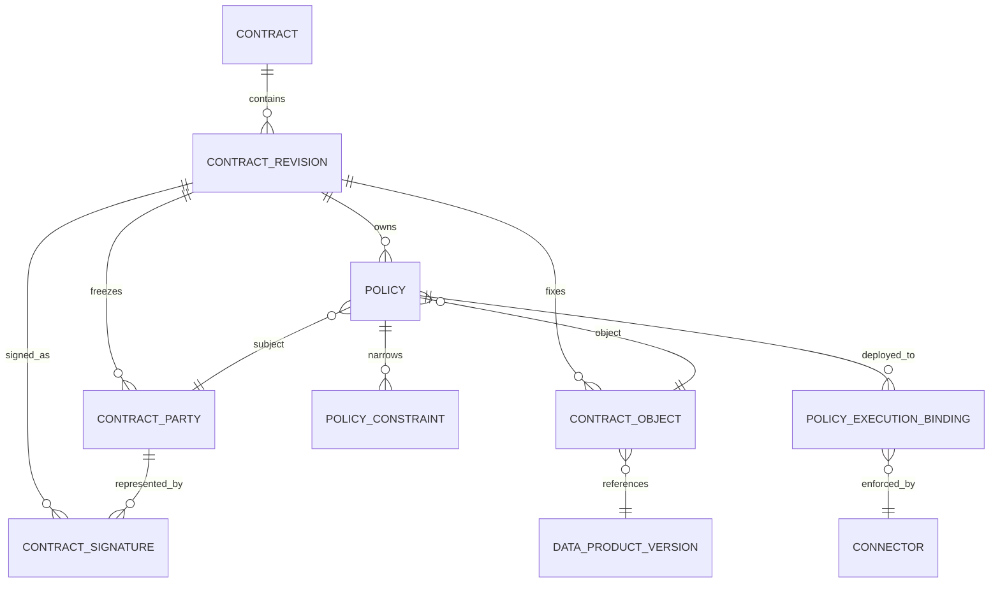

# MedTrust Space Phase 2-B.5-B2 Contract Policy / Constraint / Binding / Signature 领域模型

> 日期：2026-07-22  
> 状态：领域设计冻结；未生成 ORM、migration、API 或 Compute 代码  
> 上游基线：`Phase2-database-design-v5.md`、`Phase2-B5-contract-model.md`、Contract Core ORM  
> 适用范围：V1 医疗数字病理可信数据空间演示系统

## 0. 结论

本阶段允许 Contract 从“合同骨架”继续演进为“可执行规则规格”，但仍不产生数据访问权，也不代表真实 CA 电子签名。

沿用 v5 已冻结的四个对象名：

1. `Policy`：表达某一合同修订版中，某一主体对某一数据对象的允许、禁止或义务；
2. `PolicyConstraint`：表达 Policy 的结构化执行条件；
3. `PolicyExecutionBinding`：把具体 Policy 绑定到负责执行或举证的 Connector；
4. `ContractSignature`：保存针对不可变 Revision 内容摘要的演示签署证据。

不新增平行的 `ContractPolicy`、`ContractConstraint`、`ContractConnectorBinding` 表。章节可以称为 Contract Policy，但数据库对象继续使用 v5 的八表基线。

本阶段还冻结以下边界：

- `ApplicationRequestedAction` 是业务用途，不等于机器可执行动作；
- `ApplicationRequestedOutputType` 是请求，不等于已获准输出；
- 数据范围由 `ContractObject.data_product_version_id + authorized_scope` 权威表达，Constraint 不重复保存；
- Policy 不拥有独立生命周期，生命周期继承 `ContractRevision`；
- `signed` 只表示必需 Party 已签署，`active` 还必须满足 Binding 和当前运行守卫；
- Binding 被 Connector 接受，不代表可以直接执行；
- Artifact 是否出域由未来 Artifact Review/Grant 决定，Contract 只能规定上限；
- V1 Signature 明确为演示签署，不声明 CA、法律效力或真实电子签名能力。

## 1. 目标与非目标

### 1.1 本阶段目标

- 将审核通过的申请范围编译为结构化、默认拒绝、可摘要的合同策略；
- 证明合同只能收窄 Application/Review 已批准范围；
- 指明每条执行策略由哪些 Connector 能力承接；
- 冻结提案、签署、激活三道完整性门禁；
- 为未来 Compute 定义最小准入输入和判定输出，但不实现任务执行。

### 1.2 明确不做

- 不实现通用规则语言、脚本表达式或策略解释器；
- 不执行用户代码，不实现真实沙箱、隐私计算或联邦学习；
- 不签发访问令牌，不提供原始 WSI 下载路径；
- 不接入 CA、时间戳服务或真实电子签名平台；
- 不实现 Artifact 出域授权；
- 不修改现有 Connector、Contract Core、Application 或 Review 代码。

## 2. 聚合关系



权威链路：

```text
ApplicationSnapshot + Eligibility Evidence
  -> Policy Compilation
  -> ContractRevision
  -> Party / Object / Policy / Constraint / immutable Binding spec
  -> content_digest
  -> proposed
  -> append-only demo signatures
  -> signed
  -> required Binding receipts + current guards
  -> active
  -> future EvaluateContractUse
  -> future controlled Compute
```

## 3. Policy

### 3.1 定义

Policy 是某个 `ContractRevision` 内，对“主体—数据对象—动作”三元组施加的规范。它不是独立合同，也不是自由 JSON 规则。

每条 Policy 必须明确：

- `subject_contract_party_id`：谁受约束；
- `contract_object_id`：作用于哪个已固定版本的数据对象；
- `action_code`：执行动作；
- `policy_type`：permission / prohibition / obligation；
- `effect`：permit / deny / require；
- `policy_digest`：Policy 及稳定排序 Constraint 的摘要。

合法组合：

| policy_type | effect | 语义 |
| --- | --- | --- |
| permission | permit | 在全部 Constraint 满足时允许动作 |
| prohibition | deny | 命中即拒绝，优先级最高 |
| obligation | require | 执行前、执行中或执行后必须履行 |

其他组合一律非法。

### 3.2 V1 可执行动作词表

```text
execute_controlled_compute
export_artifact
export_raw_data
reidentify_subject
redistribute_data
retain_intermediate
delete_intermediate
write_audit_log
```

`read_catalog_metadata` 保留在 v5 长期词表中，但不进入 V1 最小合同策略集。目录可发现性由 Catalog/Space 治理，不应被误解为医疗数据使用权。

动作语义：

| action_code | V1 用途 |
| --- | --- |
| `execute_controlled_compute` | 在受控环境使用合同对象执行获批任务 |
| `export_artifact` | 请求将某类结果制品送入未来出域审核；不是自动出域许可 |
| `export_raw_data` | 原始数据导出；V1 必须 deny |
| `reidentify_subject` | 重识别患者；V1 必须 deny |
| `redistribute_data` | 向第三方转交数据；V1 必须 deny |
| `retain_intermediate` | 在约束期限内保留中间结果 |
| `delete_intermediate` | 到期或终止后删除中间结果 |
| `write_audit_log` | 产生完整运行和履约审计证据 |

### 3.3 Application Action 到 Policy Action 的映射

Application Action 表达业务目的，Policy Action 表达可执行行为，两者不得复用同一词表。

| ApplicationRequestedAction | Policy 编译结果 |
| --- | --- |
| `ai_training` | permit `execute_controlled_compute` + `purpose_code in ['ai_training']` |
| `model_validation` | permit `execute_controlled_compute` + `purpose_code in ['model_validation']` |
| `research_analysis` | permit `execute_controlled_compute` + `purpose_code in ['research_analysis']` |
| `drug_development` | permit `execute_controlled_compute` + `purpose_code in ['drug_development']`，并保留更严格审核义务 |

同一 Policy 可以用 `purpose_code` 约束多个已批准目的；不能把未获批目的写入 Constraint。

### 3.4 V1 最小策略集

每个 consumer Party 与 ContractObject 至少生成：

1. 一条 permit `execute_controlled_compute`；
2. 一条 deny `export_raw_data`；
3. 一条 deny `reidentify_subject`；
4. 一条 deny `redistribute_data`；
5. 一条 require `write_audit_log`；
6. 仅在申请和审核允许结果类型时，生成受限的 permit `export_artifact`；
7. 根据上游规则生成 `retain_intermediate` / `delete_intermediate` 义务。

缺失明确 permit 时默认拒绝。`priority` 只用于稳定解释和排序，绝不能覆盖 deny。

## 4. PolicyConstraint

### 4.1 定义

Constraint 是 Policy 下的类型化条件。V1 只接受冻结字段、冻结 operator 和类型校验，不接受任意表达式、脚本、SQL 或用户上传策略代码。

### 4.2 冻结约束词表

| constraint_name | operator | value 类型 | unit | 说明 |
| --- | --- | --- | --- | --- |
| `purpose_code` | `in` | 非空 string[] | null | 必须是已批准 Application Action 子集 |
| `algorithm_digest` | `eq` | digest string | null | 固定算法包摘要 |
| `environment_mode` | `eq` | `controlled_compute` | null | V1 唯一可执行环境 |
| `run_count` | `lte` | 正整数 | `count` | 最大运行次数 |
| `effective_until` | `before` | RFC3339 timestamp | null | 只能早于或等于 Revision 终点 |
| `output_type` | `in` | 非空 string[] | null | 获准请求输出的子集 |
| `output_review_required` | `eq` | boolean | null | V1 对可出域制品不得弱化为 false |
| `retention_seconds` | `lte` | 非负整数 | `seconds` | 中间结果或制品最长保留时间 |
| `region` | `in` | 非空 string[] | null | 允许的执行地域集合 |
| `network_zone` | `eq` | string | null | 受控网络区域 |
| `audit_level` | `gte` | `full` | null | V1 固定为 full，不实现通用等级比较引擎 |

冻结 operator：

```text
eq
in
lte
gte
before
after
```

`after` 在 V1 仅保留结构兼容性；未经单独领域规则定义，不得由前端自由创建。

### 4.3 数据范围边界

不新增 `data_scope` Constraint。权威数据范围是：

```text
ContractObject
  -> data_product_version_id
  -> data_product_version_digest
  -> authorized_scope
```

原因：

- 避免 Object 与 Constraint 出现两个数据范围真相源；
- Compute 校验时先选择 ContractObject，再评估其 Policy；
- 任何新增 Version 或扩大的 `authorized_scope` 都必须新申请，而不是增加 Constraint。

### 4.4 计数与期限语义

- `run_count` 的计数范围冻结为：`revision + policy + subject party + contract object`；
- 未来 Compute 必须在数据库事务中原子消耗计数，Contract 只保存上限，不保存运行计数真相；
- `effective_until` 只能收窄 Revision 的 effective window，不能替代 Revision 时间字段；
- `retention_seconds` 不能超过 Space、产品策略或审核证据中的最小上限。

## 5. Policy 编译与“只能收窄”证明

### 5.1 编译输入

Policy 不是人工自由填写，而由以下输入合成：

```text
Space mandatory rules
+ DataProductVersion default_policy_snapshot
+ approved ApplicationSnapshot
+ Review Eligibility Evidence
+ negotiated narrowing terms
```

### 5.2 合成规则

- permit：取交集；
- deny：取并集，deny 优先；
- obligation：取并集并允许加强；
- 输出类型：只能取申请并获批输出的子集；
- 数字上限：取更小值；
- 时间窗口：取更短窗口；
- 算法：若要求固定摘要，必须精确相等；
- 数据对象：必须与 ApplicationItem 固定的 DataProductVersion 及摘要一致；
- 数据范围：必须是申请范围子集；
- 任何新增 action、output、version 或 scope 均返回 `new_application_required`。

### 5.3 编译结果，不新增事实表

V1 定义瞬时值 `PolicyCompilationReport`，不新增数据库表。其稳定部分进入 Revision 的 `handoff_guard_evidence.policy_compilation`：

```json
{
  "schema_version": "1.0",
  "compiler_version": "contract-policy-compiler-v1",
  "source_digests": {
    "application_snapshot": "sha256:...",
    "eligibility": "sha256:...",
    "space_rules": "sha256:...",
    "product_policies": ["sha256:..."]
  },
  "normalized_claims_digest": "sha256:...",
  "compiled_policy_set_digest": "sha256:...",
  "checks": [
    {"code": "actions_subset", "result": "pass"},
    {"code": "outputs_subset", "result": "pass"},
    {"code": "objects_exact", "result": "pass"},
    {"code": "scope_subset", "result": "pass"}
  ]
}
```

`evaluated_at`、请求 ID、操作者 UI 信息等动态元数据不进入稳定摘要。

### 5.4 新 Revision 的收窄规则

如果已有 signed/active Revision，新 Revision 还必须相对前一 Revision 不扩大：

- permit action 不增加；
- output 不增加；
- ContractObject 和 authorized_scope 不扩大；
- run_count、retention、期限不得放宽；
- deny 不得删除；
- obligation 不得弱化。

需要扩大时必须创建新 Application，而不是新 Revision。

## 6. PolicyExecutionBinding

### 6.1 定义

Binding 表示“某条 Policy 由某个 Connector 以某种执行角色承接”。它不是 `ContractRevision -> Connector` 的宽泛关系，也不是凭证或访问令牌。

不可变规格：

- `policy_id` / `policy_digest`；
- `connector_id`；
- `execution_role`；
- `is_required`。

运行回执状态：

```text
pending -> accepted | rejected
accepted -> revoked
```

`rejected` 或 `revoked` 后，V1 不允许原地更换 Connector；需要创建新 Revision。

### 6.2 执行角色

建议冻结：

```text
compute_executor
egress_controller
audit_evidence_emitter
```

含义：

| execution_role | 职责 |
| --- | --- |
| `compute_executor` | 执行受控计算并强制环境、算法、次数、期限等约束 |
| `egress_controller` | 阻断原始数据导出并把候选 Artifact 送入未来出域审核 |
| `audit_evidence_emitter` | 产生不可缺失的任务、策略匹配和执行结果证据 |

### 6.3 Connector 能力依赖

当前 Connector 模型的 `capability_code` 是开放文本，尚未冻结执行能力词表。为避免 Binding“形式接受、实际不能执行”，Contract B2 设计冻结以下最小能力代码：

```text
controlled_compute_execution
egress_policy_enforcement
audit_evidence_emit
```

映射：

| execution_role | Connector 必需 capability_code |
| --- | --- |
| `compute_executor` | `controlled_compute_execution` |
| `egress_controller` | `egress_policy_enforcement` |
| `audit_evidence_emitter` | `audit_evidence_emit` |

实现前置条件：Connector 模块需要对这三个代码、版本和 verified 状态建立校验。没有已验证能力的 Connector 不得 accepted Binding，也不得激活 Revision。

### 6.4 Policy 到 Binding 的最低要求

| Policy action | 必需 Binding |
| --- | --- |
| permit `execute_controlled_compute` | `compute_executor` |
| permit `export_artifact` | `egress_controller` |
| deny `export_raw_data` | `egress_controller` |
| deny `redistribute_data` | `egress_controller` |
| deny `reidentify_subject` | `compute_executor` + `egress_controller` |
| require `write_audit_log` | `audit_evidence_emitter` |
| retain/delete intermediate | `compute_executor`，必要时加 `egress_controller` |

### 6.5 回执与摘要边界

Binding 不可变规格进入 Revision `content_digest`；运行状态和回执不进入：

进入摘要：

```text
policy_id
policy_digest
connector_id
execution_role
is_required
```

不进入摘要：

```text
deployment_status
deployed_at
acknowledged_at
receipt_digest
rejection_reason
revoked_at
revocation_receipt_digest
revocation_reason
row_version
```

`accepted` 仅表示 Connector 已确认能够承接不可变规格。真正执行还必须携带未来平台签发的“Revision 当前 active”断言，并再次评估当前守卫。

Binding 从 accepted 变为 revoked 后：

- 立即阻止新 ComputeJob；
- active Revision 应进入 suspended 或治理终止流程；
- 不改变历史签名和历史任务证据；
- 已运行任务如何停止由未来 Compute 编排定义。

## 7. ContractSignature

### 7.1 V1 语义

ContractSignature 是追加式演示签署证据，不是 CA 签名。

V1 规则：

- `signature_type` 只能为 `demo`；
- 创建时 `verification_status=verified`；
- `verified_at` 必须非空；
- 页面必须显示“演示签署，不代表 CA 或法律效力”；
- 不保存私钥、证书私钥材料或真实患者数据；
- 每个必需 Party 对同一 `content_digest` 最多一条 verified Signature；
- Signature 不允许 update 或 delete，错误签署通过撤回 Revision 或新 Revision 处理。

### 7.2 签署绑定

每条 Signature 必须同时绑定：

- `contract_revision_id`；
- `contract_party_id`；
- `signer_organization_id`；
- `signer_user_id`；
- `signed_content_digest`，必须等于 Revision `content_digest`；
- 签署时的 `authority_snapshot`；
- `signature_digest`。

V1 `authority_snapshot` 最小内容：

```json
{
  "schema_version": "1.0",
  "is_demo": true,
  "organization_id": "...",
  "user_id": "...",
  "organization_member_id": "...",
  "membership_status": "active",
  "authority_code": "demo_contract_signer",
  "scope": {
    "contract_revision_id": "...",
    "contract_party_id": "..."
  }
}
```

领域服务还需确认 signer 是 signer organization 的 active member，且代表的 organization 与 ContractParty 一致。

### 7.3 Signature digest

`signature_digest` 对以下稳定事实做 canonical SHA-256：

- Revision ID 与 `signed_content_digest`；
- Party ID、Organization ID、User ID；
- `signature_type=demo`；
- `signature_value_ref`；
- canonical `authority_snapshot`；
- `signed_at`、`verified_at` 与 verification status。

Signature 本身不进入 Revision `content_digest`，否则会形成循环摘要。

## 8. Revision content digest

### 8.1 进入摘要

- Contract ID、revision_no、supersedes_revision_id；
- ApplicationSnapshot digest、Eligibility digest；
- effective window、signing mode；
- terms digest、handoff guard digest；
- 稳定排序的 Parties；
- 稳定排序的 ContractObjects；
- 稳定排序的 Policies 及 Constraints；
- Binding 不可变规格。

### 8.2 不进入摘要

- Revision status 与生命周期时间戳；
- Signature 行；
- Binding deployment status 与 receipt；
- UI 文案、请求 ID、计算时间；
- Connector 凭据；
- ComputeJob、Artifact 或未来出域 Grant ID。

### 8.3 canonical 规则

```text
UTF-8
JSON object keys ascending
compact separators
allow_nan = false
digest = sha256:<64 lowercase hex>
```

数组稳定排序：

- Parties：`party_role, organization_id, id`；
- Objects：`position_no, data_product_version_id, id`；
- Policies：`policy_code, subject_party_id, object_id, action_code`；
- Constraints：`policy_id, position_no`；
- Bindings：`policy_id, connector_id, execution_role`。

## 9. 生命周期门禁

### 9.1 draft -> proposed

必须全部满足：

- Party 完整，至少包含被冻结的 provider 和 consumer；
- ContractObject 与 ApplicationItem 版本、摘要和范围一致；
- PolicyCompilationReport 全部通过；
- V1 最小策略集完整；
- Constraint 类型、单位和上限合法；
- 每条需执行 Policy 有完整 Binding 不可变规格；
- Binding 所指 Connector 属于同一 Space/参与组织；
- Connector 声明并已验证所需 capability；
- terms、handoff、Policy、Revision content digest 已生成；
- 没有 Signature；
- 当前 eligibility 与 handoff guards 通过。

提案后，Party/Object/Policy/Constraint/Binding 规格及所有摘要冻结。Binding 可以仍为 pending。

### 9.2 proposed -> signed

必须全部满足：

- 所有必需 Party 已对同一 `content_digest` 完成 verified demo Signature；
- 无重复 Party 签署事实；
- Signature authority snapshot 可验证；
- Revision 内容未变化；
- 候选 Revision 未 withdrawn/superseded。

签署不要求 Binding 已 accepted，因此部署确认可以与签署编排并行；但两者都不能产生执行权。

### 9.3 signed -> active

必须全部满足：

- 所有 `is_required=true` Binding 为 accepted；
- receipt digest 可验证且对应冻结 Policy/Connector/role；
- Space、provider、consumer、Connector、DataProductVersion 当前均有效；
- DataProductPublication 的变化不影响已签版本，但产品 hold/法务禁用必须阻断；
- 当前时间在 Revision effective window 内；
- 没有治理 hold、撤销或冲突 active Revision；
- mandatory deny 与 audit obligation 均存在；
- 当前 guard evidence 重新计算通过。

激活是领域命令，不由页面直接改 status。

## 10. Policy 到未来 Compute 的准入接口

本阶段只冻结接口语义，不创建代码。

未来 `EvaluateContractUse` 输入：

```text
contract_revision_id
requesting_organization_id
requesting_user_id
contract_party_id
contract_object_id
requested_action
purpose_code
algorithm_digest
requested_output_types
connector_id
requested_at
```

判定顺序：

1. Revision 必须 active；
2. 请求主体必须匹配 ContractParty；
3. Object 必须属于该 Revision；
4. 必须存在命中的 permit；
5. 任一命中 deny 立即拒绝；
6. 全部 Constraint 必须满足；
7. 全部 obligation 必须可以履行；
8. 所需 Binding 必须 accepted 且未 revoked；
9. Connector capability 当前仍有效；
10. run_count 等消耗型限制必须在未来事务中原子预留；
11. 输出请求只能是 Contract 允许集合的子集；
12. `export_artifact` 只返回 `output_review_required=true`，不返回出域许可。

未来判定输出：

```json
{
  "decision": "permit|deny",
  "reason_codes": [],
  "revision_content_digest": "sha256:...",
  "matched_policy_digests": [],
  "binding_receipt_digests": [],
  "constraint_evidence_digest": "sha256:...",
  "effective_until": "...",
  "output_review_required": true
}
```

未来 ComputeJob 必须保存 Revision content digest 和本次判定证据摘要。它不能只保存 `contract_id`，也不能获得原始数据下载地址。

## 11. 数字病理演示示例

申请证据：

```text
Applicant: AI企业（演示）
Object: 鼻咽癌数字病理多模态研究数据产品 v1.0（演示）
Action: ai_training
Requested output: aggregate_statistics, model_artifact
```

编译后的核心 Policy：

```text
permit execute_controlled_compute
  purpose_code in [ai_training]
  algorithm_digest eq sha256:...
  environment_mode eq controlled_compute
  run_count lte 30

permit export_artifact
  output_type in [aggregate_statistics, model_artifact]
  output_review_required eq true

deny export_raw_data
deny reidentify_subject
deny redistribute_data
require write_audit_log
  audit_level gte full
```

Binding：

```text
Hospital Pathology Connector
  compute_executor
  controlled_compute_execution

Hospital Egress Connector
  egress_controller
  egress_policy_enforcement

Space Audit Connector
  audit_evidence_emitter
  audit_evidence_emit
```

即使 Revision active，模型制品仍需未来 Artifact Review 才能出域；原始 WSI 始终不可导出。

## 12. 后续实现不变量与测试矩阵

| 不变量 | ORM/领域服务 | PostgreSQL 集成验证 |
| --- | --- | --- |
| Policy 必须绑定同一 Revision 的 Party 和 Object | 是 | 复合 FK |
| Policy type/effect 合法组合 | 是 | CHECK |
| Constraint 名称、operator、value、unit 匹配 | 是 | CHECK/trigger + 领域校验 |
| Policy digest 包含稳定排序 Constraints | 是 | 实库摘要回归 |
| proposed 后 Policy/Constraint/Binding 规格不可改 | 是 | trigger |
| Contract 不能扩大 Application/Review 范围 | 编译服务 | 集成场景测试 |
| mandatory deny 与 audit obligation 不可缺失 | proposal service | 集成场景测试 |
| Binding role 与 Connector capability 匹配 | binding service | 实库关联测试 |
| accepted receipt 对应冻结 Binding 规格 | binding service | trigger/集成测试 |
| revoked Binding 阻止新 Compute | 未来 Compute | 未来并发测试 |
| Signature 绑定准确 content digest | signature service | 复合 FK |
| Signature 不可更新、不可删除 | 是 | trigger |
| 每个 Party/Content 最多一条 verified Signature | 是 | partial unique |
| signed 不等于 active | lifecycle service | 集成状态机测试 |
| active 需要所有 required Binding accepted | lifecycle service | 延迟一致性/集成测试 |

## 13. 实现前依赖与风险

### 13.1 Connector 能力词表是硬依赖

当前 Connector 能力仍为开放文本。下一批 ORM 前必须先决定：

- 是否在 Connector 模块冻结上述三个 capability code；
- capability version 的兼容规则；
- `verified_at`、status 与能力参数的真实性校验；
- 同一 Revision 所需 compute/egress/audit 角色是否可由一个或多个 Connector 承担。

在此依赖未完成前，允许设计 Binding，但不应声称可成功 proposal/active。

### 13.2 Artifact 出域仍未实现

Contract 只表达 `export_artifact` 上限和 `output_review_required`。未来仍需：

```text
ComputeJob -> Artifact -> ArtifactReview -> EgressGrant/Release
```

不得以 ContractSignature 或 active Revision 替代 Artifact Review。

### 13.3 Audit 仍是未来域

`write_audit_log` 是合同义务，当前还没有完成 AuditEvent/HashChain 实现。Compute 上线前必须补齐审计证据生产和失败闭锁：无法写审计时，任务默认拒绝或停止。

## 14. 下一步建议

本领域模型可以进入数据库冻结同步，但不建议立刻一次实现全部四表。合理顺序：

1. 同步 v6 数据库设计，确认 v5 八表字段与本设计一致；
2. 先冻结 Connector execution capability 词表和验证语义；
3. 实现 `Policy + PolicyConstraint` ORM、migration 与只收窄编译测试；
4. 实现 `PolicyExecutionBinding` 及真实 PostgreSQL 回执/撤销约束；
5. 实现 `ContractSignature` 追加式演示签署；
6. 补齐 proposal/signed/active 生命周期命令与实库验证；
7. 上述全部完成后，才进入 Compute 领域设计。

## 15. 验收结论

Phase 2-B.5-B2 领域设计通过，前提是后续实现保持以下底线：

- Policy 是 Revision 内的结构化执行规范，不是自由 JSON；
- Constraint 不复制 ContractObject 的数据范围；
- Binding 是 Policy 到 Connector 的可验证执行关系；
- Signature 只是演示签署证据；
- Contract 只收窄已审核申请；
- proposed 冻结内容，signed 证明同意，active 才允许未来受控执行；
- active 仍不等于 Artifact 可出域。

