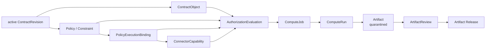
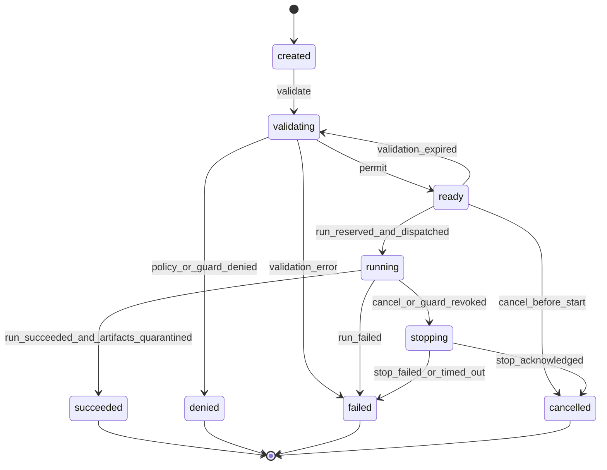

# Phase 2-B.6 Compute 领域模型

> 完成日期：2026-07-22  
> 状态：领域设计冻结；待数据库冻结同步  
> 范围：设计 Compute 与 Artifact 边界，不生成 ORM、migration、API 或执行代码

## 1. 结论

Compute 域负责把 active ContractRevision 中已经确定的授权规则转换为一次可验证、可追踪、默认不出域的受控执行过程。

它不决定新的数据权限，也不重新解释申请范围：

```text
active ContractRevision
  -> ContractObject + Policy + Constraint + Binding
  -> EvaluateContractUse
  -> ComputeJob
  -> ComputeRun
  -> quarantined Artifact
  -> ArtifactReview
  -> released Artifact（条件满足时）
```

本次设计对初始五对象方案作三项修正：

1. 增加 `ComputeRun`。Job 表示一次稳定的使用意图，Run 表示一次实际执行尝试；重试、节点回执、计数消耗和失败证据不能反复覆盖 Job。
2. `AlgorithmSpec` 与 `ExecutionEnvironment` 在 V1 是不可变值对象/证据快照，不单独建立可变目录表。算法不上传，环境由 Contract Binding 和 ConnectorCapability 选择。
3. ComputeJob 的生命周期止于执行成功、失败或取消；输出审核和发布属于 Artifact，不把 `review/released` 混入 Job 状态。

## 2. 目标与非目标

### 2.1 目标

- 只有 active ContractRevision 可以发起 ComputeJob；
- 每次创建、校验和启动都基于固定 ContractObject 与 Contract Policy；
- 任务不能扩大数据范围、用途、算法、环境或候选输出；
- 任务启动前重新验证当前 Contract、Binding、Connector 和 Capability；
- 运行次数限制能够在并发场景下原子占用；
- 执行回执与业务任务分离，支持可追溯的失败和受控重试；
- 所有输出先形成隔离 Artifact，默认不可查看或下载；
- Artifact 内容摘要固定后才能审核，审核不能覆盖 Contract 明确禁止的输出。

### 2.2 非目标

本阶段不实现：

- 用户上传或执行 Python、容器、模型文件；
- Kubernetes、GPU 调度器、沙箱或隐私计算引擎；
- 原始 WSI、临床表、患者清单或真实对象路径读取；
- Connector 网络协议、访问令牌或执行票据下发；
- Compute ORM、migration、CRUD 或 API；
- Artifact 文件上传、病毒扫描、真实结果出域；
- AuditEvent、Outbox 或哈希链；
- 通用算法市场、环境目录或工作流编排器。

## 3. 统一语言

| 术语 | 定义 |
| --- | --- |
| ComputeJob | 一次稳定的受控使用意图及其生命周期，不是容器或进程。 |
| ComputeRun | ComputeJob 的一次实际执行尝试，保存调度、节点回执和额度消费证据。 |
| ComputeInput | Job 内固定的输入值对象；V1 精确对应一个 ContractObject。 |
| AlgorithmSpec | 预登记算法的不可变描述快照，不包含代码或下载地址。 |
| ExecutionPlanSnapshot | 从 PolicyExecutionBinding 和 ConnectorCapability 解析出的本次执行计划证据。 |
| AuthorizationEvaluation | 对主体、标的、动作、约束和节点当前状态的 fail-closed 判定。 |
| Artifact | Run 产生的候选输出制品；创建后默认隔离。 |
| ArtifactReview | 针对特定 Artifact content digest 的出域审核工作项和决定。 |
| Release | 在 Contract Policy 与所有必需 ArtifactReview 同时允许时，将特定 Artifact 暴露给限定主体。 |

## 4. 聚合与依赖方向



依赖保持单向：

- Compute 引用 ContractRevision、ContractParty、ContractObject、Policy 和 Binding 证据；
- Compute 不修改 Contract、Policy、Application 或 Review 历史；
- Artifact 引用 ComputeRun，不反向改变 Job 的执行结果；
- ArtifactReview 只决定特定 Artifact 是否满足出域条件；
- Audit 未来消费 Compute/Artifact 事实，不能反向成为业务状态真相源。

### 4.1 聚合边界

| 聚合 | 负责 | 不负责 |
| --- | --- | --- |
| ComputeJob | 使用意图、输入、算法、授权判定、总体执行状态 | 合同协商、数据目录、Artifact出域决定 |
| ComputeRun | 单次执行尝试、额度占用、Connector回执、运行时间与失败 | 修改Job授权范围、发布结果 |
| Artifact | 输出内容身份、隔离保管和发布状态 | 决定自身是否合规 |
| ArtifactReview | 对固定Artifact摘要作出审核决定 | 扩大Contract允许的输出类型 |

## 5. ComputeJob

### 5.1 定义

`ComputeJob` 是使用方基于一条 active ContractRevision 提出的一次受控计算请求。它固定请求主体、一个 ContractObject、算法摘要、业务用途、候选输出集合和授权判定证据。

Job 不是执行节点、容器或算法包。它可以拥有多个顺序执行的 ComputeRun，但任何时刻最多一个非终态 Run。

### 5.2 字段候选

| 字段 | 类型 | 说明 |
| --- | --- | --- |
| `id` | uuid | Job 标识。 |
| `space_id` | uuid | 所属 Space；必须与 Contract 一致。 |
| `contract_revision_id` | uuid | 必须引用 active Revision。 |
| `revision_content_digest` | text | 创建时固定的 Revision 摘要。 |
| `requester_contract_party_id` | uuid | 必须是该 Revision 的 consumer Party。 |
| `requester_organization_id` | uuid | 与 Party 组织一致。 |
| `requester_user_id` | uuid | 当前组织有效成员。 |
| `contract_object_id` | uuid | V1 唯一输入对象。 |
| `purpose_code` | varchar | 必须属于 Contract 允许的 Application purpose 子集。 |
| `requested_output_types` | jsonb | 排序去重后的候选输出类型；只能收窄。 |
| `input_snapshot` | jsonb | ComputeInput 规范化快照。 |
| `input_snapshot_digest` | text | 输入快照摘要。 |
| `algorithm_snapshot` | jsonb | AlgorithmSpec 规范化快照。 |
| `algorithm_digest` | text | 必须精确匹配 Policy Constraint。 |
| `authorization_evidence` | jsonb | EvaluateContractUse 的可验证判定结果。 |
| `authorization_evidence_digest` | text | 判定证据摘要。 |
| `status` | varchar | ComputeJob 状态。 |
| `creation_request_digest` | text | 创建命令规范化内容摘要；客户端幂等键由未来Platform IdempotencyKey统一管理。 |
| `created_at` / `created_by` | timestamptz/uuid | 创建证据。 |
| `validated_at` | timestamptz | 最近一次成功校验时间。 |
| `started_at` / `finished_at` | timestamptz | Job 总体运行窗口。 |
| `denial_code` | varchar | 校验拒绝原因。 |
| `failure_code` / `failure_summary` | varchar/text | 系统或执行失败原因，不保存患者内容。 |
| `row_version` | integer | 并发状态转换。 |

### 5.3 V1 单输入边界

V1 每个 Job 只选择一个 ContractObject：

```text
ComputeJob
  -> ContractObject
  -> DataProductVersion
  -> DataResource集合
```

这不妨碍“数字病理多模态数据产品”同时包含 WSI、临床变量、治疗信息和随访，因为这些资源属于同一个 DataProductVersion。

`ComputeJob` 不再直接建立第二条 DataProductVersion 权威外键。`input_snapshot` 可以复制版本 ID 和摘要用于证据展示，但必须从 ContractObject 派生并与其一致。

如果未来确需一次 Job 跨多个 ContractObject，必须新增规范化输入关系和多对象 Policy 组合规则；不能把任意 UUID 数组塞入 JSONB 后绕过外键与额度作用域。

## 6. ComputeInput 值对象

`ComputeInput` 是 Job 创建时生成的不可变值对象，不是原始数据清单。

建议内容：

```json
{
  "schema_version": "compute-input/v1",
  "contract_object_id": "uuid",
  "data_product_version_id": "uuid",
  "product_snapshot_digest": "sha256:...",
  "authorized_scope_digest": "sha256:..."
}
```

其中：

- ContractObject 是权威来源；
- DataProductVersion ID 和摘要只用于证明解析结果；
- DataResource 与 DataProductSource 可能对应多个 Connector，Job 不复制单一“提供方节点”；实际执行节点只从 Contract Binding 解析；
- V1 不接受 Job 级 SQL、病例筛选表达式或任意 cohort query；
- Job 不能扩大或替换 ContractObject.authorized_scope。

中央平台不得在 ComputeInput 保存：

- 患者标识或病例清单；
- WSI、PACS、HIS、LIS 的真实地址；
- MinIO 预签名下载 URL；
- 数据库连接串、账号、密钥或令牌；
- 可直接执行的查询或脚本。

## 7. AlgorithmSpec 值对象

### 7.1 定义

V1 `AlgorithmSpec` 描述一个已经预登记的演示算法身份。它不是上传物，也不是平台可以任意拉取和执行的代码包。

建议内容：

```json
{
  "schema_version": "algorithm-spec/v1",
  "algorithm_name": "NPC Risk Model Demo",
  "algorithm_version": "1.0",
  "algorithm_digest": "sha256:...",
  "registry_type": "platform_demo_registry",
  "registry_reference": "demo:npc-risk-model:1.0",
  "execution_profile": "built_in_simulation",
  "declared_output_types": ["aggregate_statistics", "risk_scoring_model"]
}
```

### 7.2 不变量

- `algorithm_digest` 必须精确匹配 Contract Policy 的 `algorithm_digest eq` Constraint；
- `declared_output_types` 只能覆盖 Job 请求输出，不能扩大 Contract 输出集合；
- V1 `registry_type` 只允许演示注册表，不允许上传 URL、镜像地址或任意代码仓库；
- 算法名称和版本只用于解释，digest 才是执行身份；
- 修改算法内容必须产生新 digest 和新申请/合同，不得沿用旧授权。

## 8. ExecutionPlanSnapshot 值对象

初始建议中的 `ExecutionEnvironment` 不单独成为 V1 聚合。环境由 Contract Policy 的 accepted Binding 和 ConnectorCapability 当前状态决定，Job 只能保存当次选择结果。

建议快照：

```json
{
  "schema_version": "execution-plan/v1",
  "environment_mode": "controlled_compute",
  "bindings": [
    {
      "policy_id": "uuid",
      "policy_digest": "sha256:...",
      "binding_id": "uuid",
      "execution_role": "compute_executor",
      "connector_id": "uuid",
      "capability_code": "controlled_compute_execution",
      "capability_version": "1.0",
      "receipt_digest": "sha256:..."
    },
    {
      "policy_id": "uuid",
      "policy_digest": "sha256:...",
      "binding_id": "uuid",
      "execution_role": "egress_controller",
      "connector_id": "uuid",
      "capability_code": "egress_policy_enforcement",
      "capability_version": "1.0",
      "receipt_digest": "sha256:..."
    },
    {
      "policy_id": "uuid",
      "policy_digest": "sha256:...",
      "binding_id": "uuid",
      "execution_role": "audit_evidence_emitter",
      "connector_id": "uuid",
      "capability_code": "audit_evidence_emit",
      "capability_version": "1.0",
      "receipt_digest": "sha256:..."
    }
  ],
  "runtime_limits": {
    "max_duration_seconds": 3600,
    "network_mode": "deny_by_default",
    "raw_export": false
  }
}
```

快照是历史证据，不是当前真相源。Job 启动前仍需重读：

- Binding 是否仍为 accepted；
- Connector 是否 verified、online 且心跳有效；
- Capability 是否仍为 verified 且参数满足 V1；
- Contract 是否仍 active；
- Space、组织、参与方和数据产品是否仍有效。

`bindings` 按 `execution_role + policy_id + binding_id` 稳定排序。它是所有命中 Policy 的 required Binding 集合，不是假设整个Revision永远只有三个Binding。

## 9. AuthorizationEvaluation

### 9.1 输入

沿用 Contract 阶段冻结的 `EvaluateContractUse` 语义：

```text
contract_revision_id
requesting_organization_id
requesting_user_id
requester_contract_party_id
contract_object_id
requested_action = execute_controlled_compute
purpose_code
algorithm_digest
requested_output_types
requested_at
```

### 9.2 判定顺序

1. Revision 必须处于 active 且在有效时间窗口；
2. requester 必须是有效 consumer ContractParty，用户是组织有效成员；
3. ContractObject 必须属于该 Revision；
4. 必须命中 `permit execute_controlled_compute`；
5. 任一命中 prohibition 立即 deny；
6. purpose、algorithm、environment、时间、次数和地域等 Constraint 全部满足；
7. `write_audit_log` 等 obligation 必须有可履行 Binding；
8. required Binding 必须 accepted 且未 revoked；
9. Connector/Capability 当前状态满足 fail-closed 要求；
10. 候选输出只能是 `export_artifact` Policy 允许集合的子集；
11. 输出仍标记 `output_review_required=true`，不能返回出域许可；
12. 生成稳定 evidence 和 digest。

### 9.3 判定输出

```json
{
  "schema_version": "contract-use-evaluation/v1",
  "decision": "permit",
  "reason_codes": [],
  "revision_content_digest": "sha256:...",
  "contract_object_id": "uuid",
  "matched_policy_digests": ["sha256:..."],
  "binding_receipt_digests": ["sha256:..."],
  "constraint_evidence_digest": "sha256:...",
  "execution_plan_digest": "sha256:...",
  "effective_until": "2026-10-20T00:00:00Z",
  "output_review_required": true
}
```

判定结果只证明某一时点满足条件。`start` 必须再次评估，不能把 `validated` 当成长期访问令牌。

## 10. ComputeRun

### 10.1 定义

`ComputeRun` 是 ComputeJob 的一次具体执行尝试。它承载执行计划快照、额度占用、节点回执、开始/结束时间、输出清单摘要和失败事实。

### 10.2 字段候选

| 字段 | 类型 | 说明 |
| --- | --- | --- |
| `id` | uuid | Run 标识。 |
| `compute_job_id` | uuid | 所属 Job。 |
| `attempt_no` | integer | 同一 Job 单调递增且唯一。 |
| `status` | varchar | Run 状态。 |
| `authorization_evidence_digest` | text | 启动前最新授权判定摘要。 |
| `execution_plan_snapshot` | jsonb | 本次 Binding/Connector/Capability 快照。 |
| `execution_plan_digest` | text | 执行计划摘要。 |
| `quota_policy_id` | uuid | 被消耗的 run_count Policy。 |
| `quota_scope_digest` | text | revision + policy + party + object 作用域摘要。 |
| `quota_reservation_digest` | text | 额度作用域、attempt与创建命令的确定性摘要。 |
| `execution_reference` | text | Connector 返回的非敏感、不可下载执行引用。 |
| `dispatch_receipt_digest` | text | 节点接收回执摘要。 |
| `completion_receipt_digest` | text | 节点完成回执摘要。 |
| `audit_receipt_digest` | text | 审计证据回执摘要。 |
| `reserved_at` / `dispatched_at` | timestamptz | 额度占用和下发时间。 |
| `started_at` / `finished_at` | timestamptz | 节点确认的运行窗口。 |
| `failure_code` / `failure_summary` | varchar/text | 结构化失败信息。 |
| `row_version` | integer | 状态并发控制。 |

### 10.3 运行次数语义

`run_count` 的作用域固定为：

```text
ContractRevision + permit Policy + consumer Party + ContractObject
```

数据库不保存可被并发覆盖的 `remaining_runs`。未来开始 Run 时应：

1. 锁定额度作用域；
2. 统计或预留已经占用的 Run；
3. 再次验证上限；
4. 原子创建 reservation/Run 事实；
5. 成功后才允许 dispatch。

V1 规则：每次真正 dispatch 都消费一次额度。校验失败不消费；节点接收后的基础设施失败仍消费，防止利用重试绕过上限。重试创建新的 `attempt_no`，不得覆盖失败 Run。

为避免多个 permit Policy 产生含糊额度口径，V1 对同一 `consumer Party + ContractObject + execute_controlled_compute` 必须解析出唯一 governing permit Policy；出现多个可适用 permit 时 fail-closed 返回 `ambiguous_permit_policy`。deny 与 obligation 仍可同时命中并全部执行。

## 11. 状态机

### 11.1 ComputeJob 状态

冻结词表：

```text
created
validating
ready
running
stopping
succeeded
denied
failed
cancelled
```



语义：

- `ready` 只表示最近一次校验通过；不是执行凭证；
- `succeeded` 只表示执行成功并生成零个或多个 quarantined Artifact；
- `succeeded` 不表示任何 Artifact 已审核或发布；
- `denied` 是规则拒绝，`failed` 是系统/节点失败，两者不能混写；
- running 后取消先进入 `stopping`，收到节点回执后才进入 `cancelled`。

### 11.2 ComputeRun 状态

```text
reserved -> dispatched -> running -> succeeded
   |            |           |------> failed
   |            |----------> timed_out
   |-----------------------> cancelled
```

规则：

- 每个 Job 最多一个 `reserved/dispatched/running` Run；
- reserved阶段下发失败可以进入failed，授权取消可以进入cancelled；
- Run 状态由受信 Connector 回执或编排超时命令推进；
- 迟到、重复或逆序回执必须幂等拒绝；
- terminal Run 不可修改执行证据；
- 只有 succeeded Run 可以产生 Artifact。

## 12. Artifact

### 12.1 定义

Artifact 是 succeeded ComputeRun 产生的候选输出。它不是原始输入，也不是自动交付物。

### 12.2 类型词表

V1 对外候选类型沿用 Application 输出词表：

```text
aggregate_statistics
model_artifact
feature_dataset
risk_scoring_model
```

执行日志和审计回执不是可申请输出 Artifact，应进入未来 Audit 域或内部证据包。

### 12.3 字段候选

| 字段 | 类型 | 说明 |
| --- | --- | --- |
| `id` | uuid | Artifact 标识。 |
| `space_id` | uuid | 所属空间。 |
| `compute_job_id` / `compute_run_id` | uuid | 来源 Job 和成功 Run。 |
| `artifact_type` | varchar | 必须属于 Job 请求与 Contract permit 的交集。 |
| `content_digest` | text | 内容身份；审核固定该摘要。 |
| `storage_reference` | text | 隔离区内不透明引用，不是下载 URL。 |
| `size_bytes` | bigint | 非负。 |
| `classification_level` | varchar | 输出敏感等级。 |
| `release_status` | varchar | `quarantined/released/revoked/destroyed`。 |
| `retention_until` | timestamptz | 不得宽于 Contract Constraint。 |
| `release_evidence` / `release_evidence_digest` | jsonb/text | 发布时的策略与审核证据。 |
| `created_at` / `released_at` / `revoked_at` / `destroyed_at` | timestamptz | 生命周期时间。 |
| `row_version` | integer | 并发控制。 |

### 12.4 不变量

- 新 Artifact 必须为 `quarantined`；
- Artifact 内容一旦登记不得原地替换；内容改变必须创建新 Artifact；
- 使用方在 released 前不能获得 storage reference、预签名 URL 或内容；
- Artifact 类型必须是 Job 请求输出和 Contract允许输出的交集；
- 原始 WSI、患者级数据和可重识别结果不得伪装成 Artifact 类型；
- released 之后的治理撤销进入 `revoked`，不删除历史审核和发布证据；
- destroyed 只表示保管副本按策略销毁，摘要和最小审计证据仍保留。

## 13. ArtifactReview

### 13.1 为什么不直接复用当前 ReviewTask

现有 ReviewTask 的数据库外键被严格固定为 ApplicationSnapshot。直接增加无约束多态 target 会破坏已经验证的 Review 不变量。

V1 使用独立 `artifact_reviews`：复用“固定 digest、责任组织、领取、最终决定、历史不可覆盖”的原则，但不复用当前 Application Review 表结构。

### 13.2 字段候选

| 字段 | 类型 | 说明 |
| --- | --- | --- |
| `id` | uuid | 审核标识。 |
| `artifact_id` | uuid | 被审 Artifact。 |
| `target_content_digest` | text | 必须等于 Artifact content_digest。 |
| `review_type` | varchar | `provider_output_review`、`egress_compliance_review`。 |
| `responsible_organization_id` | uuid | 责任组织。 |
| `claimed_by_user_id` | uuid | 领取人，可空。 |
| `status` | varchar | `pending/claimed/decided/cancelled`。 |
| `is_required` | boolean | 是否影响发布资格。 |
| `routing_rule_digest` | text | 路由依据。 |
| `decision` | varchar | decided 时为 `approved/rejected`。 |
| `reason_code` / `comment` | varchar/text | 决定理由。 |
| `decision_digest` | text | 最终决定摘要。 |
| `claimed_at` / `decided_at` / `cancelled_at` | timestamptz | 生命周期时间。 |
| `created_at` | timestamptz | 创建时间。 |
| `row_version` | integer | 并发控制。 |

V1 `artifact_reviews` 将任务和最终决定放在同一行，是37表冻结下的最小模型。状态到 `decided` 后决定字段不可更新或删除。若未来需要多次补件/复审，应创建新的 Artifact 或新的 Review，而不是覆盖旧决定。

### 13.3 发布资格

Artifact 只有同时满足以下条件才能从 quarantined 进入 released：

1. 来源 ComputeRun succeeded；
2. Artifact content digest 未变化；
3. 所有 required ArtifactReview 均 decided/approved；
4. 当前 Revision 未被 terminated/expired，且治理规则允许历史结果发布；
5. 存在匹配 Artifact 类型的 `permit export_artifact`；
6. `output_review_required=true` 已满足；
7. egress Binding 仍 accepted，Connector/Capability 当前有效；
8. 任一 deny 仍优先；
9. 生成发布证据包及摘要；
10. 使用方只获得 Artifact 级访问，不获得原始数据访问。

人工点击“批准”不能越过 Contract Policy。

## 14. 领域命令

| 命令 | 主体 | 核心前置条件 | 结果 |
| --- | --- | --- | --- |
| `create_compute_job` | consumer授权用户 | Revision active；Party/Object同Revision；幂等键有效 | Job created |
| `validate_compute_job` | Policy服务 | EvaluateContractUse permit；当前Binding/Capability有效 | ready 或 denied |
| `start_compute_job` | 编排服务 | 再次评估；原子占用run_count；审计能力fail-closed | Run reserved/dispatched，Job running |
| `acknowledge_run_started` | compute Connector | 回执身份、顺序和digest有效 | Run running |
| `complete_compute_run` | compute Connector | 成功回执；审计回执有效；输出清单合规 | Run succeeded，创建quarantined Artifact，Job succeeded |
| `fail_compute_run` | Connector/编排服务 | 失败或超时证据有效 | Run/Job failed |
| `cancel_compute_job` | requester/provider/operator授权角色 | 状态允许；原因明确 | cancelled或stopping |
| `create_artifact_reviews` | 出域编排服务 | Artifact quarantined；Policy要求审核 | required Review集合 |
| `decide_artifact_review` | 责任组织用户 | 固定digest；职责分离 | approved/rejected决定 |
| `release_artifact` | Artifact领域服务 | Policy与全部required Review均允许 | released |
| `revoke_artifact` | provider/operator治理角色 | 合规或合同治理原因 | revoked |

## 15. 当前状态变化时如何处理

### 15.1 Job 创建或 ready 阶段

下列任一变化都应使新建/启动失败：

- Revision 不再 active；
- Binding rejected/revoked；
- Connector offline、verification revoked 或心跳过期；
- Capability disabled；
- Space/组织/参与方失效；
- DataProductVersion 被治理 hold；
- run_count 已耗尽；
- Audit obligation 无法履行。

ready Job 在校验证据过期后回到 validating，而不是沿用旧 permit。

### 15.2 running 阶段

运行中发现授权或执行条件失效时：

- 编排服务进入 `stopping` 并请求 Connector fail-closed 停止；
- 不把合同历史改成 rejected，也不修改 ReviewDecision；
- 已产生的候选输出仍隔离，不自动销毁或发布；
- 无法确认停止时以 `failed` 结束并保留风险原因；
- 后续治理可把 Revision 转入 suspended，但 Compute 不反向直接修改 Contract。

### 15.3 succeeded 之后

- Contract 后续失效不抹去 Run/Artifact 历史；
- 未发布 Artifact 的 release 必须按当时合同证据和当前治理规则再次检查；
- 已发布 Artifact 是否撤销由治理命令决定，不自动删除。

## 16. 并发、幂等与顺序

| 场景 | 保护原则 |
| --- | --- |
| 重复创建Job | 未来Platform IdempotencyKey锁定命令；Job保存creation_request_digest校验重放内容一致 |
| 并发validate | Job row_version；只接受当前状态 |
| 并发start | 锁Job与quota scope；最多一个非终态Run |
| 并发run_count | 原子占用，不维护可覆盖remaining字段 |
| 重复Connector回执 | run + receipt digest 幂等 |
| 逆序回执 | 状态机拒绝；不回退状态 |
| 重复Artifact清单 | run + artifact type + content digest 唯一 |
| 并发审核决定 | ArtifactReview row_version；终态不可覆盖 |
| 并发release | Artifact行锁 + release evidence digest |

所有摘要文档采用 canonical JSON：键排序、数组按稳定业务键排序、UTC RFC3339 时间、拒绝 NaN/Infinity。

## 17. 数据最小化与安全边界

Compute 中央元数据可以保存：

- 组织、用户、Contract/Party/Object/Policy/Binding ID；
- 规范化算法和环境快照；
- 摘要、状态、时间、原因码和不透明执行引用；
- Artifact 类型、摘要、大小、分类和隔离引用。

不得保存：

- 患者姓名、身份证、住院号或病例级标签；
- 原始切片、影像或临床表内容；
- 真实数据库连接信息；
- 可直接下载的对象地址；
- 用户上传代码、容器命令或任意脚本；
- Connector 私钥、临时访问令牌或完整网络凭据；
- 在失败摘要中复制患者数据或算法输入。

## 18. 与 Audit 的硬边界

Contract 已要求 `write_audit_log` 且 Binding 指向 `audit_evidence_emit/1.0`。因此未来真实 `start_compute_job` 必须 fail-closed：

```text
无法建立审计证据通道
  -> 不创建可执行Run
  -> 不下发任务
```

本阶段只在 Run 中预留 `audit_receipt_digest` 语义，不创建 AuditEvent 或 HashChain。下一阶段若只实现 Compute ORM，可以创建元数据和模拟状态，但在 Audit 域落地前不得声称真实执行闭环已经成立。

## 19. 数据库映射建议

保持 v6 的四张未来表，不在本轮修改数据库冻结文档：

| 逻辑表 | 领域内容 |
| --- | --- |
| `compute_jobs` | Job、ComputeInput快照、AlgorithmSpec快照、Authorization evidence |
| `compute_runs` | 执行尝试、ExecutionPlanSnapshot、额度与节点回执 |
| `artifacts` | 隔离输出、摘要、保管和发布状态 |
| `artifact_reviews` | Artifact固定摘要的出域审核与最终决定 |

V1 不创建：

- `algorithm_specs`；
- `execution_environments`；
- `compute_job_inputs`；
- `artifact_grants`；
- `workflow_steps`；
- `quota_counters`。

上述决定保持总逻辑表数为37；当前已实现30张，Compute/Artifact四表、Audit两表和Platform幂等表仍待实现。

## 20. 数字病理演示场景

```text
ContractRevision ACTIVE
  对象：鼻咽癌数字病理多模态研究数据产品 v1.0（演示）
  允许：execute_controlled_compute
  用途：ai_training
  算法：NPC Risk Model Demo / sha256:...
  候选输出：aggregate_statistics, risk_scoring_model
  禁止：raw export, reidentify, redistribute
```

流程：

1. AI企业授权用户创建Job，选择唯一ContractObject；
2. 平台从ContractObject解析版本和范围摘要，不获取WSI路径；
3. Policy评估确认用途、算法、输出、次数和环境；
4. compute、egress、audit三个required Binding当前均有效；
5. start时原子占用一次运行额度并形成ComputeRun；
6. V1仅模拟Connector回执，不执行算法；
7. 成功回执形成隔离的aggregate_statistics和risk_scoring_model Artifact元数据；
8. 医院/合规责任方审核固定Artifact digest；
9. 只有聚合统计通过Policy和审核后才能标记released；
10. 原始WSI始终不进入Artifact，也不存在下载入口。

## 21. 验收矩阵

后续 ORM/领域服务至少需要验证：

| 不变量 | 快速测试 | PostgreSQL/并发测试 |
| --- | --- | --- |
| 非active Revision不能创建Job | 是 | 是 |
| requester必须匹配consumer Party | 是 | 复合FK/服务 |
| Job只能固定同Revision ContractObject | 是 | 复合FK |
| algorithm digest必须匹配Policy | 是 | 集成 |
| 输出集合只能收窄 | 是 | 集成 |
| denied与failed语义分离 | 是 | 状态CHECK |
| start前重算当前授权 | 是 | 状态变化集成 |
| 并发run_count不超限 | 否 | 必须 |
| 每Job最多一个非终态Run | 是 | 部分唯一索引 |
| terminal Run证据不可改 | 是 | trigger |
| Artifact默认quarantined | 是 | CHECK/trigger |
| succeeded不等于released | 是 | 是 |
| 审核绑定Artifact digest | 是 | 复合FK/trigger |
| 人工批准不能覆盖Policy deny | 是 | 集成 |
| 无audit能力时start失败关闭 | 是 | 集成 |

## 22. 风险与待冻结问题

进入数据库设计 v7 前仍需明确：

1. `compute_jobs` 中单ContractObject复合外键的具体候选键；
2. AlgorithmSpec 与 ExecutionPlanSnapshot 的 JSONB schema 和不可变字段；
3. Job/Run状态转换的数据库trigger边界；
4. run_count原子占用是锁Policy行、使用事务级锁还是引入独立ledger；
5. ArtifactReview单表承载任务与最终决定时的终态不可变实现；
6. Contract suspended/expired 后历史Artifact release的治理规则；
7. Audit域应在真实Run状态机之前还是与Compute migration同批落地。
8. Platform IdempotencyKey与ComputeJob/ComputeRun命令摘要的外键和清理边界。

其中第4项和第7项是进入“真实执行”前的阻塞项，但不阻塞下一步数据库设计评审。

## 23. 下一步

建议进入 Phase 2-B.6-A：Compute 数据库冻结同步 v7，只更新数据库设计，不生成 ORM。

冻结重点：

- 四表字段、主外键、唯一约束和索引；
- Job/Run两层状态机；
- 单ContractObject输入边界；
- run_count并发占用方案；
- Artifact与ArtifactReview摘要关系；
- Audit fail-closed依赖和迁移顺序。

在 v7 审查通过前，不应创建 Compute ORM，更不应接入真实任务执行。
