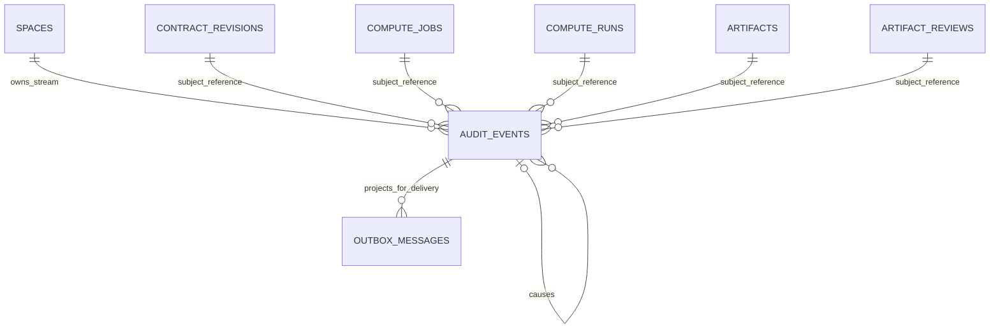
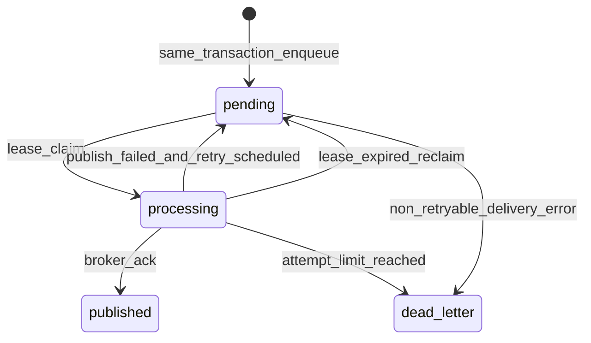

# MedTrust Space Phase 2-B.7-A AuditEvent + Transactional Outbox 领域模型

> 完成日期：2026-07-22  
> 状态：领域设计冻结；待数据库冻结同步 v8  
> 前置基线：Alembic `20260722_0013`，34 张实表  
> 本阶段边界：只设计，不生成 ORM、migration、API、Dispatcher、执行器或前端代码

## 1. 结论先行

本阶段冻结两个持久化事实对象：

| 对象 | 职责 | 是否业务事实源 | 是否可变 |
| --- | --- | --- | --- |
| `AuditEvent` | 记录谁在何时、依据什么证据、对什么对象执行了什么命令以及结果 | 是 | 整行追加后不可修改、不可删除 |
| `OutboxMessage` | 将已提交的 AuditEvent 可靠投递给执行器、审计投影或其他消费者 | 否，只是投递状态 | 仅投递状态、租约、重试字段可变 |

V1 **不新增** `AuditStreamHead` / `AuditSequence` 表，也不保留旧占位名 `audit_hash_chain`：

1. 首批事件全部属于一个明确的 Space；
2. 事件追加时锁定现有 `spaces` 行；
3. 在该锁内读取最后一个事件，原子分配下一序号和前序摘要；
4. 不同 Space 互不阻塞，同一 Space 内按链顺序串行；
5. 事务回滚时事件、Outbox 和序号一起回滚，不遗留断号。

因此首批 Audit 持久化结构为：

```text
当前 34 张实表
  + audit_events
  + outbox_messages
= 36 张实表
```

旧数据库规划中的平台 `idempotency_keys` 仍是未来独立能力：它负责 API 请求结果重放，不由 AuditEvent 或 OutboxMessage 冒充。未来实现后才达到原规划的 37 张逻辑表。

本设计同时保持当前安全边界：在 Audit ORM、事务写入服务和数据库命令守卫真正落地前，`ComputeRun` 真实启动和 `Artifact` release 仍必须抛出 `AuditEvidenceUnavailable`。

---

## 2. 目标与非目标

### 2.1 目标

- 关键业务状态、AuditEvent 和至少一个 OutboxMessage 在同一 PostgreSQL 事务提交；
- 任一写入失败时，业务状态、事件和消息一起回滚；
- AuditEvent 是不可变证据，Outbox 状态不是业务事实；
- 按 Space 建立可校验的 SHA-256 摘要链，避免全系统单链写热点；
- Outbox 使用至少一次投递，消费者按 `event_id` / `idempotency_key` 幂等；
- Worker 崩溃后租约能够过期并重新领取；
- 事件快照仅保存治理元数据、摘要和受控引用，不保存患者数据或秘密；
- 为 Contract、Compute 与 Artifact 的关键命令定义明确的事件目录和硬门禁；
- 为后续数据库冻结、ORM、事务服务和 Dispatcher 提供单一实现基线。

### 2.2 非目标

本阶段不实现：

- Audit ORM 或 Outbox ORM；
- Alembic migration 或 PostgreSQL 函数；
- Outbox Dispatcher、Worker、定时任务或监控告警；
- Kafka、RabbitMQ、Redis Streams 或云消息服务；
- 端到端 exactly-once；
- 第三方时间戳、区块链、CA、WORM 存储或法律意义上的可信存证；
- ComputeRun 执行器、Connector 网络调用或用户代码运行；
- Artifact 下载、发布 API 或真实结果出域；
- API、前端、病理数据和病理模型；
- 对历史 Application / Review / Contract 事件进行追溯补写。

---

## 3. 统一语言与权威边界

| 术语 | 定义 |
| --- | --- |
| AuditEvent | 已发生业务命令结果的不可变证据。 |
| Event Catalog | 冻结事件名称、版本、Actor、Subject、证据和消费者的目录。 |
| Audit Stream | 同一 Space 内按 `stream_sequence` 排序的一条事件链。 |
| Evidence Snapshot | 为验证事件所需的最小、脱敏、规范化元数据快照。 |
| Evidence Digest | Evidence Snapshot 的 SHA-256 摘要。 |
| Event Digest | 覆盖事件固定字段、Evidence Digest 和前序摘要的 SHA-256 摘要。 |
| OutboxMessage | AuditEvent 的不可变投递信封加可变投递状态。 |
| Dispatcher | 领取 OutboxMessage 并投递给外部消费者的未来基础设施。 |
| Lease | Dispatcher 对消息的有限时独占领取，不是永久锁。 |
| Hard Gate | 没有同事务 AuditEvent + OutboxMessage 就不得提交的状态转换。 |
| At-least-once | 消息可能重复投递，但不会因一次临时失败被静默丢弃。 |

### 3.1 单一真相源

```text
业务表
  -> 业务状态真相

AuditEvent
  -> 已发生命令与证据真相

OutboxMessage
  -> 投递进度
```

禁止以下反向推断：

- `OutboxMessage.status=published` 不代表业务状态成功；业务事实必须读业务表和 AuditEvent；
- `OutboxMessage.status=dead_letter` 不撤销已经提交的业务状态；它表示投递需要运维处理；
- 普通日志、控制台输出、前端时间线不能补充或替代 AuditEvent；
- `ComputeRun.audit_receipt_digest` 只是证据引用，不是 AuditEvent；
- AuditEvent 不反向修改 Contract、Run、Artifact 或 Review。

---

## 4. 对象关系与依赖方向



`subject_type + subject_id` 是受 Event Catalog 约束的多态引用，不创建一条无法表达多表目标的普通 FK。数据库追加函数必须按 `event_type` 查询对应业务表，并验证其 `space_id`、目标状态和证据摘要。

依赖保持单向：

```text
Contract / Compute / Artifact command
  -> AuditWriteService
  -> audit_events
  -> outbox_messages
  -> future Dispatcher
  -> idempotent consumers
```

Dispatcher 不调用业务状态命令，也不把消息发布结果写回业务对象。

---

## 5. AuditEvent 模型

### 5.1 字段冻结

| 字段 | 类型 | 必填 | 语义 |
| --- | --- | --- | --- |
| `event_id` | UUID | 是 | 全局事件标识，主键。 |
| `space_id` | UUID | 是 | 审计流边界，FK 到 Space。 |
| `event_type` | text | 是 | Event Catalog 中的稳定事件名。 |
| `schema_version` | smallint | 是 | 当前事件 payload schema 版本，从 1 开始。 |
| `canonicalization_version` | text | 是 | V1 固定 `medtrust-jsonb-c14n/v1`。 |
| `occurred_at` | timestamptz | 是 | 数据库在获得 Space 链锁后生成的 UTC 时间。 |
| `actor_type` | text | 是 | `user`、`connector` 或 `system`。 |
| `actor_organization_id` | UUID | 否 | Actor 所属组织；user/connector 时必填。 |
| `actor_user_id` | UUID | 否 | user Actor 时必填。 |
| `actor_connector_id` | UUID | 否 | connector Actor 时必填。 |
| `actor_service_code` | text | 否 | system Actor 时必填，如 `medtrust.compute`。 |
| `subject_type` | text | 是 | `contract_revision`、`compute_job`、`compute_run`、`artifact` 或 `artifact_review`。 |
| `subject_id` | UUID | 是 | 具体业务对象 ID。 |
| `result` | text | 是 | `success`、`failure`、`denied`、`interrupted` 或 `cancelled`。 |
| `correlation_id` | UUID | 是 | 一条业务协作链的关联标识。 |
| `causation_id` | UUID | 否 | 直接触发本事件的前一个内部 AuditEvent。 |
| `command_id` | UUID | 是 | 本次领域命令标识；可关联同一命令产生的多个事件。 |
| `idempotency_key` | text | 是 | 事件写入幂等摘要，不保存客户端原始键。 |
| `evidence_snapshot` | JSONB | 是 | 最小脱敏证据快照。 |
| `evidence_digest` | text | 是 | 规范化 evidence 的 `sha256:<64 hex>`。 |
| `previous_event_digest` | text | 否 | 同一 Space 前一个事件摘要；首事件为空。 |
| `event_digest` | text | 是 | 当前事件链摘要。 |
| `stream_sequence` | bigint | 是 | Space 内从 1 开始连续分配的序号。 |
| `created_at` | timestamptz | 是 | 物理插入时间；V1 与 occurred_at 同事务生成。 |

### 5.2 Actor 形态约束

| actor_type | organization | user | connector | service_code |
| --- | --- | --- | --- | --- |
| `user` | 必填 | 必填 | 空 | 空 |
| `connector` | 必填 | 空 | 必填 | 空 |
| `system` | 可空 | 空 | 空 | 必填 |

数据库追加函数还必须验证：

- user 是 actor organization 的有效成员；
- connector 属于同一 Space 和 actor organization；
- system service code 来自冻结内部词表，而不是任意客户端字符串；
- 不允许同时填写 user 与 connector；
- 不以显示名称、邮箱或自由文本替代主体 ID。

### 5.3 Subject 和 result 规则

Event Catalog 决定事件允许的 Subject：

| 事件前缀 | subject_type |
| --- | --- |
| `contract.revision.*` | `contract_revision` |
| `compute.job.*` | `compute_job` |
| `compute.run.*` | `compute_run` |
| `artifact.created/released` | `artifact` |
| `artifact.review.*` | `artifact_review` |

`result` 表达命令结果，不复刻业务决定：

- `artifact.review.decided` 的命令结果为 `success`；批准或拒绝放在 Evidence Snapshot 的 `decision`；
- `compute.run.failed` 的 result 为 `failure`；
- `compute.run.interrupted` 的 result 为 `interrupted`；
- 预检拒绝如未来需要独立事件，可使用 `denied`，但不能伪造已发生状态转换。

### 5.4 唯一约束与索引候选

数据库冻结 v8 应进一步确认以下候选：

```text
PRIMARY KEY (event_id)
UNIQUE (event_id, space_id)
UNIQUE (space_id, stream_sequence)
UNIQUE (space_id, event_digest)
UNIQUE (idempotency_key)
INDEX  (space_id, stream_sequence DESC)
INDEX  (space_id, occurred_at DESC)
INDEX  (subject_type, subject_id, occurred_at DESC)
INDEX  (correlation_id, occurred_at)
INDEX  (command_id)
INDEX  (event_type, occurred_at DESC)
```

`idempotency_key` 是事件级幂等键，例如：

```text
sha256(space_id | command_id | event_type | subject_type | subject_id | schema_version)
```

它不缓存 API response，也不能替代未来平台 `idempotency_keys`。

---

## 6. Evidence Snapshot 与摘要

### 6.1 Evidence 只保存什么

允许保存：

- ContractRevision、Policy、Binding、Capability、Job、Run、Artifact 和 Review 的 ID；
- 已冻结的业务摘要，如 revision content digest、authorization digest、decision digest；
- 状态转换前后值；
- 受控命令结果码；
- Connector 回执摘要；
- 对象存储的非秘密 opaque reference 摘要，而不是可访问 URL；
- 规则版本、事件 schema 版本和评估摘要。

禁止保存：

- 患者姓名、证件号、住院号或任何患者级原始记录；
- WSI、PACS、LIS 或对象存储真实路径；
- 预签名 URL；
- Connector 凭据、证书私钥或访问令牌；
- MinIO access key / secret key；
- 算法镜像拉取凭据；
- 未经长度限制的堆栈、SQL 或外部响应正文。

建议冻结 V1 Evidence Snapshot 上限为 64 KiB；超出内容必须保存到受控证据存储并仅在事件中记录内容摘要和 opaque reference。

### 6.2 Canonical JSON

V1 使用数据库权威规范化版本：

本节所称 canonical JSON 指按下述冻结规则生成、可跨实现复算的规范化UTF-8字节序列，而不是任意语言的默认JSON输出。

```text
canonicalization_version = medtrust-jsonb-c14n/v1
```

规则：

1. 输入必须为 JSON object；
2. object key 按 UTF-8 字节序排序；
3. array 保持业务规定顺序，集合型数组必须在调用前按冻结字段排序；
4. 不删除显式 null；
5. 不允许 NaN、Infinity 或浮点型医学测量原值；
6. 时间统一 RFC 3339 UTC，精确到微秒；
7. UUID 使用小写连字符格式；
8. 摘要使用 UTF-8 字节和 SHA-256；
9. 数据库追加函数是最终摘要权威，应用层预计算结果必须与其一致。

数据库冻结阶段应定义一个版本化 canonicalization helper，不能直接假设任意语言的默认 JSON 序列化结果一致。

### 6.3 两层摘要

```text
evidence_digest
  = SHA256(canonical(evidence_snapshot))

event_digest
  = SHA256(canonical(event_manifest))
```

`event_manifest` 至少覆盖：

```json
{
  "event_id": "uuid",
  "space_id": "uuid",
  "stream_sequence": 42,
  "previous_event_digest": "sha256:...",
  "event_type": "compute.run.started",
  "schema_version": 1,
  "occurred_at": "2026-07-22T10:30:00.123456Z",
  "actor": {},
  "subject": {},
  "result": "success",
  "correlation_id": "uuid",
  "causation_id": "uuid-or-null",
  "command_id": "uuid",
  "idempotency_key": "sha256:...",
  "evidence_digest": "sha256:..."
}
```

Outbox 的可变投递状态不进入 Event Digest。

---

## 7. 审计链方案比较与冻结

### 7.1 方案比较

| 方案 | 优点 | 风险 | V1结论 |
| --- | --- | --- | --- |
| 全系统单一链 | 查询和验证直观 | 所有Space争用一个链头；形成全局写热点和故障域 | 拒绝 |
| 按Space分链 | 边界与现有多租户模型一致；不同Space可并发 | 单个高流量Space内仍串行 | 采用 |
| 按聚合分链 | 并发最高；局部验证快 | 同一业务链跨聚合排序复杂；需要额外流目录或链头 | V1不采用，未来评估 |

### 7.2 为什么不建 AuditStreamHead

独立链头表可以保存 last sequence/digest，但同时引入一个可与最后事件不一致的派生状态。V1已有稳定、不可删除的 Space 行，可作为事务锁：

```sql
SELECT id
FROM medtrust.spaces
WHERE id = :space_id
FOR UPDATE;
```

随后通过 `(space_id, stream_sequence DESC)` 索引读取最后事件。链头唯一真相仍是 AuditEvent 本身，不需要第二张链状态表。

如果未来单个 Space 的事件吞吐确实成为瓶颈，应通过数据库 v9+ 明确迁移到按聚合分链，而不是现在同时维护 Space 链和聚合链。

### 7.3 原子序号分配

未来 `append_audit_event_v1` 数据库函数应在调用方业务事务内：

```text
1. 锁定 spaces(space_id) 行；
2. 读取同Space最后一个 stream_sequence 和 event_digest；
3. next_sequence = last + 1，首事件为1；
4. previous_event_digest = last event_digest，首事件为空；
5. 生成 occurred_at、evidence_digest 和 event_digest；
6. 插入 AuditEvent；
7. 为每个目标插入 OutboxMessage；
8. 返回 event_id、event_digest 和 message_id集合；
9. 由外层业务事务统一COMMIT或ROLLBACK。
```

两个并发事务写同一 Space 时，第二个事务必须等待 Space 行锁，再读取第一个已提交事件，不会获得相同序号。

### 7.4 回滚与断号

- 序号不使用全局 PostgreSQL sequence；
- AuditEvent 和业务状态在同一事务；
- 事务回滚后事件行不存在，下一事务可复用该序号；
- 因此已提交链中不产生由业务回滚造成的断号；
- 事件链顺序以 `stream_sequence` 为准，不以客户端时间为准；
- `occurred_at` 必须在获得 Space 锁后由数据库生成，避免等待锁时出现时间倒序。

### 7.5 链验证

验证器按 Space：

1. 从 sequence 1 顺序读取；
2. 验证序号连续；
3. 验证首事件 previous digest 为空；
4. 验证后续 previous digest 等于上一 event digest；
5. 重算 evidence digest；
6. 重算 event digest；
7. 报告第一个不一致位置，不自动“修复”历史。

能力边界必须诚实表达：

> 数据库内哈希链可提供意外修改和部分篡改的检测线索，但数据库Owner若能重写全部历史并重算整条链，仍可能绕过。它不是第三方可信时间戳、WORM或法律意义上的不可篡改存证。

---

## 8. OutboxMessage 模型

### 8.1 字段冻结

| 字段 | 类型 | 必填 | 语义 |
| --- | --- | --- | --- |
| `message_id` | UUID | 是 | Outbox主键。 |
| `audit_event_id` | UUID | 是 | 对应AuditEvent，RESTRICT。 |
| `space_id` | UUID | 是 | 与AuditEvent同Space，用于分区和一致性。 |
| `destination` | text | 是 | 逻辑消费者/目的地。 |
| `topic` | text | 是 | 稳定消息主题。 |
| `payload_snapshot` | JSONB | 是 | AuditEvent的不可变投递信封。 |
| `payload_digest` | text | 是 | payload规范化摘要。 |
| `idempotency_key` | text | 是 | 消息投递幂等键，通常由event+destination派生。 |
| `status` | text | 是 | `pending`、`processing`、`published`、`dead_letter`。 |
| `attempt_count` | integer | 是 | 每次成功领取租约时原子加1。 |
| `available_at` | timestamptz | 是 | 下次可领取时间。 |
| `locked_at` | timestamptz | 否 | 最近领取时间。 |
| `lock_expires_at` | timestamptz | 否 | 租约失效时间。 |
| `lock_owner` | text | 否 | Dispatcher实例的非秘密标识。 |
| `last_error` | text | 否 | 截断和清洗后的失败分类，不保存响应正文或凭据。 |
| `published_at` | timestamptz | 否 | 收到目标系统成功确认的时间。 |
| `created_at` | timestamptz | 是 | 与AuditEvent同事务创建。 |
| `row_version` | integer | 是 | 投递状态并发控制。 |

### 8.2 不可变与可变边界

创建后不可修改：

- message id、event id、space；
- destination、topic；
- payload snapshot、payload digest；
- idempotency key、created_at。

Dispatcher可修改：

- status；
- attempt count；
- available/locked/expiry 时间；
- lock owner；
- last error；
- published at；
- row version。

任何普通业务服务都不能直接把消息标记为 published。

### 8.3 Payload边界

Outbox payload 是AuditEvent的不可变投影，不是第二份业务事实：

```json
{
  "message_schema": "medtrust-event-envelope/v1",
  "event_id": "uuid",
  "space_id": "uuid",
  "event_type": "artifact.released",
  "event_schema_version": 1,
  "occurred_at": "...Z",
  "subject_type": "artifact",
  "subject_id": "uuid",
  "result": "success",
  "correlation_id": "uuid",
  "event_digest": "sha256:...",
  "evidence": {}
}
```

数据库写入函数必须验证 payload 中的 event id、space、type、schema version、event digest 与AuditEvent一致。Payload也遵守AuditEvent相同隐私限制。

### 8.4 唯一约束和索引候选

```text
PRIMARY KEY (message_id)
UNIQUE (idempotency_key)
UNIQUE (audit_event_id, destination)
INDEX  (status, available_at, created_at)
INDEX  (lock_expires_at) WHERE status='processing'
INDEX  (audit_event_id)
INDEX  (space_id, created_at DESC)
INDEX  (destination, status, available_at)
```

一条AuditEvent可以为不同 destination 创建多条消息，但同一 destination 只能有一条权威消息。

---

## 9. Outbox 生命周期



本设计不增加含义模糊的 `failed` 状态：

- 可重试失败重新进入 `pending`，通过 `last_error` 和 `available_at` 表达；
- 不可重试或超过上限进入 `dead_letter`；
- `published` 与 `dead_letter` 是投递终态；
- dead-letter重放必须是未来受控运维命令，不能直接改回pending后覆盖历史操作记录。

### 9.1 领取算法

未来Dispatcher在短事务内：

```sql
SELECT message_id
FROM medtrust.outbox_messages
WHERE (
        status = 'pending'
        AND available_at <= clock_timestamp()
      )
   OR (
        status = 'processing'
        AND lock_expires_at <= clock_timestamp()
      )
ORDER BY available_at, created_at
FOR UPDATE SKIP LOCKED
LIMIT :batch_size;
```

然后同一事务原子更新：

```text
status = processing
attempt_count = attempt_count + 1
locked_at = now
lock_expires_at = now + lease_duration
lock_owner = dispatcher_instance
row_version = row_version + 1
```

领取事务应尽快提交；网络投递不持有数据库行锁。

### 9.2 成功、失败和崩溃

- 收到消费者/消息系统确认后，只有相同lock owner且租约未被他人接管的Dispatcher可标记published；
- 临时失败将消息改回pending，清空租约并设置指数退避后的available_at；
- 超过最大尝试次数进入dead_letter；
- Worker在发布后、写published前崩溃会导致重复投递，这是至少一次语义的预期行为；
- 消费者必须以event_id或message idempotency key去重；
- Outbox投递失败不回滚此前已经提交的业务事务，但必须可重试、可监控、可告警。

建议退避：

```text
delay = min(base_delay * 2^(attempt_count-1) + jitter, max_delay)
```

具体时间、最大尝试次数和dead-letter运维SLA留待数据库冻结/运行配置阶段确定，不写死在领域对象中。

---

## 10. 事务边界

### 10.1 标准命令模板

所有硬门禁命令遵守：

```text
BEGIN
  -> 锁定并重新验证业务对象
  -> 执行业务状态变更
  -> 调用 append_audit_event_v1
       -> 锁 Space 审计流
       -> 插入 AuditEvent
       -> 插入一个或多个 OutboxMessage
  -> 数据库延迟守卫验证业务状态有匹配事件和Outbox
COMMIT
```

以下任何失败都导致整个事务回滚：

- 当前授权重验证失败；
- AuditEvent canonicalization或digest失败；
- 序号或previous digest不一致；
- Outbox目标、payload或幂等约束失败；
- 业务状态与Event Catalog证据不一致；
- 数据库延迟守卫找不到同command id的匹配事件/消息。

### 10.2 为什么不是“先改状态，再异步补事件”

错误模式：

```text
COMMIT Run=running
  -> 进程崩溃
  -> AuditEvent从未写入
```

正确模式：

```text
Run=running
+ AuditEvent(compute.run.started)
+ OutboxMessage
= one commit
```

### 10.3 事务提交后投递失败

业务事务只保证Outbox已可靠入库，不保证外部系统在同一事务收到消息：

```text
business + AuditEvent + Outbox committed
  -> broker unavailable
  -> Outbox remains pending
  -> Dispatcher retries
```

这不会撤销业务事实，也不能把业务事务包装成跨系统分布式事务。

### 10.4 PostgreSQL事务不能原子覆盖Connector副作用

同事务保证只覆盖本数据库内的业务状态、AuditEvent和OutboxMessage，不覆盖外部Connector或消息系统：

```text
PostgreSQL commit
  != Connector process start
  != broker delivery ack
```

因此未来执行协议必须采用以下顺序：

1. `compute.run.reserved` 与 `compute.dispatch` Outbox先提交；
2. Dispatcher至少一次投递dispatch intent；
3. Connector以Run id / dispatch message id幂等接收；
4. Connector确认开始后，以固定command id回调`compute.run.started`；
5. 平台在新事务中写running状态、started事件和Outbox；
6. 若Connector已启动但回调事务失败，Connector必须重试同一command id；平台保持dispatched并由对账流程发现，不能伪造running。

同理，`artifact.released`表示平台已完成授权发布状态和可靠通知入队，不代表接收方已经下载或消费制品。外部交付由Outbox消费者幂等完成。

---

## 11. 幂等与至少一次语义

### 11.1 三个不同的幂等边界

| 边界 | 键 | 目标 |
| --- | --- | --- |
| 领域命令 | `command_id` + 未来平台request key | 防止重复改变业务状态；未来平台表负责response replay。 |
| AuditEvent追加 | `idempotency_key` | 同一命令、事件类型和Subject只形成一个事件。 |
| Outbox投递 | `message.idempotency_key` / `event_id` | 消费者重复接收时只处理一次业务效果。 |

AuditEvent唯一键只能保证不重复写证据，不能自动返回原API响应，因此不替代未来`idempotency_keys`表。

### 11.2 消费者规则

消费者必须：

1. 在自己的存储中记录已处理event_id或message idempotency key；
2. 在处理效果和去重记录之间使用本地事务；
3. 对重复消息返回成功确认，而不是重复执行；
4. 不以Outbox attempt count推断业务重试次数；
5. 验证payload digest和event digest；
6. 不承诺端到端 exactly-once。

---

## 12. 关键命令接入语义

### 12.1 ContractRevision active

```text
validate signed revision and all current guards
  -> revision.status = active
  -> AuditEvent contract.revision.activated
  -> Outbox audit.timeline
  -> commit
```

事件Evidence至少包含revision content digest、eligibility digest、required signature digests、Policy/Binding摘要和activation guard digest。

### 12.2 ComputeJob创建

```text
evaluate active contract authorization
  -> create ComputeJob
  -> AuditEvent compute.job.created
  -> Outbox audit.timeline
  -> commit
```

不能把算法、输入或授权快照全文无界复制到事件；只保存Job中的既有digest和必要ID。

### 12.3 ComputeRun预留

```text
revalidate authorization
  -> atomically reserve run_count
  -> Run prepared -> reserved
  -> AuditEvent compute.run.reserved
  -> Outbox audit.timeline
  -> Outbox compute.dispatch
  -> commit
```

这是执行硬门禁。没有事件与两类必要Outbox时，不得消耗额度或进入reserved。

### 12.4 ComputeRun开始

```text
validate dispatch receipt and current guards
  -> Run dispatched -> running
  -> AuditEvent compute.run.started
  -> Outbox audit.timeline
  -> commit
```

当前不存在生产Run启动命令；这里只冻结未来事务契约，不等于已经具备执行器。

该事务记录Connector已确认的开始事实，但不能让PostgreSQL假装与外部进程启动具有分布式原子性。回调提交失败时，Connector必须使用相同command id重试；平台不得创建第二个Run来掩盖未知执行状态。

### 12.5 ComputeRun终态

```text
connector/system completion receipt
  -> Run running -> succeeded/failed/interrupted
  -> matching terminal AuditEvent
  -> Outbox audit.timeline
  -> commit
```

失败和中断是独立事实，不通过修改旧事件表达。

### 12.6 Artifact创建

```text
succeeded Run + output policy evaluation
  -> create quarantined Artifact
  -> AuditEvent artifact.created
  -> Outbox audit.timeline
  -> Outbox artifact.review-routing
  -> commit
```

事件只保存content digest、policy evaluation digest、classification和opaque storage reference digest。

### 12.7 ArtifactReview决定

```text
claimed review + policy deny guard
  -> Review decided
  -> AuditEvent artifact.review.decided
  -> Outbox audit.timeline
  -> Outbox artifact.release-evaluation
  -> commit
```

Review approved仍不改变Artifact release status。

### 12.8 Artifact release

```text
approved review + current policy/contract/connector guard
  -> Artifact quarantined -> released
  -> AuditEvent artifact.released
  -> Outbox audit.timeline
  -> Outbox artifact.delivery-notification
  -> commit
```

这是发布硬门禁。缺少任一AuditEvent或必要Outbox时，数据库必须拒绝released状态。

`released`表示受控发布授权已经生效且可靠交付消息已经入队，不表示文件已被下载。实际交付失败由Outbox重试处理，不反向把已提交Artifact状态改回quarantined。

---

## 13. 首批 Event Catalog

| event_type | 触发命令 | Actor | Subject | 必需证据摘要 | Outbox消费者 | 硬门禁 |
| --- | --- | --- | --- | --- | --- | --- |
| `contract.revision.activated` | activate revision | user/system | contract_revision | revision、eligibility、signature、policy/binding guard | audit.timeline | 是 |
| `compute.job.created` | create job | user | compute_job | revision、object、algorithm、input、creation authorization | audit.timeline | 是 |
| `compute.run.reserved` | reserve run | user/system | compute_run | quota scope、reservation ordinal、start authorization、bindings | audit.timeline；compute.dispatch | 是 |
| `compute.run.started` | acknowledge start | connector/system | compute_run | start receipt、execution environment、capability/binding | audit.timeline | 是 |
| `compute.run.completed` | complete run | connector/system | compute_run | completion receipt、run result、authorization evidence | audit.timeline | 是 |
| `compute.run.failed` | fail run | connector/system | compute_run | failure code、receipt digest、last valid guard | audit.timeline | 是 |
| `compute.run.interrupted` | interrupt run | connector/system | compute_run | interruption code、revoked/failed guard digest | audit.timeline | 是 |
| `artifact.created` | register output | connector/system | artifact | run、content、output policy evaluation、storage ref digest | audit.timeline；artifact.review-routing | 是 |
| `artifact.review.decided` | decide review | user | artifact_review | target content、decision、reason、decision evidence | audit.timeline；artifact.release-evaluation | 是 |
| `artifact.released` | release artifact | user/system | artifact | approved review、current guard、release evidence | audit.timeline；artifact.delivery-notification | 是 |

### 13.1 Payload最小化示例

`compute.run.reserved` Evidence：

```json
{
  "contract_revision_id": "uuid",
  "compute_job_id": "uuid",
  "compute_run_id": "uuid",
  "quota_policy_id": "uuid",
  "reservation_ordinal": 1,
  "quota_reservation_digest": "sha256:...",
  "start_authorization_evaluation_digest": "sha256:...",
  "execution_environment_digest": "sha256:...",
  "binding_ids": ["uuid", "uuid", "uuid"]
}
```

`artifact.released` Evidence：

```json
{
  "artifact_id": "uuid",
  "content_digest": "sha256:...",
  "artifact_review_id": "uuid",
  "review_decision_digest": "sha256:...",
  "output_policy_evaluation_digest": "sha256:...",
  "release_evidence_digest": "sha256:..."
}
```

不包含文件路径、下载地址、患者记录或访问令牌。

---

## 14. 数据库守卫与权限边界

数据库冻结 v8 应设计：

1. `append_audit_event_v1(...)`：在当前事务内锁Space、分配链序号、计算摘要并插入事件；
2. `enqueue_outbox_message_v1(...)`：只为当前事务中新建Event创建不可变消息；
3. 或一个组合入口一次写事件和全部目标，避免事件无Outbox的中间状态；
4. AuditEvent UPDATE/DELETE拒绝触发器；
5. Outbox不可变payload字段守卫；
6. Outbox合法状态转换、租约Owner和时间形态守卫；
7. 关键业务状态的DEFERRABLE约束触发器，在COMMIT前验证匹配的Event与Outbox；
8. 链验证只读函数；
9. 应用角色撤销AuditEvent直接INSERT/UPDATE/DELETE权限，只允许调用受控追加函数；
10. 数据库Owner仍属于运维信任边界，不能宣称可抵御Owner重写。

### 14.1 当前临时门如何替换

当前：

```text
assert_compute_audit_ready_v7() -> always raises
assert_artifact_release_audit_ready_v7() -> always raises
```

未来不能简单改成no-op。安全替换必须：

- 验证同一事务已有与Run/Artifact、目标状态、command id和evidence digest匹配的AuditEvent；
- 验证该Event具有全部必需destination的OutboxMessage；
- 任一不匹配仍抛出AuditEvidenceUnavailable或更明确的不变量异常；
- 只有事务型写入服务和数据库守卫同批完成后才能替换。

---

## 15. 安全、隐私与保留

### 15.1 最小权限

- 业务应用可调用受控Audit追加函数；
- Dispatcher只能读取/领取/更新Outbox投递字段；
- Dispatcher不能修改AuditEvent或业务状态；
- 审计查询角色只读AuditEvent；
- 普通业务用户不能查询其他Space事件；
- 未来RLS若启用，必须按Space membership和审计角色限制。

### 15.2 保留与删除

- AuditEvent默认长期保留，不物理删除；
- Outbox published消息可在满足审计和运维保留策略后归档，但不能删除对应AuditEvent；
- dead-letter必须保留到人工处置完成；
- GDPR/个人信息删除请求不应通过在Audit中保存患者数据来制造冲突，因此源头禁止患者数据进入Event；
- 如事件误含秘密，应进入安全事件响应，不允许直接UPDATE擦除并破坏链。

### 15.3 错误信息

`last_error`只保存：

- 稳定错误码；
- 目标系统分类；
- 截断后的非秘密摘要。

不得保存HTTP Authorization header、消息正文、对象路径、凭据或患者信息。

---

## 16. 失败场景与预期行为

| 场景 | 预期 |
| --- | --- |
| 业务更新成功，AuditEvent插入失败 | 整个业务事务回滚。 |
| AuditEvent成功，Outbox插入失败 | 整个业务事务回滚。 |
| 两个事务同时写同Space | Space行锁串行，获得不同连续序号。 |
| 两个事务写不同Space | 独立并发，不争用全局链头。 |
| 同一idempotency key重试 | 返回已存在事件或幂等冲突，不新增事件。 |
| 发布外部消息失败 | 业务事实保持；Outbox回pending并退避重试。 |
| 发布成功但写published前崩溃 | 可能重复投递；消费者按event id幂等。 |
| 租约持有者崩溃 | lock expiry后可被其他Dispatcher领取。 |
| 消息超过最大尝试 | 进入dead_letter并告警，不伪装published。 |
| AuditEvent直接UPDATE/DELETE | 数据库拒绝。 |
| Run启动没有匹配事件/Outbox | 数据库拒绝running。 |
| Artifact release没有匹配事件/Outbox | 数据库拒绝released。 |
| 数据库Owner重写整条链 | 超出V1防护边界；不宣称第三方不可篡改。 |

---

## 17. 迁移与实现顺序建议

### 17.1 后续migration编号

建议数据库冻结 v8 评审通过后：

```text
20260722_0014_audit_events_outbox
```

0014只应创建：

- `audit_events`；
- `outbox_messages`；
- canonicalization、链追加、不可变和Outbox状态守卫。

0014完成后为36张实表。

### 17.2 不在0014提前解锁

如果0014仅完成表和ORM，而事务型命令服务尚未接入，必须继续保留当前两个固定拒绝门。建议后续另建：

```text
20260722_0015_audit_command_gates
```

0015只有在以下内容同批通过时才替换临时门：

- 关键命令同事务写Event/Outbox；
- DEFERRABLE数据库守卫；
- Run启动和Artifact release直接SQL防绕过；
- rollback、并发和Outbox故障测试。

### 17.3 固定后续顺序

```text
B7领域设计（本阶段）
  -> 数据库冻结v8
  -> 0014 AuditEvent/Outbox ORM与数据库守卫
  -> 事务型Audit写入服务
  -> 0015业务命令硬门接入
  -> Outbox Dispatcher
  -> 解锁Run真实启动与Artifact可靠发布
  -> 内置模拟执行器
  -> Compute API
  -> 前端接真实API
  -> 公开病理数据与既有模型
```

---

## 18. ORM前待冻结事项

数据库冻结 v8 必须最终回答：

1. `medtrust-jsonb-c14n/v1` 的PostgreSQL函数精确定义和跨Python测试向量；
2. AuditEvent/Outbox最大JSONB大小与数据库CHECK方式；
3. app role、dispatcher role、audit reader role的数据库权限；
4. Event Catalog是否以migration内CHECK/触发器冻结，而不新增目录表；
5. subject多态引用的逐事件数据库校验函数；
6. user/connector/system Actor复合一致性；
7. 同一命令多事件时command id和event idempotency key规则；
8. 每个事件所需destination集合及延迟守卫；
9. Outbox lease duration、最大attempt和退避配置来源；
10. dead-letter重放是否创建新的运维AuditEvent；
11. Audit链验证函数的返回格式和巡检频率；
12. 0014是否只建表、0015才替换当前Audit门；
13. future platform `idempotency_keys`的API response replay边界；
14. 事件保留、Outbox归档与备份恢复策略。

---

## 19. 验收标准

本领域设计通过需满足：

- AuditEvent和OutboxMessage职责不重叠；
- 不新增双重业务真相源；
- 不使用全系统单链；
- 明确同Space并发序号和previous digest分配；
- 明确回滚不留断号；
- 明确数据库哈希链能力边界；
- 明确至少一次投递与消费端幂等；
- 明确租约、重试、dead-letter和崩溃恢复；
- 10个首批事件均有Actor、Subject、证据、消费者和硬门禁；
- Run启动和Artifact release必须同事务具备Event/Outbox；
- 未实现Audit前，当前fail-closed保持不变；
- 不保存患者数据、真实路径、凭据、令牌或密钥；
- 不生成ORM、migration、Dispatcher、执行器、API或前端代码。

---

## 20. 最终边界

Phase 2-B.7-A完成后，MedTrust Space可以宣称已经设计：

```text
业务状态
+ 不可变审计证据
+ 可靠事件投递
= 同一事务提交模型
```

但仍不能宣称：

- Audit/outbox已经落库；
- ComputeRun可以真实启动；
- Artifact可以真实发布；
- 消息端到端exactly-once；
- 已实现第三方可信存证；
- 已接入真实医疗数据或病理模型。

下一步是数据库冻结 v8，而不是直接编写Dispatcher或运行病理模型。
