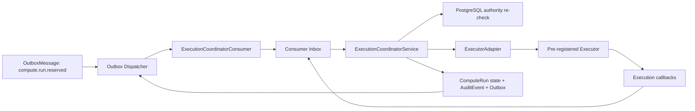
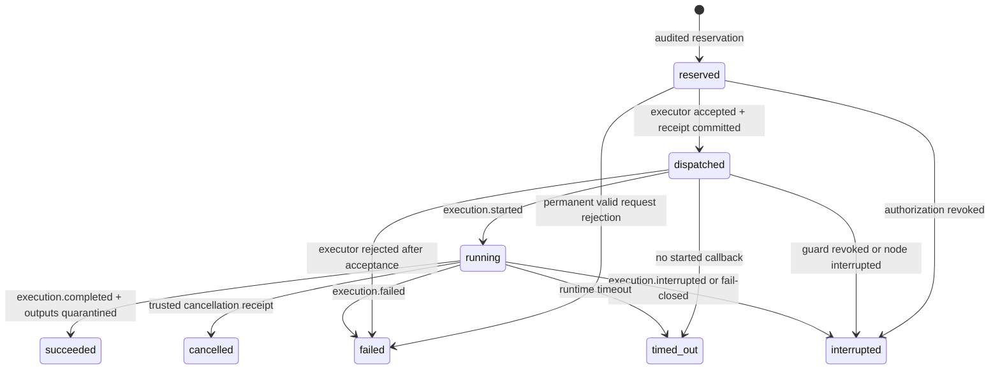
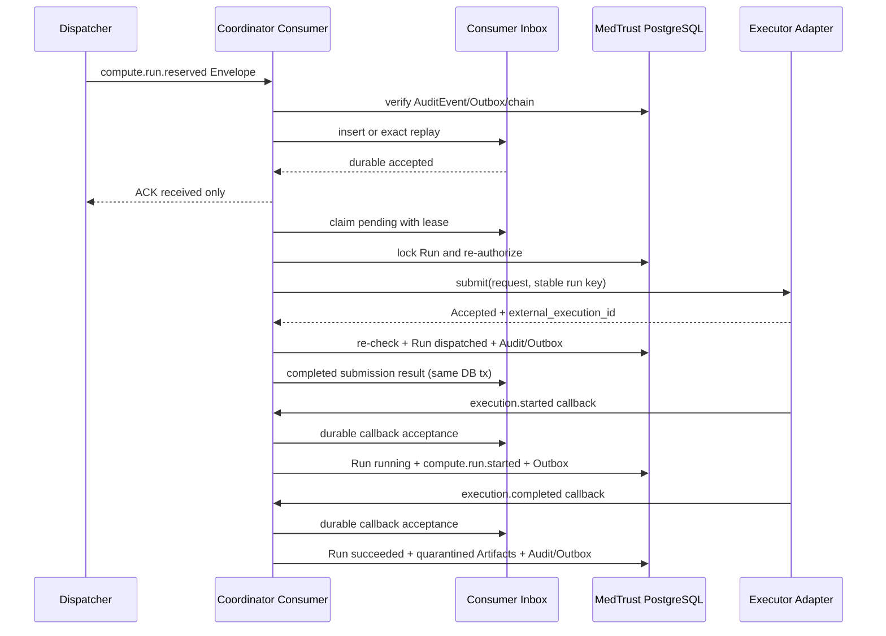

# Phase 2-B.8-A Execution Coordinator Protocol & Consumer Design

日期：2026-07-22  
状态：设计完成并通过静态一致性检查（design-only）

## 1. 结论

Execution Coordinator位于可靠消息投递和真实执行器之间。它解释`compute.run.reserved`，重新读取数据库权威状态，构造不可变执行请求，并只向支持幂等提交的预登记Executor提交任务。

本阶段作出三项关键修正：

1. 现有ComputeRun状态机是`reserved -> dispatched -> running`。因此Executor Accepted映射为`dispatched`，Executor Started才映射为`running`，不能直接从reserved跳到running。
2. 通用API幂等键不能表达Consumer租约、外部提交故障窗口和回调去重。下一阶段确有必要新增一张专用`consumer_inbox_entries`表，作为第37张实表；不再同时机械增加通用`idempotency_keys`表。
3. 当前Audit事件目录缺少`compute.run.dispatched`。Executor Accepted形成权威状态变化时，必须新增这一事件，不能用reserved或started事件冒充。

本轮不生成ORM、migration、Consumer、Executor、API或模型运行代码。Alembic head保持`20260722_0015`，实表保持36张。

## 2. 组件与职责

| 组件 | 负责 | 明确不负责 |
|---|---|---|
| Outbox Dispatcher | 至少一次投递、租约、重试、ACK后标记published | 解释Compute业务、调用Executor、改变Run状态 |
| ExecutionCoordinatorConsumer | 验证Envelope并把接收事实持久写入Inbox，提交后返回Dispatcher ACK | 把收到消息解释为模型已启动 |
| ExecutionCoordinatorService | 领取Inbox、重新授权、构造ExecutionRequest、协调提交和回执落库 | 训练模型、读取WSI、扩大Contract范围 |
| ExecutorAdapter | 提交、按幂等键查询、查询状态、取消 | 决定授权、读取平台数据库、审批Artifact |
| Executor | 在受控环境运行平台预登记算法 | 扩大输入/输出、签发平台审计结论 |
| Callback Consumer | 持久接收并幂等处理执行回调 | 绕过Run状态机或直接发布Artifact |

### 2.1 架构图



Consumer返回Dispatcher ACK的条件是“Inbox接收事实已提交”，不是“Executor已接受”或“模型已启动”。

## 3. 输入事件与Envelope验证

首期Consumer只接受：

```text
topic       = medtrust.compute.dispatch.v1
destination = compute.dispatch
event_type  = compute.run.reserved
subject_type = compute_run
```

校验顺序：

1. 校验message schema和event schema为受支持版本；
2. 校验message/event/Space/Subject/Correlation/Causation标识格式；
3. 对payload执行canonical JSON并复算`payload_digest`；
4. 按`event_id`重新读取AuditEvent；
5. 核对event type、subject、Space、event digest和evidence digest；
6. 验证对应Space的审计链；
7. 核对OutboxMessage确实属于该AuditEvent和compute.dispatch目标；
8. 将接收事实写入Consumer Inbox并提交；
9. 只有提交成功才向Dispatcher返回ACK。

当前`OutboxEnvelope.schema_version`表达消息Envelope版本。实现前需把协议字段明确为：

```text
message_schema_version
event_schema_version
```

这是消息值对象的兼容扩展，不需要数据库字段变更，因为两个版本已存在于Outbox/Audit记录中。

Envelope只用于定位与完整性校验。即使Envelope完全有效，也不能直接据此启动执行。

## 4. Consumer ACK、Accepted与Started

| 层级 | 权威含义 | ComputeRun变化 | Audit事件 |
|---|---|---|---|
| Dispatcher ACK | Consumer Inbox已持久接收消息 | 不变化，仍reserved | 无新的Compute事件 |
| Executor Accepted | Executor以稳定幂等键接受请求并返回同一external_execution_id | reserved -> dispatched | `compute.run.dispatched`（需新增） |
| Executor Started | Executor确认运行环境和算法进程实际启动 | dispatched -> running | `compute.run.started` |

`submit()`返回Accepted不能直接推进running。Accepted写回事务必须同时完成：

```text
ComputeRun -> dispatched
+ execution_reference = external_execution_id
+ dispatch_receipt_digest
+ dispatched_at
+ compute.run.dispatched AuditEvent
+ required OutboxMessage
+ Consumer Inbox completed result
```

任何一项失败，数据库事务回滚。外部Executor若已接受，下一次处理必须使用相同提交幂等键恢复同一receipt。

## 5. 启动前重新授权

Coordinator处理Inbox时必须锁定Consumer Inbox和ComputeRun，并重新读取：

- Run仍为`reserved`，或已是同一提交产生的`dispatched`；
- Job、Run、Space、ContractObject复合关系一致；
- ContractRevision仍为`active`；
- 当前时间仍在合同有效窗口；
- Revision content digest与Job冻结证据一致；
- Policy和Constraint仍有效，deny优先且默认拒绝；
- compute、egress、audit Binding未撤销；
- Connector身份有效且在线；
- required Capability仍为`verified`；
- Capability code和version精确匹配；
- DataProductVersion、Provider、Requester和SpaceParticipant仍有效；
- run_count reservation ordinal和quota digest仍有效；
- `compute.run.reserved` AuditEvent、Outbox目标和Space审计链有效；
- 当前没有治理hold、暂停或终止条件。

外部调用前完成一次评估；Executor返回Accepted后、写入dispatched前再做一次轻量当前有效性检查。这样可以覆盖授权检查与外部接受之间发生的撤销。

### 5.1 失败处理

- Envelope无法信任：不调用Executor，不改变Run；Inbox dead-letter并报警。
- 已确认Run但授权撤销：不调用Executor；Run从reserved进入interrupted，并同事务写`compute.run.interrupted`证据。
- Executor临时不可用：Run保持reserved，Inbox按退避重试。
- 请求本身在冻结规则下永久无效：Run可进入failed并写明确的request-rejected证据；普通投递失败不能走该路径。

## 6. ExecutionRequest

ExecutionRequest是由权威数据库状态合成的不可变值对象，不是用户提交表单，也不是Connector访问凭据。

```text
execution_request_schema = medtrust-execution-request/v1
run_id
job_id
space_id
contract_revision_id
contract_object_id
policy_digest
constraint_digest
binding_id
connector_id
algorithm_spec_snapshot
algorithm_digest
compute_input_snapshot
input_digest
execution_environment_snapshot
resource_limits
callback_correlation_id
submission_idempotency_key
request_digest
```

### 6.1 构造规则

- `algorithm_spec_snapshot`和digest必须来自ComputeJob冻结值；
- `compute_input_snapshot`必须是ContractObject和DataProductVersion解析出的逻辑清单，不得盲目复制潜在路径；
- `resource_limits`由Policy Constraint合成，用户不能覆盖；
- `binding_id`和`connector_id`来自当前已验证的controlled-compute Binding；
- `submission_idempotency_key`固定为`medtrust:compute-run:<run_id>`或其稳定SHA-256形式；
- `request_digest`对完整allowlist请求执行canonical JSON + SHA-256；
- 同一Run的请求digest不得随重试变化。

### 6.2 禁止字段

不得包含：

- 患者姓名、住院号、身份证、病理号；
- 真实WSI/PACS/LIS/EMR路径；
- Connector账号、密码或长期令牌；
- MinIO access/secret key或预签名下载地址；
- 数据库连接串；
- 执行环境私钥；
- 超出ContractObject的数据资源标识。

Executor通过受控Connector按逻辑标识解析输入；平台不把医院文件路径直接发送给Executor。

## 7. Consumer Inbox：持久化幂等

### 7.1 选择结论

下一阶段建议新增专用：

```text
consumer_inbox_entries
```

它有真实业务必要性，将成为第37张实表。暂不同时创建通用`idempotency_keys`：后者适合API命令结果复用，但不足以表达Consumer lease、外部提交结果、callback去重和崩溃恢复。两个平行表会导致幂等事实边界重叠。

### 7.2 统一处理两类输入

Inbox支持：

```text
source_kind = audit_event
source_id   = event_id
```

以及：

```text
source_kind = executor_callback
source_id   = callback_id
```

建议唯一约束：

```text
UNIQUE (consumer_name, source_kind, source_id)
```

对`compute.run.reserved`，这等价于要求的`consumer_name + event_id`唯一。

### 7.3 候选字段

| 字段组 | 字段 |
|---|---|
| 身份 | id, consumer_name, source_kind, source_id, event_type |
| 作用域 | space_id, compute_run_id, audit_event_id（可空） |
| 完整性 | payload_snapshot, payload_digest, schema_version |
| 处理 | status, attempt_count, available_at, locked_at, lock_owner, lease_expires_at |
| 结果 | result_snapshot, result_digest, last_error |
| 时间 | received_at, completed_at, created_at, updated_at, row_version |

状态只表达消费处理，不复制ComputeRun状态：

```text
pending -> processing -> completed
                     -> dead_letter
```

- completed后不可修改处理结果；
- exact duplicate返回既有结果；
- 相同source ID但payload digest不同报`IdempotencyConflict`；
- processing具有租约，过期可被其他Coordinator接管；
- dead-letter不自动重放，必须人工诊断后使用受审计的redrive命令。

`payload_snapshot`采用条件边界：Audit事件来源不复制完整Outbox payload，只保存`audit_event_id + payload_digest`并处理时重读权威Audit/Outbox；Executor Callback来源必须保存经过allowlist清洗的回调快照，否则外部回调事实会在ACK后丢失。两类来源都不得保存敏感路径或凭据。

## 8. Executor提交幂等

Consumer Inbox不能单独覆盖以下窗口：

```text
Executor已接受
→ Consumer尚未写回dispatched
→ Consumer崩溃
```

因此所有可用ExecutorAdapter必须承诺：

1. 同一`submission_idempotency_key + request_digest`返回同一`external_execution_id`；
2. 同一key但不同digest立即拒绝；
3. 幂等记录跨进程、跨重启有效；
4. 支持按submission key查询，以覆盖网络超时后未知结果；
5. 不支持该能力的Executor不能注册为MedTrust可执行节点。

### 8.1 ExecutorAdapter协议

```text
submit(request) -> ExecutionSubmissionReceipt
lookup_submission(submission_idempotency_key) -> ExecutionSubmissionReceipt | None
get_status(external_execution_id) -> ExecutionStatus
cancel(external_execution_id, cancellation_idempotency_key) -> CancellationReceipt
```

`lookup_submission`是必要接口；只有`get_status(external_execution_id)`无法处理“Executor已接受但调用方没有拿到external ID”的超时窗口。

SubmissionReceipt至少包含：

```text
accepted
external_execution_id
accepted_at
request_digest
retryable
error_code
receipt_digest
```

本阶段不绑定Docker、Kubernetes或云平台。普通Docker未来只能称为原型隔离环境，不能宣称生产级安全沙箱。

## 9. 故障窗口

| 故障窗口 | 恢复方式 | Run状态 |
|---|---|---|
| Executor接受后Consumer崩溃 | Inbox租约接管；按submission key查询/重提同一digest，获得同一external ID | reserved，直到receipt事务提交 |
| submit网络超时 | lookup_submission；未知时只用同一key重试 | reserved |
| Executor ACK后数据库事务失败 | 重试同一key；再写dispatched + Audit + Inbox result | reserved |
| Dispatcher重复投递 | exact Inbox记录返回durable ACK | 不重复提交 |
| Inbox processing租约过期 | 新Coordinator接管并先reconcile，再决定是否submit | 不变 |
| Accepted后授权被撤销 | 尝试幂等cancel；Run interrupted并留证 | interrupted |
| Started回调先于Accepted落库 | 回调先持久进Inbox，等待Run进入dispatched后处理 | reserved/dispatched，不跳状态 |

整个方案提供“至少一次消息 + 幂等副作用”，不宣称分布式exactly-once。

## 10. 执行回调协议

支持四类回调：

```text
execution.started
execution.completed
execution.failed
execution.interrupted
```

通用字段：

```text
callback_schema_version
callback_id
run_id
external_execution_id
callback_type
occurred_at
payload_snapshot
payload_digest
execution_evidence_digest
correlation_id
idempotency_key
executor_identity
```

回调进入相同Consumer Inbox，以`consumer_name + executor_callback + callback_id`去重。必须验证：

- Executor身份与Run选定Adapter/Connector一致；
- external_execution_id等于Run.execution_reference；
- payload digest和执行证据digest有效；
- callback的Run状态前置条件满足；
- 同callback ID不同payload拒绝；
- 同一终态的语义重复返回既有结果；
- 乱序回调先持久保存，满足前置状态后再处理，不跳过状态。

### 10.1 started

前置：Run=`dispatched`。同一事务：

```text
Run -> running
Job -> running
start_receipt_digest + started_at
compute.run.started AuditEvent
required OutboxMessage
Inbox -> completed
```

### 10.2 completed

前置：Run=`running`。Payload仅允许：输出清单、内容摘要、资源使用摘要、结束时间和执行证据摘要，不允许完整日志、敏感路径或访问令牌。

当前授权仍有效时，同一事务：

```text
Run -> succeeded
Job -> succeeded
completion_receipt_digest + finished_at
compute.run.completed AuditEvent
Artifact(s) created as quarantined
artifact.created AuditEvent(s) + OutboxMessage(s)
Inbox -> completed
```

回调名称为completed，但现有Run终态名称是`succeeded`；不新增`completed`状态。

如果运行期间授权被撤销，平台记录真实回调证据，但业务Run进入`interrupted`，输出保持隔离并不得注册为可发布Artifact。

### 10.3 failed

可信Executor明确报告执行失败时，Run/Job进入failed，保存清洗后的failure code和receipt digest，并同事务写`compute.run.failed`。不得保存完整堆栈中的路径、凭据或患者内容。

Dispatcher超时、Consumer数据库错误或Publisher失败不是模型执行失败，不能生成该事件。

### 10.4 interrupted

用于Connector失联、合同暂停/终止、能力撤销、执行节点中断或平台主动fail-closed。Run/Job进入interrupted并写`compute.run.interrupted`。不得生成released Artifact。

## 11. 状态映射



Executor Accepted不等于running；消息接收更不等于Accepted。没有Executor时，Run最多停留在reserved。

## 12. Consumer错误分类

| 错误 | 重试 | Inbox | Run | 人工调查 |
|---|---|---|---|---|
| MessageValidationError | 否 | dead_letter | 不变 | 是，安全级 |
| AuthorizationRevoked | 否 | completed（interrupted结果） | interrupted | 视规则 |
| ExecutorUnavailable | 是，退避 | pending | reserved | 超阈值后 |
| SubmissionUnknown | 是，先reconcile | processing/pending | reserved | 长时间未知时必须 |
| IdempotencyConflict | 否 | dead_letter | 不变 | 是，高优先级 |
| NonRetryableExecutionRequest | 否 | completed（failed结果） | failed | 是 |
| DatabaseTransactionFailure | 是 | 租约接管 | 保持已提交状态 | 多次失败时 |

基础设施失败不得伪装成`compute.run.failed`。只有经过可信身份验证的Executor失败回调，或权威规则判定请求永久不可执行，才能形成Run failed事实。

## 13. 安全边界

- Consumer和Coordinator日志只记录event/callback/run/external execution ID、状态和清洗后的error code；
- 不打印完整ExecutionRequest、Evidence、Callback Payload或算法输入；
- Executor只接收ContractObject逻辑范围，不能解析其他数据产品；
- Connector解析逻辑输入时再次校验Binding、Capability和Run；
- 短期访问材料只能由受控节点按需生成，不进入ExecutionRequest、Inbox或Audit；
- Executor不能扩大Action、资源范围、运行次数或输出类型；
- 所有输出先进入隔离区并生成quarantined Artifact；
- Executor和Coordinator都不能生成ArtifactReview决定或外部下载链接；
- Docker仅是未来原型实现选择，不等于隐私计算或生产安全沙箱。

## 14. 最小数据库影响评估

下一实现阶段需要数据库冻结，但本阶段不创建migration。

### 14.1 必需新增

1. `consumer_inbox_entries`：第37张实表，承载跨进程Consumer/Callback幂等、lease与处理结果。
2. Audit事件词表增加`compute.run.dispatched`，subject=`compute_run`，result=`success`。
3. `compute.run.dispatched`至少生成`audit.timeline` Outbox，不再次发送到`compute.dispatch`，避免循环。
4. 替换0015保留的真实执行硬门：分别要求dispatched/running/succeeded/failed/interrupted状态变化在同一事务具有匹配AuditEvent/Outbox证据。

### 14.2 现有字段足够

ComputeRun已存在：

- `execution_reference`：冻结为external_execution_id；
- `dispatch_receipt_digest`；
- `start_receipt_digest`；
- `completion_receipt_digest`；
- `dispatched_at`、`started_at`、`finished_at`；
- `failure_code`、`interruption_code`。

因此当前不需要新增ExecutionSubmission或ExecutionCallback业务表。提交与回调的幂等接收证据统一进入Consumer Inbox，Run继续是执行状态真相源。

### 14.3 暂不新增

- 通用`idempotency_keys`；
- ExecutionRequest表；
- ExecutionSubmissionReceipt表；
- Executor目录表；
- Callback历史平行状态表；
- Docker/Kubernetes配置表。

## 15. 顺序图



## 16. 实现前冻结事项

进入Phase 2-B.8-B前必须完成数据库冻结：

1. Consumer Inbox字段、状态、唯一键、lease、redrive和删除策略；
2. Inbox是否同时承载Audit事件与Executor Callback（本设计建议是）；
3. `compute.run.dispatched`事件schema、evidence和Outbox目标；
4. ExecutionRequest canonicalization和digest测试向量；
5. submission key格式及Executor持久幂等能力认证方式；
6. Accepted后授权撤销时的cancel与interrupted事务顺序；
7. callback乱序、重复和冲突处理；
8. completed事务中多Artifact创建和多AuditEvent链序号；
9. 0015真实执行硬门的增量替换策略，不修改历史migration；
10. Inbox数据保留期：completed/dead-letter不能被普通业务删除。

## 17. 后续顺序与验收

建议顺序：

```text
Phase 2-B.8-B1  Consumer Inbox数据库冻结
Phase 2-B.8-B2  Consumer Inbox + Coordinator实现
Phase 2-B.8-C   FakeExecutor + Accepted/Callback闭环
Phase 2-B.8-D   Local Built-in Executor
Phase 2-B.8-E   公开数据与预登记模型冒烟测试
```

本阶段完成后仍不能运行病理模型。第一次公开数据测试必须等到：

- Inbox持久幂等已落库；
- Executor提交幂等通过故障注入；
- started/completed/failed/interrupted回调同事务Audit已验证；
- 输出固定进入quarantined Artifact；
- Artifact release仍受独立审核和发布执行器控制。
