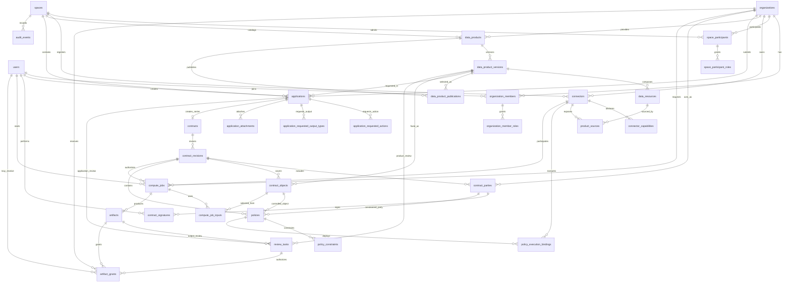
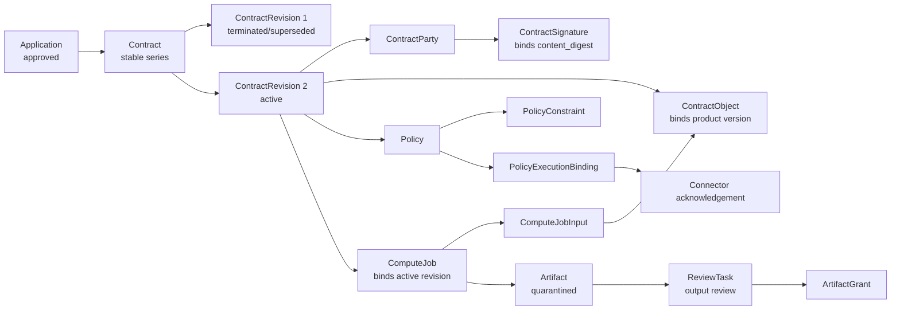

# MedTrust Space Phase 2-A.6 PostgreSQL 数据库设计冻结评审 v2

文档版本：v0.2.1  
日期：2026-07-22  
状态：数据库逻辑设计已冻结，Catalog ORM 前置基线  
上游文档：`docs/Phase2-domain-model.md`、`docs/Phase2-B2-catalog-model.md`  
范围：表、字段、主外键、约束、索引、删除策略、ER 图与设计审查；不包含 SQL、ORM、Alembic 或后端代码。

## 0. 冻结结论

Phase 2-A 的领域方向成立，但不能直接把每个领域对象机械映射成一张表。数据库评审后确定以下关键调整：

1. `User` 不从属于单一 `Organization`；二者通过 `organization_members` 和成员角色表关联。
2. `DataProduct` 属于提供方组织，不属于 Connector；`DataProductVersion` 由一个或多个 `DataResource` 构成，资源再通过 `product_sources` 映射来源 Connector。
3. 默认使用策略是 DataProductVersion 内不可变 JSONB 快照和摘要，不是可直接执行的 Contract Policy，也不引用可变共享模板。
4. 不在 `data_products` 中保存 `current_version_id`，避免 Product ↔ Version 循环外键；当前目录版本由 `data_product_publications` 表表达。
5. `Contract` 拆成稳定身份 `contracts` 与不可变内容 `contract_revisions`；签署、标的和 Policy 均绑定具体 revision。
6. `ComputeJob` 固定引用已激活的 `contract_revision_id`，不只引用一个会继续变化的逻辑 Contract。
7. 任务输入通过 `compute_job_inputs` 引用合约标的，不重复保存产品名称和版本号。
8. `Artifact` 与发布授权分离；`artifact_grants` 记录谁可以在何时查看哪个已审制品。
9. `ReviewTask` 保留统一工作项，但使用三个真实外键并以“恰好一个非空”约束绑定产品版本、申请或制品，不采用无外键的通用 `target_type + target_id`。
10. `AuditEvent` 的对象引用保留逻辑多态，不设置业务对象外键，使证据在业务对象停用或未来归档后仍可保留。
11. 所有业务状态由后端显式命令推进；数据库约束负责行内合法性和引用完整性，跨表状态规则由事务内领域服务负责。

冻结后的主链：

```text
Organization + User + Membership
            ↓
Space + SpaceParticipant
            ↓
Connector
            ↓
DataProduct + Version + DataResource + Source + Publication
            ↓
Application + ReviewTask
            ↓
Contract + ContractRevision + Policy
            ↓
ComputeJob + ComputeJobInput
            ↓
Artifact + ReviewTask + ArtifactGrant
            ↓
AuditEvent + OutboxEvent
```

本设计支持：

- 多医院和多类型组织；
- 一个用户加入多个组织；
- 一个组织在不同空间承担不同角色；
- 多空间、多产品和多产品版本；
- 同时存在多个申请、合约、任务和制品；
- 产品和合约的不可变版本追溯；
- 多连接器来源和策略执行；
- 结果默认隔离、审核后定向发布；
- 追加式审计和可靠事件投递。

### 0.1 相对 v1 的结构变更

| 变更类型 | 对象 | v2 决定 |
|---|---|---|
| 新增表 | `data_resources` | 新增版本内逻辑资源层；总表数 33 → 34。 |
| 删除表 | 无 | 保留原有 33 张表，Publication 不删除。 |
| 关系变化 | `product_sources` | 父对象从 DataProductVersion 改为 DataResource。 |
| 字段新增 | `data_products.description` | 增加非版本化目录说明。 |
| 字段替换 | DataProductVersion | 删除版本级 `schema_metadata`，详细结构下沉 DataResource；新增 `linkage_metadata`。 |
| 字段替换 | DataProductVersion | `default_policy_template_ref` 改为 `default_policy_template jsonb + default_policy_digest`。 |
| 字段新增 | Application | 增加 `requested_product_snapshot_digest` 固定提交时证据。 |
| 保持不变 | DataProductPublication | 继续独立表达当前目录版本并保留产品-版本复合 FK。 |
| 保持不变 | ContractObject | 继续保存明确 version FK、名称快照和 `product_snapshot_digest`。 |
| 保持不变 | ComputeJobInput | 继续通过 ContractObject 间接固定 version，并保存 `input_snapshot_digest`。 |

本表是 v2 与 v1 的唯一结构差异清单。未列出的表继续沿用 v1 字段与约束，但以本文重新汇总的 34 表清单和跨表不变量为最高优先级。

### 0.2 Catalog ORM 前冻结补充

Phase 2-B.2.3-A 复核没有改变五表边界或 34 表总数，但补强了两类可由 PostgreSQL 低成本阻止的歧义：

1. `DataProductVersion.version_label` 在同一产品内唯一，避免两个不同版本同时显示为 `v1.0`。
2. `DataProduct → Version → Resource → Publication` 的冗余 `space_id` 通过复合候选键和复合外键闭合，不再只依赖领域服务检查父子对象是否同空间；`Application → Version` 同步采用同空间复合外键。

父对象引用由复合 FK 单独承担，不再对同一父 ID 叠加单列 FK；各表可继续直接引用 `spaces.id`。这样既避免 ORM 重复关系路径，也不削弱租户完整性。

`ProductSource → Connector` 的同空间、参与资格和能力匹配仍由领域服务校验。若为该关系重复增加 `space_id`，会扩大组成表并制造额外一致性写入点，当前收益不足。

---

## 1. PostgreSQL 设计基线

### 1.1 数据库与命名

| 项目 | 冻结决定 |
|---|---|
| 数据库 | PostgreSQL；逻辑设计不依赖某个最新版本专属功能，Phase 2-B 冻结容器镜像版本。 |
| Schema | 使用单一业务 schema `medtrust`；模块边界由代码包和表所有权维护，不为每个模块创建数据库 schema。 |
| 命名 | 表和字段使用 `snake_case`；表名使用复数。 |
| 主键 | 所有业务表使用 `uuid`；由应用生成不可枚举 ID。 |
| 业务编号 | 产品编号、申请编号、合约编号、任务编号作为独立可读字段，不能代替主键。 |
| 时间 | 一律使用 `timestamptz`；展示时再转换用户时区。 |
| 状态 | 使用 `text/varchar + CHECK`，暂不使用 PostgreSQL 原生 ENUM，降低增加状态时的迁移成本。 |
| 扩展结构 | `jsonb` 只保存扩展元数据、质量报告和能力声明；核心权限与查询字段关系化。 |
| 摘要 | 使用带算法前缀的 `text`，例如 `sha256:...`，不把算法固定在列类型中。 |
| 金额 | Phase 2-B 不涉及交易清算；不预建金额字段。 |
| 删除 | 业务生命周期优先使用状态，不给所有表统一添加 `deleted_at`。 |
| 并发 | 可变聚合根使用 `row_version integer` 做乐观锁。 |
| 演示标识 | 组织、空间、产品等种子对象保留 `is_demo boolean`。 |

### 1.2 通用列

可变聚合根通常包含：

| 字段 | 类型 | 约束/说明 |
|---|---|---|
| `id` | uuid | PK。 |
| `created_at` | timestamptz | NOT NULL。 |
| `created_by` | uuid | FK → users.id；系统动作可为空。 |
| `updated_at` | timestamptz | NOT NULL。 |
| `row_version` | integer | NOT NULL，默认 1，每次更新递增。 |
| `is_demo` | boolean | NOT NULL，默认 false；仅适用需要区分演示数据的根对象。 |

不可变快照和事件表不使用通用 `updated_at`；它们只记录创建、签署、发生或失效时间。

### 1.3 多空间隔离

- `Connector`、产品、申请、合约、任务、制品、审计等空间级聚合根均直接保存 `space_id`。
- 纯组成表从父表推导 `space_id`，不无条件复制租户键。
- 跨对象命令在同一事务中验证所有对象属于同一空间。
- Phase 2-B 可以为核心表增加 PostgreSQL RLS 作为纵深防御，但 RLS 不能替代应用层权限和跨对象测试。
- 初期不采用复合主键 `(space_id, id)`，避免所有 ORM 关系被迫使用复合键；UUID 保证全局唯一。

### 1.4 索引原则

1. PK 和 UNIQUE 约束产生的索引不重复创建。
2. PostgreSQL 不会自动索引外键引用列，因此每个高频 FK 都需要显式索引。
3. 工作队列使用部分索引，例如只索引 `pending/claimed` ReviewTask。
4. “每个产品仅一个当前发布”“每个 Contract 仅一个活动 revision”使用部分唯一索引。
5. 多列 B-tree 索引按真实过滤顺序设计，通常以 `space_id` 开头。
6. 不预先给所有 JSONB 建 GIN；只有查询被确认后才增加。
7. `audit_events` 初期不分区；达到真实规模和保留需求后再基于 `occurred_at` 评估。

---

## 2. 表总览与模块归属

冻结设计共 34 张业务及基础支撑表。

| 模块 | 表 |
|---|---|
| Identity | `organizations`、`users`、`organization_members`、`organization_member_roles` |
| Spaces | `spaces`、`space_participants`、`space_participant_roles` |
| Connectors | `connectors`、`connector_capabilities` |
| Catalog | `data_products`、`data_product_versions`、`data_resources`、`product_sources`、`data_product_publications` |
| Applications | `applications`、`application_requested_actions`、`application_requested_output_types`、`application_attachments` |
| Reviews | `review_tasks` |
| Contracts | `contracts`、`contract_revisions`、`contract_parties`、`contract_signatures`、`contract_objects`、`policies`、`policy_constraints`、`policy_execution_bindings` |
| Compute | `compute_jobs`、`compute_job_inputs`、`artifacts`、`artifact_grants` |
| Audit | `audit_events`、`outbox_events` |
| Platform | `idempotency_keys` |

`Reviews` 是模块化单体中的小型共享工作流模块。将产品上架、申请审批和结果出域全部塞进 Applications 模块会造成反向依赖；独立 Reviews 模块更清晰，但不需要拆成微服务。

---

## 3. Identity 表设计

### 3.1 organizations

组织是法律或业务主体，不等同于空间角色。

| 字段 | 类型 | 键/约束 | 说明 |
|---|---|---|---|
| `id` | uuid | PK | 组织 ID。 |
| `legal_name` | text | NOT NULL | 法定或演示名称。 |
| `display_name` | text | NOT NULL | 展示名称。 |
| `organization_type` | text | CHECK | hospital、research_institute、ai_company、service_provider、operator。 |
| `verification_status` | text | CHECK | unverified、pending、verified、failed。 |
| `status` | text | CHECK | active、suspended、withdrawn。 |
| `external_identity_ref` | text | NULL | 外部统一身份标识。 |
| `contact_metadata` | jsonb | NOT NULL，默认 `{}` | 非核心联系元数据；不得存患者数据。 |
| `is_demo` | boolean | NOT NULL | 演示标识。 |
| `created_at/by` | timestamptz/uuid | created_by FK → users.id，可延后添加 | 创建信息。 |
| `updated_at` | timestamptz | NOT NULL | 更新时间。 |
| `row_version` | integer | NOT NULL | 乐观锁。 |

约束与索引：

- UNIQUE：`external_identity_ref`，仅非空值。
- INDEX：`(organization_type, status)`。
- INDEX：`(verification_status, status)`。
- 可选表达式索引：`lower(display_name)`，确认存在模糊/不区分大小写检索后再加。

删除策略：组织不物理删除；使用 `withdrawn`。历史签约主体名称由 ContractParty 快照保留。

### 3.2 users

| 字段 | 类型 | 键/约束 | 说明 |
|---|---|---|---|
| `id` | uuid | PK | 用户 ID。 |
| `identity_issuer` | text | NOT NULL | 身份提供方。 |
| `identity_subject` | text | NOT NULL | 身份提供方内稳定 subject。 |
| `display_name` | text | NOT NULL | 展示姓名。 |
| `email` | text | NULL | 通知地址；不作为唯一身份依据。 |
| `status` | text | CHECK | invited、active、suspended、disabled。 |
| `mfa_status` | text | CHECK | unknown、disabled、enabled。 |
| `last_authenticated_at` | timestamptz | NULL | 最近认证时间。 |
| `is_demo` | boolean | NOT NULL | 演示标识。 |
| `created_at` | timestamptz | NOT NULL | 创建时间。 |
| `updated_at` | timestamptz | NOT NULL | 更新时间。 |
| `row_version` | integer | NOT NULL | 乐观锁。 |

约束与索引：

- UNIQUE：`(identity_issuer, identity_subject)`。
- INDEX：`lower(email)`，仅 `email IS NOT NULL`，用于查找而非身份唯一性。
- INDEX：`(status, last_authenticated_at)`。

删除策略：用户不物理删除；禁用后保留历史主体 ID。

### 3.3 organization_members

| 字段 | 类型 | 键/约束 | 说明 |
|---|---|---|---|
| `id` | uuid | PK | 成员关系 ID。 |
| `organization_id` | uuid | FK → organizations.id，RESTRICT | 组织。 |
| `user_id` | uuid | FK → users.id，RESTRICT | 用户。 |
| `status` | text | CHECK | invited、active、suspended、removed。 |
| `valid_from` | timestamptz | NULL | 生效时间。 |
| `valid_until` | timestamptz | NULL | 失效时间。 |
| `created_at/by` | timestamptz/uuid | created_by FK → users.id | 创建信息。 |
| `updated_at` | timestamptz | NOT NULL | 更新时间。 |
| `row_version` | integer | NOT NULL | 乐观锁。 |

约束与索引：

- UNIQUE：`(organization_id, user_id)`。
- CHECK：`valid_until IS NULL OR valid_until > valid_from`。
- INDEX：`(user_id, status)`，用于查用户可切换组织。
- INDEX：`(organization_id, status)`，用于组织成员列表。

### 3.4 organization_member_roles

| 字段 | 类型 | 键/约束 | 说明 |
|---|---|---|---|
| `organization_member_id` | uuid | FK → organization_members.id，CASCADE | 成员关系。 |
| `role_code` | text | CHECK/角色目录 | provider_data_admin、contract_signer 等。 |
| `granted_at/by` | timestamptz/uuid | granted_by FK → users.id | 授予信息。 |

主键与索引：

- PK：`(organization_member_id, role_code)`。
- INDEX：`(role_code, organization_member_id)`，用于权限反查。

删除策略：成员关系物理删除仅允许未激活邀请；已参与业务后用 `removed`，角色撤销可物理删除关系行并记录 AuditEvent。

---

## 4. Spaces 表设计

### 4.1 spaces

| 字段 | 类型 | 键/约束 | 说明 |
|---|---|---|---|
| `id` | uuid | PK | 空间 ID。 |
| `code` | text | UNIQUE，NOT NULL | 稳定空间编码。 |
| `name` | text | NOT NULL | 空间名称。 |
| `space_type` | text | CHECK | industry、enterprise、city。 |
| `operator_organization_id` | uuid | FK → organizations.id，RESTRICT | 运营主体。 |
| `status` | text | CHECK | draft、active、suspended、closed。 |
| `ruleset_version` | text | NOT NULL | 当前共识规则版本。 |
| `classification_scheme_version` | text | NOT NULL | 分类分级规则版本。 |
| `default_retention_policy` | jsonb | NOT NULL | 默认保留规则；结构需应用校验。 |
| `is_demo` | boolean | NOT NULL | 演示标识。 |
| 通用审计列 | - | - | created/updated/row_version。 |

索引：

- UNIQUE：`code`。
- INDEX：`(operator_organization_id, status)`。
- INDEX：`(space_type, status)`。

删除策略：空间不物理删除；使用 `closed`。

### 4.2 space_participants

组织加入空间的关系；角色不放在 organizations 上。

| 字段 | 类型 | 键/约束 | 说明 |
|---|---|---|---|
| `id` | uuid | PK | 参与关系 ID。 |
| `space_id` | uuid | FK → spaces.id，RESTRICT | 空间。 |
| `organization_id` | uuid | FK → organizations.id，RESTRICT | 组织。 |
| `admission_status` | text | CHECK | applied、reviewing、admitted、rejected、suspended、exited。 |
| `ruleset_accepted_version` | text | NULL | 已接受规则版本。 |
| `admitted_at` | timestamptz | NULL | 准入时间。 |
| `suspended_at` | timestamptz | NULL | 暂停时间。 |
| 通用审计列 | - | - | created/updated/row_version。 |

约束与索引：

- UNIQUE：`(space_id, organization_id)`。
- INDEX：`(organization_id, admission_status)`。
- 部分 INDEX：`(space_id, admitted_at)` WHERE `admission_status='admitted'`。

### 4.3 space_participant_roles

| 字段 | 类型 | 键/约束 | 说明 |
|---|---|---|---|
| `space_participant_id` | uuid | FK → space_participants.id，CASCADE | 参与关系。 |
| `role_code` | text | CHECK/角色目录 | provider、consumer、service_provider、operator。 |
| `granted_at/by` | timestamptz/uuid | granted_by FK → users.id | 授予信息。 |

主键与索引：

- PK：`(space_participant_id, role_code)`。
- INDEX：`(role_code, space_participant_id)`。

---

## 5. Connectors 表设计

### 5.1 connectors

身份核验状态与运行状态必须分列。

| 字段 | 类型 | 键/约束 | 说明 |
|---|---|---|---|
| `id` | uuid | PK | 平台连接器 ID。 |
| `space_id` | uuid | FK → spaces.id，RESTRICT | 注册空间。 |
| `owner_organization_id` | uuid | FK → organizations.id，RESTRICT | 所有组织。 |
| `external_connector_id` | text | NULL | 外部基础设施标识。 |
| `name` | text | NOT NULL | 连接器名称。 |
| `verification_status` | text | CHECK | pending、verified、failed、revoked。 |
| `runtime_status` | text | CHECK | unknown、online、degraded、offline、maintenance。 |
| `endpoint_metadata` | jsonb | NOT NULL | 协议和地址元数据；不存私钥。 |
| `certificate_fingerprint` | text | NULL | 凭证指纹。 |
| `last_heartbeat_at` | timestamptz | NULL | 最近心跳。 |
| `last_policy_ack_at` | timestamptz | NULL | 最近策略回执。 |
| `is_demo` | boolean | NOT NULL | 演示标识。 |
| 通用审计列 | - | - | created/updated/row_version。 |

约束与索引：

- UNIQUE：`(space_id, external_connector_id)`，仅 external ID 非空。
- UNIQUE：`(space_id, owner_organization_id, name)`。
- INDEX：`(space_id, verification_status, runtime_status)`。
- INDEX：`(owner_organization_id, runtime_status)`。
- 部分 INDEX：`(space_id, last_heartbeat_at)` WHERE `runtime_status IN ('degraded','offline')`。

跨表不变量：owner organization 必须是该 Space 的有效 participant，由领域服务校验。

### 5.2 connector_capabilities

能力需要被查询和策略匹配，不只放在 JSONB 数组里。

| 字段 | 类型 | 键/约束 | 说明 |
|---|---|---|---|
| `connector_id` | uuid | FK → connectors.id，CASCADE | 连接器。 |
| `capability_code` | text | NOT NULL | product_publish、policy_execute、compute 等。 |
| `capability_version` | text | NOT NULL | 能力版本。 |
| `status` | text | CHECK | declared、verified、disabled。 |
| `parameters` | jsonb | NOT NULL | 非核心扩展参数。 |
| `verified_at` | timestamptz | NULL | 核验时间。 |

主键与索引：

- PK：`(connector_id, capability_code, capability_version)`。
- INDEX：`(capability_code, status, connector_id)`，用于能力匹配。

---

## 6. Catalog 表设计

### 6.1 data_products

逻辑产品身份；不保存当前版本外键。

| 字段 | 类型 | 键/约束 | 说明 |
|---|---|---|---|
| `id` | uuid | PK | 产品 ID。 |
| `space_id` | uuid | FK → spaces.id，RESTRICT | 所属空间。 |
| `provider_organization_id` | uuid | FK → organizations.id，RESTRICT | 产品责任主体。 |
| `product_code` | text | NOT NULL | 空间内稳定业务编码。 |
| `name` | text | NOT NULL | 当前产品展示名称。 |
| `description` | text | NOT NULL | 面向目录发现的非版本化说明。 |
| `product_type` | text | CHECK | controlled_compute、api、file、model_service 等。 |
| `domain` | text | NOT NULL | digital_pathology 等。 |
| `lifecycle_status` | text | CHECK | draft、active、suspended、expired、archived。 |
| `is_demo` | boolean | NOT NULL | 演示标识。 |
| 通用审计列 | - | - | created/updated/row_version。 |

约束与索引：

- UNIQUE：`(space_id, product_code)`。
- UNIQUE：`(space_id, id)`，作为 Version 和 Publication 同空间复合外键的候选键。
- INDEX：`(space_id, lifecycle_status, domain)`。
- INDEX：`(provider_organization_id, lifecycle_status)`。
- 目录全文或模糊搜索索引延后到真实查询确认后。

删除策略：有任何版本后不物理删除。

### 6.2 data_product_versions

已批准版本及其 DataResource、ProductSource 内容不可变。目录“当前发布”由 publication 表决定。

| 字段 | 类型 | 键/约束 | 说明 |
|---|---|---|---|
| `id` | uuid | PK | 版本 ID。 |
| `space_id` | uuid | FK → spaces.id，RESTRICT；参与与 data_product_id 的复合 FK | 冗余租户键，用于查询/RLS；由复合 FK 强制与产品相同。 |
| `data_product_id` | uuid | NOT NULL；与 space_id 组成复合 FK → data_products(space_id, id)，RESTRICT | 逻辑产品；不再重复建立单列父表 FK。 |
| `version_no` | integer | NOT NULL，>0 | 单调版本号。 |
| `version_label` | text | NOT NULL | v1.2 等展示版本。 |
| `status` | text | CHECK | draft、under_review、approved、retired。 |
| `content_summary` | text | NOT NULL | 内容摘要。 |
| `scope_metadata` | jsonb | NOT NULL | 病种、时间和规模摘要，不含患者行。 |
| `linkage_metadata` | jsonb | NOT NULL | 多模态资源匿名关联规则，不含患者标识。 |
| `quality_report` | jsonb | NOT NULL | 质量指标和适用边界。 |
| `classification_level` | text | NOT NULL | 分类分级。 |
| `default_use_mode` | text | NOT NULL | controlled_compute 等。 |
| `default_policy_template` | jsonb | NOT NULL | 提供方默认策略的规范化不可变快照。 |
| `default_policy_digest` | text | NOT NULL | 默认策略快照摘要。 |
| `provenance_summary` | jsonb | NOT NULL | 来源与加工摘要。 |
| `snapshot_digest` | text | NULL | 规范化版本摘要；under_review 起必须存在。 |
| `approved_at/by` | timestamptz/uuid | approved_by FK → users.id | 批准信息。 |
| `created_at/by` | timestamptz/uuid | created_by FK → users.id | 创建信息。 |

约束与索引：

- UNIQUE：`(data_product_id, version_no)`。
- UNIQUE：`(data_product_id, version_label)`，展示版本在产品内不得产生歧义。
- UNIQUE：`(data_product_id, id)`，供 Publication 复合外键验证产品与版本配对。
- UNIQUE：`(space_id, id)`，供 Resource 和 Application 同空间复合外键使用。
- 复合 FK：`(space_id, data_product_id)` → `data_products(space_id, id)`，RESTRICT。
- UNIQUE：`snapshot_digest` 可不全局唯一；建议 `(data_product_id, snapshot_digest)`。
- CHECK：`approved_at` 与 `approved_by` 同时为空或同时非空。
- CHECK：status 为 under_review、approved、retired 时 snapshot_digest、default_policy_digest 不得为空。
- INDEX：`(space_id, status, created_at DESC)`。
- INDEX：`(data_product_id, status, version_no DESC)`。

不可变策略：

- draft 可编辑；under_review 内容锁定。审查要求修改时先执行 under_review → draft，关闭本轮审查结论，再修改并重新生成全部摘要。
- approved/retired 禁止修改版本、资源、来源和策略内容；只允许状态从 approved → retired。
- 数据库实现阶段使用权限隔离或触发器作为纵深防御，领域服务仍是主控制点。

摘要规则：`snapshot_digest` 覆盖版本内容、范围、linkage、质量、分类分级、默认使用模式、`default_policy_digest` 和按稳定顺序排列的全部 `data_resources.resource_digest`。

### 6.3 data_resources

版本内的逻辑资源组件；不是患者、单张切片、单个 DICOM 文件或平台文件对象。

| 字段 | 类型 | 键/约束 | 说明 |
|---|---|---|---|
| `id` | uuid | PK | 资源 ID。 |
| `space_id` | uuid | FK → spaces.id，RESTRICT；参与与 data_product_version_id 的复合 FK | 冗余空间键，由复合 FK 强制与版本一致。 |
| `data_product_version_id` | uuid | NOT NULL；与 space_id 组成复合 FK → data_product_versions(space_id, id)，CASCADE 仅限 draft 清理 | 所属版本；不再重复建立单列父表 FK。 |
| `resource_code` | text | NOT NULL | 版本内稳定组件编码。 |
| `name` | text | NOT NULL | 资源展示名称。 |
| `resource_type` | text | NOT NULL | image_collection、tabular、annotation_set、api_resource 等。 |
| `modality` | text | NOT NULL | wsi、ct、mri、clinical、followup 等。 |
| `format` | text | NOT NULL | DICOM-WSI、DICOM、Parquet、FHIR 等。 |
| `schema_metadata` | jsonb | NOT NULL | 字段、标签、单位、编码体系和结构描述。 |
| `scope_metadata` | jsonb | NOT NULL | 资源级规模、时间和覆盖范围摘要。 |
| `quality_report` | jsonb | NOT NULL | 资源级完整性、缺失、图像质量和标注一致性。 |
| `classification_level` | text | NOT NULL | 资源分类分级。 |
| `resource_digest` | text | NULL | 资源描述和全部来源摘要的规范化摘要。 |
| `position_no` | integer | CHECK >0 | 稳定展示与摘要排序。 |
| `created_at/by` | timestamptz/uuid | created_by FK → users.id | 创建信息。 |

约束与索引：

- UNIQUE：`(data_product_version_id, resource_code)`。
- UNIQUE：`(data_product_version_id, position_no)`。
- UNIQUE：`(data_product_version_id, id)`，供 ProductSource 和未来同父对象复合 FK 使用。
- 复合 FK：`(space_id, data_product_version_id)` → `data_product_versions(space_id, id)`。
- INDEX：`(space_id, data_product_version_id, position_no)`。
- INDEX：`(resource_type, modality, format)`，仅在目录确有资源级过滤需求时启用；V1 可先不建。

跨表不变量：

- DataResource 与 DataProductVersion 必须属于同一 Space。
- 版本进入 under_review 前，每个资源必须存在 `resource_digest` 且至少有一个 ProductSource。
- 版本级 classification_level 不得低于任何资源的分类等级。
- 详细 schema/质量事实以 DataResource 为准，Version 的 quality_report 是汇总，不保存相互竞争的人工副本。

删除策略：仅 draft 版本允许级联清理；under_review、approved、retired 的资源不得物理删除。

### 6.4 product_sources

| 字段 | 类型 | 键/约束 | 说明 |
|---|---|---|---|
| `data_resource_id` | uuid | FK → data_resources.id，CASCADE 仅限 draft 清理 | 版本内逻辑资源。 |
| `connector_id` | uuid | FK → connectors.id，RESTRICT | 来源连接器。 |
| `local_resource_alias` | text | NOT NULL | 连接器本地别名，不是平台路径。 |
| `source_digest` | text | NOT NULL | 来源快照摘要。 |
| `source_role` | text | CHECK | primary、secondary。 |
| `source_snapshot_at` | timestamptz | NOT NULL | 本地来源快照形成时间。 |

主键与索引：

- PK：`(data_resource_id, connector_id, local_resource_alias)`。
- INDEX：`(connector_id, data_resource_id)`。

跨表不变量：资源、版本、产品和 Connector 必须属于同一 Space；Connector 必须属于产品提供方，或属于已准入 provider 且具备明确联合授权。来源变化将改变 resource_digest 和 version snapshot_digest，因此必须生成新版本。

### 6.5 data_product_publications

独立表达“哪个版本当前在目录生效”，消除 `data_products.current_version_id` 循环外键。

| 字段 | 类型 | 键/约束 | 说明 |
|---|---|---|---|
| `id` | uuid | PK | 发布记录 ID。 |
| `space_id` | uuid | FK → spaces.id，RESTRICT；参与与 data_product_id 的复合 FK | 空间。 |
| `data_product_id` | uuid | NOT NULL；与 space_id 组成复合 FK → data_products(space_id, id)，RESTRICT | 产品；不再重复建立单列父表 FK。 |
| `data_product_version_id` | uuid | NOT NULL；与 data_product_id 组成复合 FK → data_product_versions(data_product_id, id)，RESTRICT | 被发布版本，且强制属于同一产品；不再重复建立单列父表 FK。 |
| `status` | text | CHECK | active、withdrawn、expired。 |
| `visibility` | text | CHECK | space、restricted、invitation_only。 |
| `published_at/by` | timestamptz/uuid | published_by FK → users.id | 发布时间。 |
| `withdrawn_at/by` | timestamptz/uuid | withdrawn_by FK → users.id | 撤回信息。 |
| `withdrawal_reason` | text | NULL | 撤回原因。 |

约束与索引：

- 部分 UNIQUE：`data_product_id` WHERE `status='active'`，每个产品最多一个当前发布。
- 部分 UNIQUE：`data_product_version_id` WHERE `status='active'`。
- 复合 FK：`(space_id, data_product_id)` → `data_products(space_id, id)`，RESTRICT。
- INDEX：`(space_id, status, published_at DESC)`，目录主查询。
- INDEX：`(data_product_version_id, published_at DESC)`，版本发布历史。

跨表不变量：只有 approved 版本可以发布；product_id 必须与 version 所属产品一致。

---

## 7. Applications 与 Reviews 表设计

### 7.1 applications

| 字段 | 类型 | 键/约束 | 说明 |
|---|---|---|---|
| `id` | uuid | PK | 申请 ID。 |
| `space_id` | uuid | FK → spaces.id，RESTRICT；参与与 data_product_version_id 的复合 FK | 空间。 |
| `application_number` | text | NOT NULL | 可读编号。 |
| `applicant_organization_id` | uuid | FK → organizations.id，RESTRICT | 申请组织。 |
| `applicant_user_id` | uuid | FK → users.id，RESTRICT | 发起用户。 |
| `data_product_version_id` | uuid | NOT NULL；与 space_id 组成复合 FK → data_product_versions(space_id, id)，RESTRICT | 固定产品版本；不再重复建立单列父表 FK。 |
| `requested_product_snapshot_digest` | text | NOT NULL | 提交申请时固定的产品版本摘要证据。 |
| `purpose` | text | NOT NULL | 具体用途。 |
| `legal_or_ethics_basis` | text | NULL | 依据摘要。 |
| `algorithm_name` | text | NOT NULL | 预登记算法。 |
| `algorithm_version` | text | NOT NULL | 算法版本。 |
| `algorithm_digest` | text | NOT NULL | 算法摘要。 |
| `requested_duration_seconds` | bigint | CHECK >0 | 请求期限。 |
| `requested_run_limit` | integer | CHECK >0 | 请求运行次数。 |
| `status` | text | CHECK | draft、submitted、under_review、approved、rejected、withdrawn、expired。 |
| `submitted_at` | timestamptz | NULL | 提交时间。 |
| `decided_at` | timestamptz | NULL | 最终决定时间。 |
| `decision_summary` | text | NULL | 决定摘要，不代替 ReviewTask。 |
| 通用审计列 | - | - | created/updated/row_version/is_demo。 |

约束与索引：

- UNIQUE：`(space_id, application_number)`。
- 复合 FK：`(space_id, data_product_version_id)` → `data_product_versions(space_id, id)`，RESTRICT。
- INDEX：`(space_id, status, submitted_at DESC)`。
- INDEX：`(applicant_organization_id, status, created_at DESC)`。
- INDEX：`(data_product_version_id, status)`，提供方查看申请。
- 部分 INDEX：`(space_id, submitted_at)` WHERE `status IN ('submitted','under_review')`。

不可变策略：submitted 后用途、产品版本、产品摘要、算法摘要、请求次数和输出类型不可原地改；撤回后新建申请。提交命令必须验证 `requested_product_snapshot_digest` 等于当前 DataProductVersion.snapshot_digest，且该版本存在 active Publication。

### 7.2 application_requested_actions

申请动作是后续 Policy 生成和检索依据，使用关系行而不是 JSONB。

| 字段 | 类型 | 键/约束 | 说明 |
|---|---|---|---|
| `application_id` | uuid | FK → applications.id，CASCADE 仅限 draft 清理 | 申请。 |
| `action_code` | text | NOT NULL | compute、aggregate、validate_model 等。 |
| `parameters` | jsonb | NOT NULL，默认 `{}` | 动作的非核心扩展参数。 |

主键与索引：

- PK：`(application_id, action_code)`。
- INDEX：`(action_code, application_id)`，用于按用途反查。

### 7.3 application_requested_output_types

| 字段 | 类型 | 键/约束 | 说明 |
|---|---|---|---|
| `application_id` | uuid | FK → applications.id，CASCADE 仅限 draft 清理 | 申请。 |
| `output_type` | text | NOT NULL | metrics、aggregate_report、model 等。 |
| `requires_manual_review` | boolean | NOT NULL | 是否请求人工出域审查。 |

主键与索引：

- PK：`(application_id, output_type)`。
- INDEX：`(output_type, application_id)`。

### 7.4 application_attachments

| 字段 | 类型 | 键/约束 | 说明 |
|---|---|---|---|
| `id` | uuid | PK | 附件 ID。 |
| `application_id` | uuid | FK → applications.id，RESTRICT | 申请。 |
| `attachment_type` | text | CHECK | ethics、authorization、algorithm_document、other。 |
| `display_name` | text | NOT NULL | 展示名称。 |
| `storage_ref` | text | NOT NULL | 对象存储引用。 |
| `content_digest` | text | NOT NULL | 内容摘要。 |
| `size_bytes` | bigint | CHECK >=0 | 大小。 |
| `scan_status` | text | CHECK | pending、clean、rejected。 |
| `created_at/by` | timestamptz/uuid | created_by FK → users.id | 上传信息。 |

索引：

- INDEX：`(application_id, attachment_type)`。
- UNIQUE 可选：`(application_id, content_digest)`，防止重复附件。

删除策略：申请为 draft 时可删除；提交后附件不可覆盖，只能撤回申请。

### 7.5 review_tasks

ReviewTask 是共享工作项，不使用无 FK 的多态目标。

| 字段 | 类型 | 键/约束 | 说明 |
|---|---|---|---|
| `id` | uuid | PK | 审查任务 ID。 |
| `space_id` | uuid | FK → spaces.id，RESTRICT | 空间。 |
| `review_type` | text | CHECK | product_review、application_precheck、provider_review、output_review。 |
| `data_product_version_id` | uuid | FK → data_product_versions.id，RESTRICT，NULL | 产品审查目标。 |
| `application_id` | uuid | FK → applications.id，RESTRICT，NULL | 申请审查目标。 |
| `artifact_id` | uuid | FK → artifacts.id，RESTRICT，NULL | 制品审查目标。 |
| `assignee_organization_id` | uuid | FK → organizations.id，RESTRICT | 处理组织。 |
| `assignee_user_id` | uuid | FK → users.id，RESTRICT，NULL | 具体处理人。 |
| `status` | text | CHECK | pending、claimed、approved、rejected、cancelled。 |
| `decision` | text | CHECK/NULL | approve、reject、request_changes。 |
| `reason_code` | text | NULL | 结构化原因。 |
| `comment` | text | NULL | 人工意见。 |
| `sequence_no` | integer | CHECK >0 | 审查顺序。 |
| `due_at` | timestamptz | NULL | 截止时间。 |
| `claimed_at` | timestamptz | NULL | 领取时间。 |
| `decided_at` | timestamptz | NULL | 决定时间。 |
| `target_digest` | text | NOT NULL | 被审快照摘要；防止审后内容变化。 |
| 通用审计列 | - | - | created/updated/row_version。 |

约束与索引：

- CHECK：三个目标 FK 恰好一个非空。
- CHECK：review_type 与目标列匹配。
- CHECK：approved/rejected 必须有 decision 和 decided_at；pending/claimed 不得有最终决定。
- UNIQUE：`(id, artifact_id)`，供 ArtifactGrant 复合外键验证审查任务确实属于同一 Artifact。
- INDEX：`(assignee_organization_id, status, due_at)`。
- INDEX：`(assignee_user_id, status, due_at)`，仅 assignee_user_id 非空。
- 部分 INDEX：`(space_id, due_at)` WHERE `status IN ('pending','claimed')`。
- 三个目标列分别建立部分索引，只索引非空值。

跨表不变量：最终决定由授权角色提交；Application/Artifact 状态由领域服务汇总 ReviewTask 推进。

---

## 8. Contracts 表设计

### 8.1 contracts

稳定合约身份，不直接保存会变化的正文和签署状态。

| 字段 | 类型 | 键/约束 | 说明 |
|---|---|---|---|
| `id` | uuid | PK | 合约逻辑 ID。 |
| `space_id` | uuid | FK → spaces.id，RESTRICT | 空间。 |
| `application_id` | uuid | FK → applications.id，RESTRICT | 来源申请。 |
| `contract_number` | text | NOT NULL | 稳定业务编号。 |
| `created_at/by` | timestamptz/uuid | created_by FK → users.id | 创建信息。 |
| `row_version` | integer | NOT NULL | 协调 revision 创建的乐观锁。 |

约束与索引：

- UNIQUE：`application_id`，首期一份申请只产生一个合约系列。
- UNIQUE：`(space_id, contract_number)`。
- INDEX：`(space_id, created_at DESC)`。

不保存：dataset_name、provider_name、consumer_name、当前 revision 指针或当前 status。当前状态来自该 Contract 唯一活动/最新 revision。

### 8.2 contract_revisions

一条记录是一份可签署的合约内容快照。

| 字段 | 类型 | 键/约束 | 说明 |
|---|---|---|---|
| `id` | uuid | PK | revision ID。 |
| `contract_id` | uuid | FK → contracts.id，RESTRICT | 合约系列。 |
| `revision_no` | integer | NOT NULL，>0 | 单调修订号。 |
| `name` | text | NOT NULL | 标题。 |
| `summary` | text | NOT NULL | 摘要。 |
| `status` | text | CHECK | draft、negotiating、signed、active、suspended、expired、terminated。 |
| `signing_mode` | text | CHECK | peer_to_peer、platform_mediated、multi_party。 |
| `content_digest` | text | NULL | 合约正文、标的、签署方和策略的规范化摘要；签署前必须存在。 |
| `effective_from` | timestamptz | NULL | 生效起点。 |
| `effective_until` | timestamptz | NULL | 到期时间。 |
| `proposed_at` | timestamptz | NULL | 提议时间。 |
| `signed_at` | timestamptz | NULL | 全部签署完成时间。 |
| `activated_at` | timestamptz | NULL | 激活时间。 |
| `ended_at` | timestamptz | NULL | 到期/终止时间。 |
| `created_at/by` | timestamptz/uuid | created_by FK → users.id | 创建信息。 |

约束与索引：

- UNIQUE：`(contract_id, revision_no)`。
- UNIQUE：`(contract_id, content_digest)`，避免同内容重复 revision。
- CHECK：`effective_until IS NULL OR effective_until > effective_from`。
- CHECK：status 为 signed、active、suspended、expired、terminated 时 content_digest 不得为空。
- 部分 UNIQUE：`contract_id` WHERE `status IN ('draft','negotiating')`，最多一个当前协商版本。
- 部分 UNIQUE：`contract_id` WHERE `status IN ('signed','active','suspended')`，最多一个已签/有效版本。
- INDEX：`(contract_id, revision_no DESC)`。
- INDEX：`(status, effective_until)`，用于到期任务。

不可变策略：signed 后正文、标的、签署方、Policy 和 content_digest 全部冻结；修改创建新 revision 并重新签署。

### 8.3 contract_parties

合约可以多方签署，不能只在 contracts 放 provider_id 和 consumer_id。

| 字段 | 类型 | 键/约束 | 说明 |
|---|---|---|---|
| `id` | uuid | PK | 签署方记录。 |
| `contract_revision_id` | uuid | FK → contract_revisions.id，CASCADE 仅限 draft 清理 | 合约 revision。 |
| `organization_id` | uuid | FK → organizations.id，RESTRICT | 组织。 |
| `party_role` | text | CHECK | provider、consumer、service_provider、operator_witness。 |
| `signing_order` | integer | CHECK >0 | 签署顺序。 |
| `is_required` | boolean | NOT NULL | 是否必需签署。 |
| `party_name_snapshot` | text | NOT NULL | 签署时组织名称快照。 |
| `identity_snapshot` | jsonb | NOT NULL | 签署时必要身份快照；不得包含无关敏感信息。 |

约束与索引：

- UNIQUE：`(contract_revision_id, organization_id, party_role)`。
- UNIQUE：`(contract_revision_id, id)`，供 Policy 复合外键保证签署方属于同一 revision。
- INDEX：`(organization_id, party_role, contract_revision_id)`。

`party_name_snapshot` 是有意冗余：只存 FK 会因组织后续改名而改变历史合约展示。数据库必须同时保留可验证引用和签署时快照。

### 8.4 contract_signatures

| 字段 | 类型 | 键/约束 | 说明 |
|---|---|---|---|
| `id` | uuid | PK | 签名 ID。 |
| `contract_party_id` | uuid | FK → contract_parties.id，RESTRICT | 签署方。 |
| `signer_user_id` | uuid | FK → users.id，RESTRICT | 实际签署用户。 |
| `signature_type` | text | CHECK | demo、electronic、external_reference。 |
| `signature_value_ref` | text | NOT NULL | 签名值或外部签名引用。 |
| `signed_content_digest` | text | NOT NULL | 被签合约摘要。 |
| `verification_status` | text | CHECK | pending、verified、failed、revoked。 |
| `signed_at` | timestamptz | NOT NULL | 签署时间。 |
| `verified_at` | timestamptz | NULL | 核验时间。 |

约束与索引：

- 部分 UNIQUE：`contract_party_id` WHERE `verification_status IN ('pending','verified')`。
- INDEX：`(signer_user_id, signed_at DESC)`。
- INDEX：`(signed_content_digest, verification_status)`。

跨表不变量：signed_content_digest 必须等于所属 ContractRevision.content_digest，签署人必须具有该组织的 contract_signer 权限。

### 8.5 contract_objects

| 字段 | 类型 | 键/约束 | 说明 |
|---|---|---|---|
| `id` | uuid | PK | 合约标的 ID。 |
| `contract_revision_id` | uuid | FK → contract_revisions.id，CASCADE 仅限 draft 清理 | revision。 |
| `data_product_version_id` | uuid | FK → data_product_versions.id，RESTRICT | 固定产品版本。 |
| `product_snapshot_digest` | text | NOT NULL | 产品版本摘要。 |
| `product_name_snapshot` | text | NOT NULL | 签约时可读名称。 |
| `position_no` | integer | CHECK >0 | 多标的顺序。 |

约束与索引：

- UNIQUE：`(contract_revision_id, data_product_version_id)`。
- UNIQUE：`(contract_revision_id, position_no)`。
- UNIQUE：`(contract_revision_id, id)`，供 Policy 和 JobInput 复合外键保证标的属于同一 revision。
- INDEX：`(data_product_version_id, contract_revision_id)`。

`product_name_snapshot` 不是用来代替 FK，而是与 digest 一起保存签约时的人类可读证据，因此属于合理的历史快照冗余。

### 8.6 policies

| 字段 | 类型 | 键/约束 | 说明 |
|---|---|---|---|
| `id` | uuid | PK | Policy ID。 |
| `contract_revision_id` | uuid | FK → contract_revisions.id，CASCADE 仅限 draft 清理 | 所属 revision。 |
| `policy_code` | text | NOT NULL | revision 内稳定编码。 |
| `version_no` | integer | NOT NULL，>0 | 策略版本。 |
| `policy_type` | text | CHECK | permission、prohibition、obligation。 |
| `subject_contract_party_id` | uuid | 与 contract_revision_id 组成复合 FK → contract_parties(contract_revision_id, id)，RESTRICT | 受约束主体，且必须属于同一 revision。 |
| `contract_object_id` | uuid | 与 contract_revision_id 组成复合 FK → contract_objects(contract_revision_id, id)，RESTRICT | 合约标的，且必须属于同一 revision。 |
| `action` | text | NOT NULL | access、compute、export、delete、log 等。 |
| `effect` | text | CHECK | permit、deny、require。 |
| `priority` | integer | NOT NULL | 冲突优先级。 |
| `status` | text | CHECK | draft、effective、superseded、revoked。 |
| `policy_digest` | text | NOT NULL | 规范化策略摘要。 |
| `effective_from/until` | timestamptz | NULL | 策略有效期。 |
| `created_at/by` | timestamptz/uuid | created_by FK → users.id | 创建信息。 |

约束与索引：

- UNIQUE：`(contract_revision_id, policy_code, version_no)`。
- UNIQUE：`(contract_revision_id, policy_digest)`。
- CHECK：policy_type/effect 合理组合，例如 prohibition 对应 deny。
- INDEX：`(contract_revision_id, status, priority DESC)`。
- INDEX：`(subject_contract_party_id, action, status)`。
- INDEX：`(contract_object_id, action, status)`。

### 8.7 policy_constraints

| 字段 | 类型 | 键/约束 | 说明 |
|---|---|---|---|
| `id` | uuid | PK | 约束 ID。 |
| `policy_id` | uuid | FK → policies.id，CASCADE | Policy。 |
| `constraint_name` | text | NOT NULL | time、run_count、environment、output_type 等。 |
| `operator` | text | CHECK | eq、in、lte、gte、before、after、matches。 |
| `value` | jsonb | NOT NULL | 类型化约束值。 |
| `unit` | text | NULL | seconds、count、bytes 等。 |
| `position_no` | integer | CHECK >0 | 稳定顺序。 |

约束与索引：

- UNIQUE：`(policy_id, position_no)`。
- INDEX：`(policy_id, constraint_name)`。
- 不默认建立 GIN；只有出现跨 Policy 的 value 包含查询时再添加。

### 8.8 policy_execution_bindings

记录策略下发至哪些 Connector 及其回执。

| 字段 | 类型 | 键/约束 | 说明 |
|---|---|---|---|
| `id` | uuid | PK | 绑定 ID。 |
| `policy_id` | uuid | FK → policies.id，RESTRICT | Policy。 |
| `connector_id` | uuid | FK → connectors.id，RESTRICT | 执行节点。 |
| `execution_role` | text | CHECK | provider、consumer、service。 |
| `deployment_status` | text | CHECK | pending、accepted、rejected、revoked。 |
| `deployed_at` | timestamptz | NULL | 下发时间。 |
| `acknowledged_at` | timestamptz | NULL | 回执时间。 |
| `receipt_digest` | text | NULL | 履约/接收回执摘要。 |
| `rejection_reason` | text | NULL | 拒绝原因。 |

约束与索引：

- UNIQUE：`(policy_id, connector_id, execution_role)`。
- INDEX：`(connector_id, deployment_status, deployed_at DESC)`。
- 部分 INDEX：`(policy_id, connector_id)` WHERE `deployment_status='pending'`。

合约激活前，所有必需 PolicyExecutionBinding 必须 accepted；这是跨表事务规则，不用 CHECK 伪造。

---

## 9. Compute 表设计

### 9.1 compute_jobs

| 字段 | 类型 | 键/约束 | 说明 |
|---|---|---|---|
| `id` | uuid | PK | Job ID。 |
| `space_id` | uuid | FK → spaces.id，RESTRICT | 空间。 |
| `job_number` | text | NOT NULL | 可读任务号。 |
| `contract_revision_id` | uuid | FK → contract_revisions.id，RESTRICT | 固定激活 revision。 |
| `requester_organization_id` | uuid | FK → organizations.id，RESTRICT | 请求组织。 |
| `requester_user_id` | uuid | FK → users.id，RESTRICT | 请求用户。 |
| `provider_connector_id` | uuid | FK → connectors.id，RESTRICT | 提供方节点。 |
| `consumer_connector_id` | uuid | FK → connectors.id，RESTRICT，NULL | 使用方节点。 |
| `service_connector_id` | uuid | FK → connectors.id，RESTRICT，NULL | 服务节点。 |
| `algorithm_name` | text | NOT NULL | 本次实际算法。 |
| `algorithm_version` | text | NOT NULL | 实际版本。 |
| `algorithm_digest` | text | NOT NULL | 实际摘要。 |
| `policy_snapshot_digest` | text | NULL | validated 后固定。 |
| `status` | text | CHECK | created、validated、running、review、released、rejected、failed、cancelled。 |
| `validation_result` | jsonb | NULL | 不含患者数据的校验摘要。 |
| `runtime_limits` | jsonb | NOT NULL | CPU、内存、时长、网络等限制。 |
| `execution_ref` | text | NULL | 外部执行环境引用。 |
| `started_at/completed_at` | timestamptz | NULL | 运行时间。 |
| `failure_code` | text | NULL | 失败代码。 |
| `failure_summary` | text | NULL | 去敏失败摘要。 |
| 通用审计列 | - | - | created/updated/row_version/is_demo。 |

约束与索引：

- UNIQUE：`(space_id, job_number)`。
- UNIQUE：`(id, contract_revision_id)`，供 JobInput 复合外键保证输入标的与任务属于同一合约 revision。
- INDEX：`(space_id, status, created_at DESC)`。
- INDEX：`(contract_revision_id, status, created_at DESC)`。
- INDEX：`(requester_organization_id, status, created_at DESC)`。
- INDEX：三个 Connector FK；consumer/service 使用部分索引排除 NULL。
- 部分 INDEX：`(space_id, created_at)` WHERE `status IN ('created','validated','running','review')`。
- CHECK：completed_at 不早于 started_at。
- CHECK：failed 必须有 failure_code；validated 及之后必须有 policy_snapshot_digest。

有意保留 algorithm 字段：虽然 Application 已登记算法，Job 必须保存实际执行摘要，以证明没有发生算法替换。

### 9.2 compute_job_inputs

任务输入引用 ContractObject，避免在 ComputeJob 重复产品名称和版本。

| 字段 | 类型 | 键/约束 | 说明 |
|---|---|---|---|
| `compute_job_id` | uuid | FK → compute_jobs.id，CASCADE 仅限 created 清理 | Job。 |
| `contract_revision_id` | uuid | 与 compute_job_id 组成复合 FK → compute_jobs(id, contract_revision_id)，RESTRICT | Job 固定的合约 revision。 |
| `contract_object_id` | uuid | 与 contract_revision_id 组成复合 FK → contract_objects(contract_revision_id, id)，RESTRICT | 同一 revision 内的合约标的。 |
| `input_role` | text | CHECK | primary、reference、validation。 |
| `input_snapshot_digest` | text | NOT NULL | 执行时输入摘要。 |

主键与索引：

- PK：`(compute_job_id, contract_object_id)`。
- 复合 FK：`(compute_job_id, contract_revision_id)` → `compute_jobs(id, contract_revision_id)`。
- 复合 FK：`(contract_revision_id, contract_object_id)` → `contract_objects(contract_revision_id, id)`。
- INDEX：`(contract_object_id, compute_job_id)`。

上述两组复合外键直接保证 ContractObject 与 ComputeJob 引用同一 ContractRevision，不依赖服务层补查。

### 9.3 artifacts

| 字段 | 类型 | 键/约束 | 说明 |
|---|---|---|---|
| `id` | uuid | PK | Artifact ID。 |
| `space_id` | uuid | FK → spaces.id，RESTRICT | 空间。 |
| `compute_job_id` | uuid | FK → compute_jobs.id，RESTRICT | 来源 Job。 |
| `artifact_number` | text | NOT NULL | 可读编号。 |
| `artifact_type` | text | CHECK | aggregate_report、metrics、model、log_bundle。 |
| `classification_level` | text | NOT NULL | 制品敏感级别。 |
| `storage_ref` | text | NOT NULL | 隔离存储引用。 |
| `content_digest` | text | NOT NULL | 内容摘要。 |
| `size_bytes` | bigint | CHECK >=0 | 大小。 |
| `review_status` | text | CHECK | pending、under_review、approved、rejected。 |
| `release_status` | text | CHECK | quarantined、released、revoked、destroyed。 |
| `retention_until` | timestamptz | NULL | 保留期限。 |
| `created_at` | timestamptz | NOT NULL | 生成时间。 |
| `destroyed_at` | timestamptz | NULL | 销毁时间。 |

约束与索引：

- UNIQUE：`(space_id, artifact_number)`。
- UNIQUE：`(compute_job_id, content_digest)`。
- INDEX：`(compute_job_id, review_status, release_status)`。
- 部分 INDEX：`(space_id, created_at)` WHERE `release_status='quarantined'`。
- 部分 INDEX：`(retention_until)` WHERE `release_status IN ('quarantined','released','revoked')`。

新制品默认 quarantined。Artifact 本身不存“谁能看”，发布范围由 artifact_grants 表表达。

### 9.4 artifact_grants

| 字段 | 类型 | 键/约束 | 说明 |
|---|---|---|---|
| `id` | uuid | PK | 授权 ID。 |
| `artifact_id` | uuid | FK → artifacts.id，RESTRICT | 制品。 |
| `grantee_organization_id` | uuid | FK → organizations.id，RESTRICT | 获权组织。 |
| `grantee_user_id` | uuid | FK → users.id，RESTRICT，NULL | 可选指定用户。 |
| `review_task_id` | uuid | 与 artifact_id 组成复合 FK → review_tasks(id, artifact_id)，RESTRICT | 同一制品的批准审核任务。 |
| `grant_type` | text | CHECK | view、download、api_access。 |
| `status` | text | CHECK | active、revoked、expired。 |
| `granted_at/by` | timestamptz/uuid | granted_by FK → users.id | 授权信息。 |
| `expires_at` | timestamptz | NULL | 授权到期。 |
| `revoked_at/by` | timestamptz/uuid | revoked_by FK → users.id | 撤销信息。 |

约束与索引：

- 部分 UNIQUE：`(artifact_id, grantee_organization_id, grant_type)` WHERE `status='active' AND grantee_user_id IS NULL`，防止重复组织级授权。
- 部分 UNIQUE：`(artifact_id, grantee_organization_id, grantee_user_id, grant_type)` WHERE `status='active' AND grantee_user_id IS NOT NULL`，防止重复用户级授权。
- INDEX：`(grantee_organization_id, status, expires_at)`。
- INDEX：`(grantee_user_id, status, expires_at)`，仅用户非空。
- INDEX：`(artifact_id, status)`。

跨表不变量：ReviewTask 必须是针对同一 Artifact 的 approved output_review；grant_type 必须被 Policy 允许。

---

## 10. Audit 与平台支撑表

### 10.1 audit_events

审计对象引用有意不设 FK，以保证长期证据保留和跨模块解耦。

| 字段 | 类型 | 键/约束 | 说明 |
|---|---|---|---|
| `id` | uuid | PK | 全局事件 ID。 |
| `space_id` | uuid | FK → spaces.id，RESTRICT | 空间。 |
| `event_type` | text | NOT NULL | 标准事件类型。 |
| `actor_type` | text | CHECK | user、connector、system。 |
| `actor_id` | uuid | NULL，无业务 FK | 动作主体 ID。 |
| `actor_organization_id` | uuid | NULL，无删除级联 | 组织上下文。 |
| `actor_display_snapshot` | text | NOT NULL | 当时显示主体快照。 |
| `subject_type` | text | NOT NULL | application、contract_revision、artifact 等。 |
| `subject_id` | uuid | NOT NULL，无 FK | 业务对象 ID。 |
| `action` | text | NOT NULL | 标准动作。 |
| `outcome` | text | CHECK | succeeded、denied、failed。 |
| `reason_code` | text | NULL | 原因。 |
| `payload` | jsonb | NOT NULL | 最小化元数据，不含患者级信息。 |
| `correlation_id` | uuid | NOT NULL | 流程关联 ID。 |
| `causation_id` | uuid | NULL | 触发事件 ID，可逻辑引用 audit_events.id。 |
| `source_connector_id` | uuid | NULL | 来源连接器 ID 快照，不做删除级联。 |
| `occurred_at` | timestamptz | NOT NULL | 业务发生时间。 |
| `recorded_at` | timestamptz | NOT NULL | 平台记录时间。 |
| `previous_hash` | text | NULL | 前序摘要。 |
| `event_hash` | text | NULL | 当前摘要。 |
| `signature_ref` | text | NULL | 外部签名/时间戳引用。 |

索引：

- INDEX：`(space_id, occurred_at DESC, id)`，空间时间线。
- INDEX：`(space_id, subject_type, subject_id, occurred_at)`，对象证据链。
- INDEX：`(correlation_id, occurred_at)`，流程追踪。
- INDEX：`(actor_organization_id, occurred_at DESC)`，组织审计。
- INDEX：`(event_type, occurred_at DESC)`，事件查询。
- BRIN 或分区延后到数据量证明需要时。

不可变策略：只允许 INSERT 和 SELECT；应用角色无 UPDATE/DELETE 权限。

### 10.2 outbox_events

保证业务事务提交后，领域事件不会丢失。

| 字段 | 类型 | 键/约束 | 说明 |
|---|---|---|---|
| `id` | uuid | PK | Outbox ID。 |
| `space_id` | uuid | NULL | 全局事件可为空。 |
| `event_type` | text | NOT NULL | 事件类型。 |
| `aggregate_type` | text | NOT NULL | 聚合类型。 |
| `aggregate_id` | uuid | NOT NULL | 聚合 ID。 |
| `aggregate_version` | integer | NOT NULL | 聚合版本。 |
| `payload` | jsonb | NOT NULL | 事件载荷。 |
| `occurred_at` | timestamptz | NOT NULL | 发生时间。 |
| `published_at` | timestamptz | NULL | 投递时间。 |
| `attempt_count` | integer | NOT NULL，>=0 | 尝试次数。 |
| `last_error` | text | NULL | 去敏错误。 |

约束与索引：

- UNIQUE：`(aggregate_type, aggregate_id, aggregate_version, event_type)`。
- 部分 INDEX：`(occurred_at, id)` WHERE `published_at IS NULL`。
- INDEX：`(published_at, occurred_at)`，清理/监控。

### 10.3 idempotency_keys

用于提交、审批、签署、任务创建等命令去重。

| 字段 | 类型 | 键/约束 | 说明 |
|---|---|---|---|
| `id` | uuid | PK | 记录 ID。 |
| `space_id` | uuid | FK → spaces.id，RESTRICT，NOT NULL | 空间上下文；首期所有幂等业务命令均在空间内。 |
| `actor_user_id` | uuid | FK → users.id，RESTRICT | 调用用户。 |
| `command_name` | text | NOT NULL | 命令名称。 |
| `idempotency_key` | text | NOT NULL | 客户端键。 |
| `request_digest` | text | NOT NULL | 请求摘要，防止同键不同请求。 |
| `response_status` | integer | NULL | 首次结果状态。 |
| `response_body` | jsonb | NULL | 可选去敏结果。 |
| `resource_type/id` | text/uuid | NULL | 创建出的资源。 |
| `created_at` | timestamptz | NOT NULL | 创建时间。 |
| `expires_at` | timestamptz | NOT NULL | 去重窗口。 |

约束与索引：

- UNIQUE：`(space_id, actor_user_id, command_name, idempotency_key)`。
- INDEX：`expires_at`，用于清理。
- CHECK：`expires_at > created_at`。

---

## 11. 数据库 ER 图

### 11.1 总体 ER 图



### 11.2 合约与执行细节图



---

## 12. 循环依赖检查

### 12.1 已消除的数据库循环

| 潜在循环 | 冻结处理 |
|---|---|
| DataProduct.current_version_id ↔ DataProductVersion.data_product_id | 删除 current_version_id；使用 data_product_publications。 |
| Contract.current_revision_id ↔ ContractRevision.contract_id | Contract 不保存 current revision FK；通过部分唯一索引和 revision_no 查询当前 revision。 |
| Application.review_id ↔ ReviewTask.application_id | Application 不保存单一 review_id；ReviewTask 单向引用被审对象。 |
| ComputeJob.result_id ↔ Artifact.compute_job_id | ComputeJob 不保存结果 ID；Artifact 单向引用 Job。 |
| Artifact.review_task_id ↔ ReviewTask.artifact_id | Artifact 不保存 review_task_id；ReviewTask 指向 Artifact，ArtifactGrant 指向批准任务。 |
| 业务对象 ↔ AuditEvent | 业务对象不反向保存事件 ID；AuditEvent 使用逻辑 subject 引用。 |

### 12.2 仍存在但可接受的依赖

- `review_tasks.artifact_id` 需要 artifacts 表先存在；这只是迁移创建顺序，不是互相引用。
- `artifact_grants` 同时引用 artifacts 和 review_tasks，属于授权关系表，不构成循环。
- `created_by` 广泛引用 users，Identity 模块必须最先建表；organizations.created_by 可以在用户表创建后补 FK，或首版允许为空。
- AuditEvent 的 causation_id 可以逻辑指向另一事件；不设置级联删除。

结论：冻结设计不存在必须使用延迟约束才能插入主业务数据的硬循环外键。

---

## 13. 字段重复与快照审查

### 13.1 已删除或不应加入的重复字段

| 不应存放 | 原因 | 正确来源 |
|---|---|---|
| contracts.dataset_name | 名称可变且重复 | contract_objects → data_product_versions/data_products；签约展示使用快照字段。 |
| contracts.provider_name / consumer_name | 多方合约无法表达 | contract_parties。 |
| contracts.current_version_id | 形成循环依赖 | contract_revisions + 部分唯一索引。 |
| data_products.current_version_id | 形成循环依赖 | data_product_publications。 |
| applications.provider_organization_id | 可从产品版本追溯提供方 | data_product_version → data_product。 |
| compute_jobs.product_version_id | 多标的时失效 | compute_job_inputs → contract_objects。 |
| compute_jobs.output_review_status | 一个 Job 可产生多个不同审查结果 | artifacts + review_tasks。 |
| artifacts.allowed_user_ids JSON | 无法做 FK、撤销和索引 | artifact_grants。 |
| audit_events.patient_id | 审计平台不应记录患者级数据 | 禁止存储。 |

### 13.2 有意保留的冗余

| 字段 | 保留原因 |
|---|---|
| data_product_versions.space_id | 空间过滤、未来 RLS 和安全审计；需事务验证与父产品一致。 |
| applications/compute_jobs/artifacts.space_id | 高频租户查询和隔离；避免每次穿透多层 JOIN 才确认空间。 |
| contract_parties.party_name_snapshot | 组织改名后仍能还原签署时文本。 |
| contract_objects.product_name_snapshot | 产品改名后仍能还原签约标的。 |
| contract_objects.product_snapshot_digest | 证明引用的是签约时固定版本。 |
| compute_jobs.algorithm_* | 证明实际执行算法与申请、合约一致。 |
| review_tasks.target_digest | 防止审查对象在决定后被替换。 |
| audit_events.actor_display_snapshot | 用户或组织停用、改名后仍可读。 |

原则：引用字段保证当前关系，快照字段保证历史证据；二者缺一不可。快照不能用于当前权限判断。

---

## 14. 不可变版本原则检查

### 14.1 DataProductVersion

- draft/under_review 可修改。
- under_review 每次修改后必须重新计算 Source、Resource、Policy 和 Version 摘要并使旧审查决定失效。
- approved 后版本内容、DataResource、ProductSource、质量、分类分级、默认策略快照和全部 digest 冻结。
- 新增病例、字段或来源必须创建新版本。
- 目录切换版本通过新增/撤回 publication，不修改旧版本内容。
- Application、ContractObject 和 ReviewTask 绑定具体 version ID 与 digest；ComputeJobInput 经 ContractObject 间接固定版本。

### 14.2 ContractRevision

- draft/negotiating 可编辑并重新计算 content_digest。
- 任一签署发生后，不再修改当前 revision 内容；需要调整时创建新 revision。
- Signature 绑定 signed_content_digest。
- Policy、ContractParty 和 ContractObject 都属于具体 revision。
- ComputeJob 只引用 active revision，后续新 revision 不改变历史任务依据。

### 14.3 Artifact

- 审查和授权绑定 content_digest。
- 内容变化产生新 Artifact，而不是覆盖同一 storage_ref。
- Grant 撤销不会删除 Artifact 或 ReviewTask 历史。

结论：冻结设计满足产品、合约和结果制品三层不可变追溯。

---

## 15. 状态机可执行性检查

### 15.1 Catalog

```text
DataProduct:
draft → active ↔ suspended → expired → archived
draft → archived

DataProductVersion:
draft → under_review → approved → retired
          ↘ draft（要求修改并重新计算摘要）

DataProductPublication:
active → withdrawn
active → expired
```

关键条件：

- 首个 approved 版本发布时，DataProduct 可从 draft 进入 active。
- 只有 approved 版本可以创建 active Publication。
- DataResource 和 ProductSource 继承 Version 生命周期，不另设独立状态机。
- 新版本发布必须在一个事务内撤回旧 active Publication 并创建新记录。
- retired 版本不能接受新申请，但历史申请、合约和任务仍可引用。

### 15.2 Application

正确分支：

```text
draft → submitted → under_review → approved
                                  ↘ rejected
draft/submitted/under_review → withdrawn
approved → expired（未及时签约等规则触发）
```

不能把 `approved → rejected` 作为正常顺序。最终决定纠错应新增补充 ReviewTask 或撤销/终止后续合约，不覆写历史批准事实。

### 15.3 ContractRevision

```text
draft → negotiating → signed → active → expired
                      ↘ terminated
active ↔ suspended
active → terminated
```

关键数据库条件：

- 同一 Contract 最多一个 draft/negotiating revision。
- 同一 Contract 最多一个 signed/active/suspended revision。
- signed 后冻结内容。
- active 是领域服务在签名、有效期、Policy 和 Connector 回执全部满足后产生的状态。

### 15.4 ComputeJob 与 Artifact

```text
ComputeJob:
created → validated → running → review → released
    ↘ rejected      ↘ failed/cancelled

Artifact:
quarantined + pending_review
    → approved + released（创建 ArtifactGrant）
    → rejected（无 Grant）
```

`review` 是 Job 汇总状态；真正的审查对象和发布范围位于 Artifact、ReviewTask、ArtifactGrant。

### 15.5 数据库能约束什么

数据库 CHECK/UNIQUE/FK 可以约束：

- 状态值是否合法；
- 时间区间是否合法；
- 目标外键是否存在；
- 一条 ReviewTask 是否恰好绑定一个目标；
- 同一产品是否只有一个 active publication；
- 同一 Contract 是否只有一个活动 revision；
- 同一个幂等键是否重复。

数据库普通 CHECK 不能可靠约束：

- 产品版本是否处于 approved 才能提交申请；
- 所有 ReviewTask 是否均批准；
- 所有必需签署方是否签署相同摘要；
- 所有 Connector 是否 accepted；
- 合约次数是否仍有余额；
- Artifact 类型是否被 Policy 允许。

这些跨表规则必须在后端事务内校验，并通过行锁、乐观锁或原子更新处理并发。

---

## 16. 多医院、多空间和多产品扩展检查

| 场景 | 支持方式 | 结论 |
|---|---|---|
| 多医院 | organizations + space_participants；医院不是硬编码角色 | 支持 |
| 一家医院多角色 | space_participant_roles 多行 | 支持 |
| 用户加入多个组织 | organization_members 多行 | 支持 |
| 多空间 | 所有空间级根对象保存 space_id | 支持 |
| 同一物理 Connector 接多个空间 | 当前一条 connectors 记录对应一个空间准入实例；external_connector_id 可相同但 space_id 不同 | 支持 |
| 一个产品多个版本 | data_product_versions | 支持 |
| 一个版本多个模态资源 | data_resources 多行 | 支持 |
| 多节点联合产品 | 每个 data_resource 可有多个 product_sources | 支持 |
| 多产品合约 | contract_objects 多行；Phase 2-B UI 先限制一项 | 数据库支持 |
| 多方合约 | contract_parties 多行 | 支持 |
| 多条策略和多执行节点 | policies + policy_execution_bindings | 支持 |
| 同一合约多任务 | compute_jobs 多行并受运行次数策略约束 | 支持 |
| 一个任务多个输出 | artifacts 多行 | 支持 |
| 一个制品定向授权多人/组织 | artifact_grants 多行 | 支持 |

注意：多空间支持并不等于已经安全隔离。Phase 2-B 必须增加跨空间越权集成测试，并决定是否启用 RLS。

---

## 17. 删除、归档与保留策略

### 17.1 可 CASCADE 的组成关系

仅当父对象仍处于可物理删除的草稿阶段时，下列组成行可随父删除：

- organization_member_roles → organization_members
- space_participant_roles → space_participants
- connector_capabilities → connectors
- product_sources → data_resources
- data_resources → draft data_product_versions
- application_requested_actions/application_requested_output_types/application_attachments → applications
- contract parties/objects/policies/constraints → 未签署 contract_revision
- compute_job_inputs → 未启动 compute_job

即使 FK 配置 CASCADE，应用服务仍必须阻止已发布、已提交、已签署或已运行父对象的物理删除。

### 17.2 必须 RESTRICT 的独立业务对象

- Organization、User、Space、Connector
- DataProduct、approved DataProductVersion
- submitted Application
- Contract、signed/active ContractRevision
- ComputeJob、Artifact
- ReviewTask

这些对象通过生命周期状态停用或终结。

### 17.3 永不通过业务 API 删除

- audit_events
- 已处理 outbox_events（按运维保留策略归档）
- contract_signatures
- artifact_grants 历史

---

## 18. 索引冻结清单

除 PK/UNIQUE 自带索引外，Phase 2-B 首批迁移必须显式建立以下高价值索引：

| 表 | 索引列/条件 | 目的 |
|---|---|---|
| organization_members | `(user_id, status)` | 登录后组织切换。 |
| space_participants | `(organization_id, admission_status)` | 组织空间列表。 |
| connectors | `(space_id, verification_status, runtime_status)` | 节点中心与任务准入。 |
| connector_capabilities | `(capability_code, status, connector_id)` | 能力匹配。 |
| data_products | `(space_id, lifecycle_status, domain)` | 产品目录。 |
| data_product_versions | `(data_product_id, status, version_no DESC)` | 版本历史。 |
| data_resources | `(space_id, data_product_version_id, position_no)` | 版本资源组成。 |
| product_sources | `(connector_id, data_resource_id)` | 连接器反查资源和产品。 |
| data_product_publications | `(space_id, status, published_at DESC)` | 当前目录。 |
| applications | `(space_id, status, submitted_at DESC)` | 申请队列。 |
| applications | `(data_product_version_id, status)` | 提供方查看申请。 |
| review_tasks | `(assignee_organization_id, status, due_at)` | 组织待办。 |
| review_tasks | 部分 `(space_id, due_at)`，pending/claimed | 全空间待办。 |
| contract_revisions | `(contract_id, revision_no DESC)` | 合约历史。 |
| contract_revisions | `(status, effective_until)` | 到期扫描。 |
| contract_parties | `(organization_id, party_role, contract_revision_id)` | 组织合约列表。 |
| policies | `(contract_revision_id, status, priority DESC)` | 策略评估。 |
| policy_execution_bindings | `(connector_id, deployment_status, deployed_at DESC)` | 回执与异常。 |
| compute_jobs | `(space_id, status, created_at DESC)` | 任务中心。 |
| compute_jobs | `(contract_revision_id, status, created_at DESC)` | 合约用量。 |
| artifacts | `(compute_job_id, review_status, release_status)` | 任务结果。 |
| artifacts | 部分 `(space_id, created_at)`，quarantined | 出域审查队列。 |
| artifact_grants | `(grantee_organization_id, status, expires_at)` | 已获授权制品。 |
| audit_events | `(space_id, subject_type, subject_id, occurred_at)` | 对象证据链。 |
| audit_events | `(correlation_id, occurred_at)` | 全流程追踪。 |
| outbox_events | 部分 `(occurred_at, id)`，未发布 | 可靠投递。 |
| idempotency_keys | `expires_at` | 清理过期记录。 |

所有其他索引必须由查询计划和实际数据量驱动，避免“每列一个索引”。

---

## 19. 迁移创建顺序

本节不是 Alembic 代码，只冻结依赖顺序。

1. `organizations`、`users`；随后补 organizations.created_by FK。
2. `organization_members`、`organization_member_roles`。
3. `spaces`、`space_participants`、`space_participant_roles`。
4. `connectors`、`connector_capabilities`。
5. `data_products`、`data_product_versions`、`data_resources`、`product_sources`、`data_product_publications`。
6. `applications`、`application_requested_actions`、`application_requested_output_types`、`application_attachments`。
7. `contracts`、`contract_revisions`、`contract_parties`、`contract_signatures`、`contract_objects`。
8. `policies`、`policy_constraints`、`policy_execution_bindings`。
9. `compute_jobs`、`compute_job_inputs`、`artifacts`。
10. `review_tasks`。
11. `artifact_grants`。
12. `audit_events`、`outbox_events`、`idempotency_keys`。
13. 增加不可变保护、应用数据库角色和可选 RLS。
14. 插入纯演示种子数据并运行约束/越权/状态转换测试。

该顺序不需要临时关闭外键，也不存在互相等待的硬循环。

---

## 20. Phase 2-B 前的冻结决策

### 20.1 已冻结

- 单一 PostgreSQL 业务 schema。
- UUID 主键、timestamptz、text + CHECK 状态。
- User—Organization 多对多成员关系。
- Organization—Space 多对多参与关系和多角色。
- DataProduct 属于组织；Version 由 DataResource 组成，DataResource 通过 ProductSource 映射 Connector。
- 默认策略作为 Version 内 JSONB 快照和 digest 固定，Contract Policy 独立实例化。
- Product 当前版本通过 Publication 表表达。
- Contract 与 ContractRevision 分离。
- Policy、签署方、签名和标的绑定 revision。
- Job 固定引用 active ContractRevision。
- Job input、Artifact、ReviewTask、Grant 分离。
- AuditEvent 追加式保存，Outbox 保证可靠投递。
- 不使用全局 DemoStage，不允许任意 PATCH status。

### 20.2 Phase 2-B 开始前仍需项目方选择

1. PostgreSQL 容器精确版本。
2. 首期身份：本地演示身份还是 OIDC。
3. 是否首版启用 RLS，还是先用严格应用层授权和测试。
4. 附件与 Artifact 使用本地兼容对象存储还是外部服务。
5. 签名保持模拟，还是对接真实电子签名；二者法律含义不同。
6. 审计首版是普通追加日志，还是增加可信时间戳/外部存证。
7. approved 行不可变采用应用权限、数据库触发器还是二者结合。

这些是基础设施和可信等级选择，不再改变本文件的核心关系模型。

---

## 21. Phase 2-B 最低数据库验收标准

- [ ] 所有表都有 PK，所有业务关系都有 FK 或明确说明为何不设 FK。
- [ ] 高频 FK 均有显式索引。
- [ ] 非法状态值和非法时间区间被数据库拒绝。
- [ ] ReviewTask 不能同时或完全不绑定审查目标。
- [ ] 同一产品不能存在两个 active publication。
- [ ] DataResource、DataProductVersion 和 DataProduct 属于同一 Space。
- [ ] under_review/approved 版本的每个 DataResource 都有摘要和至少一个 ProductSource。
- [ ] ProductSource 的 Connector 与资源、版本、产品属于同一 Space，且 owner 具有有效参与资格。
- [ ] approved DataProductVersion 的 DataResource、ProductSource 和默认策略快照不能被修改。
- [ ] 同一 Contract 不能存在两个 active/signed revision。
- [ ] approved DataProductVersion 不能被内容更新。
- [ ] signed ContractRevision 不能被内容更新。
- [ ] Application 固定引用产品版本，并保存提交时 `requested_product_snapshot_digest`。
- [ ] ContractObject 固定引用产品版本，并保存 `product_snapshot_digest`。
- [ ] ComputeJob 固定引用 active ContractRevision。
- [ ] ComputeJobInput 通过同一 revision 的 ContractObject 间接固定产品版本，并保存 `input_snapshot_digest`。
- [ ] 非 active ContractRevision 无法通过领域服务创建 Job。
- [ ] Artifact 默认 quarantined，未通过 ReviewTask 不生成 Grant。
- [ ] 跨组织和跨空间引用被拒绝并记录 AuditEvent。
- [ ] 重复命令由 idempotency_keys 去重。
- [ ] 业务写入和 outbox 事件处于同一事务。
- [ ] audit_events 对应用账号不可 UPDATE/DELETE。
- [ ] 种子数据全部标记 is_demo，不包含真实患者信息。

全部通过后，才允许 React 从 Mock 逐模块切换到 API。

---

## 22. 评审结果

### 22.1 循环依赖

通过。通过 Publication、ContractRevision、单向 ReviewTask 和单向 Artifact 关系消除了主要循环外键。

### 22.2 字段重复

通过，但保留少量有证据意义的快照冗余。FK 用于当前关系，快照用于还原签署/执行当时事实。

### 22.3 不可变版本

通过。DataProductVersion 连同 DataResource、ProductSource 和默认策略快照整体冻结；ContractRevision 和 Artifact 也具有稳定 ID、内容摘要和不可覆盖规则。

### 22.4 多主体扩展

通过。组织、空间、成员、角色、连接器、产品、合约和任务均为多实例关系，不依赖机构类型硬编码。

### 22.5 状态机执行

有条件通过。表结构可承载状态机，但跨表规则必须在 Phase 2-B 的领域服务、事务和测试中实现；数据库 CHECK 不能替代这些规则。

### 22.6 最终建议

该数据库逻辑设计是 `20260722_0003_connectors` 之后的后续建库基线。Identity、Spaces、Connectors 已分批实现；下一批只能实现 Catalog 五表及其不变量测试，审查通过后再进入 Applications。不要一次性生成 Applications、Contracts、Compute 与 Audit，也不要先铺 CRUD 再补不可变约束。

---

## 23. 参考资料

1. PostgreSQL 当前官方文档：数据类型  
   https://www.postgresql.org/docs/current/datatype.html
2. PostgreSQL 当前官方文档：约束与外键  
   https://www.postgresql.org/docs/current/ddl-constraints.html
3. PostgreSQL 当前官方文档：部分索引  
   https://www.postgresql.org/docs/current/indexes-partial.html
4. PostgreSQL 当前官方文档：JSON 类型  
   https://www.postgresql.org/docs/current/datatype-json.html
5. PostgreSQL 当前官方文档：行级安全  
   https://www.postgresql.org/docs/current/ddl-rowsecurity.html
6. MedTrust Space Phase 2-A 领域模型  
   `docs/Phase2-domain-model.md`
7. MedTrust Space Phase 2-B.2.3 Catalog / DataProduct 领域模型  
   `docs/Phase2-B2-catalog-model.md`

本文件是数据库逻辑设计，不是生产安全或标准符合性证明。
