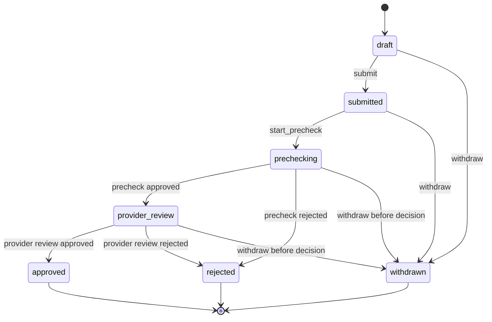
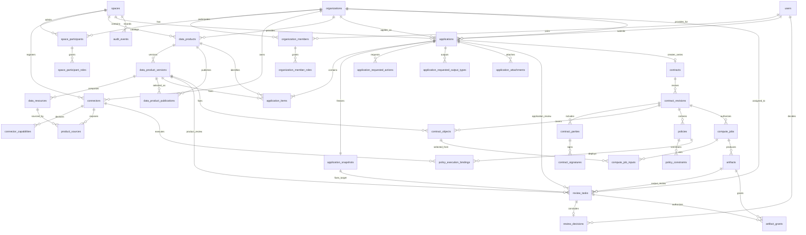
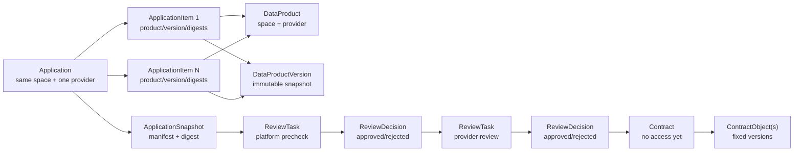

# MedTrust Space Phase 2-B.3-A PostgreSQL 数据库设计冻结 v3

> 版本：v0.3.1  
> 日期：2026-07-22  
> 状态：Application/Reviews 数据库逻辑设计已冻结，尚未生成 ORM、migration 或 API  
> 数据库基线：PostgreSQL 16，业务 schema 为 `medtrust`
> 历史说明：Application 六表设计继续有效；Review 实现基线已由 `Phase2-database-design-v4.md` 替代。

## 0. 冻结结论

Phase 2-B.3 Application 领域模型可以落到关系数据库，但不能直接沿用 v2 的“单申请单产品版本”四表设计。

v3 将申请建模为：

```text
Application
  → ApplicationItem(s)
  → concrete DataProductVersion(s)

Application
  → immutable ApplicationSnapshot

Application
  → ReviewTask(s)
  → append-only ReviewDecision
```

本次冻结结论：

1. 总表数从 34 张增加到 37 张；
2. 新增 `application_items`、`application_snapshots`、`review_decisions`；
3. `applications` 不再直接保存单一产品版本；
4. `review_tasks` 只保存任务生命周期，批准/拒绝迁入 `review_decisions`；
5. V1 一份申请可包含多个产品版本，但必须同一 Space、同一提供方；
6. ApplicationItem 只引用 DataProductVersion，不拆分版本内 DataResource；
7. ApplicationSnapshot 固定完整提交内容；
8. Application 获批只允许创建 Contract，不产生数据访问权；
9. Artifact 的 `output_review` 继续复用 Reviews 模块，不进入 Application 状态机；
10. 当前已实现的 Identity、Spaces、Connectors、Catalog ORM 和 `20260722_0004_catalog` migration 均不在本阶段修改。

结论为 **Go for Application ORM planning**，但正式写 ORM 前仍需以本文件为基线做一次表名、约束名与 migration 范围检查。

### 0.1 相对 v2 的结构变化

| 类型 | 对象 | v2 | v3 |
|---|---|---|---|
| 新增表 | ApplicationItem | 无 | `application_items`，一项固定一个产品版本。 |
| 新增表 | ApplicationSnapshot | 无 | `application_snapshots`，一份申请一个不可变提交快照。 |
| 新增表 | ReviewDecision | 无 | `review_decisions`，追加式最终决定。 |
| 调整表 | applications | 直接保存 version ID 和 digest | 移除单一版本字段，增加 provider、细化状态。 |
| 调整表 | review_tasks | task status 与 decision 淆合 | 只保存任务生命周期和目标快照。 |
| 增加候选键 | data_products | `(space_id, id)` | 额外增加 `(space_id, provider_organization_id, id)`。 |
| 保持 | DataResource | 版本内部资源 | 不变，不生成 ApplicationItem。 |
| 保持 | Contract | 一申请一合约系列 | 不变，多个 Item 映射多个 ContractObject。 |
| 保持 | Compute | 经 ContractObject 固定输入 | 不直接引用 ApplicationItem。 |

### 0.2 不接受的简化

- 不在 `applications` 中保存版本 ID 数组或 JSONB 产品列表；
- 不把 DataResource 当 ApplicationItem；
- 不允许 Item 只引用 DataProduct 或“当前版本”；
- 不在 ReviewTask 同时保存 task status 和 approve/reject 结论；
- 不使用无真实 FK 的 `target_type + target_id` 替代审查目标列；
- 不把 `APPROVED` 当成数据授权；
- 不通过数据库 CHECK 伪装跨表角色、Publication 状态或利益冲突校验。

---

## 1. PostgreSQL 设计基线

### 1.1 通用约定

- PostgreSQL 16；
- 单一 `medtrust` schema；
- UUID 主键；
- 所有时间使用 `timestamptz` 并按 UTC 写入；
- 状态使用 `text`/短 varchar + CHECK，不使用 PostgreSQL enum，降低增量迁移成本；
- JSONB 只承载快照 manifest、请求范围和非核心扩展证据；
- 核心主体、标的、状态、动作和决定保持关系化；
- 外键高频查询方向显式建索引；
- 已提交、已决定和证据对象不通过业务 API 物理删除。

### 1.2 通用审计列

可变业务表按需使用：

| 字段 | 说明 |
|---|---|
| `created_at` | 创建时间。 |
| `created_by` | 创建用户。 |
| `updated_at` | 最近更新时间。 |
| `row_version` | 乐观锁，起始为 1。 |
| `is_demo` | 演示数据标识。 |

不可变证据表不使用会造成“可编辑”错觉的 `updated_at`；修正通过新记录表达。

### 1.3 数据库保证与领域服务保证

数据库必须保证：

- PK、FK、复合父子归属、唯一性和当前行 CHECK；
- ApplicationItem 与 Application 同空间、同提供方；
- ApplicationItem 固定具体 Product 与 Version；
- ApplicationSnapshot 一对一、摘要存在和不可覆盖；
- ReviewTask 只有一个目标；
- ReviewDecision 最多一项，且决定组织等于任务责任组织；
- 非法状态值和明显非法时间组合被拒绝。

领域服务必须保证：

- 组织在 Space 中具有有效参与角色；
- Version 仍允许申请且有 active Publication；
- requested scope 只是 DataResource 范围的子集；
- 用户具有代表组织提交或决定的权限；
- 申请方不能审批自己；
- 审核顺序、汇总状态与 Contract 创建条件；
- manifest/digest 的规范化算法正确；
- 幂等命令、outbox 与 AuditEvent 同事务。

PostgreSQL CHECK 不读取其他表。跨表状态规则使用受控服务、事务锁、复合 FK、部分唯一索引和必要触发器组合实现。

---

## 2. 37 张表总览

| 模块 | 数量 | 表 |
|---|---:|---|
| Identity | 4 | `organizations`、`users`、`organization_members`、`organization_member_roles` |
| Spaces | 3 | `spaces`、`space_participants`、`space_participant_roles` |
| Connectors | 2 | `connectors`、`connector_capabilities` |
| Catalog | 5 | `data_products`、`data_product_versions`、`data_resources`、`product_sources`、`data_product_publications` |
| Applications | 6 | `applications`、`application_items`、`application_snapshots`、`application_requested_actions`、`application_requested_output_types`、`application_attachments` |
| Reviews | 2 | `review_tasks`、`review_decisions` |
| Contracts | 8 | `contracts`、`contract_revisions`、`contract_parties`、`contract_signatures`、`contract_objects`、`policies`、`policy_constraints`、`policy_execution_bindings` |
| Compute | 4 | `compute_jobs`、`compute_job_inputs`、`artifacts`、`artifact_grants` |
| Audit | 2 | `audit_events`、`outbox_events` |
| Platform | 1 | `idempotency_keys` |
| 合计 | **37** | - |

相对 v2 只新增三张表；原 Application 四张组成表继续保留，Reviews 从一张表增至两张。

---

## 3. 已实现上游表的兼容调整

### 3.1 data_products 增加复合候选键

当前 Catalog 已有：

- PK：`id`；
- UNIQUE：`(space_id, id)`；
- provider 外键：`provider_organization_id → organizations.id`。

v3 额外冻结：

```text
UNIQUE (space_id, provider_organization_id, id)
```

用途是供 ApplicationItem 通过复合 FK 证明：

1. Item 的产品属于申请所在 Space；
2. Item 的产品属于 Application 指定的单一提供方；
3. 不是由服务层临时推断提供方。

这是一个新增候选键，不增加列、不改历史数据、不改变 Catalog 领域语义。该约束应由后续 Application migration 添加，不回写已经验证的 `20260722_0004_catalog`。

### 3.2 data_product_versions 复用现有候选键

当前 Catalog 已存在：

```text
UNIQUE (data_product_id, id)
```

ApplicationItem 使用它保证指定 Version 确实属于指定 Product，不需要给 Version 增加 provider 冗余列。

### 3.3 不改变 DataResource

ApplicationItem 不直接引用 DataResource。对版本内资源范围的收窄保存在 `requested_scope` 快照中，并在提交服务中验证为 Version 资源集合的子集。

---

## 4. Applications 表设计

### 4.1 applications

Application 是使用请求的稳定业务身份和事务聚合根，不直接保存产品版本。

| 字段 | 类型 | 键/约束 | 说明 |
|---|---|---|---|
| `id` | uuid | PK | 申请 ID。 |
| `space_id` | uuid | FK → spaces.id，RESTRICT | 所属空间。 |
| `application_number` | text | NOT NULL | 空间内可读编号。 |
| `applicant_organization_id` | uuid | FK → organizations.id，RESTRICT | 申请组织。 |
| `applicant_user_id` | uuid | FK → users.id，RESTRICT | 发起用户。 |
| `provider_organization_id` | uuid | FK → organizations.id，RESTRICT | V1 全部 Item 的单一提供方。 |
| `purpose` | text | NOT NULL | 具体使用目的。 |
| `legal_or_ethics_basis` | text | NULL | 合规、授权或伦理依据摘要。 |
| `algorithm_name` | text | NOT NULL | 预登记算法名称。 |
| `algorithm_version` | text | NOT NULL | 预登记算法版本。 |
| `algorithm_digest` | text | NOT NULL | 算法包或规范摘要。 |
| `requested_duration_seconds` | bigint | CHECK > 0 | 请求授权期限。 |
| `requested_run_limit` | integer | CHECK > 0 | 请求运行次数。 |
| `status` | text | CHECK | draft、submitted、prechecking、provider_review、approved、rejected、withdrawn。 |
| `submitted_at` | timestamptz | NULL | 提交时间。 |
| `decided_at` | timestamptz | NULL | approved/rejected 时间。 |
| `withdrawn_at` | timestamptz | NULL | 撤回时间。 |
| `decision_summary` | text | NULL | 汇总结论，不替代 ReviewDecision。 |
| 通用列 | - | - | created/updated/row_version/is_demo。 |

#### 约束

- UNIQUE：`(space_id, application_number)`；
- UNIQUE 候选键：`(id, space_id, provider_organization_id)`，供 Item 复合 FK；
- CHECK：`applicant_organization_id <> provider_organization_id`；
- CHECK：`row_version >= 1`；
- CHECK：draft 时 `submitted_at/decided_at/withdrawn_at` 均为空；
- CHECK：submitted、prechecking、provider_review、approved、rejected、withdrawn 均必须有 `submitted_at`；
- CHECK：approved/rejected 必须有 `decided_at`，其他状态不得有；
- CHECK：withdrawn 必须有 `withdrawn_at`，其他状态不得有；
- CHECK：approved/rejected/withdrawn 视为终态，不允许普通 UPDATE 回到前序状态。

#### 索引

- `(space_id, status, submitted_at DESC)`；
- `(applicant_organization_id, status, created_at DESC)`；
- `(provider_organization_id, status, submitted_at DESC)`；
- 部分索引 `(space_id, submitted_at)` WHERE status IN (`submitted`,`prechecking`,`provider_review`)。

#### 删除与不可变

- 只有从未提交的 draft 可由受控服务物理删除；
- submitted 后，申请主体、提供方、用途、算法、期限和次数被冻结；
- 状态只能通过显式命令转换；
- approved/rejected/withdrawn 不物理删除。

### 4.2 application_items

一条 Item 是 Application 中的一个明确 DataProductVersion 标的。

| 字段 | 类型 | 键/约束 | 说明 |
|---|---|---|---|
| `id` | uuid | PK | Item ID。 |
| `application_id` | uuid | 复合 FK 组成列 | 所属申请。 |
| `space_id` | uuid | 复合 FK 组成列 | 冗余空间键，用于数据库闭合。 |
| `provider_organization_id` | uuid | 复合 FK 组成列 | 冗余提供方键，用于数据库闭合。 |
| `data_product_id` | uuid | 复合 FK 组成列 | 逻辑产品身份。 |
| `data_product_version_id` | uuid | 复合 FK 组成列 | 固定产品版本。 |
| `position_no` | integer | CHECK > 0 | 稳定排序。 |
| `requested_product_snapshot_digest` | text | NOT NULL | 提交时 Version 摘要。 |
| `requested_policy_digest` | text | NOT NULL | 提交时默认策略摘要。 |
| `requested_scope` | jsonb | NOT NULL，默认 `{}` | 版本内资源/字段范围的收窄快照。 |
| `created_at` | timestamptz | NOT NULL | 创建时间。 |

#### 复合外键

1. `(application_id, space_id, provider_organization_id)`  
   → `applications(id, space_id, provider_organization_id)`，CASCADE 仅支持 draft 聚合清理；
2. `(space_id, provider_organization_id, data_product_id)`  
   → `data_products(space_id, provider_organization_id, id)`，RESTRICT；
3. `(data_product_id, data_product_version_id)`  
   → `data_product_versions(data_product_id, id)`，RESTRICT。

三组 FK 联合保证：Item 与 Application 同空间同提供方，Version 属于指定 Product，且 Product 的提供方就是申请头中的提供方。

`data_product_id` 是为复合完整性保留的伴随键，不是第二个可选择标的。业务请求的唯一实际标的仍是 `data_product_version_id`；任何只给 Product ID、不指定 Version 的申请都无效。

#### 唯一性与 CHECK

- UNIQUE：`(application_id, data_product_version_id)`，同一申请不重复请求同一版本；
- UNIQUE：`(application_id, position_no)`；
- UNIQUE 候选键：`(application_id, id, data_product_version_id)`，供未来 Contract 映射或证据查询；
- CHECK：`jsonb_typeof(requested_scope) = 'object'`。

#### 不可变

- draft 可增删和重排；
- Application 提交后禁止 INSERT/UPDATE/DELETE Item；
- 产品摘要或策略摘要变化时必须生成新 Application；
- Publication 后续撤回不修改历史 Item。

### 4.3 application_snapshots

ApplicationSnapshot 是完整提交 manifest 的不可变证据，V1 与 Application 一对一。

| 字段 | 类型 | 键/约束 | 说明 |
|---|---|---|---|
| `id` | uuid | PK | Snapshot ID。 |
| `application_id` | uuid | FK → applications.id，RESTRICT；UNIQUE | 所属申请。 |
| `schema_version` | text | NOT NULL | manifest 规范版本。 |
| `manifest` | jsonb | NOT NULL | 规范化申请清单。 |
| `snapshot_digest` | text | NOT NULL | 整体摘要。 |
| `digest_algorithm` | text | CHECK | V1 为 sha256。 |
| `captured_at` | timestamptz | NOT NULL | 提交时间。 |
| `captured_by` | uuid | FK → users.id，RESTRICT | 提交用户。 |

#### 约束与索引

- UNIQUE：`application_id`；
- UNIQUE：`(application_id, id, snapshot_digest)`，供 ReviewTask 复合 FK；
- UNIQUE：`(application_id, snapshot_digest)`；
- CHECK：`jsonb_typeof(manifest) = 'object'`；
- CHECK：`schema_version <> ''`；
- INDEX：`snapshot_digest`，用于证据核验；不默认设全局唯一。

#### manifest 边界

manifest 至少覆盖：

- Space、申请编号、申请组织和提供方；
- purpose、依据摘要、算法身份、期限和次数；
- 按 position_no 排序的全部 Item、Version ID、产品 digest、策略 digest 和 requested scope；
- 按 `action_code` 排序的请求动作及规范化参数；
- 按 `output_type` 排序的请求输出类型、系统派生审核标记和 `review_rule_digest`；
- 按 `attachment_type`、`content_digest` 排序的附件元数据和内容摘要。

manifest 使用 UTF-8 canonical JSON：对象键按字典序输出、数组按上述业务键稳定排序、禁止 NaN/Infinity，并以紧凑分隔符序列化后计算 SHA-256。`ApplicationSnapshot.schema_version` 在本轮保持 `1.0`。

manifest 不包含患者数据、WSI 地址、Connector 本地资源定位符或密钥。

#### 不可变

- INSERT 后禁止 UPDATE/DELETE；
- Application 从 draft 进入 submitted 前必须在同一事务生成 Snapshot；
- captured_by 必须等于提交命令的授权用户；
- 修改申请必须克隆新 Application，V1 不增加 snapshot revision_no。

### 4.4 application_requested_actions

沿用 v2，属于 Application 整体请求，不按 Item 重复。

| 字段 | 类型 | 约束 |
|---|---|---|
| `application_id` | uuid | FK → applications.id；draft 清理可 CASCADE。 |
| `action_code` | text | NOT NULL；限定为 `ai_training`、`model_validation`、`research_analysis`、`drug_development`。 |
| `parameters` | jsonb | NOT NULL，默认 `{"schema_version":"1.0"}`；必须为 object 且包含字符串型 `schema_version`。 |

- PK：`(application_id, action_code)`；
- INDEX：`(action_code, application_id)`；
- submitted 后禁止 INSERT/UPDATE/DELETE。

### 4.5 application_requested_output_types

沿用 v2，属于 Application 整体请求。

| 字段 | 类型 | 约束 |
|---|---|---|
| `application_id` | uuid | FK → applications.id；draft 清理可 CASCADE。 |
| `output_type` | text | NOT NULL；限定为 `aggregate_statistics`、`model_artifact`、`feature_dataset`、`risk_scoring_model`。 |
| `requires_manual_review` | boolean | NOT NULL；仅由平台规则派生，申请方/API 不得直接写入。 |

- PK：`(application_id, output_type)`；
- INDEX：`(output_type, application_id)`；
- submitted 后禁止 INSERT/UPDATE/DELETE。

### 4.6 application_attachments

沿用 v2，不把附件内容存入 PostgreSQL。

| 字段 | 类型 | 约束/说明 |
|---|---|---|
| `id` | uuid | PK。 |
| `application_id` | uuid | FK → applications.id。 |
| `attachment_type` | text | `research_protocol`、`ethics`、`authorization`、`algorithm_document`、`compliance_evidence`、`other`。 |
| `display_name` | text | NOT NULL。 |
| `storage_ref` | text | 对象存储引用。 |
| `content_digest` | text | NOT NULL。 |
| `size_bytes` | bigint | CHECK >= 0。 |
| `scan_status` | text | NOT NULL，默认 `pending`；限定为 `pending`、`clean`、`rejected`。 |
| `created_at/by` | timestamptz/uuid | 上传信息。 |

- INDEX：`(application_id, attachment_type)`；
- INDEX：`(scan_status, application_id)`；
- UNIQUE：`(application_id, content_digest)`；
- 提交要求所有必需附件 `scan_status='clean'`；
- submitted 后禁止覆盖或删除。

---

## 5. Reviews 表设计

Reviews 是模块化单体中的共享工作流模块。产品版本、Application 和 Artifact 复用同一任务表，但业务目标仍通过真实 FK 表达。

逻辑终态包含三类目标；物理迁移分两步：Application 阶段先创建 Product/Application 目标列，Artifact 表创建后再通过 ALTER TABLE 增加 `artifact_id`、扩展目标 CHECK 和 `output_review` 枚举约束。这样不为迁移顺序牺牲真实 FK，也不提前创建 Compute/Artifact 空壳表。

### 5.1 review_tasks

ReviewTask 保存任务生命周期，不保存批准/拒绝结论。

| 字段 | 类型 | 键/约束 | 说明 |
|---|---|---|---|
| `id` | uuid | PK | 任务 ID。 |
| `space_id` | uuid | FK → spaces.id，RESTRICT | 空间。 |
| `review_type` | text | CHECK | product_review、application_precheck、provider_review、output_review。 |
| `data_product_version_id` | uuid | FK → data_product_versions.id，RESTRICT，NULL | 产品版本目标。 |
| `application_id` | uuid | FK → applications.id，RESTRICT，NULL | Application 目标。 |
| `application_snapshot_id` | uuid | NULL；Application 目标时复合 FK | 被审提交快照。 |
| `artifact_id` | uuid | FK → artifacts.id，RESTRICT，NULL | Artifact 目标。 |
| `assignee_organization_id` | uuid | FK → organizations.id，RESTRICT | 责任组织。 |
| `assignee_user_id` | uuid | FK → users.id，RESTRICT，NULL | 领取人。 |
| `task_status` | text | CHECK | pending、claimed、decided、cancelled。 |
| `sequence_no` | integer | CHECK > 0 | 审核顺序。 |
| `is_required` | boolean | NOT NULL | 是否影响目标汇总状态。 |
| `target_digest` | text | NOT NULL | 被审对象摘要。 |
| `due_at` | timestamptz | NULL | 截止时间。 |
| `claimed_at` | timestamptz | NULL | 领取时间。 |
| `decided_at` | timestamptz | NULL | 最终决定时间。 |
| `cancelled_at` | timestamptz | NULL | 取消时间。 |
| 通用列 | - | - | created/row_version。 |

#### 目标约束

- `data_product_version_id`、`application_id`、`artifact_id` 恰好一个非空；
- `review_type` 必须与目标列匹配；
- `application_snapshot_id` 当且仅当 `application_id` 非空；
- Application 任务使用复合 FK：  
  `(application_id, application_snapshot_id, target_digest)`  
  → `application_snapshots(application_id, id, snapshot_digest)`；
- Application 任务因此不能审核 draft 或另一份申请的 Snapshot；
- Product/Artifact 的 target_digest 一致性由对应领域创建服务验证，后续可在各自表具备稳定复合候选键时增强为复合 FK。

#### 任务状态 CHECK

- pending：`assignee_user_id/claimed_at/decided_at/cancelled_at` 为空；
- claimed：`assignee_user_id` 与 `claimed_at` 非空，决定/取消时间为空；
- decided：`decided_at` 非空，`cancelled_at` 为空；
- cancelled：`cancelled_at` 非空，`decided_at` 为空；
- `due_at` 若存在，必须晚于 created_at。

#### 候选键、唯一性与索引

- UNIQUE：`(id, target_digest)`，供 ReviewDecision 复合 FK；
- UNIQUE：`(id, assignee_organization_id)`，保证决定组织与任务责任组织一致；
- UNIQUE：`(id, artifact_id)`，供 ArtifactGrant 继续验证同一 Artifact；
- 部分 UNIQUE：`(application_id, review_type)` WHERE application_id IS NOT NULL AND task_status <> 'cancelled'；
- INDEX：`(assignee_organization_id, task_status, due_at)`；
- 部分 INDEX：`(assignee_user_id, task_status, due_at)` WHERE assignee_user_id IS NOT NULL；
- 部分 INDEX：`(space_id, due_at)` WHERE task_status IN (`pending`,`claimed`)；
- 三个目标列分别建立非空部分索引。

### 5.2 review_decisions

ReviewDecision 是一个 ReviewTask 的追加式最终决定。

| 字段 | 类型 | 键/约束 | 说明 |
|---|---|---|---|
| `id` | uuid | PK | 决定 ID。 |
| `review_task_id` | uuid | 复合 FK 组成列；UNIQUE | 所属任务。 |
| `decision` | text | CHECK | approved、rejected。 |
| `reason_code` | text | NULL | rejected 时必填。 |
| `comment` | text | NULL | 人工意见。 |
| `decided_by_user_id` | uuid | FK → users.id，RESTRICT | 决定人。 |
| `decided_for_organization_id` | uuid | 复合 FK 组成列 | 决定人代表的组织。 |
| `decided_at` | timestamptz | NOT NULL | 决定时间。 |
| `target_digest` | text | 复合 FK 组成列 | 被审快照摘要。 |
| `evidence` | jsonb | NOT NULL，默认 `{}` | 非敏感证据引用。 |
| `decision_digest` | text | NOT NULL | 决定规范化摘要。 |

#### 复合外键

1. `(review_task_id, target_digest)`  
   → `review_tasks(id, target_digest)`，RESTRICT；
2. `(review_task_id, decided_for_organization_id)`  
   → `review_tasks(id, assignee_organization_id)`，RESTRICT。

这两组 FK 证明决定针对任务原始摘要，并由任务责任组织作出。

#### CHECK、唯一性与索引

- UNIQUE：`review_task_id`，一项任务最多一个最终决定；
- UNIQUE：`decision_digest`；
- CHECK：rejected 必须有非空 `reason_code`；approved 可有说明但不强制；
- CHECK：`jsonb_typeof(evidence) = 'object'`；
- INDEX：`(decided_by_user_id, decided_at DESC)`；
- INDEX：`(decided_for_organization_id, decided_at DESC)`。

#### 追加式保护

- 业务数据库角色只有 INSERT/SELECT 权限，无 UPDATE/DELETE；
- 数据库触发器拒绝 UPDATE/DELETE；
- 纠错创建补充 ReviewTask，不覆盖原决定；
- 只有插入 Decision 与 Task 转为 decided 的事务成功后，Application 汇总状态才能推进。

### 5.3 “待审/通过/拒绝”的查询投影

数据库不再在 Task 同一列混合生命周期与决定：

| 页面状态 | 数据库条件 |
|---|---|
| 待审 | task_status IN (`pending`,`claimed`) 且无 ReviewDecision。 |
| 已通过 | task_status=`decided` 且 decision=`approved`。 |
| 已拒绝 | task_status=`decided` 且 decision=`rejected`。 |
| 已取消 | task_status=`cancelled` 且无 ReviewDecision。 |

---

## 6. Application 状态与审核汇总

### 6.1 状态机



### 6.2 审核任务规则

V1 每份提交申请恰好创建：

1. 一个 required `application_precheck`，责任组织为 Space operator；
2. 预审通过后，一个 required `provider_review`，责任组织为 Application.provider_organization_id。

状态推进：

- submitted → prechecking：预审任务已幂等创建；
- prechecking → provider_review：预审 Decision=approved；
- prechecking → rejected：预审 Decision=rejected；
- provider_review → approved：提供方 Decision=approved；
- provider_review → rejected：提供方 Decision=rejected。

Application 的 `decision_summary` 是投影/摘要，不是权威决定记录。

### 6.3 数据库触发器与服务职责

建议 Application migration 建立最小保护函数：

1. `guard_application_state_transition`：拒绝非法状态跳转和终态回退；
2. `guard_submitted_application_content`：submitted 后拒绝修改冻结字段；
3. `guard_application_children_after_submit`：父申请非 draft 时拒绝 Item、Action、Output、Attachment 的增删改；
4. `guard_application_snapshot_immutable`：拒绝 Snapshot 更新/删除；
5. `guard_review_decision_immutable`：拒绝 Decision 更新/删除。

触发器不负责验证空间角色、Publication active、算法语义或自审冲突；这些属于领域服务。

Snapshot 必须存在才允许 draft → submitted，可通过提交事务和 deferred constraint trigger 双层保证。ReviewDecision 与 Task/Application 的状态汇总由服务事务完成，避免把复杂工作流完全塞进 PL/pgSQL。

---

## 7. 与 Contract、Compute、Artifact 的关系

### 7.1 Contract

`contracts.application_id` 继续保持 UNIQUE：一份 approved Application 最多创建一个 Contract 系列。

生成规则：

```text
ApplicationItem 1 → ContractObject 1
ApplicationItem 2 → ContractObject 2
...
```

ContractObject 继续保存：

- `data_product_version_id`；
- `product_snapshot_digest`；
- `product_name_snapshot`；
- `position_no`。

v3 不给 ContractObject 增加 `application_item_id`：

- ContractObject 是签约 revision 的独立不可变标的；
- ApplicationItem 是前置请求证据；
- 创建服务必须逐项匹配 Version ID 与 digest，并写 AuditEvent；
- 避免让合约 revision 反向依赖可归档的申请组成行。

如果未来监管要求数据库级追溯到具体 Item，可新增独立 `contract_object_origins` 证据关系表，而不是把来源 FK 塞进签约标的主表；V1 不提前增加第 38 张表。

### 7.2 Compute

- ComputeJob 仍只引用 active ContractRevision；
- ComputeJobInput 仍通过 ContractObject 固定 Version；
- Compute 不直接引用 Application 或 ApplicationItem；
- 运行前重新核对 Contract Policy、Connector 状态和执行次数；
- Application APPROVED 不能创建 ComputeJob。

### 7.3 Artifact 与 output review

- Artifact 仍由 ComputeJob 产生并默认 quarantined；
- `review_tasks.artifact_id` 承载 output_review；
- ReviewDecision 保存结果审核结论；
- ArtifactGrant 必须引用同一 Artifact 的已批准 ReviewTask；
- Application 状态不会因为结果拒绝而从 approved 回退。

### 7.4 ArtifactGrant 对 ReviewDecision 的补强

v2 只要求 ArtifactGrant 引用同一 Artifact 的 ReviewTask。v3 进一步冻结：领域服务创建 Grant 时必须验证该 Task：

- review_type=`output_review`；
- task_status=`decided`；
- 存在 decision=`approved` 的 ReviewDecision；
- target_digest 等于 Artifact.content_digest；
- grant_type 被 active Contract Policy 允许。

这是一项跨表状态规则，不用 CHECK 表达。必要时在 Artifact ORM 阶段增加受控存储过程或 constraint trigger，而不是在本阶段虚构已实现能力。

---

## 8. Audit 与 Outbox 关系

新增事件建议：

| 对象 | 事件 |
|---|---|
| Application | `application.created`、`application.submitted`、`application.precheck_started`、`application.provider_review_started`、`application.approved`、`application.rejected`、`application.withdrawn` |
| ApplicationItem | `application.item_added`、`application.item_removed`（仅 draft） |
| Snapshot | `application.snapshot_created` |
| ReviewTask | `review.task_created`、`review.task_claimed`、`review.task_cancelled` |
| ReviewDecision | `review.decision_recorded` |
| Contract handoff | `contract.creation_requested`、`contract.created_from_application` |

AuditEvent 至少保存：

- actor user/organization；
- Space；
- subject type/id；
- action；
- outcome；
- correlation/causation ID；
- ApplicationSnapshot、target 或 decision digest；
- occurred_at；
- previous_hash/current_hash（若 V1 启用哈希链）。

业务写入与 outbox event 必须同事务。Audit consumer 失败不能导致业务重复执行；重试由 idempotency_keys 去重。

---

## 9. 总体 ER 图

### 9.1 37 表总体关系



### 9.2 Application 约束细节图



---

## 10. 循环依赖与字段重复检查

### 10.1 无硬循环

- ApplicationItem 单向引用 Application、Product、Version；
- Snapshot 单向引用 Application；
- ReviewTask 单向引用被审目标；
- ReviewDecision 单向引用 ReviewTask；
- Application 不反向保存 ReviewTask/Decision ID；
- Contract 单向引用 Application；
- Compute 不反向引用 Application；
- Audit 使用逻辑 subject，不被业务对象反向引用。

插入顺序明确，不需要延迟关闭 FK 才能创建主链数据。

### 10.2 有意冗余

| 字段 | 原因 | 完整性措施 |
|---|---|---|
| Application.provider_organization_id | V1 聚合边界、队列检索和合约责任方 | ApplicationItem 复合 FK 闭合 Product provider。 |
| ApplicationItem.space_id | 跨空间数据库防错 | 同时复合引用 Application 与 Product。 |
| ApplicationItem.data_product_id | 证明 Version 属于指定逻辑 Product | 复合 FK 到 Version。 |
| Item 产品/策略 digest | 还原单个标的提交事实 | 提交服务核对 Version。 |
| Snapshot manifest/digest | 还原完整申请组合 | 不可变触发器。 |
| ReviewDecision.target_digest | 防止对另一快照作决定 | 复合 FK 到 ReviewTask。 |
| decision_summary | 申请列表快速展示 | 权威结论仍来自 ReviewDecision。 |

不保留：

- applications.data_product_version_id；
- applications.requested_product_snapshot_digest；
- review_tasks.decision/reason/comment；
- Application.current_review_task_id；
- Application.contract_id；
- ComputeJob.application_id。

---

## 11. 不可变与删除策略

### 11.1 可在 draft 聚合清理时 CASCADE

- Application → ApplicationItem；
- Application → requested actions；
- Application → requested output types。

前提是 Application 删除由服务限制为从未提交的 draft。数据库角色不能绕过 guard 直接删除已提交申请。

### 11.2 必须 RESTRICT

- ApplicationSnapshot → Application；
- ReviewTask → Application/Snapshot/ProductVersion/Artifact；
- ReviewDecision → ReviewTask；
- Contract → Application；
- ApplicationItem → Product/Version；
- ApplicationAttachment 在提交后。

### 11.3 永不通过业务 API 删除

- ApplicationSnapshot；
- ReviewDecision；
- 已提交 Application；
- 已决定 ReviewTask；
- 已生成 Contract 的申请证据；
- AuditEvent/Outbox 历史。

### 11.4 归档

Application 终态数据按合规保留策略归档，但不能因目录 Publication 撤回或产品 retired 被级联删除。对象存储附件可到期销毁，数据库仍保留 digest、销毁时间和 AuditEvent。

---

## 12. 索引冻结清单

Application/Reviews 增量必须包含：

| 表 | 索引/唯一键 | 目的 |
|---|---|---|
| data_products | UNIQUE `(space_id, provider_organization_id, id)` | Item 同空间同提供方 FK。 |
| applications | UNIQUE `(space_id, application_number)` | 业务编号。 |
| applications | UNIQUE `(id, space_id, provider_organization_id)` | Item 复合 FK。 |
| applications | `(space_id, status, submitted_at DESC)` | 空间申请队列。 |
| applications | `(provider_organization_id, status, submitted_at DESC)` | 医院审核队列。 |
| applications | `(applicant_organization_id, status, created_at DESC)` | 使用方申请列表。 |
| application_items | UNIQUE `(application_id, data_product_version_id)` | 防重复标的。 |
| application_items | UNIQUE `(application_id, position_no)` | 稳定排序。 |
| application_items | `(data_product_version_id, application_id)` | 版本申请反查。 |
| application_snapshots | UNIQUE `application_id` | V1 一对一。 |
| application_snapshots | `snapshot_digest` | 证据核验。 |
| application_attachments | `(application_id, attachment_type)` | 材料检查。 |
| review_tasks | `(assignee_organization_id, task_status, due_at)` | 组织待办。 |
| review_tasks | 部分 `(space_id, due_at)`，pending/claimed | 空间待办。 |
| review_tasks | 部分 `(application_id, review_type)`，非 cancelled 唯一 | 防重复必要任务。 |
| review_decisions | UNIQUE `review_task_id` | 每任务一个最终决定。 |
| review_decisions | `(decided_by_user_id, decided_at DESC)` | 决定人追踪。 |
| review_decisions | `(decided_for_organization_id, decided_at DESC)` | 组织决定记录。 |

不为所有 JSONB 建通用 GIN 索引。只有出现明确的 manifest/requested_scope 查询路径和真实执行计划证据后再增加。

### 12.1 约束命名候选

Alembic 实现时优先使用短局部名，交由现有 naming convention 加表名前缀；不得把完整 `ck_<table>_...` 再传给 convention。

| 用途 | 局部名候选 |
|---|---|
| Product 空间/提供方候选键 | `space_provider_id` |
| Application 三元候选键 | `id_space_provider` |
| Item → Application | `application_scope` |
| Item → Product | `product_provider` |
| Item → Version | `product_version` |
| Snapshot 一申请一份 | `application` |
| Task → ApplicationSnapshot | `application_snapshot_digest` |
| Decision → Task target | `task_target_digest` |
| Decision → Task organization | `task_assignee_org` |

正式 migration 必须枚举最终展开后的全部约束、索引和触发器名称，验证 UTF-8 字节长度均不超过 PostgreSQL 63 字节。

---

## 13. 并发与幂等冻结

### 13.1 提交申请

事务必须：

1. 以 row lock/乐观锁读取 Application；
2. 验证仍为 draft；
3. 验证至少一个 Item；
4. 验证全部 Product/Version/Publication、provider 和 digest；
5. 验证动作、输出和附件；
6. 生成 canonical manifest 与 Snapshot；
7. 更新 status=submitted 与 submitted_at；
8. 写 outbox/audit；
9. 提交事务。

重复 submit 使用 idempotency key 返回同一结果，不创建第二个 Snapshot。

### 13.2 领取任务

使用条件更新：仅当 task_status=pending 时写入 assignee_user_id、claimed_at 并转为 claimed。受影响行数为 0 表示已被领取或状态变化。

### 13.3 提交决定

在一个事务内：

1. 锁定 ReviewTask；
2. 校验 claimed、责任组织、用户权限和 target digest；
3. 插入 ReviewDecision；
4. Task 转为 decided；
5. 汇总 Application 并推进状态；
6. 写 outbox/audit。

UNIQUE(review_task_id) 是并发最终防线。

### 13.4 创建 Contract

只有 approved Application 可以创建；`contracts.application_id` UNIQUE 与 idempotency key 共同防止重试产生多份合约系列。

---

## 14. 迁移创建顺序

本节冻结依赖顺序，不生成 Alembic 代码。

### 14.1 全系统顺序

1. Identity 四表；
2. Spaces 三表；
3. Connectors 两表；
4. Catalog 五表；
5. 给 `data_products` 增加 `(space_id, provider_organization_id, id)` 候选键；
6. `applications`；
7. `application_items`；
8. `application_requested_actions`、`application_requested_output_types`、`application_attachments`；
9. `application_snapshots`；
10. Contracts 的 `contracts`、revisions、parties、signatures、objects；
11. policies、constraints、execution bindings；
12. Compute 的 jobs、inputs、artifacts；
13. `review_tasks` 最终形态；若已在 Application 阶段创建，则此处只增加 `artifact_id` FK 并扩展目标 CHECK；
14. `review_decisions`（若 Application 阶段已创建则不重复创建）；
15. `artifact_grants`；
16. audit_events、outbox_events、idempotency_keys；
17. Application/Snapshot/Decision 不可变保护与数据库角色；
18. 演示种子和越权、摘要、并发、升降级测试。

### 14.2 下一批 Application migration 的实际范围

下一批增量 migration 只应：

1. 给已存在 `data_products` 增加一个复合 UNIQUE；
2. 创建 Applications 六表；
3. 在独立后续 migration 创建 Reviews 两表的首期形态：ReviewTask 只包含 Product/Application 目标，不含 `artifact_id`；
4. Artifact 表创建后，用增量 migration 给 ReviewTask 增加 `artifact_id` FK、`output_review` 和三目标恰一非空 CHECK；
5. 添加 Application 聚合、Snapshot 和 Decision guard 函数/触发器；
6. 本阶段不创建 Contract、Compute、Artifact、Audit 表。

建议继续分批：

```text
B.3-B1 Applications 6表
  ↓ PostgreSQL验证
B.3-B2 Reviews 2表首期形态（Product/Application targets）
  ↓ PostgreSQL验证
B.3-B3 Application领域服务与状态测试
  ↓ 后续 Contract/Compute/Artifact
Artifact migration 扩展 ReviewTask output_review target
```

不要一次生成剩余 23 张未来表。

### 14.3 downgrade 顺序

反向顺序：先删除 guard triggers/functions，再删除 ReviewDecision、ReviewTask、Snapshot、Application 组成表与 Application；最后移除 data_products 新候选键。若已有真实后续证据或 Contract 引用，生产环境不执行破坏性 downgrade，只采用前向修复迁移。

---

## 15. 完整性检查结果

### 15.1 Application 只能引用 DataProductVersion

通过。Application 主表不保存产品标的；每个 ApplicationItem 通过 `(data_product_id, data_product_version_id)` 复合 FK 固定明确 Version，不能引用“最新版本”。

### 15.2 同空间同提供方

通过。ApplicationItem 同时复合引用 Application 三元候选键和 DataProduct 三元候选键，数据库可拒绝跨 Space 或混合提供方产品。

### 15.3 Snapshot 不可变

通过设计。V1 `application_id` 唯一，manifest/digest 必填；业务角色无 UPDATE/DELETE，触发器二次保护。需在 PostgreSQL 16 实库验证后才能声称实现通过。

### 15.4 ReviewDecision 追加式

通过设计。每 Task 唯一决定、目标摘要和责任组织均由复合 FK 固定，权限与触发器禁止覆盖。需在 ORM/migration 实现后实库验证。

### 15.5 Contract 关系

清晰。一份 approved Application 生成一个 Contract 系列，多个 Item 映射同一 revision 下多个 ContractObject；申请批准不授予访问。

### 15.6 Compute 关系

清晰。Compute 仅消费 active ContractRevision/ContractObject，不直接消费 Application；因此申请变化不能绕过合约策略。

### 15.7 Audit 关系

清晰。Snapshot、Task、Decision 和状态推进均产生 outbox/audit 事件；Audit 不反向绑定业务 FK，避免归档循环。

### 15.8 循环依赖

通过。新增表均从下游单向引用上游，不要求互相等待插入；ReviewTask 晚于 Artifact 创建只是迁移顺序，不是硬循环。

---

## 16. PostgreSQL 实现验收矩阵

Application/Reviews ORM 与 migration 完成后，至少真实验证：

### 16.1 结构与 FK

- [ ] metadata 与 PostgreSQL 实库精确为预期表数；
- [ ] ApplicationItem 跨 Space 被拒绝；
- [ ] ApplicationItem 混合 provider 被拒绝；
- [ ] Item 的 Product/Version 错配被拒绝；
- [ ] 同一申请重复 Version 被拒绝；
- [ ] Snapshot 重复创建被拒绝；
- [ ] Application ReviewTask 引用另一申请 Snapshot 被拒绝；
- [ ] ReviewDecision 使用另一 target digest 被拒绝；
- [ ] ReviewDecision 使用非任务责任组织被拒绝。

### 16.2 状态与不可变

- [ ] 非法 Application 状态跳转被拒绝；
- [ ] submitted 后修改申请头被拒绝；
- [ ] submitted 后增删改 Item/Action/Output/Attachment 被拒绝；
- [ ] Snapshot UPDATE/DELETE 被拒绝；
- [ ] ReviewDecision UPDATE/DELETE 被拒绝；
- [ ] rejected 决定缺 reason_code 被拒绝；
- [ ] 一个 ReviewTask 并发决定只有一个成功。

### 16.3 服务级不变量

- [ ] 非空间成员不能提交；
- [ ] 无 active Publication 的 Version 不能提交；
- [ ] 产品 digest 或策略 digest 不匹配不能提交；
- [ ] requested_scope 超出 Version 资源范围不能提交；
- [ ] 申请方不能进行 provider review；
- [ ] precheck 未通过不能建立 provider_review；
- [ ] 全部必要决定未通过不能 approve；
- [ ] approved Application 不能直接创建 ComputeJob；
- [ ] 重复提交、决定和建合约保持幂等。

### 16.4 Migration

- [ ] `alembic upgrade head` 在 PostgreSQL 16 成功；
- [ ] 增量 downgrade/upgrade 在可丢弃测试库对称；
- [ ] 约束与索引名均不超过 PostgreSQL 63 字节；
- [ ] ORM metadata 与实库约束名一致；
- [ ] 现有 32 项 Catalog 实库测试不回归。

---

## 17. Phase 2-B.3-A 冻结清单

- [x] 总表数更新为 37。
- [x] Application、Item、Snapshot、ReviewTask、ReviewDecision 关系明确。
- [x] Application 不再直接引用单一 Version。
- [x] Item 固定 Product + Version + 两类 digest。
- [x] 数据库可拒绝跨 Space 与混合 provider Item。
- [x] Snapshot 一对一、不可变且不保存真实医疗数据地址。
- [x] ReviewTask 生命周期与 ReviewDecision 结果分离。
- [x] Decision target digest 与责任组织由复合 FK 固定。
- [x] Application 七状态和审核汇总规则明确。
- [x] Contract 多标的、Compute 间接消费和 Artifact 出域审核边界明确。
- [x] Audit/Outbox 事件目录明确。
- [x] 迁移依赖顺序和分批范围明确。
- [x] ORM/migration 前后的验收矩阵明确。
- [x] 本阶段未生成 ORM、migration、API 或业务 CRUD。

---

## 18. 最终结论与下一步

Phase 2-B.3-A 数据库冻结同步通过。v3 是 Application/Reviews 后续实现的逻辑基线，v2 保留为 Catalog 阶段历史基线。

建议下一阶段不是一次生成八张表，而是：

1. **Phase 2-B.3-B1：Applications 六表 ORM + migration**；
2. PostgreSQL 16 验证同空间、同提供方、Snapshot 和提交后不可变；
3. **Phase 2-B.3-B2：Reviews 两表首期 ORM + migration**，只启用 Product/Application 审核目标；
4. PostgreSQL 16 验证目标摘要、责任组织、追加式决定和并发唯一性；
5. 再实现 Application 状态领域服务，不提前实现 Contract 或 Compute；
6. Artifact 域落库时再增量扩展 ReviewTask 的 `artifact_id` 与 `output_review`，不新建第二套审核表。

主链最终保持：

```text
Published DataProductVersion(s)
  → ApplicationItem(s)
  → ApplicationSnapshot
  → Platform Precheck
  → Provider Review
  → Approved Application
  → Contract / Policy
  → Controlled Compute
  → Artifact Review
  → Audit Evidence
```

这保证 MedTrust Space 管理的是可验证的数据流通行为，而不是把“审批通过”误当成直接数据访问。
