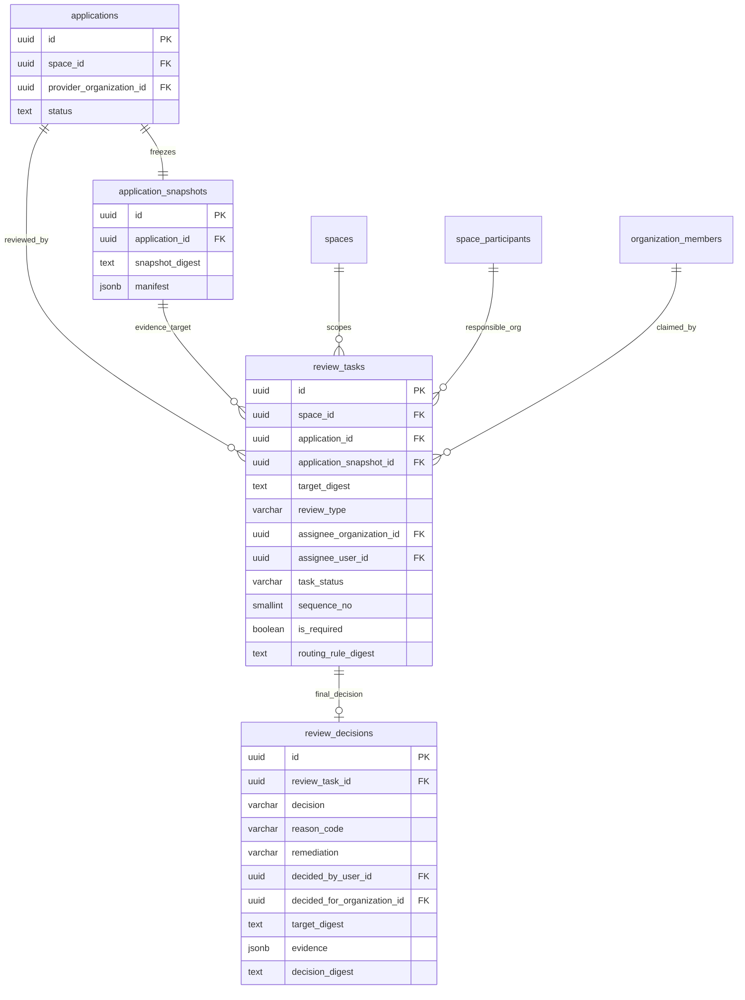
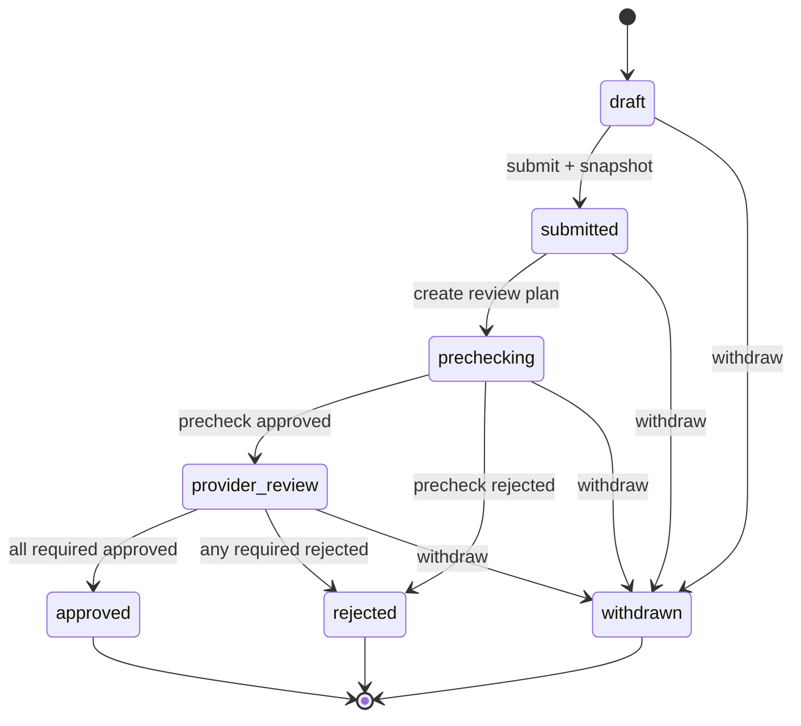
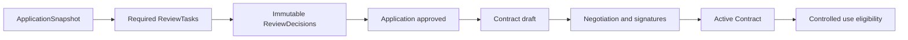
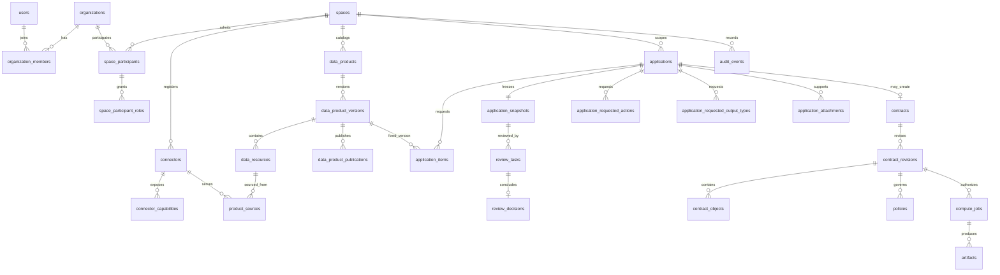

# MedTrust Space Phase 2-B.4-A PostgreSQL 数据库设计冻结 v4

> 版本：v0.4.0  
> 日期：2026-07-22  
> 状态：Review 数据库逻辑设计已冻结；ORM 与 `0007` migration 已实现，API 与 Contract 未实现  
> 数据库基线：PostgreSQL 16，业务 schema 为 `medtrust`  
> 当前实库基线：22 张已实现表，Alembic head 为 `20260722_0007`

## 0. 冻结结论

Phase 2-B.4 Review 领域模型可以映射为 `review_tasks` 与 `review_decisions` 两张表，但不能直接照搬 v3 的多目标预留结构。

v4 冻结为：

```text
Application
  -> immutable ApplicationSnapshot
  -> required ReviewTask(s)
  -> immutable ReviewDecision
  -> Application aggregate result
  -> Contract draft eligibility only
```

本次结论：

1. 逻辑总表数仍为 **37**，不新增 ReviewPolicy、ReviewRoute 或中间证据表；
2. `review_tasks` 首期审核对象固定为 `ApplicationSnapshot`；
3. `review_decisions` 每个 Task 最多一条，只允许 INSERT/SELECT，不允许覆盖；
4. Task 生命周期与 Decision 结论继续分离；
5. 审核类型冻结为 `application_precheck`、`provider_review`、`compliance_review`、`ethics_review`；
6. `platform_review` 不作为第二个持久化值；中文产品文案可显示“平台预审”；
7. Task 保存 `routing_rule_digest`，但 V1 不实现规则引擎；
8. Task 责任组织使用 `assignee_organization_id`，领取用户使用 `assignee_user_id`，不增加同义字段；
9. Decision 只允许 `approved/rejected`，不增加 `returned`；
10. 补件使用 `rejected + remediation=clone_and_resubmit`，新材料形成新的 Application/Snapshot；
11. Application approved 只允许进入 Contract 草案阶段，不产生访问授权；
12. 本文件是 Review 实现的权威数据库基线；v3 继续作为 Application 六表的历史设计依据。

结论为 **Go for Review ORM planning after freeze review**。在本文审查通过前，不生成 `0007` migration。

### 0.1 相对 v3 的变化

| 类型 | v3 | v4 |
| --- | --- | --- |
| 表数量 | 37 | 37，不变。 |
| ReviewTask 首期目标 | Product/Application，Artifact 后补 | 仅 ApplicationSnapshot；Product/Artifact 后续按真实领域需求 ALTER。 |
| 平台预审代码 | `application_precheck` | 保留，不增加 `platform_review`。 |
| 审核类型 | precheck、provider、product、output | Application 首期四类：precheck、provider、compliance、ethics。 |
| 路由证据 | 未固定 | 新增 `routing_rule_digest`。 |
| 取消原因 | 仅时间 | 新增 `cancel_reason`。 |
| 补件语义 | reason/comment | Decision 新增 `remediation`，受控值仅 `clone_and_resubmit`。 |
| Task 去重 | 非 cancelled 部分唯一 | Snapshot + review_type 完整唯一，取消后也不得重建同类任务。 |
| Task 空间归属 | 独立 Space FK | 增加 Application 与 Space 的复合归属 FK。 |
| 责任组织 | 普通 Organization FK | 增加 SpaceParticipant 复合 FK。 |
| 领取人 | 普通 User FK | 增加 OrganizationMember 复合 FK。 |
| Contract handoff | approved Application | 保持；补充全部 required Decision approved 的服务校验。 |

### 0.2 不接受的简化

- 不把 `ReviewTask.status` 设为 approved/rejected；
- 不把 ReviewDecision 字段塞回 Applications；
- 不审核可变 Application 草稿；
- 不使用无 FK 的 `target_type + target_id`；
- 不允许普通调用方任意指定责任组织；
- 不把 `platform_review` 与 `application_precheck` 同时存库；
- 不允许同一 Snapshot 的拒绝决定被后续批准覆盖；
- 不把 approved Application 当成数据访问授权；
- 不为“未来可能需要”提前增加第 38 张表。

---

## 1. PostgreSQL 设计基线

### 1.1 通用约定

- PostgreSQL 16；
- 单一 `medtrust` schema；
- UUID 主键；
- 时间使用 `timestamptz`，按 UTC 写入；
- 状态使用短 varchar/text + CHECK，不使用 PostgreSQL enum；
- digest 使用 64 位小写十六进制 SHA-256 字符串；
- JSONB 只保存非敏感、结构化证据引用；
- 不在 Reviews 表保存附件二进制、患者数据、对象存储凭据或真实 WSI 地址；
- 已决定任务和决定记录不通过业务 API 物理删除；
- 数据库约束负责结构完整性，领域服务负责角色、顺序、利益冲突和路由语义。

### 1.2 数据库与服务职责

数据库必须保证：

- Task 与 Application、Space、Snapshot、target digest 一致；
- Task 责任组织是该 Space 的参与组织；
- 被领取时，领取用户属于责任组织；
- 一个 Snapshot 的一种 review type 最多一个 Task；
- Task 状态与时间/领取字段组合合法；
- 一个 Task 最多一条 Decision；
- Decision 的 target digest、责任组织和决定用户与 Task 一致；
- rejected 必须有 reason code；
- Decision 不可 UPDATE/DELETE；
- Task 转为 decided 时必须存在 Decision。

领域服务必须保证：

- Space、参与组织、组织成员和用户均处于有效状态；
- 用户持有对应组织/空间上下文审核能力；
- applicant organization 不能审核自己的申请；
- precheck 与后续 required review 不由同一用户决定；
- review type 对应正确责任组织；
- 合规/伦理任务由服务端规则触发，不接受申请方降级；
- 只有当前最小未完成 sequence 可领取；
- Application 状态由全部 required Decision 汇总；
- 幂等键、outbox 和后续 AuditEvent 与业务写入同事务。

PostgreSQL CHECK 不读取其他表。需要跨表当前状态的规则采用复合 FK、领域服务、事务锁和必要 constraint trigger。

---

## 2. 37 张表总览

| 模块 | 数量 | 表 | 当前状态 |
| --- | ---: | --- | --- |
| Identity | 4 | `organizations`、`users`、`organization_members`、`organization_member_roles` | 已实现 |
| Spaces | 3 | `spaces`、`space_participants`、`space_participant_roles` | 已实现 |
| Connectors | 2 | `connectors`、`connector_capabilities` | 已实现 |
| Catalog | 5 | `data_products`、`data_product_versions`、`data_resources`、`product_sources`、`data_product_publications` | 已实现 |
| Applications | 6 | `applications`、`application_items`、`application_snapshots`、`application_requested_actions`、`application_requested_output_types`、`application_attachments` | 已实现 |
| Reviews | 2 | `review_tasks`、`review_decisions` | 已实现并通过 PostgreSQL 16 验证 |
| Contracts | 8 | `contracts`、`contract_revisions`、`contract_parties`、`contract_signatures`、`contract_objects`、`policies`、`policy_constraints`、`policy_execution_bindings` | 未来 |
| Compute | 4 | `compute_jobs`、`compute_job_inputs`、`artifacts`、`artifact_grants` | 未来 |
| Audit | 2 | `audit_events`、`outbox_events` | 未来 |
| Platform | 1 | `idempotency_keys` | 未来 |
| 合计 | **37** | - | 22 已实现，15 待实现 |

v4 不改变除 Applications 候选键和 Reviews 两表以外的已冻结字段设计。

---

## 3. 上游兼容调整

### 3.1 applications 增加空间候选键

当前 Applications ORM 已有：

```text
UNIQUE (id, space_id, provider_organization_id)
```

v4 额外冻结：

```text
UNIQUE (id, space_id)
```

用途：让 ReviewTask 通过复合 FK 证明其 `space_id` 与 Application 真实所属空间一致。

该候选键：

- 不增加业务数据列；
- 不改变 Application 聚合语义；
- 对现有数据天然满足；
- 应在 Review migration 中先于 `review_tasks` 创建；
- downgrade 时在删除 Reviews 两表后移除。

### 3.2 复用既有候选键

不修改以下已实现候选键：

```text
application_snapshots
  UNIQUE (application_id, id, snapshot_digest)

space_participants
  UNIQUE (space_id, organization_id)

organization_members
  UNIQUE (organization_id, user_id)
```

它们分别用于固定 Snapshot 证据、责任组织的空间参与关系和领取用户的组织成员关系。

### 3.3 不新增 source_application_id

Review 领域文档提出补件时复制新申请。v4 不在 Applications 表临时增加 `source_application_id`：

- 它不是 Review 两表落库的必要条件；
- 当前用户请求只授权 Review 数据库同步；
- 申请复制谱系应在 Application 修订/复制能力设计时单独冻结；
- V1 Demo 可先通过业务编号、correlation ID 和未来 AuditEvent 说明来源，不冒充数据库级谱系已实现。

---

## 4. ReviewTask 表设计

### 4.1 表职责

`review_tasks` 保存“谁应审核哪一份不可变 Snapshot、按什么顺序、为何被路由到这里”的任务事实。

它不保存批准/拒绝结论。

### 4.2 字段

| 字段 | PostgreSQL 类型 | NULL | 键/约束 | 说明 |
| --- | --- | --- | --- | --- |
| `id` | uuid | 否 | PK | Task ID。 |
| `space_id` | uuid | 否 | 复合 FK 组成列 | 审核空间。 |
| `review_type` | varchar(32) | 否 | CHECK | 四类 Application 审核之一。 |
| `application_id` | uuid | 否 | 复合 FK 组成列 | 被审申请。 |
| `application_snapshot_id` | uuid | 否 | 复合 FK 组成列 | 被审不可变快照。 |
| `target_digest` | text | 否 | 复合 FK 组成列，CHECK | `sha256:<64 hex>`；等于 Snapshot digest。 |
| `assignee_organization_id` | uuid | 否 | 复合 FK 组成列 | 审核责任组织。 |
| `assignee_user_id` | uuid | 是 | 复合 FK 组成列 | 领取用户。pending 时为空。 |
| `task_status` | varchar(16) | 否 | CHECK | pending、claimed、decided、cancelled。 |
| `sequence_no` | smallint | 否 | CHECK > 0 | V1 使用 10、20。 |
| `is_required` | boolean | 否 | - | 是否参与 Application 汇总。V1 创建的任务均为 true。 |
| `routing_rule_digest` | text | 否 | CHECK | `sha256:<64 hex>`；路由规则与责任解析摘要。 |
| `due_at` | timestamptz | 是 | CHECK | 截止时间。 |
| `claimed_at` | timestamptz | 是 | 状态 CHECK | 领取时间。 |
| `decided_at` | timestamptz | 是 | 状态 CHECK | 最终决定时间。 |
| `cancelled_at` | timestamptz | 是 | 状态 CHECK | 取消时间。 |
| `cancel_reason` | varchar(32) | 是 | 条件 CHECK | 取消原因。 |
| `created_at` | timestamptz | 否 | DEFAULT now() | 创建时间。 |
| `created_by` | uuid | 否 | FK → users.id | 创建主体。 |
| `row_version` | integer | 否 | CHECK >= 1 | 乐观锁。 |

Task 不保存 `updated_at`。生命周期变化由明确时间列、row version 和未来 AuditEvent 表达。

### 4.3 审核类型词表

持久化值冻结为：

```text
application_precheck
provider_review
compliance_review
ethics_review
```

语义：

| 值 | 中文展示 | 责任组织来源 | sequence |
| --- | --- | --- | ---: |
| `application_precheck` | 平台预审 | `spaces.operator_organization_id` | 10 |
| `provider_review` | 数据提供方审核 | `applications.provider_organization_id` | 20 |
| `compliance_review` | 合规审核 | 服务端空间路由配置中的已准入参与组织 | 20 |
| `ethics_review` | 伦理审核 | 服务端空间路由配置中的已准入参与组织 | 20 |

不使用 `platform_review`，理由：

- `application_precheck` 已存在于领域文档、Application 状态命令和 v3；
- 两者表达同一个平台预审阶段；
- 同时保留会造成筛选、约束、事件和迁移双重代码值；
- UI 文案与数据库编码可以分离。

### 4.4 审核目标复合外键

#### Application 空间归属

```text
FOREIGN KEY (application_id, space_id)
  REFERENCES applications(id, space_id)
  ON DELETE RESTRICT
```

#### Snapshot 证据

```text
FOREIGN KEY (application_id, application_snapshot_id, target_digest)
  REFERENCES application_snapshots(application_id, id, snapshot_digest)
  ON DELETE RESTRICT
```

两组 FK 共同保证：

- Task 不能跨 Application 使用 Snapshot；
- Task 不能伪造 Snapshot digest；
- Task 不能把另一个 Space 的 ID 填入队列维度；
- 审核对象固定为提交证据，不是可变 Application 行。

### 4.5 责任组织与领取用户复合外键

#### 责任组织必须参与目标 Space

```text
FOREIGN KEY (space_id, assignee_organization_id)
  REFERENCES space_participants(space_id, organization_id)
  ON DELETE RESTRICT
```

#### 领取用户必须属于责任组织

```text
FOREIGN KEY (assignee_organization_id, assignee_user_id)
  REFERENCES organization_members(organization_id, user_id)
  ON DELETE RESTRICT
```

复合 FK 只能证明关系行存在，不能证明当前状态有效。以下仍由领域服务在创建、领取和决定时检查：

- Space 为 active；
- SpaceParticipant 为 admitted；
- OrganizationMember 为 active 且处于有效期；
- 用户持有对应组织/空间上下文能力；
- 组织和用户未被 suspended/disabled。

### 4.6 review type 与责任组织的跨表规则

Task 创建事务必须校验：

```text
application_precheck
  assignee_organization_id = spaces.operator_organization_id

provider_review
  assignee_organization_id = applications.provider_organization_id

compliance_review / ethics_review
  assignee_organization_id = 服务端路由配置解析结果
  并且是该Space admitted participant
```

前两项可由受控创建服务加 PostgreSQL trigger 双层保护。合规/伦理路由配置当前没有持久化表，因此数据库只能验证空间参与关系和固定 `routing_rule_digest`，不能伪造“已从数据库规则目录解析”。

### 4.7 routing_rule_digest

`routing_rule_digest` 固定以下规范化输入：

```json
{
  "schema_version": "1.0",
  "space_id": "uuid",
  "space_ruleset_version": "string",
  "application_snapshot_digest": "sha256",
  "review_type": "ethics_review",
  "sequence_no": 20,
  "is_required": true,
  "trigger_facts": ["high_sensitivity", "model_artifact"],
  "assignee_organization_id": "uuid",
  "route_config_version": "demo-v1"
}
```

使用与 ApplicationSnapshot 一致的 canonical JSON 规则：UTF-8、键排序、紧凑分隔符、禁止 NaN/Infinity，再计算 SHA-256。

该摘要证明“当时为何生成这个任务”，但不等于已经实现 ReviewPolicy 规则引擎。

### 4.8 Task 状态 CHECK

#### pending

```text
task_status = 'pending'
assignee_user_id IS NULL
claimed_at IS NULL
decided_at IS NULL
cancelled_at IS NULL
cancel_reason IS NULL
```

#### claimed

```text
task_status = 'claimed'
assignee_user_id IS NOT NULL
claimed_at IS NOT NULL
decided_at IS NULL
cancelled_at IS NULL
cancel_reason IS NULL
```

#### decided

```text
task_status = 'decided'
assignee_user_id IS NOT NULL
claimed_at IS NOT NULL
decided_at IS NOT NULL
cancelled_at IS NULL
cancel_reason IS NULL
```

#### cancelled

```text
task_status = 'cancelled'
decided_at IS NULL
cancelled_at IS NOT NULL
cancel_reason IS NOT NULL
(assignee_user_id IS NULL) = (claimed_at IS NULL)
```

取消保留已有领取人和 claimed_at；如果任务尚未领取，则两者都为空。

其他 CHECK：

- `due_at IS NULL OR due_at > created_at`；
- `sequence_no > 0`；
- `row_version >= 1`；
- `target_digest ~ '^sha256:[0-9a-f]{64}$'`；
- `routing_rule_digest ~ '^sha256:[0-9a-f]{64}$'`；
- `cancel_reason` 只允许 `application_withdrawn`、`upstream_rejected`、`administrative_termination`。

“逾期”由 `due_at < now()` 且状态为 pending/claimed 的查询投影生成，不增加 `expired` 状态。

### 4.9 唯一性与候选键

```text
UNIQUE (application_snapshot_id, review_type)
UNIQUE (id, target_digest)
UNIQUE (id, assignee_organization_id)
UNIQUE (id, assignee_user_id)
```

说明：

- 同一不可变 Snapshot 的同类 Task 永远只有一个；
- cancelled 后也不能为同一 Snapshot 重建第二个同类 Task；
- 补件必须创建新 Application/Snapshot；
- 后三组候选键供 ReviewDecision 复合 FK 使用。

### 4.10 索引

| 索引 | 用途 |
| --- | --- |
| `(assignee_organization_id, task_status, due_at)` | 组织待办。 |
| 部分 `(assignee_user_id, task_status, due_at)` WHERE user IS NOT NULL | 个人待办。 |
| 部分 `(space_id, sequence_no, due_at)` WHERE status IN pending/claimed | 空间审核队列。 |
| `(application_id, sequence_no, task_status)` | Application 汇总。 |
| `(application_snapshot_id, review_type)` UNIQUE | 防重复审核任务。 |
| `(routing_rule_digest)` | 路由证据核验和排障。 |

### 4.11 Task 可变边界

创建后永远不可修改：

- space/application/snapshot/target digest；
- review type；
- assignee organization；
- sequence/is_required；
- routing rule digest；
- created fields。

生命周期命令只能修改：

- task_status；
- assignee_user_id；
- claimed/decided/cancelled 时间；
- cancel_reason；
- row_version。

Task 进入 decided/cancelled 后，数据库 trigger 拒绝 UPDATE/DELETE。

---

## 5. ReviewDecision 表设计

### 5.1 表职责

`review_decisions` 保存对一个 ReviewTask 的唯一最终结论。它是追加式证据对象，不是可编辑意见表。

### 5.2 字段

| 字段 | PostgreSQL 类型 | NULL | 键/约束 | 说明 |
| --- | --- | --- | --- | --- |
| `id` | uuid | 否 | PK | Decision ID。 |
| `review_task_id` | uuid | 否 | UNIQUE，复合 FK 组成列 | 所属 Task。 |
| `decision` | varchar(16) | 否 | CHECK | approved/rejected。 |
| `reason_code` | varchar(64) | 是 | 条件 CHECK | rejected 时必填。 |
| `comment` | text | 是 | - | 人工说明。 |
| `remediation` | varchar(32) | 是 | 条件 CHECK | 可为 clone_and_resubmit。 |
| `decided_by_user_id` | uuid | 否 | 复合 FK 组成列 | 必须是 Task 当前领取人。 |
| `decided_for_organization_id` | uuid | 否 | 复合 FK 组成列 | 必须是 Task 责任组织。 |
| `target_digest` | text | 否 | 复合 FK 组成列，CHECK | `sha256:<64 hex>`；必须等于 Task target digest。 |
| `evidence` | jsonb | 否 | CHECK object | 非敏感证据引用。 |
| `decision_digest` | text | 否 | UNIQUE，CHECK | `sha256:<64 hex>`；决定规范化 SHA-256。 |
| `decided_at` | timestamptz | 否 | - | 决定时间。 |

不增加 `updated_at`、`updated_by` 或 `deleted_at`。这些字段会暗示决定可被原地修改。

### 5.3 复合外键

#### 固定审核目标

```text
FOREIGN KEY (review_task_id, target_digest)
  REFERENCES review_tasks(id, target_digest)
  ON DELETE RESTRICT
```

#### 固定责任组织

```text
FOREIGN KEY (review_task_id, decided_for_organization_id)
  REFERENCES review_tasks(id, assignee_organization_id)
  ON DELETE RESTRICT
```

#### 固定领取用户

```text
FOREIGN KEY (review_task_id, decided_by_user_id)
  REFERENCES review_tasks(id, assignee_user_id)
  ON DELETE RESTRICT
```

三组 FK 共同保证 Decision 不能换目标、换组织或由未领取该任务的用户写入。

### 5.4 Decision 词表与条件约束

持久化决定只有：

```text
approved
rejected
```

约束：

```text
approved:
  reason_code IS NULL
  remediation IS NULL

rejected:
  reason_code IS NOT NULL AND btrim(reason_code) <> ''
  remediation IS NULL OR remediation = 'clone_and_resubmit'
```

V1 reason code 受控词表：

```text
incomplete_materials
missing_ethics_material
subject_not_eligible
policy_conflict
purpose_not_justified
compliance_requirement_not_met
ethics_requirement_not_met
conflict_of_interest
other
```

其他约束：

- `jsonb_typeof(evidence) = 'object'`；
- `target_digest ~ '^sha256:[0-9a-f]{64}$'`；
- `decision_digest ~ '^sha256:[0-9a-f]{64}$'`；
- `decided_at >= review_tasks.claimed_at` 由插入 trigger 校验。

### 5.5 Decision digest

canonical 输入至少包含：

```json
{
  "schema_version": "1.0",
  "review_task_id": "uuid",
  "review_type": "provider_review",
  "target_digest": "sha256",
  "decision": "rejected",
  "reason_code": "missing_ethics_material",
  "remediation": "clone_and_resubmit",
  "evidence_refs": ["digest-or-reference"],
  "decided_by_user_id": "uuid",
  "decided_for_organization_id": "uuid",
  "decided_at": "UTC ISO-8601"
}
```

使用 UTF-8、键排序、稳定数组排序、紧凑分隔符、禁止 NaN/Infinity 后计算 SHA-256。

### 5.6 追加式与一任务一决定

- UNIQUE `review_task_id`；
- UNIQUE `decision_digest`；
- 业务数据库角色仅有 INSERT/SELECT；
- `guard_review_decision_immutable` trigger 拒绝 UPDATE/DELETE；
- Decision 插入 trigger 要求 Task 当前为 claimed；
- Task claimed → decided 的 deferred constraint trigger 要求事务结束时存在唯一 Decision；
- Decision 与 Task 状态更新、Application 汇总、outbox 写入必须在同一事务。

“追加式”指每次新的审核事实写新行，不是允许同一 Task 写多条冲突最终决定。

---

## 6. Review 详细 ER



---

## 7. Review 计划与 Application 汇总

### 7.1 审核计划创建

`start_application_review` 在单一事务中：

1. 锁定 status=submitted 的 Application；
2. 读取唯一 ApplicationSnapshot；
3. 验证附件状态、Snapshot digest 和空间状态；
4. 根据 Snapshot 风险事实与服务端路由规则派生所需 Task；
5. 解析每项 Task 的责任组织；
6. 验证组织是 admitted SpaceParticipant；
7. 创建全部 required Task；
8. Application 转为 prechecking；
9. 写 outbox；
10. 提交事务。

同一 Snapshot + review type 的 UNIQUE 和幂等键共同防止重复计划。

如果规则要求 compliance/ethics review，但缺少合格责任组织，整个计划创建失败，Application 保持 submitted；不得只创建其他任务并静默跳过高风险审核。

### 7.2 两阶段屏障

```text
sequence 10
  application_precheck

sequence 20（并行）
  provider_review
  compliance_review（条件触发）
  ethics_review（条件触发）
```

- 只有最小未完成 sequence 的任务可领取；
- sequence 10 approved 后 Application 转为 provider_review；
- `provider_review` 状态在 V1 表示“预审后的全部必要审核屏障”，不只表示医院单项审核；
- sequence 20 required 任务可并行；
- 任一 required rejected，Application 转 rejected，其余未决定 Task 转 cancelled；
- 全部 required approved，Application 转 approved。

### 7.3 Application 状态机



现有 Application 状态词表无需迁移修改。

### 7.4 汇总事务

提交 Decision 时：

1. 锁定 ReviewTask；
2. 校验 claimed、领取用户、责任组织、角色、sequence 和 digest；
3. 插入 ReviewDecision；
4. Task 转 decided；
5. 锁定 Application；
6. 汇总该 Snapshot 的全部 required Task/Decision；
7. 推进 Application 状态；
8. 取消因拒绝而不再需要的开放 Task；
9. 写 outbox；
10. 提交事务。

`applications.decision_summary` 只保存查询摘要，权威事实始终是 ReviewDecision。

---

## 8. 领取、释放、取消与职责分离

### 8.1 领取

使用条件更新：

```text
UPDATE review_tasks
SET task_status='claimed',
    assignee_user_id=:user_id,
    claimed_at=:now,
    row_version=row_version+1
WHERE id=:task_id
  AND task_status='pending'
  AND row_version=:expected_version
```

执行前服务校验：

- 用户属于责任组织且成员状态有效；
- 用户拥有该 review type 所需上下文能力；
- 任务处于当前可执行 sequence；
- 用户/组织不是申请方；
- 用户未违反阶段间职责分离。

受影响行数为 0 表示并发冲突或状态已变化。

### 8.2 释放领取

`claimed -> pending`：

- 只允许当前领取人或授权运营管理员；
- 尚不存在 Decision；
- 清空 assignee_user_id 和 claimed_at；
- 增加 row_version；
- 未来写 `review.task_released` AuditEvent。

### 8.3 取消

允许原因：

- `application_withdrawn`；
- `upstream_rejected`；
- `administrative_termination`。

普通 reviewer 不能取消任务；已决定 Task 不能取消。

### 8.4 防自审与职责分离

数据库复合 FK 不能表达全部利益冲突，服务必须检查：

- `assignee_organization_id <> applications.applicant_organization_id`；
- 决定用户所属组织不是 applicant organization；
- provider review 的责任组织等于 provider organization；
- application precheck 的责任组织等于 Space operator；
- precheck 决定用户不能再决定该申请的任何 sequence 20 required Task；
- 即使 operator 与 provider 是同一组织，也必须由不同用户完成两个阶段；
- suspended/disabled/exited 主体不能领取或决定。

必要时 migration 可增加约束触发器验证固定组织映射；用户角色和当前有效状态仍由服务校验。

---

## 9. 补件、重审与不可变边界

### 9.1 不持久化 returned

V1 Decision 只有 approved/rejected。需要补件时：

```text
decision = rejected
reason_code = missing_ethics_material
remediation = clone_and_resubmit
```

当前 Application/Snapshot/Task/Decision 进入终态并保留。

申请方复制内容、补齐材料后创建新的 Application 和 Snapshot，再生成新的 Task/Decision。

### 9.2 禁止同一 Snapshot 冲突决定

数据库通过：

- UNIQUE `(application_snapshot_id, review_type)`；
- UNIQUE `review_decisions.review_task_id`；
- Decision UPDATE/DELETE trigger；
- Task 终态不可变 trigger；

阻止以下错误模型：

```text
Snapshot S1
  -> provider_review rejected
  -> provider_review approved
```

### 9.3 管理性纠错

reviewer 误操作不通过 UPDATE Decision 修复。V1 处理为：

- 立即阻断尚未开始的 Contract handoff；
- 记录管理性事件；
- 由授权治理流程决定是否新建纠错任务或重新申请；
- `supersedes_review_task_id` 留待 Audit/治理阶段评审，不在 v4 临时增加。

---

## 10. Review 与 Contract Draft

### 10.1 准入关系



Review approved 只允许创建 Contract draft。

### 10.2 Contract 创建服务必须校验

- Application.status=`approved`；
- ApplicationSnapshot 存在且 digest 一致；
- 该 Snapshot 所有 `is_required=true` 的 Task 均为 decided；
- 每个 required Task 都有 decision=approved；
- 不存在 required rejected 或开放 Task；
- Contract actions/outputs/versions 是申请与审核范围的子集；
- `contracts.application_id` UNIQUE，保证一份申请一个 Contract 系列；
- 幂等键防止重复创建。

### 10.3 不新增 Decision 关联表

v4 不增加 `contract_review_decisions`：

- Contract 可通过 Application -> Snapshot -> Tasks -> Decisions 查询审核证据；
- 增加关联表会把总表数变为 38，超出本轮授权；
- 后续若监管要求合约 revision 直接固定决定 digest 集合，应在 Contract 领域设计中评审，而不是在 Review 阶段预判。

Application approved、Contract draft、Contract signed、Contract active 是四个不同事实，不能合并。

---

## 11. 全系统总体 ER



该 ER 显示逻辑主链；未实现的 Contract/Compute/Audit 字段继续以 v3/v2 冻结设计为历史参考，直到各自领域进入新版本冻结。

---

## 12. 索引与约束冻结清单

| 表 | 约束/索引 | 目的 |
| --- | --- | --- |
| applications | UNIQUE `(id, space_id)` | Task 同空间复合 FK。 |
| review_tasks | FK `(application_id, space_id)` | 固定申请空间。 |
| review_tasks | FK `(application_id, snapshot_id, target_digest)` | 固定不可变审核证据。 |
| review_tasks | FK `(space_id, assignee_org_id)` | 责任组织属于 Space。 |
| review_tasks | FK `(assignee_org_id, assignee_user_id)` | 领取用户属于责任组织。 |
| review_tasks | UNIQUE `(snapshot_id, review_type)` | 同一证据同类审核唯一。 |
| review_tasks | UNIQUE `(id, target_digest)` | Decision 目标 FK。 |
| review_tasks | UNIQUE `(id, assignee_org_id)` | Decision 责任组织 FK。 |
| review_tasks | UNIQUE `(id, assignee_user_id)` | Decision 用户 FK。 |
| review_tasks | `(assignee_org_id, task_status, due_at)` | 组织待办。 |
| review_tasks | 部分 `(space_id, sequence_no, due_at)` | 空间开放队列。 |
| review_tasks | `(application_id, sequence_no, task_status)` | 汇总查询。 |
| review_decisions | UNIQUE `review_task_id` | 一任务一最终决定。 |
| review_decisions | UNIQUE `decision_digest` | 决定证据去重。 |
| review_decisions | 三组复合 FK 到 Task | 固定目标、组织、用户。 |
| review_decisions | `(decided_by_user_id, decided_at DESC)` | 用户决定记录。 |
| review_decisions | `(decided_for_organization_id, decided_at DESC)` | 组织决定记录。 |

字段缩写只用于本表展示；实际 ORM/migration 使用完整字段名。

约束名称候选采用短局部名，最终展开后不得超过 PostgreSQL 63 字节：

| 用途 | 局部名候选 |
| --- | --- |
| Application 空间候选键 | `id_space` |
| Task → Application/Space | `application_space` |
| Task → Snapshot digest | `snapshot_digest` |
| Task → SpaceParticipant | `assignee_participant` |
| Task → OrganizationMember | `assignee_member` |
| Task Snapshot/type 唯一 | `snapshot_type` |
| Decision → Task target | `task_target` |
| Decision → Task org | `task_org` |
| Decision → Task user | `task_user` |

正式 migration 必须同时检查 ORM metadata 与实库名称，避免 PostgreSQL 静默截断。

---

## 13. 数据库触发器边界

建议 `0007_reviews_application` 包含最小数据库保护：

### 13.1 `guard_review_task_lifecycle`：结构保护

INSERT/UPDATE 时：

- 校验 review type 与 sequence；
- precheck assignee 等于 Space operator；
- provider review assignee 等于 Application provider；
- 合规/伦理仅校验参与关系，路由资格由服务验证；
- 结构字段创建后不可修改。

### 13.2 `guard_review_task_lifecycle`：终态保护

- decided/cancelled Task 拒绝 UPDATE/DELETE；
- 非终态只允许受控生命周期字段变化；
- 非法状态跳转被拒绝。

### 13.3 `guard_review_decision`：插入保护

INSERT 时：

- Task 必须为 claimed；
- user/org/digest 必须匹配 Task；
- decided_at 不早于 claimed_at；
- 决定结构满足条件约束。

### 13.4 `guard_review_decision`：追加式保护

- 拒绝 UPDATE；
- 拒绝 DELETE。

### 13.5 延迟一致性触发器

事务结束时保证：

- Task.status=decided 必须存在唯一 ReviewDecision；
- Task.status=cancelled 不得存在 ReviewDecision；
- Decision 存在时 Task 必须为 decided。

Application 汇总、权限、sequence 开放、跨任务职责分离不塞进 PL/pgSQL；它们由模块化单体领域服务和事务锁实现。

---

## 14. 删除、归档与保留

### 14.1 RESTRICT

- ReviewTask -> Application；
- ReviewTask -> ApplicationSnapshot；
- ReviewTask -> SpaceParticipant；
- ReviewTask -> OrganizationMember；
- ReviewDecision -> ReviewTask。

### 14.2 不允许业务删除

- ReviewDecision；
- decided/cancelled ReviewTask；
- 已形成 ReviewTask 的 ApplicationSnapshot；
- 已完成审核的 Application。

### 14.3 未提交与未决定对象

- draft Application 仍按现有 Application 规则清理；
- ReviewTask 只能在 submitted 后生成；
- pending/claimed Task 不物理删除，只能按受控原因 cancelled；
- 组织退出、成员停用不删除历史 Task/Decision。

### 14.4 归档

终态审核证据按空间保留策略归档；归档不改变 digest、不覆盖决定、不解除 Contract/Audit 的历史追溯关系。

---

## 15. 并发与幂等

| 场景 | 最终防线 |
| --- | --- |
| 重复创建审核计划 | `(snapshot_id, review_type)` UNIQUE + idempotency key。 |
| 两人同时领取 | status/row_version 条件 UPDATE。 |
| 领取与取消并发 | Task row lock + row_version。 |
| 两个最终决定并发 | UNIQUE `review_task_id`。 |
| Decision 写入后汇总失败 | 同一事务回滚。 |
| Application 撤回与决定并发 | Application + Task 有序加锁。 |
| 重复 Contract handoff | contracts.application_id UNIQUE + idempotency key。 |

建议固定加锁顺序：

```text
Application
  -> ReviewTask(s) by sequence_no, id
  -> ReviewDecision insert
  -> outbox
```

避免不同命令反向加锁产生死锁。

---

## 16. 迁移创建顺序

### 16.1 当前已完成

```text
0001 Identity
0002 Spaces
0003 Connectors
0004 Catalog
0005 Application Core
0006 Application Extensions
0007 Reviews for ApplicationSnapshot
```

当前 head：`20260722_0007`。

### 16.2 本批已实现范围

已创建单一增量 revision：

```text
20260722_0007_reviews
```

严格范围：

1. 给 `applications` 增加 UNIQUE `(id, space_id)`；
2. 创建 application-only `review_tasks`；
3. 创建 `review_decisions`；
4. 创建必要索引、复合 FK 和 CHECK；
5. 创建 ReviewTask/ReviewDecision 最小 guard triggers/functions；
6. 不创建 Contract、Compute、Artifact、Audit、ReviewPolicy 或 ReviewRoute；
7. 不新增 API、CRUD 或前端状态写入。

是否把 ReviewTask 和 ReviewDecision 拆为两个 migration 没有真实依赖收益：Decision 必须紧随 Task 才能验证 decided 状态，V1 可在一个增量 revision 中创建并一起实库验证。

### 16.3 后续顺序

```text
0007 Reviews for ApplicationSnapshot
  -> PostgreSQL 16 verification
  -> Review domain services and state tests
  -> Contract domain design/freeze
  -> Contract ORM/migration
  -> Compute/Artifact design
  -> ALTER review_tasks for Artifact output_review target
  -> Audit/Outbox persistence
```

如果未来确需 DataProductVersion 审核复用 ReviewTask，也必须通过独立设计和增量 migration 添加真实 FK；v4 不预留 nullable product target 列。

### 16.4 downgrade

仅在可丢弃测试库：

1. 删除延迟约束触发器；
2. 删除 Decision immutable/insert triggers；
3. 删除 Task triggers；
4. 删除 ReviewDecision；
5. 删除 ReviewTask；
6. 移除 Applications `(id, space_id)` 候选键；
7. 恢复到 0006。

生产环境一旦存在真实决定证据，不执行破坏性 downgrade，只使用前向修复 migration。

---

## 17. 循环依赖与字段重复检查

### 17.1 无硬循环

- ReviewTask 单向引用 Space、Application、Snapshot、Participant 和 Member；
- ReviewDecision 单向引用 ReviewTask；
- Application 不反向保存 Task/Decision ID；
- Contract 单向引用 Application；
- Compute 不直接引用 ReviewDecision；
- Audit 未来使用 subject/correlation，不被 Review 反向引用。

插入顺序明确，无循环 FK。

### 17.2 有意冗余

| 字段 | 原因 | 完整性措施 |
| --- | --- | --- |
| Task.space_id | 空间队列、ABAC、责任组织复合 FK | FK 到 Application(id, space_id)。 |
| Task.application_id | 聚合汇总与复合 Snapshot FK | 双重复合 FK。 |
| Task.target_digest | 固定审核证据 | FK 到 Snapshot digest；Decision 再复合引用。 |
| Task.assignee org/user | 待办分配和决定身份 | 复合 FK 到 Participant/Member 和 Decision。 |
| Decision.target_digest | 防止换目标写决定 | 复合 FK 到 Task。 |
| Application.decision_summary | 列表投影 | 权威结论来自 Decision。 |

### 17.3 不新增同义字段

不增加：

- `responsible_organization_id`；
- `reviewer_organization_id`；
- `claimed_by_user_id`；
- `platform_review`；
- `review_tasks.decision`；
- `applications.review_status`；
- `applications.review_decision_id`；
- `review_decisions.updated_at/deleted_at`。

---

## 18. PostgreSQL 16 验收矩阵

### 18.1 结构与复合 FK

- [ ] 0007 从空测试库真实 upgrade 成功；
- [ ] Review 两表创建且总表数从 20 变为 22；
- [ ] Task 跨 Application 使用 Snapshot 被拒绝；
- [ ] Task 使用正确 Snapshot ID 但错误 digest 被拒绝；
- [ ] Task 使用错误 Space 被拒绝；
- [ ] assignee organization 不是 SpaceParticipant 被拒绝；
- [ ] assignee user 不属于责任组织被拒绝；
- [ ] 同 Snapshot 同 review type 重复 Task 被拒绝；
- [ ] Decision 使用错误 target digest 被拒绝；
- [ ] Decision 使用错误组织或用户被拒绝。

### 18.2 词表与状态

- [ ] `platform_review` 被 CHECK 拒绝；
- [ ] 非四类 Application review type 被拒绝；
- [ ] pending/claimed/decided/cancelled 字段组合非法时被拒绝；
- [ ] decided 无 Decision 时事务失败；
- [ ] cancelled 有 Decision 时事务失败；
- [ ] 非法 cancel_reason 被拒绝；
- [ ] due_at 不晚于 created_at 被拒绝。

### 18.3 追加式与不可变

- [ ] 一个 Task 并发插入两个 Decision 只有一个成功；
- [ ] approved 带 reason/remediation 被拒绝；
- [ ] rejected 缺 reason_code 被拒绝；
- [ ] 非法 remediation 被拒绝；
- [ ] Decision UPDATE/DELETE 被拒绝；
- [ ] decided/cancelled Task UPDATE/DELETE 被拒绝；
- [ ] 同一 Snapshot 不能取消后重建同类 Task。

### 18.4 服务不变量

- [ ] applicant organization 不能领取/决定；
- [ ] application_precheck 责任组织只能是 Space operator；
- [ ] provider_review 责任组织只能是 provider organization；
- [ ] 缺失必需合规/伦理责任组织时计划创建失败；
- [ ] sequence 10 未通过时 sequence 20 不可领取；
- [ ] 同一用户不能决定 precheck 和 sequence 20 required Task；
- [ ] 任一 required rejected 会拒绝 Application 并取消开放任务；
- [ ] 全部 required approved 才能 approve Application；
- [ ] approved Application 不能直接创建 ComputeJob；
- [ ] approved Application 只获得 Contract draft eligibility。

### 18.5 Migration 与回归

- [x] 0006 -> 0007 -> 0006 -> 0007 真实循环通过；
- [x] 全后端回归为 52 passed、2 个显式破坏性测试按开关跳过；
- [x] ORM metadata 可完整解析22张已实现表；
- [x] PostgreSQL trigger/function 升降级对称；
- [x] 最终 head 恢复 0007。

---

## 19. v4 冻结清单

- [x] 总表数保持 37。
- [x] 实现前基线为20表、0006 head；实现后为22表、0007 head。
- [x] Reviews 只新增既有规划中的两表。
- [x] 首期审核目标固定为 ApplicationSnapshot。
- [x] Task 空间、Snapshot 和 digest 使用复合 FK 固定。
- [x] 责任组织与领取用户使用复合成员关系固定。
- [x] 审核类型统一为四个小写 snake_case 值。
- [x] `application_precheck` 是唯一平台预审代码。
- [x] Task 生命周期与 Decision 结论分离。
- [x] Decision 一任务一条、追加式、不可覆盖。
- [x] `returned` 不入库，补件形成新申请证据。
- [x] 路由摘要存在，但不伪造规则引擎。
- [x] Application 汇总与 Contract draft 边界明确。
- [x] Product/Artifact Review 采用未来增量扩展，不预留无用列。
- [x] 迁移范围、顺序、downgrade 和验收矩阵明确。
- [x] ORM 与 migration 已按冻结范围实现；未生成 API 或 Contract 代码。

---

## 20. 最终结论与下一步

Phase 2-B.4-A Review 数据库冻结同步 v4 完成。Review 首期物理模型稳定为：

```text
ApplicationSnapshot
  -> ReviewTask(application-only target)
  -> ReviewDecision(insert-only)
  -> Application aggregate result
  -> Contract draft eligibility
```

Review ORM、`20260722_0007_reviews` migration 和 PostgreSQL 16 专项验证已经完成。下一步应先补齐审核计划编排、sequence 屏障、职责分离授权和 Application 汇总的设计边界，再进入 Contract 领域设计；不能把单个 `approved` Decision 直接当作数据访问权。

v3 保留为 Application 阶段历史基线；Review 实现若与 v3 冲突，以 v4 为准。
