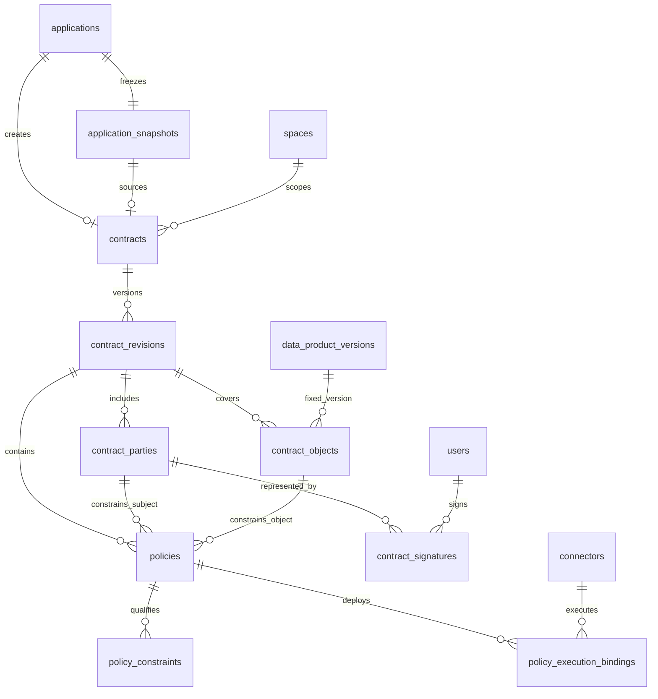
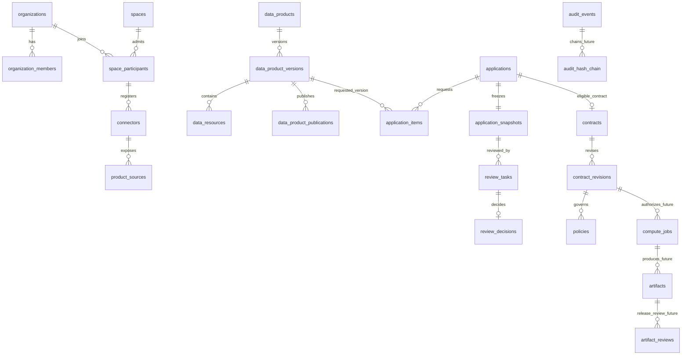

# MedTrust Space Phase 2-B.5-A PostgreSQL 数据库设计冻结 v5

> 日期：2026-07-22  
> 状态：Contract 数据库逻辑设计已冻结；ORM、migration、API 与 Compute 均未实现  
> 继承基线：`Phase2-database-design-v4.md` 继续作为 Identity 至 Review 的字段级基线  
> 当前实库：22 张表，Alembic head 为 `20260722_0007`  
> 目标数据库：PostgreSQL 16

## 0. 冻结结论

本版只同步 Contract 数据库设计，不修改既有数据库，也不生成代码。

```text
approved ApplicationSnapshot
  -> Eligibility Evidence
  -> Contract stable series
  -> immutable ContractRevision
  -> Parties / Objects / Policies / Bindings
  -> append-only Signatures
  -> signed Revision
  -> current activation guards
  -> active Revision
  -> future controlled Compute
```

冻结结论：

1. 全系统逻辑总表数仍为 **37**；
2. 当前实库仍为 **22** 张表，Alembic head 仍为 `20260722_0007`；
3. Contract 域使用八张表，不压缩为六张：
   - `contracts`；
   - `contract_revisions`；
   - `contract_parties`；
   - `contract_signatures`；
   - `contract_objects`；
   - `policies`；
   - `policy_constraints`；
   - `policy_execution_bindings`；
4. 不新增近义的 `contract_policies` 或 `contract_status` 表；
5. `contracts` 只保存稳定系列身份和来源证据，不保存权威 `status`、`current_revision_id` 或当前 Policy 指针；
6. `contract_revisions` 是协议内容、签署状态和运行生命周期的权威主体；
7. Revision 从 `draft` 进入 `proposed` 时冻结；任何反提案创建新 Revision；
8. Party、Object、Policy、Constraint 和 Binding 规格全部绑定具体 Revision；
9. Signature 是追加式签署事实，绑定 Party、Revision 和同一 `content_digest`；
10. Policy 不保存独立权威生命周期；是否可执行由 Revision active、Binding accepted 和当前运行守卫共同决定；
11. Contract 只可收窄 approved Application 范围，不能增加 Version、Action 或 Output；
12. `signed` 不等于 `active`，`active` 也不等于 Artifact 可以出域；
13. JSONB 只承载受约束证据或值，不作为整份可执行 Policy 的唯一权威字段；
14. 本阶段不创建任何表、索引、触发器或 migration。

### 0.1 相对 v4 的变化

| 项目 | v4 | v5 冻结 |
| --- | --- | --- |
| 总表数 | 37 | 37，不变。 |
| 已实现表 | 22 | 22，不变。 |
| Contract 表 | 8 张预留 | 8 张字段、约束、ER 与迁移批次正式冻结。 |
| Contract 状态 | 仅历史参考 | Contract 不存权威状态，由 Revision 集合投影。 |
| Revision 状态 | 旧设计含 negotiating | 使用 `proposed`，并增加 `superseded`、`withdrawn`。 |
| Revision 冻结 | 旧设计偏向签署后冻结 | `draft -> proposed` 即冻结协议结构。 |
| Policy | 旧设计含 version/status/effective window | 删除独立 version/status；生命周期继承 Revision。 |
| Handoff | 仅准入说明 | 保存最小 evidence JSONB 与 digest；激活仍实时复查。 |
| 签署 | 旧设计混合工作流与技术类型 | `signing_mode` 表达流程，`signature_type` 表达 demo/外部签名技术。 |

### 0.2 对原建议的两项修正

#### 不把 Contract 压缩为六表

`ContractPolicy` 一个表无法同时可靠表达：

- 明确主体、标的、动作和效果；
- 可查询的类型化限制；
- Policy 下发到哪个 Connector；
- Connector 是否接受该不可变规格；
- Binding 被撤销后如何阻断新任务。

因此保留 `policies + policy_constraints + policy_execution_bindings` 三层，不把执行控制藏进一个 JSONB。

#### `demo` 不是 signing mode

`signing_mode` 表达签署编排：

```text
peer_to_peer
platform_mediated
multi_party
```

`signature_type` 表达签名证据技术：

```text
demo
electronic
external_reference
```

V1 只实现 `demo`，页面必须明确标注“演示签署，无 CA 或法律效力声明”。

---

## 1. PostgreSQL 设计基线

### 1.1 通用约定

沿用 v4：

- 主键使用 UUID；
- 时间使用 UTC `timestamptz`；
- 业务枚举首期使用 `text + CHECK`；
- digest 格式统一为 `sha256:<64 lowercase hex>`；
- FK 引用列按真实查询路径显式建立索引；
- 跨行、跨表或当前状态规则不伪装为普通 CHECK；
- 证据对象不做业务软删除；需要停止使用时通过状态、终止事实或治理事件表达；
- 外部文件、私钥、Connector 凭据和真实医疗数据不进入 Contract 表。

摘要通用 CHECK：

```sql
value ~ '^sha256:[0-9a-f]{64}$'
```

JSONB 通用边界：

- evidence/snapshot 必须是 JSON object；
- array 顺序必须由 canonical 规则定义；
- 不允许 `NaN`、无限值、任意脚本或用户表达式；
- JSONB 不替代可以结构化约束的 FK、状态、动作、效果和时间窗口。

### 1.2 数据库与领域服务职责

| 规则 | 数据库 | 领域服务 |
| --- | --- | --- |
| PK/FK/唯一性/同 Revision 归属 | 强制 | 预校验并给出业务错误。 |
| Application/Snapshot 同 Space | 复合 FK | 创建前复查 approved 与当前守卫。 |
| Revision 状态词表与时间形态 | CHECK/触发器 | 执行合法命令。 |
| proposed 后结构不可变 | 触发器兜底 | 禁止原地编辑，创建新 Revision。 |
| 一 Application 一 Contract | UNIQUE | 幂等返回既有系列。 |
| 一系列一个候选/一个运行 Revision | 部分 UNIQUE | 锁定 Contract 后创建或激活。 |
| Contract 只可收窄 | 无法由单行 CHECK 完成 | 重建 Snapshot/Policy 输入并比较集合与上限。 |
| provider/consumer 映射 | 触发器可兜底 | 必须等于 Application 提供方/申请方。 |
| 签署人代表权限 | 复合 FK 保证成员关系 | 校验 active member、空间能力和职责分离。 |
| 所有必需签署完成 | 延迟一致性保护 | 同事务聚合并转为 signed。 |
| 当前激活守卫 | 不保存为历史真相 | 激活时实时复查 Space、组织、产品、Connector 与 hold。 |
| Binding 接受状态 | 状态 CHECK/触发器 | 下发、核验 receipt、暂停策略。 |
| Artifact 出域 | Contract 不授予 | 未来 ArtifactReview/Grant 决定具体制品。 |

---

## 2. 37 张逻辑表总览

| 领域 | 数量 | 表 | 当前状态 |
| --- | ---: | --- | --- |
| Identity | 4 | `organizations`、`users`、`organization_members`、`organization_member_roles` | 已实现 |
| Spaces | 3 | `spaces`、`space_participants`、`space_participant_roles` | 已实现 |
| Connectors | 2 | `connectors`、`connector_capabilities` | 已实现 |
| Catalog | 5 | `data_products`、`data_product_versions`、`data_resources`、`product_sources`、`data_product_publications` | 已实现 |
| Applications | 6 | `applications`、`application_items`、`application_snapshots`、`application_requested_actions`、`application_requested_output_types`、`application_attachments` | 已实现 |
| Reviews | 2 | `review_tasks`、`review_decisions` | 已实现 |
| Contracts | 8 | `contracts`、`contract_revisions`、`contract_parties`、`contract_signatures`、`contract_objects`、`policies`、`policy_constraints`、`policy_execution_bindings` | 本版冻结，未实现 |
| Compute/Artifact | 4 | `compute_jobs`、`compute_runs`、`artifacts`、`artifact_reviews` | 未来 |
| Audit | 2 | `audit_events`、`audit_hash_chain` | 未来 |
| Platform | 1 | `idempotency_keys` | 未来 |
| 合计 | **37** | - | **22 已实现，15 待实现** |

完成 Contract 八表后，预期为 30 张已实现表、7 张待实现表；这是后续目标，不是当前实库状态。

---

## 3. 上游引用与候选键

### 3.1 复用既有候选键

Contract 不要求上游新增专用字段，但 ContractObject 要用 Version ID 与摘要形成复合证据 FK，因此首批 Contract migration 必须给既有 `data_product_versions` 补一个 `(id, snapshot_digest)` 候选键。它只增加约束，不增加列、不改变表数。

```text
applications:
  UNIQUE (id, space_id)

application_snapshots:
  UNIQUE (application_id, id, snapshot_digest)

data_product_versions:
  EXISTING UNIQUE (data_product_id, id)
  EXISTING UNIQUE (space_id, id)
  EXISTING UNIQUE (data_product_id, snapshot_digest)
  V5 REQUIRED UNIQUE (id, snapshot_digest)

organization_members:
  UNIQUE (organization_id, user_id)
```

### 3.2 Eligibility Evidence 不是新事实表

Eligibility Evidence 是从 ApplicationSnapshot、ReviewTask 和 ReviewDecision 构建的不可变准入证据包，不新增 Eligibility 表。

`contracts` 固定：

- `application_snapshot_id`；
- `application_snapshot_digest`；
- `eligibility_evidence`；
- `eligibility_digest`。

ReviewDecision 仍是审核事实源；Contract 保存的是签约准入时所使用的证据包，不反向改写 Review。

---

## 4. `contracts`

### 4.1 表职责

一个 approved Application 对应的稳定协议系列。它证明一组 Revision 来自同一申请与审核证据，不代表当前可执行状态。

### 4.2 字段

| 字段 | 类型 | 约束 | 说明 |
| --- | --- | --- | --- |
| `id` | uuid | PK | 稳定 Contract ID。 |
| `space_id` | uuid | FK → `spaces.id`，RESTRICT | 所属空间。 |
| `application_id` | uuid | NOT NULL | 来源 Application。 |
| `application_snapshot_id` | uuid | NOT NULL | 被审核的不可变快照。 |
| `application_snapshot_digest` | text | digest CHECK | 快照摘要。 |
| `eligibility_evidence` | jsonb | object CHECK | 稳定准入证据包；不含动态时间和凭据。 |
| `eligibility_digest` | text | digest CHECK | Eligibility canonical digest。 |
| `contract_number` | text | NOT NULL | 空间内稳定业务编号。 |
| `created_at` | timestamptz | NOT NULL | 创建时间。 |
| `created_by` | uuid | FK → `users.id`，RESTRICT | 发起领域命令的用户。 |
| `row_version` | integer | NOT NULL，`>=1` | Revision 创建并发控制。 |
| `is_demo` | boolean | NOT NULL | V1 必须为 true。 |

不保存：

- `status`；
- `current_revision_id`；
- `provider_name` / `consumer_name`；
- 当前 Policy；
- Connector 凭据；
- Compute token。

### 4.3 键与索引

```text
UNIQUE (application_id)
UNIQUE (space_id, contract_number)
UNIQUE (id, space_id)
INDEX  (space_id, created_at DESC)
INDEX  (application_snapshot_digest)
INDEX  (eligibility_digest)
```

复合 FK：

```text
(application_id, space_id)
  -> applications(id, space_id)

(application_id, application_snapshot_id, application_snapshot_digest)
  -> application_snapshots(application_id, id, snapshot_digest)
```

### 4.4 不可变边界

Contract 创建后，除 `row_version` 外的来源证据和稳定编号不允许更新。Eligibility 变化不是更新既有 Contract 的理由，而是证据冲突或新 Application。

数据库 UNIQUE 阻止第二个 Contract 系列；领域服务负责：

- Application 必须 approved；
- Eligibility Evidence 必须可从当前历史重建；
- 当前 handoff guards 通过；
- 同一幂等请求返回既有 Contract。

---

## 5. `contract_revisions`

### 5.1 表职责

一条记录是一份完整、可提议、可签署、可激活的协议内容快照。Revision 是 Contract 域权威状态主体。

### 5.2 字段

| 字段 | 类型 | 约束 | 说明 |
| --- | --- | --- | --- |
| `id` | uuid | PK | Revision ID。 |
| `contract_id` | uuid | FK → `contracts.id`，RESTRICT | 所属系列。 |
| `revision_no` | integer | `>0` | 系列内单调编号。 |
| `supersedes_revision_id` | uuid | nullable | 被反提案或激活替代的 Revision。 |
| `name` | text | NOT NULL | 标题。 |
| `summary` | text | NOT NULL | 人类可读摘要。 |
| `terms_schema_version` | text | NOT NULL | 条款结构版本。 |
| `terms_document` | jsonb | object CHECK | 稳定人类条款结构，不承载 Policy 权威规则。 |
| `terms_digest` | text | digest CHECK | 条款正文摘要。 |
| `status` | text | CHECK | Revision 生命周期。 |
| `signing_mode` | text | CHECK | 签署编排方式。 |
| `effective_from` | timestamptz | nullable in draft | 生效起点。 |
| `effective_until` | timestamptz | nullable in draft | 生效终点。 |
| `handoff_guard_evidence` | jsonb | object CHECK，nullable in draft | propose 时最小当前守卫证据。 |
| `handoff_guard_digest` | text | digest CHECK，nullable in draft | 守卫证据摘要。 |
| `content_digest` | text | digest CHECK，nullable in draft | 完整签署内容摘要。 |
| `proposed_at` | timestamptz | nullable | 冻结时间。 |
| `signed_at` | timestamptz | nullable | 必需签名齐全时间。 |
| `activated_at` | timestamptz | nullable | 激活时间。 |
| `suspended_at` | timestamptz | nullable | 最近暂停时间。 |
| `ended_at` | timestamptz | nullable | 撤回、替代、到期或终止时间。 |
| `created_at` | timestamptz | NOT NULL | 创建时间。 |
| `created_by` | uuid | FK → `users.id`，RESTRICT | 创建用户。 |
| `row_version` | integer | `>=1` | 生命周期并发控制。 |

### 5.3 状态与签署词表

Revision status：

```text
draft
proposed
signed
active
suspended
expired
terminated
superseded
withdrawn
```

Signing mode：

```text
peer_to_peer
platform_mediated
multi_party
```

### 5.4 键、FK 与索引

```text
UNIQUE (contract_id, revision_no)
UNIQUE (id, contract_id)
UNIQUE (id, content_digest)
UNIQUE (contract_id, content_digest)
INDEX  (contract_id, revision_no DESC)
INDEX  (status, effective_until) WHERE status IN ('signed','active','suspended')
```

同系列替代关系：

```text
(supersedes_revision_id, contract_id)
  -> contract_revisions(id, contract_id)
```

并额外 CHECK：`supersedes_revision_id IS NULL OR supersedes_revision_id <> id`。

上述 `UNIQUE (id, content_digest)` 必须是非部分候选键，因为 `contract_signatures` 的复合 FK 要直接引用它；PostgreSQL 不允许 FK 以部分唯一索引作为目标。draft 的 null digest 不会破坏唯一约束语义。

部分唯一索引：

```sql
-- 最多一个开放候选；active/suspended 可与候选同时存在
UNIQUE (contract_id)
WHERE status IN ('draft','proposed','signed');

-- 最多一个当前运行或暂停的 revision
UNIQUE (contract_id)
WHERE status IN ('active','suspended');
```

### 5.5 行级 CHECK

1. `effective_until IS NULL OR effective_from IS NOT NULL`；
2. `effective_until IS NULL OR effective_until > effective_from`；
3. `status IN ('proposed','signed','active','suspended','expired','terminated','superseded')` 时，effective window、handoff evidence/digest、terms digest、content digest、`proposed_at` 均非空；
4. `withdrawn` 允许来自未提议 draft 或已提议候选：冻结字段必须“全部为空”或“全部完整”，不允许半冻结；
5. `status IN ('signed','active','suspended','expired','terminated')` 时 `signed_at` 非空；`superseded` 可能来自 proposed 反提案，因此不强制 signed_at；
6. `status IN ('active','suspended','terminated')` 时 `activated_at` 非空；`expired` 可能来自未能激活的 signed Revision；
7. 终态 `expired/terminated/superseded/withdrawn` 时 `ended_at` 非空；
8. `handoff_guard_evidence` 与 `terms_document` 必须为 JSON object。

CHECK 只验证当前行形态；签名齐全、Binding accepted、只收窄和当前守卫由事务服务与延迟保护完成。

### 5.6 状态转换

```text
draft -> proposed | withdrawn
proposed -> signed | superseded | withdrawn
signed -> active | expired | withdrawn
active -> suspended | expired | terminated | superseded
suspended -> active | expired | terminated | superseded
```

其余转换拒绝。

- `withdrawn` 只用于未激活候选；
- `terminated` 只用于 active/suspended 的提前永久结束；
- `expired` 和 `terminated` 使 Contract 系列终局；
- 新 Revision 激活时，旧 active/suspended 在同一事务转为 superseded。

### 5.7 proposed 后不可变

从 `proposed` 开始冻结：

- `contract_id/revision_no/supersedes_revision_id`；
- name、summary、terms；
- signing mode 与 effective window；
- handoff evidence/digest；
- Parties、Objects、Policies、Constraints；
- Binding 的 Policy/Connector/role/required 规格；
- content digest。

允许变化的只有：

- Revision lifecycle status 与对应时间；
- Signature 追加；
- Binding deployment status 与回执；
- `row_version`。

---

## 6. `contract_parties`

### 6.1 字段

| 字段 | 类型 | 约束 | 说明 |
| --- | --- | --- | --- |
| `id` | uuid | PK | Party ID。 |
| `contract_revision_id` | uuid | FK → revisions，RESTRICT | 所属 Revision。 |
| `organization_id` | uuid | FK → organizations，RESTRICT | 可验证组织。 |
| `party_role` | text | CHECK | provider/consumer/service_provider/operator_witness。 |
| `signing_order` | integer | `>0` | 签署顺序。 |
| `is_required` | boolean | NOT NULL | 是否必签。 |
| `party_name_snapshot` | text | NOT NULL | 组织名称历史快照。 |
| `identity_snapshot` | jsonb | object CHECK | 最小必要资质/身份快照。 |
| `created_at/updated_at` | timestamptz | NOT NULL | draft 编辑记录。 |
| `created_by` | uuid | FK → users，RESTRICT | 创建用户。 |

### 6.2 键与索引

```text
UNIQUE (contract_revision_id, organization_id, party_role)
UNIQUE (contract_revision_id, id)
UNIQUE (contract_revision_id, id, organization_id)
INDEX  (organization_id, party_role, contract_revision_id)
INDEX  (contract_revision_id, signing_order, party_role)
```

`signing_order` 不唯一：相同顺序值表示同一并行签署批次。领域服务只要求正整数、前序 required 批次完成后才开放下一批。

### 6.3 跨表不变量

- provider 必须等于 Application provider organization；
- consumer 必须等于 Application applicant organization；
- provider 与 consumer 至少各一条且必须 `is_required=true`；
- service provider 仅在真实承担执行职责时出现；
- operator witness 是否出现由 Space 规则决定；
- Party 角色不直接授予数据访问权。

这些规则通过 Contract 创建/提议服务强制，数据库 trigger 在 `draft -> proposed` 时兜底。

---

## 7. `contract_signatures`

### 7.1 字段

| 字段 | 类型 | 约束 | 说明 |
| --- | --- | --- | --- |
| `id` | uuid | PK | Signature ID。 |
| `contract_revision_id` | uuid | NOT NULL | 被签 Revision。 |
| `contract_party_id` | uuid | NOT NULL | 被代表 Party。 |
| `signer_organization_id` | uuid | NOT NULL | 签署时代表组织。 |
| `signer_user_id` | uuid | NOT NULL | 实际签署用户。 |
| `signature_type` | text | CHECK | demo/electronic/external_reference。 |
| `signature_value_ref` | text | NOT NULL | 演示证据或外部引用；不存私钥。 |
| `signed_content_digest` | text | digest CHECK | 必须等于 Revision digest。 |
| `authority_snapshot` | jsonb | object CHECK | 签署时授权摘要。 |
| `verification_status` | text | CHECK | V1 为 verified/failed。 |
| `signature_digest` | text | digest CHECK | 签署事实 canonical digest。 |
| `signed_at` | timestamptz | NOT NULL | 签署时间。 |
| `verified_at` | timestamptz | nullable | 核验时间。 |
| `created_at` | timestamptz | NOT NULL | 记录时间。 |

### 7.2 复合 FK

```text
(contract_revision_id, contract_party_id, signer_organization_id)
  -> contract_parties(contract_revision_id, id, organization_id)

(contract_revision_id, signed_content_digest)
  -> contract_revisions(id, content_digest)

(signer_organization_id, signer_user_id)
  -> organization_members(organization_id, user_id)
```

复合 FK 只能证明“是该组织成员”，不能证明签署时 active 或具有 `contract_signer` 能力；后者由领域服务检查并冻结到 `authority_snapshot`。

### 7.3 唯一性与索引

```text
UNIQUE (signature_digest)
INDEX  (signer_user_id, signed_at DESC)
INDEX  (contract_revision_id, signed_content_digest, verification_status)
```

部分唯一：

```sql
UNIQUE (contract_party_id, signed_content_digest)
WHERE verification_status = 'verified';
```

### 7.4 V1 边界

- V1 领域服务只创建 `signature_type='demo'`；
- demo signature 写入时必须 `verification_status='verified'` 且 `verified_at` 非空；
- Signature 行 append-only，禁止 UPDATE/DELETE；
- 不使用可变 `pending -> verified` 表达外部 CA 流程；未来真实签名需要独立验证事件设计；
- 证书后续撤销不覆盖历史 Signature，应产生治理/Audit 事件并暂停或终止 Revision。

---

## 8. `contract_objects`

### 8.1 字段

| 字段 | 类型 | 约束 | 说明 |
| --- | --- | --- | --- |
| `id` | uuid | PK | Object ID。 |
| `contract_revision_id` | uuid | FK → revisions，RESTRICT | 所属 Revision。 |
| `data_product_version_id` | uuid | NOT NULL | 固定产品版本。 |
| `product_snapshot_digest` | text | digest CHECK | 申请时产品摘要。 |
| `product_name_snapshot` | text | NOT NULL | 历史可读名称。 |
| `authorized_scope` | jsonb | object CHECK | requested scope 的结构化子集。 |
| `authorized_scope_digest` | text | digest CHECK | scope canonical digest。 |
| `position_no` | integer | `>0` | 多标的稳定顺序。 |
| `created_at/updated_at` | timestamptz | NOT NULL | draft 编辑记录。 |
| `created_by` | uuid | FK → users，RESTRICT | 创建用户。 |

### 8.2 键、FK 与索引

```text
(data_product_version_id, product_snapshot_digest)
  -> data_product_versions(id, snapshot_digest)

UNIQUE (contract_revision_id, data_product_version_id)
UNIQUE (contract_revision_id, position_no)
UNIQUE (contract_revision_id, id)
INDEX  (data_product_version_id, contract_revision_id)
```

### 8.3 范围规则

- Version ID 必须存在于来源 ApplicationSnapshot items；
- product digest 必须与 Snapshot 一致；
- `authorized_scope` 必须是对应 requested scope 的子集；
- Revision 至少一个 Object；
- Object 必须与 Contract 同 Space；
- 不保存 WSI 路径、患者 ID、PACS 地址或访问凭据；
- 不反向保存 `application_item_id`。

同 Space 和 subset 规则需要 join ApplicationSnapshot，不能由单行 CHECK 表达；由提议服务强制，并在 PostgreSQL 约束触发器中做最小兜底。

---

## 9. `policies`

### 9.1 字段

| 字段 | 类型 | 约束 | 说明 |
| --- | --- | --- | --- |
| `id` | uuid | PK | Policy ID。 |
| `contract_revision_id` | uuid | FK → revisions，RESTRICT | 所属 Revision。 |
| `policy_code` | text | NOT NULL | Revision 内稳定编码。 |
| `policy_type` | text | CHECK | permission/prohibition/obligation。 |
| `effect` | text | CHECK | permit/deny/require。 |
| `subject_contract_party_id` | uuid | NOT NULL | 受约束 Party。 |
| `contract_object_id` | uuid | NOT NULL | 目标 Object。 |
| `action_code` | text | CHECK | 受控执行动作。 |
| `priority` | integer | NOT NULL | 冲突排序提示；deny-overrides 优先。 |
| `policy_digest` | text | digest CHECK，nullable in draft | Policy 与 Constraint 摘要。 |
| `created_at/updated_at` | timestamptz | NOT NULL | draft 编辑记录。 |
| `created_by` | uuid | FK → users，RESTRICT | 创建用户。 |

不保存：

- `version_no`；
- `status`；
- 独立 `effective_from/until`；
- 任意可执行表达式；
- 整份 Policy 的无结构 authority JSON。

### 9.2 复合 FK 与唯一性

```text
(contract_revision_id, subject_contract_party_id)
  -> contract_parties(contract_revision_id, id)

(contract_revision_id, contract_object_id)
  -> contract_objects(contract_revision_id, id)

UNIQUE (contract_revision_id, policy_code)
UNIQUE (contract_revision_id, policy_digest) WHERE policy_digest IS NOT NULL
UNIQUE (contract_revision_id, id)
INDEX  (subject_contract_party_id, action_code)
INDEX  (contract_object_id, action_code)
INDEX  (contract_revision_id, priority DESC)
```

### 9.3 词表与组合 CHECK

V1 action codes：

```text
read_catalog_metadata
execute_controlled_compute
export_artifact
export_raw_data
reidentify_subject
redistribute_data
retain_intermediate
delete_intermediate
write_audit_log
```

组合约束：

```text
permission  -> permit
prohibition -> deny
obligation  -> require
```

### 9.4 生效投影

```text
Policy executable
  = parent Revision.status = active
  AND all required Bindings accepted
  AND current runtime guards pass
```

Policy 没有第二份 effective 状态。Binding revoked 会阻止新任务并触发治理流程，但不改写 Policy 行。

---

## 10. `policy_constraints`

### 10.1 字段

| 字段 | 类型 | 约束 | 说明 |
| --- | --- | --- | --- |
| `id` | uuid | PK | Constraint ID。 |
| `policy_id` | uuid | FK → policies，RESTRICT | 所属 Policy。 |
| `constraint_name` | text | CHECK | 冻结类型。 |
| `operator` | text | CHECK | eq/in/lte/gte/before/after。 |
| `value` | jsonb | NOT NULL | 受类型约束的标量或字符串数组。 |
| `unit` | text | nullable | seconds/count 等受控单位。 |
| `position_no` | integer | `>0` | canonical 稳定顺序。 |
| `created_at/updated_at` | timestamptz | NOT NULL | draft 编辑记录。 |

### 10.2 V1 类型矩阵

| constraint_name | operator | value JSON 类型 | unit |
| --- | --- | --- | --- |
| `purpose_code` | `in` | 非空字符串数组 | null |
| `algorithm_digest` | `eq` | digest 字符串 | null |
| `environment_mode` | `eq` | 字符串，V1 `controlled_compute` | null |
| `run_count` | `lte` | 正整数 | `count` |
| `effective_until` | `before` | RFC3339 时间字符串 | null |
| `output_type` | `in` | 非空字符串数组 | null |
| `output_review_required` | `eq` | boolean，V1 不能弱化 true | null |
| `retention_seconds` | `lte` | 非负整数 | `seconds` |
| `region` | `in` | 非空字符串数组 | null |
| `network_zone` | `eq` | 字符串 | null |
| `audit_level` | `gte` | 字符串 | null |

### 10.3 键、索引与验证

```text
UNIQUE (policy_id, position_no)
INDEX  (policy_id, constraint_name)
```

不默认建立 JSONB GIN。只有出现跨 Policy 的 value 包含查询并经查询计划验证后再增加。

数据库 migration 应提供 IMMUTABLE 校验函数验证 JSONB 顶层类型和 digest 形态；RFC3339 解析、词表子集、审计等级强弱与只收窄比较仍由领域服务负责。

---

## 11. `policy_execution_bindings`

### 11.1 字段

| 字段 | 类型 | 约束 | 说明 |
| --- | --- | --- | --- |
| `id` | uuid | PK | Binding ID。 |
| `policy_id` | uuid | FK → policies，RESTRICT | 被执行 Policy。 |
| `connector_id` | uuid | FK → connectors，RESTRICT | 执行节点。 |
| `execution_role` | text | CHECK | provider/consumer/service。 |
| `is_required` | boolean | NOT NULL | 是否为激活必需 Binding。 |
| `deployment_status` | text | CHECK | pending/accepted/rejected/revoked。 |
| `deployed_at` | timestamptz | nullable | 下发时间。 |
| `acknowledged_at` | timestamptz | nullable | 回执时间。 |
| `receipt_digest` | text | digest CHECK，nullable | accepted 回执摘要；后续撤销不得覆盖。 |
| `rejection_reason` | text | nullable | rejected 去敏原因。 |
| `revoked_at` | timestamptz | nullable | 撤销时间。 |
| `revocation_receipt_digest` | text | digest CHECK，nullable | 撤销回执摘要，与 accepted receipt 分离。 |
| `revocation_reason` | text | nullable | 撤销去敏原因。 |
| `created_at/updated_at` | timestamptz | NOT NULL | 记录时间。 |
| `row_version` | integer | `>=1` | 回执并发控制。 |

### 11.2 规格与运行状态分离

进入 Revision `content_digest` 的不可变规格：

```text
policy_id/policy_digest
connector_id
execution_role
is_required
```

不进入 `content_digest` 的运行状态：

```text
deployment_status
deployed_at
acknowledged_at
receipt_digest
rejection_reason
revoked_at
revocation_receipt_digest
revocation_reason
row_version
```

proposed 后可以更新运行状态，但不能换 Policy、Connector、role 或 required 标志。切换 Connector 必须新 Revision。

### 11.3 键、索引与状态形态

```text
UNIQUE (policy_id, connector_id, execution_role)
INDEX  (connector_id, deployment_status, deployed_at DESC)
INDEX  (policy_id, deployment_status)
```

部分索引：

```sql
INDEX (policy_id, connector_id)
WHERE deployment_status = 'pending';
```

行级形态：

- accepted 必须有 `acknowledged_at` 和 `receipt_digest`；
- rejected 必须有 `acknowledged_at` 和 `rejection_reason`；
- revoked 必须保留原 `receipt_digest`，并新增 `revoked_at`、`revocation_receipt_digest` 和 `revocation_reason`；
- pending 不得预先写 accepted receipt。

状态转换：

```text
pending -> accepted | rejected
accepted -> revoked
```

rejected/revoked 后需要重新部署到同一或其他 Connector 时，V1 创建新 Revision，不在已签 Revision 上重置为 pending。

### 11.4 跨表不变量

- Connector 与 Contract 必须同 Space；
- Connector 组织必须对应执行角色 Party；
- Connector capability 必须满足 action/environment；
- 所有 required Binding accepted 才允许激活；
- Connector 下线或 Binding revoked 阻止新 ComputeJob，并可触发 Revision suspended。

同 Space 和 capability 需要 join 多表，使用领域服务和约束触发器，不冗余复制 `space_id` 到 Binding。

---

## 12. Revision content digest

### 12.1 canonical manifest

`content_digest` 至少覆盖：

```json
{
  "schema_version": "contract-revision/v1",
  "digest_algorithm": "sha256",
  "contract_id": "uuid",
  "revision_no": 1,
  "supersedes_revision_id": null,
  "application_snapshot_digest": "sha256:...",
  "eligibility_digest": "sha256:...",
  "effective_window": {
    "from": "RFC3339 UTC",
    "until": "RFC3339 UTC"
  },
  "signing_mode": "multi_party",
  "terms_schema_version": "v1",
  "terms_digest": "sha256:...",
  "handoff_guard_digest": "sha256:...",
  "parties": [],
  "objects": [],
  "policies": [],
  "binding_specs": []
}
```

### 12.2 明确不进入摘要

- Revision lifecycle status；
- Signature 行；
- Binding deployment status 和 receipt；
- proposed/signed/activated/suspended/ended 时间；
- UI 投影；
- Connector credential；
- ComputeJob 或 Artifact ID。

### 12.3 排序

```text
Parties:     (party_role, organization_id, id)
Objects:     (position_no, data_product_version_id, id)
Policies:    (policy_code, subject_party_id, object_id, action_code)
Constraints:(policy_id, position_no)
Bindings:    (policy_id, connector_id, execution_role)
```

canonical JSON 复用 ApplicationSnapshot/Review Evidence 约定：UTF-8、key 排序、稳定数组排序、紧凑分隔符、`allow_nan=false`、SHA-256 小写十六进制。

### 12.4 Eligibility 与 Handoff 的边界

- `eligibility_evidence/digest` 固定“为什么当时有资格进入签约”；
- `handoff_guard_evidence/digest` 固定“创建或 propose 时当前状态检查了什么”；
- `computed_at/evaluated_at` 可作为 evidence 元数据保存，但不得因运行时间变化导致同一稳定证据内容摘要漂移；
- activate 时必须重新做当前状态检查，不能只信历史 handoff digest。

---

## 13. Policy 合成与只收窄

### 13.1 输入

```text
Space mandatory rules
  + DataProductVersion default policy snapshot
  + approved ApplicationSnapshot scope/actions/outputs
  + Review eligibility evidence
  + negotiated narrowing
  -> ContractRevision Policy set
```

### 13.2 合成规则

- permit：取交集；
- prohibition：取并集；
- obligation：取并集或更严格值；
- deny overrides；
- 缺少明确 permit 即拒绝；
- 数值上限取更小；
- 时间窗口取更短；
- Output 取已审请求子集；
- 算法 digest 必须等于申请快照；
- V1 强制生成 `deny export_raw_data`、`deny reidentify_subject`、`deny redistribute_data`。

### 13.3 数据库不能独立证明的规则

以下必须在 `propose_revision` 服务中重新构建并校验：

1. Object 非空且是 Application items 子集；
2. authorized scope 是 requested scope 子集；
3. Policy purpose 是 approved actions 子集；
4. output_type 是 requested outputs 子集；
5. 新 Revision 不宽于上一 signed/active Revision；
6. 产品默认 deny 未被覆盖；
7. required Binding 集合完整；
8. provider/consumer Party 正确。

数据库触发器负责阻止绕过正常服务后对已 proposed 内容的覆盖，不把复杂集合代数塞进 CHECK。

---

## 14. 触发器与延迟一致性

### 14.1 `guard_contract_source_immutable`

`contracts` 创建后禁止修改：

- space/application/snapshot；
- eligibility evidence/digest；
- contract number；
- created evidence。

只允许受控增加 `row_version`。

### 14.2 `guard_contract_revision_lifecycle`

负责：

- 只允许冻结状态转换图；
- 校验生命周期时间形态；
- 禁止 proposed 及以后更新结构字段；
- 禁止 expired/terminated 系列再创建 Revision；
- 激活替代必须在同一事务 supersede 旧 active/suspended。

### 14.3 `guard_contract_revision_children`

Party、Object、Policy、Constraint 与 Binding 规格：

- 只有父 Revision 为 draft 才允许 INSERT/UPDATE/DELETE；
- proposed 及以后拒绝任何规格变化；
- Binding 仅允许更新部署状态列；
- draft cleanup 必须显式按叶到根删除，不使用不受控 ORM cascade。

### 14.4 `guard_contract_signature_append_only`

- 只允许父 Revision 为 proposed 时 INSERT；
- digest 必须等于父 Revision；
- Party/组织/成员复合关系必须成立；
- 禁止 UPDATE/DELETE；
- V1 demo signature 必须写入 verified。

### 14.5 延迟签署一致性

事务结束时：

```text
Revision.status = signed
iff
all required Parties have one verified Signature
on the same content_digest
```

不存在签名时不得把 Revision 直接写成 signed；Decision/Signature 证据也不能在状态已推进后缺失。

### 14.6 激活命令

激活不能只靠一条 UPDATE。领域服务必须锁定 Contract/Revisions，并校验：

1. Revision 当前 signed；
2. 必需签名齐全；
3. 时间窗口有效；
4. Space 与参与组织 active；
5. Object 未治理禁用；
6. Policy 无冲突且仍只收窄；
7. required Bindings accepted；
8. Connector 在线且能力匹配；
9. 无行政 hold；
10. 同系列无另一 active/suspended，或在同事务 supersede 旧 Revision。

---

## 15. 删除、归档与保留

### 15.1 默认 RESTRICT

Contract FK 默认 RESTRICT。尤其：

- 已被 ContractObject 引用的 DataProductVersion 不可删除；
- 已签署 Revision 不可删除；
- Signature 不可删除；
- Policy 与 Binding 历史不能因 Connector 退役而消失。

### 15.2 draft 清理

只有从未 proposed、无 Signature、无 Compute 下游引用的 draft Revision 可以清理。

清理服务按以下顺序显式删除：

```text
policy_constraints
policy_execution_bindings
policies
contract_objects
contract_parties
contract_revision
```

稳定 Contract 只有在从未产生 proposed Revision 且无任何外部证据时才可由受控维护命令清理；普通业务不提供删除入口。

### 15.3 终止不是删除

- withdrawn：候选未激活即退出；
- superseded：被新 Revision 替代；
- expired：自然到期；
- terminated：active/suspended 提前永久终止；
- suspended：暂时阻断新任务，可重校验恢复。

这些状态保留全部历史，不回写 Application/Review。

---

## 16. 并发与幂等

| 场景 | 保护 |
| --- | --- |
| 重复创建 Contract | 锁 Application + UNIQUE application_id + idempotency key。 |
| 并发创建 revision_no | 锁 Contract 行，递增 row_version 后分配编号。 |
| 并发候选 Revision | 部分 UNIQUE 限制 draft/proposed/signed。 |
| 并发激活 | 锁 Contract 与所有 live Revision + 部分 UNIQUE active/suspended。 |
| 并发签署同 Party | verified partial UNIQUE；失败事务重读签署状态。 |
| 并发最后一个签名 | 延迟一致性保护统一推进 signed。 |
| 并发 Binding 回执 | row_version + 合法状态转换。 |
| 到期任务与新 Job | Job 创建直接检查 effective_until 与 active，不只依赖异步状态更新。 |
| 暂停与 Job 创建 | 锁 Revision；Job 创建必须读 active 与 Binding 当前状态。 |

Contract 域在 `idempotency_keys` 表实现前，可先由 API 层请求键和 `application_id` UNIQUE 组合实现最小幂等；不能因此宣称平台级幂等已经完成。

---

## 17. ER 图

### 17.1 Contract 详细 ER



### 17.2 全系统主链 ER



图中的 Compute/Artifact/Audit 是未来单向依赖，仅用于验证无循环；本阶段不创建这些表或代码。

---

## 18. 循环依赖与字段重复检查

### 18.1 无硬循环

```text
Application/Review -> Contract -> Compute -> Artifact -> Audit
```

- Contract 单向引用 ApplicationSnapshot/Eligibility；
- Review 不反向引用 Contract；
- ContractObject 单向引用 DataProductVersion；
- PolicyExecutionBinding 单向引用 Connector；
- Connector 不反向保存当前 Policy；
- Compute 未来单向引用 active ContractRevision；
- Contract 不保存当前 ComputeJob 或 Artifact 指针。

### 18.2 有意冗余

| 字段 | 原因 |
| --- | --- |
| `application_snapshot_digest` | 复合 FK 与历史证据核验。 |
| `eligibility_evidence + digest` | 可解释内容与篡改检测同时需要。 |
| `party_name_snapshot` | 组织改名不改变历史合同展示。 |
| `product_name_snapshot` | 产品改名不改变历史签约标的。 |
| `product_snapshot_digest` | 固定申请时版本证据。 |
| `contract_revision_id` on signatures | 强制 Signature、Party、Revision digest 同属一个 Revision。 |
| `signer_organization_id` | 强制签署人代表 Party 组织。 |
| `handoff_guard_evidence + digest` | 可解释当时守卫和摘要核验。 |

这些冗余都有复合 FK、digest 或触发器约束，不是可自由修改的第二真相源。

### 18.3 明确删除的旧字段

- `contracts.status`；
- `contracts.current_revision_id`；
- `policies.version_no`；
- `policies.status`；
- `policies.effective_from/until`；
- `contract_signatures.verification_status='revoked'` 的原地状态模型；
- `contract_revisions.status='negotiating'`。

---

## 19. 分批迁移顺序

### 19.1 当前基线

```text
20260722_0001_identity
20260722_0002_spaces
20260722_0003_connectors
20260722_0004_catalog
20260722_0005_applications
20260722_0006_application_extensions
20260722_0007_reviews   <- current head
```

### 19.2 建议实现批次

本版不创建 migration。后续实现建议拆成三批，而不是一次生成八表大迁移：

```text
Phase 2-B.5-B1 / 20260722_0008_contract_core
  add UNIQUE data_product_versions(id, snapshot_digest)
  contracts
  contract_revisions
  contract_parties
  contract_objects

Phase 2-B.5-B2 / 20260722_0009_contract_policy
  policies
  policy_constraints
  policy_execution_bindings

Phase 2-B.5-B3 / 20260722_0010_contract_signatures_guards
  contract_signatures
  immutable/lifecycle/append-only/deferred guards
```

每批必须在 PostgreSQL 16 验证 upgrade、downgrade 与跨批回归；不得只做离线 SQL 生成检查。

### 19.3 downgrade 顺序

```text
0010: drop signature/deferred guards -> drop contract_signatures
0009: drop policy/binding guards -> drop bindings -> constraints -> policies
0008: drop core guards -> objects -> parties -> revisions -> contracts
```

downgrade 仅用于开发/空测试库。生产历史证据库不把 downgrade 当作删除合约证据的业务机制。

---

## 20. PostgreSQL 16 验收矩阵

### 20.1 Core

- [ ] Alembic 从 `0007` 升级至 Contract 最新 head；
- [ ] 八张 Contract 表、FK、候选键、CHECK 与索引名称齐全；
- [ ] 第二个相同 Application Contract 被拒绝；
- [ ] Snapshot ID/digest 错配被复合 FK 拒绝；
- [ ] 跨 Contract 的 supersedes FK 被拒绝；
- [ ] 同一系列并发候选最多一个；
- [ ] 同一系列 active/suspended 最多一个。

### 20.2 Revision 不可变

- [ ] draft Party/Object/Policy 可编辑；
- [ ] proposed 后 Revision 结构更新被拒绝；
- [ ] proposed 后子表 INSERT/UPDATE/DELETE 被拒绝；
- [ ] Binding 运行状态可合法更新，但规格不可改变；
- [ ] counterproposal 创建新 Revision，旧 proposed 变 superseded；
- [ ] expired/terminated 系列不能新建 Revision。

### 20.3 Signature

- [ ] Signature 必须绑定同 Revision Party 和 digest；
- [ ] 非 Party 组织成员被拒绝；
- [ ] Signature UPDATE/DELETE 被拒绝；
- [ ] 同 Party/digest 第二个 verified Signature 被拒绝；
- [ ] 必需签名未齐全不能转 signed；
- [ ] 最后一个签名与 signed 状态在同事务一致。

### 20.4 Policy 与 Binding

- [ ] Policy Party/Object 跨 Revision 被复合 FK 拒绝；
- [ ] policy type/effect 非法组合被拒绝；
- [ ] 非法 action/constraint/operator/value 类型被拒绝；
- [ ] JSONB 不接受任意表达式或非法顶层类型；
- [ ] required Binding 未 accepted 时不能激活；
- [ ] accepted 无 receipt 被拒绝；
- [ ] Connector 跨 Space 或 capability 不足时激活失败；
- [ ] Binding revoked 后新 Job 准入失败。

### 20.5 领域不变量

- [ ] 非 approved Application 无法创建 Contract；
- [ ] Eligibility digest 冲突不覆盖既有 Contract；
- [ ] ContractObject 只能选 Snapshot 中 Version；
- [ ] Policy Action/Output 只能收窄；
- [ ] 新 Revision 不宽于上一 signed/active Revision；
- [ ] signed 不自动 active；
- [ ] active 不直接释放 Artifact；
- [ ] suspend/terminate 不改写 Application/Review 历史。

### 20.6 Migration

- [ ] `0007 -> 0008 -> 0009 -> 0010` 成功；
- [ ] `0010 -> 0009 -> 0008 -> 0007` 成功；
- [ ] 再次升级成功；
- [ ] 全量 Identity/Space/Connector/Catalog/Application/Review 回归通过；
- [ ] 并发创建、签署和激活专项测试在真实 PostgreSQL 16 通过。

---

## 21. v5 冻结清单

- [x] 37 张逻辑表总数保持不变。
- [x] 当前 22 张实库表与 `0007` head 未改变。
- [x] Contract 八表而非六表。
- [x] Contract 仅为系列身份，无 status/current pointer。
- [x] Revision 是权威状态主体。
- [x] proposed 后结构不可变。
- [x] signed 与 active 分离。
- [x] Party/Object/Policy/Binding 全部绑定 Revision。
- [x] ContractObject 固定 DataProductVersion ID 与 digest。
- [x] Policy 不保存独立 version/status/effective 真相。
- [x] Constraint 使用冻结词表和类型矩阵。
- [x] Binding 规格与部署状态分离。
- [x] Signature 追加式并绑定同一 content digest。
- [x] Eligibility 与 Handoff 证据边界明确。
- [x] Revision content digest canonical 边界明确。
- [x] Contract 只可收窄 Application/Review 范围。
- [x] Artifact 出域仍属于未来独立审核与授权。
- [x] 三批 migration 顺序与 PostgreSQL 验收矩阵已定义。
- [x] 本阶段未生成 ORM、migration、API 或 Compute 代码。

---

## 22. 最终结论与下一步

Contract 数据库冻结 v5 通过后，系统主链为：

```text
DataProductVersion
  -> ApplicationSnapshot
  -> Review Decisions
  -> Eligibility Evidence
  -> Contract
  -> immutable ContractRevision
  -> structured Policies
  -> Connector Bindings
  -> append-only Signatures
  -> active authorization boundary
  -> future controlled Compute
```

下一阶段不是一次性实现八表，而应先进入：

```text
Phase 2-B.5-B1 Contract Core ORM + Migration
```

首批仅实现 `contracts`、`contract_revisions`、`contract_parties`、`contract_objects` 及其核心复合完整性；Policy、Signature、API、Compute 和真实电子签名仍不在首批范围。

这份 v5 是 Contract 后续 ORM 的数据库权威基线。若实现阶段需要改变表数、Revision 冻结点、Policy 生命周期或签署证据语义，必须先更新冻结设计，不能由 migration 临时决定。
