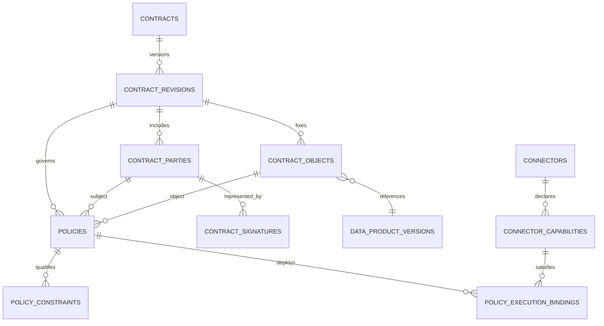
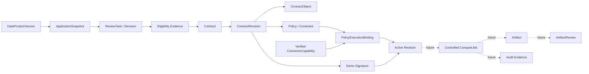

# MedTrust Space Phase 2-B.5-C PostgreSQL 数据库冻结设计 v6

> 日期：2026-07-22  
> 状态：Contract Policy 数据库设计已冻结；ORM、migration、API 与 Compute 均未实现  
> 继承基线：`Phase2-database-design-v5.md`、`Phase2-B5-contract-policy-model.md`  
> 当前实库：26 张表，Alembic head 为 `20260722_0008_contract_core`  
> 目标数据库：PostgreSQL 16

## 0. 冻结结论

v6 不是新增四张逻辑表，而是把 v5 已预留、B1 尚未实现的四张 Contract 表同步到可实施状态：

```text
policies
policy_constraints
policy_execution_bindings
contract_signatures
```

因此：

1. 全系统逻辑总表数仍为 **37**；
2. 当前实库仍为 **26** 张表；
3. 完成 Contract 剩余四表后，预计实库为 **30** 张表；
4. 不新增平行的 `contract_policies`、`contract_constraints` 或 `contract_connector_bindings`；
5. `Policy`、`PolicyConstraint`、`PolicyExecutionBinding` 与 `ContractSignature` 继续属于 `ContractRevision` 聚合；
6. 数据版本和数据范围仍由 `ContractObject` 权威表达，Constraint 不重复保存；
7. Binding 从具体 Policy 指向具体 Connector，并固定所需 capability code/version；
8. Signature 只保存演示签署证据，不实现 CA 或真实电子签名；
9. Policy 没有独立状态，是否可执行由 Revision、Binding 和当前守卫共同派生；
10. 本阶段只生成数据库设计文档，不改变 schema、代码或运行环境。

v6 相对 v5 的实质修订：

- `policy_execution_bindings.execution_role` 从宽泛的 provider/consumer/service 改为执行职责词表；
- Binding 增加 `required_capability_code` 与 `required_capability_version`，形成到现有 `connector_capabilities` 的复合 FK；
- Connector 执行能力代码和 V1 精确版本正式冻结；
- `PolicyConstraint` 明确拒绝 `data_scope` 一类重复数据范围；
- V1 Signature 在数据库层收紧为 demo + verified；
- 当前 migration 基线由 v5 的 0007 更新为已验证的 0008；
- 后续迁移拆为 0009 Policy/Binding 和 0010 Signature/guards 两批。

## 1. PostgreSQL 设计基线

### 1.1 通用约定

- 主键使用 UUID；
- 时间使用 UTC `timestamptz`；
- 业务词表首期使用 `text + CHECK`；
- digest 统一为 `sha256:<64 lowercase hex>`；
- JSONB 必须限制顶层类型，不承载任意表达式或用户脚本；
- 证据和已 proposed 内容不做普通业务软删除；
- 外键默认 `RESTRICT`，draft 清理由领域维护命令显式执行；
- 不使用 ORM 无边界 cascade 删除合同证据；
- 所有跨 Revision、跨 Space 和跨组织关系优先使用复合 FK 或事务服务证明；
- 动态 Connector 在线状态不进入签署摘要。

摘要 CHECK：

```sql
value ~ '^sha256:[0-9a-f]{64}$'
```

### 1.2 v6 权威范围

v6 对以下内容具有权威性：

- 剩余四张 Contract 表的字段、约束、索引与不可变规则；
- Connector execution capability 词表和 Contract Binding 映射；
- draft → proposed、proposed → signed、signed → active 的数据库/领域服务边界；
- 0009、0010 迁移顺序和 PostgreSQL 16 验收矩阵。

以下内容保持现状：

- Identity、Spaces、Catalog、Application、Review 表结构；
- Contract Core 0008 的四张表和既有候选键；
- Compute、Artifact、Audit 与 Platform 仍为未来逻辑表。

## 2. 37 张逻辑表总览

| 领域 | 逻辑表数 | 表 | 当前状态 |
| --- | ---: | --- | --- |
| Identity | 4 | `organizations`、`users`、`organization_members`、`organization_member_roles` | 已实现 |
| Spaces | 3 | `spaces`、`space_participants`、`space_participant_roles` | 已实现 |
| Connectors | 2 | `connectors`、`connector_capabilities` | 已实现；v6 补充能力语义 |
| Catalog | 5 | `data_products`、`data_product_versions`、`data_resources`、`product_sources`、`data_product_publications` | 已实现 |
| Applications | 6 | `applications`、`application_items`、`application_snapshots`、`application_requested_actions`、`application_requested_output_types`、`application_attachments` | 已实现 |
| Reviews | 2 | `review_tasks`、`review_decisions` | 已实现 |
| Contracts | 8 | `contracts`、`contract_revisions`、`contract_parties`、`contract_objects`、`policies`、`policy_constraints`、`policy_execution_bindings`、`contract_signatures` | Core 四表已实现；剩余四表本版冻结 |
| Compute/Artifact | 4 | `compute_jobs`、`compute_runs`、`artifacts`、`artifact_reviews` | 未来 |
| Audit | 2 | `audit_events`、`audit_hash_chain` | 未来 |
| Platform | 1 | `idempotency_keys` | 未来 |
| 合计 | **37** | - | **26 已实现，11 待实现** |

完成 0009 和 0010 后：

```text
30 implemented
7 future
```

不因能力词表、Policy 编译报告或 Eligibility 投影增加表。

## 3. 现有 Connector Capability 的 v6 语义

### 3.1 不新增 Connector 表或列

现有复合主键已能固定能力版本：

```text
connector_capabilities PK
  (connector_id, capability_code, capability_version)
```

现有字段继续使用：

| 字段 | 用途 |
| --- | --- |
| `connector_id` | 所属 Connector |
| `capability_code` | 能力代码 |
| `capability_version` | 能力协议版本 |
| `status` | declared / verified / disabled |
| `parameters` | 受能力类型约束的非敏感参数 |
| `verified_at` | 最近一次通过能力验证的时间 |

### 3.2 V1 执行能力词表

Contract Binding 首期只接受：

```text
controlled_compute_execution
egress_policy_enforcement
audit_evidence_emit
```

V1 `capability_version` 统一使用精确值：

```text
1.0
```

V1 不做 `>=1.0`、`^1.0` 或语义版本范围解析。能力升级必须显式注册新版本，并由新 Revision 重新绑定。

### 3.3 能力参数最小结构

`parameters` 仍为 JSONB，但必须按 capability code 校验。

`controlled_compute_execution/1.0`：

```json
{
  "environment_modes": ["controlled_compute"],
  "algorithm_digest_enforced": true,
  "run_count_enforced": true,
  "effective_window_enforced": true
}
```

`egress_policy_enforcement/1.0`：

```json
{
  "raw_export_denied": true,
  "artifact_review_gate": true,
  "output_type_filter": true
}
```

`audit_evidence_emit/1.0`：

```json
{
  "audit_levels": ["full"],
  "digest_algorithm": "sha256",
  "failure_mode": "fail_closed"
}
```

不得写入：

- Connector 私钥或访问凭据；
- 患者数据或资源路径；
- 可执行脚本；
- 未受约束的策略表达式。

### 3.4 状态形态

建议 0009 给既有表补充行形态保护：

```text
declared -> verified -> disabled -> verified
declared -> disabled
```

规则：

- `declared`：`verified_at IS NULL`；
- `verified`：`verified_at IS NOT NULL`；
- `disabled`：允许保留历史 `verified_at`，但不能满足 proposal/active 当前守卫；
- disabled 只能通过受控重新验证命令恢复 verified，并把 `verified_at` 更新为本次验证时间；普通字段 UPDATE 不得恢复；
- 能力协议本身发生变化时必须注册新 `capability_version`，不能借重新验证改变 `parameters` 的协议语义；
- 能力 status 和 Connector runtime status 不进入 Revision content digest。

### 3.5 Contract 使用门槛

- draft Binding 可以引用 declared 或 verified 能力行；
- draft → proposed 时，所有 required Binding 的能力必须为 verified；
- signed → active 时必须再次确认能力仍为 verified；
- active 后能力 disabled、Connector verification revoked 或运行离线，必须阻止新 ComputeJob，并触发 Revision suspended 的治理流程；
- 复合 FK 只证明能力行存在，不能替代上述动态校验。

## 4. `policies`

### 4.1 表职责

一条 Policy 是某个 ContractRevision 内的“主体—数据对象—动作—效果”规范。它不保存独立生命周期状态，也不脱离 Revision 复用。

### 4.2 字段

| 字段 | 类型 | 约束 | 说明 |
| --- | --- | --- | --- |
| `id` | uuid | PK | Policy ID |
| `contract_revision_id` | uuid | NOT NULL | 所属 Revision |
| `policy_code` | text | NOT NULL，非空 | Revision 内稳定代码 |
| `policy_type` | text | CHECK | permission/prohibition/obligation |
| `effect` | text | CHECK | permit/deny/require |
| `subject_contract_party_id` | uuid | NOT NULL | 受约束 Party |
| `contract_object_id` | uuid | NOT NULL | 作用于固定版本 Object |
| `action_code` | text | CHECK | 执行动作 |
| `priority` | integer | `>=0` | 稳定解释顺序，不覆盖 deny |
| `policy_digest` | text | digest CHECK，draft 可空 | Policy + Constraints 摘要 |
| `created_at` | timestamptz | NOT NULL | 创建时间 |
| `updated_at` | timestamptz | NOT NULL | draft 修改时间 |
| `created_by` | uuid | FK → users，RESTRICT | 创建用户 |

不保存：

- `status`；
- `version_no`；
- 独立 effective window；
- 数据路径或凭据；
- 整份可执行策略 JSON；
- Application Action 自由字符串。

### 4.3 复合 FK

```text
(contract_revision_id, subject_contract_party_id)
  -> contract_parties(contract_revision_id, id)

(contract_revision_id, contract_object_id)
  -> contract_objects(contract_revision_id, id)
```

保证 Policy 的 Party 和 Object 同属一个 Revision。

### 4.4 唯一性与索引

```text
UNIQUE (contract_revision_id, policy_code)
UNIQUE (contract_revision_id, policy_digest)
  WHERE policy_digest IS NOT NULL
UNIQUE (contract_revision_id, id)

INDEX (subject_contract_party_id, action_code)
INDEX (contract_object_id, action_code)
INDEX (contract_revision_id, priority DESC)
INDEX (created_by)
```

### 4.5 词表

V1 可持久化 action codes：

```text
read_catalog_metadata
execute_controlled_compute
export_artifact
export_raw_data
reidentify_subject
redistribute_data
retain_intermediate
delete_intermediate
write_audit_log
```

其中 `read_catalog_metadata` 仅保留兼容性；V1 Contract 最小策略编译器不生成该动作，Catalog 可发现性由 Catalog/Space 治理。

合法 type/effect 组合：

```text
permission  -> permit
prohibition -> deny
obligation  -> require
```

数据库 CHECK 必须拒绝其他组合。

### 4.6 最小策略完整性

每个 consumer Party 与 ContractObject 至少需要：

- permit `execute_controlled_compute`；
- deny `export_raw_data`；
- deny `reidentify_subject`；
- deny `redistribute_data`；
- require `write_audit_log`；
- 仅当申请/审核允许候选结果类型时，才可增加 permit `export_artifact`。

该集合是 proposal 领域服务和延迟触发器的完整性条件，不通过新增“策略模板表”表达。

## 5. `policy_constraints`

### 5.1 表职责

Constraint 只表达 Policy 的执行上下文和上限。它不定义 DataProductVersion，也不复制 ContractObject 的 `authorized_scope`。

### 5.2 字段

| 字段 | 类型 | 约束 | 说明 |
| --- | --- | --- | --- |
| `id` | uuid | PK | Constraint ID |
| `policy_id` | uuid | FK → policies，RESTRICT | 所属 Policy |
| `constraint_name` | text | CHECK | 冻结类型 |
| `operator` | text | CHECK | eq/in/lte/gte/before/after |
| `value` | jsonb | NOT NULL | 受类型矩阵限制的值 |
| `unit` | text | nullable | count/seconds 等受控单位 |
| `position_no` | integer | `>0` | canonical 稳定顺序 |
| `created_at` | timestamptz | NOT NULL | 创建时间 |
| `updated_at` | timestamptz | NOT NULL | draft 修改时间 |

### 5.3 V1 类型矩阵

| constraint_name | operator | value | unit |
| --- | --- | --- | --- |
| `purpose_code` | `in` | 非空、去重、排序后的 action string[] | null |
| `algorithm_digest` | `eq` | `sha256:<64 hex>` | null |
| `environment_mode` | `eq` | `controlled_compute` | null |
| `run_count` | `lte` | 正整数 | `count` |
| `effective_until` | `before` | RFC3339 UTC 字符串 | null |
| `output_type` | `in` | 非空、去重、排序后的 output string[] | null |
| `output_review_required` | `eq` | `true` | null |
| `retention_seconds` | `lte` | 非负整数 | `seconds` |
| `region` | `in` | 非空、去重、排序后的 string[] | null |
| `network_zone` | `eq` | 非空 string | null |
| `audit_level` | `gte` | `full` | null |

`after` 保留在 operator 顶层词表中供未来迁移兼容，但 V1 类型矩阵没有任何合法组合，校验函数必须拒绝。

V1 不允许：

```text
data_scope
data_product_version
raw_path
patient_filter
sql_expression
script
custom_expression
```

数据范围权威源：

```text
ContractObject
  -> data_product_version_id
  -> product_snapshot_digest
  -> authorized_scope
  -> authorized_scope_digest
```

### 5.4 键和索引

```text
UNIQUE (policy_id, position_no)
INDEX  (policy_id, constraint_name)
```

不默认建立 JSONB GIN 索引。Constraint 查询主路径是按 Policy 读取完整集合。

### 5.5 PostgreSQL 校验函数

0009 应创建 IMMUTABLE 函数，例如：

```text
validate_policy_constraint_v1(
  constraint_name text,
  operator text,
  value jsonb,
  unit text
) returns boolean
```

函数负责：

- JSONB 顶层类型；
- operator 与 constraint_name 组合；
- digest 格式；
- 整数正负和单位；
- 数组非空、元素均为字符串；
- purpose/output 冻结词表；
- V1 `output_review_required=true`；
- V1 `audit_level='full'`；
- 拒绝任意表达式。

函数不负责：

- purpose/output 是否是某 ApplicationSnapshot 的子集；
- effective_until 是否收窄 Revision；
- run_count 是否收窄上游上限；
- authorized_scope 子集判断。

这些由 Policy 编译服务和 proposal 守卫完成。

## 6. `policy_execution_bindings`

### 6.1 表职责

Binding 固定“哪一条 Policy，由哪个 Connector，以什么执行角色和能力版本承接”。它不是访问令牌，也不代表 Revision 已 active。

### 6.2 字段

| 字段 | 类型 | 约束 | 是否进入 content_digest | 说明 |
| --- | --- | --- | --- | --- |
| `id` | uuid | PK | 是 | Binding ID |
| `policy_id` | uuid | FK → policies，RESTRICT | 是 | 被执行 Policy |
| `connector_id` | uuid | NOT NULL | 是 | 执行 Connector |
| `execution_role` | text | CHECK | 是 | compute/egress/audit 执行职责 |
| `required_capability_code` | text | CHECK | 是 | 所需能力代码 |
| `required_capability_version` | text | V1=`1.0` | 是 | 精确能力版本 |
| `is_required` | boolean | NOT NULL | 是 | 是否为激活必需 |
| `deployment_status` | text | CHECK | 否 | pending/accepted/rejected/revoked |
| `deployed_at` | timestamptz | nullable | 否 | 下发时间 |
| `acknowledged_at` | timestamptz | nullable | 否 | 回执时间 |
| `receipt_digest` | text | digest CHECK，nullable | 否 | accepted 回执摘要 |
| `rejection_reason` | text | nullable | 否 | 去敏拒绝原因 |
| `revoked_at` | timestamptz | nullable | 否 | 撤销时间 |
| `revocation_receipt_digest` | text | digest CHECK，nullable | 否 | 撤销回执摘要 |
| `revocation_reason` | text | nullable | 否 | 去敏撤销原因 |
| `created_at` | timestamptz | NOT NULL | 否 | 创建时间 |
| `updated_at` | timestamptz | NOT NULL | 否 | 状态更新时间 |
| `row_version` | integer | `>=1` | 否 | 并发控制 |

`required_capability_code/version` 是 v6 新冻结字段，不是新表。

### 6.3 复合 FK

```text
policy_id
  -> policies(id)

(connector_id, required_capability_code, required_capability_version)
  -> connector_capabilities(
       connector_id,
       capability_code,
       capability_version
     )
```

第二个 FK 同时证明 Connector 和能力版本行存在，因此不再额外建立一个可产生重复错误信息的单列 connector FK。

### 6.4 执行角色与能力组合 CHECK

```text
compute_executor
  -> controlled_compute_execution / 1.0

egress_controller
  -> egress_policy_enforcement / 1.0

audit_evidence_emitter
  -> audit_evidence_emit / 1.0
```

非法 role/code/version 组合在单行 CHECK 层拒绝。

### 6.5 Policy action 与 Binding 完整性

| Policy action/effect | required execution role |
| --- | --- |
| permit `execute_controlled_compute` | compute_executor |
| permit `export_artifact` | egress_controller |
| deny `export_raw_data` | egress_controller |
| deny `redistribute_data` | egress_controller |
| deny `reidentify_subject` | compute_executor + egress_controller |
| require `write_audit_log` | audit_evidence_emitter |
| require retain/delete intermediate | compute_executor；必要时 egress_controller |

该完整性需要读取 Policy 集合，不能只靠单行 CHECK。proposal 服务必须计算，PostgreSQL 延迟触发器做最小兜底。

### 6.6 唯一性与索引

```text
UNIQUE (
  policy_id,
  connector_id,
  execution_role,
  required_capability_code,
  required_capability_version
)

INDEX (connector_id, deployment_status, deployed_at DESC)
INDEX (policy_id, deployment_status)
INDEX (required_capability_code, required_capability_version, deployment_status)
```

pending 部分索引：

```sql
INDEX (policy_id, connector_id)
WHERE deployment_status = 'pending';
```

### 6.7 状态形态

```text
pending -> accepted | rejected
accepted -> revoked
```

行级规则：

- pending：不得有回执、拒绝或撤销字段；
- accepted：必须有 `acknowledged_at` 与 `receipt_digest`；
- rejected：必须有 `acknowledged_at` 与 `rejection_reason`，不得有 accepted receipt；
- revoked：必须保留 accepted `receipt_digest`，并新增撤销时间、回执和原因；
- rejected/revoked 不允许重置为 pending；
- 更换 Connector 或能力版本必须创建新 Revision。

### 6.8 跨表守卫

proposal 时：

- Connector 与 Contract 同 Space；
- Connector owner organization 是该 Revision 的 provider/service_provider/operator_witness Party，并符合 execution role；
- Connector verification status 为 verified；
- required capability status 为 verified 且 `verified_at` 非空；
- capability parameters 满足 Policy Constraints；
- 所有必需 Policy 已有 required Binding spec。

activate 时全部重查，并额外要求：

- required Binding deployment_status=accepted；
- Connector runtime status 可执行；
- receipt digest 与冻结 Policy/Connector/role/capability spec 对应；
- 无 revoked Binding 或治理 hold。

Binding accepted 只证明节点承接规格，不授予执行权。

## 7. `contract_signatures`

### 7.1 表职责

Signature 是针对某个不可变 Revision content digest 的追加式演示签署事实。V1 不模拟 CA、证书链或法律效力。

### 7.2 字段

| 字段 | 类型 | 约束 | 说明 |
| --- | --- | --- | --- |
| `id` | uuid | PK | Signature ID |
| `contract_revision_id` | uuid | NOT NULL | 被签 Revision |
| `contract_party_id` | uuid | NOT NULL | 被代表 Party |
| `signer_organization_id` | uuid | NOT NULL | 代表组织 |
| `signer_user_id` | uuid | NOT NULL | 实际签署用户 |
| `signature_type` | text | V1 CHECK=`demo` | 演示签署类型 |
| `signature_value_ref` | text | NOT NULL | 演示证据引用，不存私钥 |
| `signed_content_digest` | text | digest CHECK | 必须等于 Revision digest |
| `authority_snapshot` | jsonb | object CHECK | 签署时代表权限快照 |
| `verification_status` | text | V1 CHECK=`verified` | 演示核验状态 |
| `signature_digest` | text | digest CHECK | 签署事实摘要 |
| `signed_at` | timestamptz | NOT NULL | 签署时间 |
| `verified_at` | timestamptz | NOT NULL | 演示核验时间 |
| `created_at` | timestamptz | NOT NULL | 记录时间 |

v6 比 v5 更严格：初始 migration 不接受 electronic/external_reference/failed。未来真实签名必须通过新领域设计和 schema migration 显式扩展。

### 7.3 复合 FK

```text
(contract_revision_id, contract_party_id, signer_organization_id)
  -> contract_parties(contract_revision_id, id, organization_id)

(contract_revision_id, signed_content_digest)
  -> contract_revisions(id, content_digest)

(signer_organization_id, signer_user_id)
  -> organization_members(organization_id, user_id)
```

数据库只证明成员关系存在；领域服务还需证明签署时成员 active 且具备演示签署职责，并冻结到 `authority_snapshot`。

### 7.4 authority snapshot 最小结构

```json
{
  "schema_version": "1.0",
  "is_demo": true,
  "organization_id": "uuid",
  "user_id": "uuid",
  "organization_member_id": "uuid",
  "membership_status": "active",
  "authority_code": "demo_contract_signer",
  "scope": {
    "contract_revision_id": "uuid",
    "contract_party_id": "uuid"
  }
}
```

不得保存：

- 私钥；
- 密码或认证令牌；
- 患者身份；
- 伪造的 CA serial/certificate chain。

### 7.5 唯一性与索引

```text
UNIQUE (signature_digest)
UNIQUE (contract_party_id, signed_content_digest)
INDEX  (signer_user_id, signed_at DESC)
INDEX  (contract_revision_id, signed_content_digest)
```

因为 V1 只允许 verified，Party/content 的唯一约束可使用普通 UNIQUE，不需要状态部分索引。

### 7.6 追加式保护

- 仅父 Revision 为 proposed 时允许 INSERT；
- `signed_content_digest` 必须与父 Revision 完全一致；
- Signature 禁止 UPDATE/DELETE；
- 错签不能覆盖，应 withdraw/supersede Revision；
- 最后一个必需 Party 签署和 Revision → signed 必须在同一事务满足延迟一致性；
- Signature 行不进入 Revision content digest，避免循环摘要。

## 8. Policy 编译与只收窄证明

### 8.1 输入

```text
Space mandatory rules
+ DataProductVersion default policy snapshots
+ approved ApplicationSnapshot
+ Review Eligibility Evidence
+ negotiated narrowing
```

### 8.2 输出，不新增表

`PolicyCompilationReport` 是领域服务瞬时值。其稳定部分进入：

```text
contract_revisions.handoff_guard_evidence.policy_compilation
contract_revisions.handoff_guard_digest
```

至少包括：

- compiler version；
- ApplicationSnapshot、Eligibility、Space rules、Product policies 摘要；
- normalized claims digest；
- compiled Policy set digest；
- action/output/object/scope 子集检查结果；
- 与上一 signed/active Revision 的不扩大检查结果。

不进入摘要：

- evaluated_at；
- HTTP request id；
- UI 操作者名称；
- 运行耗时。

### 8.3 合成规则

- permit 取交集；
- deny 取并集；
- obligation 取并集或更严格值；
- deny overrides；
- 缺少明确 permit 即拒绝；
- output 只能是申请且审核允许的子集；
- numeric/time/retention 限制取更小或更短；
- algorithm digest 精确匹配；
- ContractObject Version 必须与 Snapshot 完全一致；
- authorized_scope 必须为 requested_scope 子集；
- 新 Revision 不得宽于上一 signed/active Revision；
- 任何扩大返回 `new_application_required`。

数据库负责结构和不可变保护；集合代数由 proposal 服务负责，不把通用规则引擎塞进 PL/pgSQL。

## 9. Revision content digest v6

### 9.1 进入摘要

- Contract ID、revision_no、supersedes_revision_id；
- ApplicationSnapshot digest 与 Eligibility digest；
- effective window、signing mode；
- terms digest 与 handoff guard digest；
- 排序后的 Parties；
- 排序后的 ContractObjects；
- 排序后的 Policies 与 Constraints；
- Binding 不可变规格：

```text
policy_id
policy_digest
connector_id
execution_role
required_capability_code
required_capability_version
is_required
```

### 9.2 不进入摘要

- Revision status 和生命周期时间戳；
- Signature 行；
- Binding deployment status、receipt、rejection、revocation 字段；
- Connector capability 当前 status/verified_at；
- Connector runtime status/heartbeat；
- ComputeJob/Artifact/Audit ID；
- Connector 凭据。

### 9.3 canonical 规则

```text
UTF-8
object keys ascending
stable arrays
compact separators
allow_nan=false
sha256:<64 lowercase hex>
```

数组排序：

```text
Parties:    party_role, organization_id, id
Objects:    position_no, data_product_version_id, id
Policies:   policy_code, subject_party_id, object_id, action_code
Constraints:policy_id, position_no
Bindings:   policy_id, connector_id, execution_role,
            required_capability_code, required_capability_version
```

## 10. 生命周期门禁与数据库职责

### 10.1 draft → proposed

领域服务必须：

1. 锁定 Contract 与候选 Revision；
2. 重建 Application/Review eligibility；
3. 校验 Party 和 Object；
4. 编译并验证只收窄 Policy；
5. 校验 Constraint 类型和上限；
6. 校验 required Binding 规格、Connector 与 verified capability；
7. 生成 terms/handoff/policy/revision digest；
8. 把 Revision 更新为 proposed；
9. 冻结所有结构。

0009 必须替换 B1 当前“无条件阻止 draft → proposed”的临时守卫，改为“完整性全部满足才允许”。

数据库兜底：

- 至少一个 provider、一个 consumer、一个 Object；
- Policy 最小 deny/obligation 集合存在；
- Policy/Constraint/Binding 规格完整；
- digest 非空且格式合法；
- required capability 行存在并 verified；
- proposed 后结构不可变。

Binding 此时可以是 pending；proposal 不是执行授权。

### 10.2 proposed → signed

0010 负责：

- Signature 仅可对 proposed Revision 追加；
- 每个 required Party 对同一 content digest 恰好一条演示签署；
- Signature 与 Party/Organization/User 复合关系成立；
- 最后一个必需签署与 signed 状态事务一致；
- Binding 是否 accepted 不影响签署完成。

### 10.3 signed → active

领域服务实时检查：

- Revision 当前 signed 且有效窗口可用；
- required Signatures 齐全；
- required Bindings 全部 accepted；
- capability 仍 verified 且参数符合；
- Connector verification/runtime/heartbeat 可用；
- Space、组织、DataProductVersion 没有治理禁用；
- 当前 Policy 仍只收窄；
- 没有行政 hold 或并发 active/suspended Revision。

数据库通过部分唯一索引、状态 CHECK 和延迟触发器兜底；不能仅执行一条裸 UPDATE 激活。

### 10.4 active 后失效

- Binding revoked、capability disabled、Connector revoked/offline 或治理 hold 阻止新任务；
- Revision 进入 suspended，而不是修改 Policy 状态；
- 历史 Signature、Binding receipt 和已运行任务不被覆盖；
- 恢复前重新评估全部当前守卫；
- 若更换 Connector 或能力版本，需要新 Revision。

## 11. 触发器与数据库函数

### 11.1 0009 新增/替换

```text
validate_policy_constraint_v1
guard_policy_shape
guard_policy_constraint_shape
guard_policy_binding_shape
guard_connector_capability_shape
guard_contract_revision_children_v6
guard_contract_revision_proposal_v6
```

职责：

- Policy type/effect/action 合法；
- Constraint 类型矩阵合法；
- role/capability/version 组合合法；
- Binding 状态字段形态合法；
- capability verified 状态形态合法；
- proposed 后 Policy/Constraint/Binding 规格不可变；
- proposal 最小完整性成立。

### 11.2 0010 新增/替换

```text
guard_contract_signature_append_only_v6
guard_contract_revision_signed_consistency_v6
guard_contract_revision_activation_v6
```

职责：

- 演示签署形态；
- Signature append-only；
- required Party 签署齐全与 signed 一致；
- required Binding accepted 与 active 一致；
- active/suspended 系列唯一。

### 11.3 不在数据库实现

- 通用 Policy 规则引擎；
- 网络调用或 Connector 部署；
- CA 核验；
- 当前在线状态轮询；
- Artifact 出域审核；
- Compute 任务调度。

## 12. 删除、保留与撤销

### 12.1 默认 RESTRICT

- proposed/signed/active Revision 及其 Policy/Constraint/Binding/Signature 不可删除；
- ConnectorCapability 被 Binding 引用时不可删除；
- Connector 退役不能级联删除合同 Binding 历史；
- Signature 永不业务删除；
- DataProductVersion 被 ContractObject 引用时不可删除。

现有 `connector_capabilities -> connectors ON DELETE CASCADE` 在 Binding 复合 FK 使用 RESTRICT 后，会因下游引用阻止 Connector/Capability 被级联删除；这是期望行为。

### 12.2 draft 清理顺序

仅未 proposed、无 Signature、无下游任务的 draft 可以显式清理：

```text
policy_constraints
policy_execution_bindings
policies
contract_objects
contract_parties
contract_revision
```

不使用 ORM `cascade="all, delete"` 清理合同聚合。

### 12.3 撤销不是删除

- rejected Binding 保留拒绝事实；
- revoked Binding 保留原 accepted receipt 和独立撤销回执；
- capability disabled 保留历史验证时间；
- Signature 错误通过 Revision withdraw/supersede 处理；
- suspend/terminate 不回写 Application/Review 历史。

## 13. 并发与幂等

| 场景 | 保护 |
| --- | --- |
| 并发添加同 policy_code | UNIQUE revision/policy_code |
| 并发添加同 Constraint 位置 | UNIQUE policy/position_no |
| 并发部署同 Binding spec | 复合 UNIQUE |
| 并发 accepted/rejected 回执 | row_version + 状态机 |
| 并发撤销 | accepted→revoked 单向转换 |
| 并发同 Party 签署 | UNIQUE party/content digest |
| 并发最后签名 | 延迟一致性触发器 |
| 并发激活 | 锁 Contract/Revisions + active 部分唯一 |
| capability 在激活中 disabled | 锁/重读 capability，失败关闭 |
| Binding 在 Job 创建中 revoked | Job 准入事务重读，失败关闭 |

数据库不保存“剩余运行次数”。未来 Compute 必须以 `revision + policy + subject party + object` 为计数作用域原子占用。

## 14. ER 图

### 14.1 Contract 与 Connector Capability



### 14.2 全系统主链



虚线关系均未实现。

## 15. 与未来 Compute 的关系

Compute 设计阶段应引用：

- `contract_revision_id + content_digest`；
- `contract_party_id`；
- `contract_object_id`；
- 请求 action、purpose、algorithm digest 和 output types；
- 命中的 `policy_digest` 集合；
- accepted Binding receipt digest 集合；
- 本次约束判定 evidence digest。

Compute 不应：

- 只保存 `contract_id`；
- 直接引用可变 DataProduct；
- 重复保存另一个权威 DataProductVersion；
- 从 Contract active 推导 Artifact 自动出域；
- 获取原始 WSI 下载 URL；
- 绕过 run_count 原子占用和 Audit fail-closed。

v6 只冻结关系，不创建 Compute FK、表或代码。

## 16. 字段重复与循环依赖检查

### 16.1 无硬循环

```text
Application/Review
  -> ContractRevision
  -> Policy
  -> PolicyExecutionBinding
  -> ConnectorCapability
  -> future Compute
```

- Connector 不反向保存当前 Policy；
- Policy 不保存当前 Binding 状态投影；
- Contract 不保存 current Revision pointer；
- Review 不反向引用 Contract；
- Compute 不反向改变签署内容。

### 16.2 有意冗余

| 字段 | 理由 |
| --- | --- |
| Binding `required_capability_code/version` | 固定签署时能力要求并形成复合 FK |
| `signed_content_digest` | 复合 FK 证明签署同一不可变内容 |
| `signer_organization_id` | 证明 signer 代表 ContractParty 组织 |
| `policy_digest` | Policy/Constraint 不可变证据与签署清单 |
| `receipt_digest` 与 revocation digest | 接受和撤销是两个不同事实 |

这些字段由 FK、摘要或触发器约束，不是可自由更新的第二真相源。

### 16.3 明确不增加

- `ContractPolicy` 平行表；
- `ContractConstraint` 平行表；
- `ContractConnectorBinding` 平行表；
- `data_scope` Constraint；
- `Policy.status`；
- `Policy.effective_from/until`；
- `Contract.status/current_revision_id`；
- `Connector.current_contract_id`；
- `PolicyCompilationReport` 表；
- `Signature.revoked` 原地状态。

## 17. 分批迁移顺序

### 17.1 当前真实基线

```text
20260722_0001_identity
20260722_0002_spaces
20260722_0003_connectors
20260722_0004_catalog
20260722_0005_applications
20260722_0006_application_extensions
20260722_0007_reviews
20260722_0008_contract_core   <- current head
```

### 17.2 建议 0009

```text
20260722_0009_contract_policy
```

范围：

- 给现有 ConnectorCapability 增加状态形态 CHECK；
- 创建 `policies`；
- 创建 `policy_constraints`；
- 创建 `policy_execution_bindings`；
- 建立 Binding → ConnectorCapability 复合 FK；
- 创建类型校验函数和 Policy/Constraint/Binding guards；
- 替换 0008 临时 proposal 阻断，开放满足完整性条件的 draft → proposed；
- 不创建 Signature、API 或 Compute。

完成后预计 29 张实表。

### 17.3 建议 0010

```text
20260722_0010_contract_signatures_guards
```

范围：

- 创建 `contract_signatures`；
- 创建 Signature append-only guard；
- 创建 required Party/Signature 延迟一致性；
- 补齐 signed 与 active 状态门禁；
- 补齐 required Binding accepted 延迟一致性；
- 不创建 Compute、Artifact、Audit 或 CA 集成。

完成后预计 30 张实表。

### 17.4 downgrade 顺序

```text
0010:
  drop signed/active deferred guards
  drop signature guard
  drop contract_signatures

0009:
  restore 0008 proposal blocker
  drop policy/binding guards and validation functions
  drop policy_execution_bindings
  drop policy_constraints
  drop policies
  drop added connector capability shape constraint
```

downgrade 只用于空开发/测试库，不是删除合同证据的业务功能。

## 18. PostgreSQL 16 验收矩阵

### 18.1 Schema 与迁移

- [ ] `0008 -> 0009 -> 0010` 成功；
- [ ] 实表数 26 → 29 → 30；
- [ ] `0010 -> 0009 -> 0008` 成功；
- [ ] 再升级成功并恢复 head；
- [ ] Identity 至 Contract Core 全量回归通过；
- [ ] schema 中不存在平行 ContractPolicy/Constraint 表。

### 18.2 Policy

- [ ] Party/Object 跨 Revision 被复合 FK 拒绝；
- [ ] 非法 type/effect 组合被拒绝；
- [ ] 非法 action_code 被拒绝；
- [ ] priority 负数被拒绝；
- [ ] 同 Revision 重复 policy_code 被拒绝；
- [ ] proposed 后 Policy INSERT/UPDATE/DELETE 被拒绝；
- [ ] 最小 deny/audit 策略缺失时 proposal 被拒绝；
- [ ] 数据范围扩大或 action/output 扩大时 proposal 被拒绝。

### 18.3 Constraint

- [ ] 11 类合法 Constraint 可写入；
- [ ] name/operator/value/unit 错配被拒绝；
- [ ] `data_scope`、脚本和表达式被拒绝；
- [ ] purpose/output 非冻结词表被拒绝；
- [ ] output_review_required=false 被拒绝；
- [ ] audit_level 非 full 被拒绝；
- [ ] proposed 后 Constraint 变更被拒绝；
- [ ] canonical 排序后 policy_digest 稳定。

### 18.4 Connector Capability 与 Binding

- [ ] verified capability 必须有 verified_at；
- [ ] role/code/version 非法组合被拒绝；
- [ ] 不存在的 ConnectorCapability 版本被复合 FK 拒绝；
- [ ] declared/disabled required capability 阻止 proposal/active；
- [ ] Connector 跨 Space 或不属于允许 Party 时 proposal 被拒绝；
- [ ] accepted 无 receipt 被拒绝；
- [ ] rejected 无 reason 被拒绝；
- [ ] revoked 不保留 accepted receipt 被拒绝；
- [ ] rejected/revoked 重置 pending 被拒绝；
- [ ] proposed 后更换 Policy/Connector/role/capability/version 被拒绝；
- [ ] required Binding 未 accepted 时 signed 不能 active；
- [ ] Binding revoked 后新 Compute 准入投影为 deny。

### 18.5 Signature

- [ ] 非 demo signature_type 被拒绝；
- [ ] 非 verified 或 verified_at 空被拒绝；
- [ ] Signature 必须绑定同 Revision Party/Organization/content digest；
- [ ] 非组织成员 signer 被拒绝；
- [ ] Signature UPDATE/DELETE 被拒绝；
- [ ] 同 Party/content 第二条签署被拒绝；
- [ ] required Party 未签全不能 signed；
- [ ] 最后签名与 signed 在同事务一致；
- [ ] signed 不自动 active。

### 18.6 生命周期与并发

- [ ] 0008 临时 proposal blocker 被正确替换；
- [ ] incomplete draft 仍不能 proposed；
- [ ] proposed 后结构完全冻结；
- [ ] Signature 与 Binding 回执可并行产生且互不替代；
- [ ] capability 在激活事务中 disabled 导致激活失败；
- [ ] 同 Contract 只有一个 active/suspended Revision；
- [ ] Connector/capability 失效触发新任务 fail-closed；
- [ ] active 不产生 Artifact 自动出域权。

## 19. v6 冻结清单

- [x] 37 张逻辑表保持不变。
- [x] 当前真实基线为 26 表、0008 head。
- [x] Contract 八表命名保持不变。
- [x] 剩余四表字段、FK、CHECK、索引与不可变边界已同步。
- [x] DataProductVersion/authorized_scope 不在 Constraint 重复保存。
- [x] Policy action、type/effect 与最小策略集已冻结。
- [x] Constraint 封闭矩阵已冻结。
- [x] Binding 执行角色与 capability code/version 已冻结。
- [x] Binding 规格与运行回执边界已冻结。
- [x] Connector Capability 状态与参数语义已冻结。
- [x] Signature 收紧为 demo-only 追加式证据。
- [x] proposed、signed、active 三道门禁已区分。
- [x] Revision content digest 增加能力规格字段。
- [x] 0009/0010 迁移批次已更新。
- [x] Compute 未来引用边界已说明。
- [x] 本阶段未生成 ORM、migration、API 或 Compute 代码。

## 20. 最终结论与下一步

v6 冻结后的主链：

```text
approved ApplicationSnapshot
  -> Eligibility Evidence
  -> ContractRevision draft
  -> ContractObject fixed version/scope
  -> compiled Policy + typed Constraint
  -> PolicyExecutionBinding + exact Connector capability version
  -> canonical content digest
  -> proposed
  -> append-only demo Signatures
  -> signed
  -> accepted required Bindings + current guards
  -> active
  -> future controlled Compute
  -> future Artifact Review
  -> future Audit evidence
```

下一阶段不应直接进入 Compute。合理顺序是：

1. 审查 v6 新增的 Binding capability 复合 FK 和 Signature demo-only 收紧；
2. 进入 0009 的 ORM 前冻结检查；
3. 分批实现 Policy + Constraint，再实现 Binding；
4. PostgreSQL 16 实库验证 0009；
5. 再实现 Signature 和 signed/active guards；
6. 0010 实库验证通过后，才进入 Compute 领域设计。
