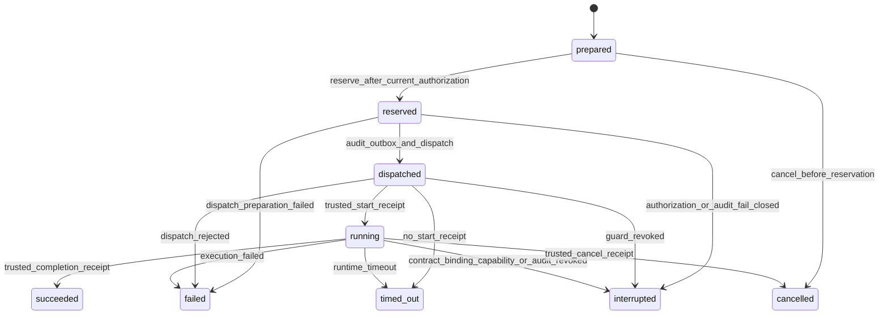
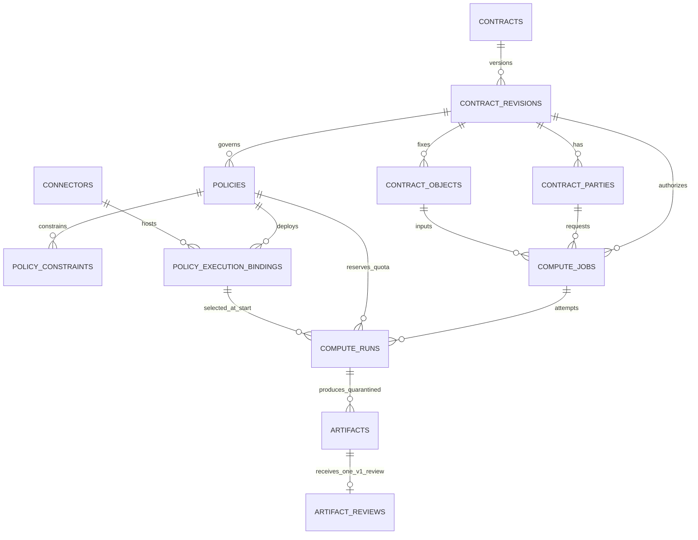

# MedTrust Space Phase 2-B.6-A PostgreSQL 数据库冻结设计 v7

> 状态：设计冻结；本文件不代表 ORM、Migration、API、执行器或真实计算能力已经实现。
>
> 当前真实基线：PostgreSQL 16，Alembic head `20260722_0010`，30 张已实现业务表。

## 0. 冻结结论

Phase 2-B.6 的领域设计可以进入数据库映射，但必须做三项收紧：

1. `run_count` 不能通过应用层 `COUNT(*)` 判定。本设计冻结为：**锁定权威 permit Policy 行，在同一 PostgreSQL 事务内分配不可回收的 `reservation_ordinal`**；
2. Job 创建时的授权判定不是执行令牌。创建 Job 与预留 Run 必须进行两次独立的当前有效性校验；
3. 当前尚无可靠 Audit/outbox。0011已落库，Artifact原0012因Contract hotfix占号而顺延为0013；无论表何时落库，数据库都必须临时阻止 Run 进入 `reserved/dispatched/running`，直到 Audit/outbox 与启动命令同批交付。

v7 只冻结四张表：

| 表 | 权威职责 |
| --- | --- |
| `compute_jobs` | 稳定计算意图、固定合同对象、算法/输入快照和创建时授权证据 |
| `compute_runs` | 一次执行尝试、启动时授权证据、原子额度预留、执行环境和节点回执 |
| `artifacts` | Run 产生的隔离制品、内容摘要、策略判定和保管状态 |
| `artifact_reviews` | 固定 Artifact 摘要的一次 V1 终态出域审核决定 |

本设计明确不新增：

- `compute_job_inputs`；
- `algorithm_specs`；
- `execution_environments`；
- `quota_counters` 或可覆盖的 `remaining_runs`；
- `compute_run_bindings`；
- `artifact_review_decisions`；
- `artifact_grants`；
- Audit、Outbox 或幂等表。

## 1. 设计基线与边界

### 1.1 依赖方向

```text
Active ContractRevision
  -> ContractParty + ContractObject
  -> Policy + Constraint + accepted Binding
  -> ComputeJob
  -> ComputeRun
  -> quarantined Artifact
  -> ArtifactReview
  -> current validity guard
  -> released Artifact
```

Compute 只消费已经生效的 Contract 权限，不能：

- 新增 Application 未申请的 action/output；
- 把 `DataProduct` 替换为其他 `DataProductVersion`；
- 扩大 `ContractObject.authorized_scope`；
- 绕过 Policy deny、run count、环境或输出限制；
- 把人工审核决定当成覆盖 Policy 的超级权限；
- 产生原始数据访问权。

### 1.2 通用约定

- 主键使用 UUID；
- 时间使用 `timestamptz`，统一 UTC；
- 快照使用 PostgreSQL `jsonb`，摘要使用规范化 JSON 的 SHA-256；
- 所有外键默认 `ON DELETE RESTRICT`；
- 业务对象不使用 ORM 级联删除；
- 状态变化通过受控命令完成，禁止调用方自由写状态；
- 任何真实路径、Connector 凭据、访问令牌和患者标识不得进入四张表；
- `row_version >= 1` 用于乐观并发控制，但不替代数据库锁和唯一约束。

### 1.3 Canonical JSON

所有 `*_snapshot`、`*_evaluation` 和 `*_evidence` 使用同一规范：

- 对象键按 Unicode code point 排序；
- 数组按文档定义的稳定业务键排序；
- UUID 使用小写连字符形式；
- 时间使用 UTC RFC 3339，固定 `Z`；
- 数字不得使用 NaN、Infinity 或不同精度的等价写法；
- 摘要字段不进入自身摘要；
- 规范化算法版本必须包含在文档的 `schema_version` 中。

## 2. 四张表的权威边界

### 2.1 `compute_jobs`

回答：

> 谁依据哪份 active ContractRevision，申请用哪个固定算法，对哪个 ContractObject 执行什么受控计算？

Job 不回答：

- 某次运行使用了哪个在线 Connector；
- 某次运行是否消耗了额度；
- Artifact 是否通过审核或已经发布。

### 2.2 `compute_runs`

回答：

> 某个 Job 的一次执行尝试在什么授权、额度、Policy、Binding、Connector 和能力快照下被预留、下发并结束？

Run 不保存可执行凭据，不直接拥有 Artifact 发布权限。

### 2.3 `artifacts`

回答：

> 某个成功 Run 产生了什么候选输出，其内容摘要、隔离保管引用、敏感等级和策略评估是什么？

Run 成功不等于 Artifact 可出域。Artifact 创建时必须为 `quarantined`。

### 2.4 `artifact_reviews`

回答：

> 对固定 `content_digest` 的 Artifact，责任组织作出的 V1 唯一终态出域审核决定是什么？

V1 每个 Artifact 只允许一行 ArtifactReview，避免“多个终态决定谁权威”的歧义。需要补件、内容修订或重新审核时必须生成新的 Artifact。

## 3. `compute_jobs`

### 3.1 字段冻结

| 字段 | 类型 | 空值 | 说明 |
| --- | --- | --- | --- |
| `id` | uuid | 否 | Job 主键 |
| `space_id` | uuid | 否 | 空间边界 |
| `contract_id` | uuid | 否 | Contract 系列 |
| `contract_revision_id` | uuid | 否 | 创建时必须为 active 的 Revision |
| `revision_content_digest` | text | 否 | 固定 Revision 内容证据 |
| `requester_contract_party_id` | uuid | 否 | consumer ContractParty |
| `requester_organization_id` | uuid | 否 | 申请执行的组织 |
| `requester_user_id` | uuid | 否 | 组织有效成员 |
| `contract_object_id` | uuid | 否 | V1 唯一输入对象 |
| `purpose_code` | text | 否 | 必须被 Contract Constraint 允许 |
| `requested_output_types` | jsonb | 否 | 排序去重后的输出词表子集 |
| `algorithm_spec_snapshot` | jsonb | 否 | 预登记演示算法快照 |
| `algorithm_spec_digest` | text | 否 | 算法快照摘要 |
| `compute_input_snapshot` | jsonb | 否 | ContractObject 解析快照 |
| `compute_input_digest` | text | 否 | 输入快照摘要 |
| `creation_authorization_evaluation` | jsonb | 否 | 创建 Job 时的授权评估 |
| `creation_authorization_evaluation_digest` | text | 否 | 创建评估摘要 |
| `creation_request_digest` | text | 否 | 规范化创建命令摘要；不是幂等键事实源 |
| `status` | varchar(16) | 否 | Job 状态 |
| `denial_code` | varchar(64) | 是 | 规则拒绝原因 |
| `failure_code` | varchar(64) | 是 | 系统失败原因 |
| `interruption_code` | varchar(64) | 是 | fail-closed 中断原因 |
| `created_at` | timestamptz | 否 | 创建时间 |
| `validated_at` | timestamptz | 是 | 最近一次验证时间 |
| `started_at` | timestamptz | 是 | 首个 Run 下发时间 |
| `finished_at` | timestamptz | 是 | Job 终止时间 |
| `created_by` | uuid | 否 | 创建用户 |
| `row_version` | integer | 否 | 乐观锁版本 |

### 3.2 Job 状态词表

```text
created
validating
ready
running
stopping
succeeded
denied
failed
interrupted
cancelled
```

`interrupted` 与 `failed` 分离：

- `failed`：算法、节点或平台执行失败；
- `interrupted`：合同暂停、Binding 撤销、能力失效、审计通道失效等当前授权条件变化触发 fail-closed。

Job 不包含 `reviewed`、`released`、`published` 等 Artifact 状态。

### 3.3 Job 外键和候选键

必须使用：

```text
(contract_id, space_id)
  -> contracts(id, space_id)

(contract_revision_id, contract_id)
  -> contract_revisions(id, contract_id)

(contract_revision_id, revision_content_digest)
  -> contract_revisions(id, content_digest)

(contract_revision_id, requester_contract_party_id, requester_organization_id)
  -> contract_parties(contract_revision_id, id, organization_id)

(contract_revision_id, contract_object_id)
  -> contract_objects(contract_revision_id, id)

(requester_organization_id, requester_user_id)
  -> organization_members(organization_id, user_id)
```

`contracts`、`contract_revisions`、`contract_parties` 和 `contract_objects` 当前已具备所需候选键。

为 `compute_runs` 增加 Job 候选键：

```text
UNIQUE (
  id,
  space_id,
  contract_id,
  contract_revision_id,
  requester_contract_party_id,
  contract_object_id
)
```

### 3.4 Job CHECK 和索引

CHECK：

- `status` 属于冻结词表；
- `requested_output_types` 是非空 JSON array，成员只允许：
  `aggregate_statistics`、`model_artifact`、`feature_dataset`、`risk_scoring_model`；
- `row_version >= 1`；
- 终态必须有相应原因/完成时间；
- `algorithm_spec_digest`、`compute_input_digest`、授权摘要和请求摘要非空；
- `status='succeeded'` 不要求存在 released Artifact。

索引：

```text
UNIQUE (creation_request_digest)
INDEX  (space_id, status, created_at DESC)
INDEX  (contract_revision_id, status)
INDEX  (requester_organization_id, created_at DESC)
INDEX  (contract_object_id, created_at DESC)
```

`creation_request_digest` 仅防止完全相同的 Job 内容重复登记；未来客户端幂等键的权威映射仍属于 Platform `idempotency_keys`。

### 3.5 创建时数据库守卫

Job INSERT 触发器至少验证：

- Revision 当前为 `active` 且处于有效时间窗；
- Party/Object 与 Revision 一致；
- Party 是 `consumer`；
- 用户是该组织当前 active 成员；
- 组织是该 Space 当前 admitted participant；
- ContractObject 对应的 DataProductVersion 仍为 `approved`，DataProduct 仍为 `active`；
- `creation_authorization_evaluation.decision='permit'`；
- 评估内 revision/object/party/algorithm/input/output 摘要与列值一致。

动态 `active` 状态无法由普通 FK 表达，必须由领域服务和数据库触发器共同验证。Job 之后保留历史，不因 Revision 暂停而删除或改写创建证据。

## 4. `compute_runs`

### 4.1 字段冻结

| 字段 | 类型 | 空值 | 说明 |
| --- | --- | --- | --- |
| `id` | uuid | 否 | Run 主键 |
| `space_id` | uuid | 否 | 冗余业务边界，用于复合 FK |
| `compute_job_id` | uuid | 否 | 所属 Job |
| `contract_id` | uuid | 否 | 与 Job 一致 |
| `contract_revision_id` | uuid | 否 | 与 Job 一致 |
| `requester_contract_party_id` | uuid | 否 | 与 Job 一致 |
| `contract_object_id` | uuid | 否 | 与 Job 一致 |
| `attempt_no` | integer | 否 | 同一 Job 单调递增 |
| `status` | varchar(16) | 否 | Run 状态 |
| `quota_policy_id` | uuid | 是 | reserved 起必填的唯一 governing permit Policy |
| `run_count_constraint_id` | uuid | 是 | governing Policy 上唯一 run_count Constraint |
| `run_limit_snapshot` | integer | 是 | 预留时权威上限快照 |
| `reservation_ordinal` | integer | 是 | 数据库原子分配；reserved 起必填 |
| `quota_scope_digest` | text | 是 | revision + policy + party + object 摘要 |
| `quota_reservation_digest` | text | 是 | 不可变预留证据摘要 |
| `quota_consumed_at` | timestamptz | 是 | 额度实际消费时间 |
| `start_authorization_evaluation` | jsonb | 是 | 预留前重新评估结果 |
| `start_authorization_evaluation_digest` | text | 是 | 启动评估摘要 |
| `compute_binding_id` | uuid | 是 | compute_executor Binding |
| `egress_binding_id` | uuid | 是 | egress_controller Binding |
| `audit_binding_id` | uuid | 是 | audit_evidence_emitter Binding |
| `execution_environment_snapshot` | jsonb | 是 | Policy/Binding/Connector/Capability/环境快照 |
| `execution_environment_digest` | text | 是 | 环境快照摘要 |
| `execution_reference` | text | 是 | 不透明节点执行引用；不是 URL/令牌 |
| `dispatch_receipt_digest` | text | 是 | 下发回执摘要 |
| `start_receipt_digest` | text | 是 | 节点启动回执摘要 |
| `completion_receipt_digest` | text | 是 | 结束回执摘要 |
| `audit_receipt_digest` | text | 是 | 审计证据回执摘要 |
| `prepared_at` | timestamptz | 否 | Run 请求登记时间 |
| `reserved_at` | timestamptz | 是 | 原子额度预留时间 |
| `dispatched_at` | timestamptz | 是 | 下发时间 |
| `started_at` | timestamptz | 是 | 节点确认开始时间 |
| `finished_at` | timestamptz | 是 | 终止时间 |
| `failure_code` | varchar(64) | 是 | 失败原因 |
| `interruption_code` | varchar(64) | 是 | fail-closed 原因 |
| `row_version` | integer | 否 | 乐观锁版本 |

### 4.2 Run 状态词表

```text
prepared
reserved
dispatched
running
succeeded
failed
interrupted
cancelled
timed_out
```

`prepared` 是未占额度的待执行记录。只有 `prepared -> reserved` 会在事务内消费一次额度。



无论 reserved 后进入哪一个终态，`reservation_ordinal` 都不返还。

### 4.3 Run 复合 FK

```text
(
  compute_job_id,
  space_id,
  contract_id,
  contract_revision_id,
  requester_contract_party_id,
  contract_object_id
)
  -> compute_jobs(
       id,
       space_id,
       contract_id,
       contract_revision_id,
       requester_contract_party_id,
       contract_object_id
     )

(contract_revision_id, quota_policy_id)
  -> policies(contract_revision_id, id)

compute_binding_id -> policy_execution_bindings(id)
egress_binding_id  -> policy_execution_bindings(id)
audit_binding_id   -> policy_execution_bindings(id)

run_count_constraint_id -> policy_constraints(id)
```

现有 `policy_execution_bindings` 没有 `(id, revision, role, connector)` 候选键；因此不能虚构一条不存在的复合 FK。以下关系由预留触发器在同一事务内 join 验证：

- 三个 Binding 的 Policy 均属于 Job 的 ContractRevision；
- 三个 Binding 分别具有 `compute_executor`、`egress_controller`、`audit_evidence_emitter` 角色；
- 能力代码/版本分别精确为冻结的 `.../1.0`；
- Binding 当前为 `accepted` 且未 revoked；
- Connector 属于同一 Space，状态为 verified/online，心跳未过期；
- Capability 当前为 verified；
- `run_count_constraint_id` 属于 `quota_policy_id`，且为 `run_count/lte/count`。

### 4.4 V1 Binding 选择

一个 Revision 可以存在多个候选 Binding；V1 每个 Run 必须从全部命中 Policy 中解析并固定：

- 一个 `compute_executor` Binding；
- 一个 `egress_controller` Binding；
- 一个 `audit_evidence_emitter` Binding。

若某个角色没有唯一可用选择，返回 `missing_execution_binding` 或 `ambiguous_execution_binding`，不得由前端任意挑选。

三项 Binding ID 只是本次选择证据。当前状态仍需在 `reserved`、`dispatched` 和 `release` 关键命令前重新读取。

### 4.5 Run 唯一约束和索引

```text
UNIQUE (compute_job_id, attempt_no)

UNIQUE (
  contract_revision_id,
  quota_policy_id,
  requester_contract_party_id,
  contract_object_id,
  reservation_ordinal
)
WHERE reservation_ordinal IS NOT NULL

UNIQUE (id, compute_job_id, space_id)

UNIQUE (compute_job_id)
WHERE status IN ('prepared','reserved','dispatched','running')
```

索引：

```text
INDEX (compute_job_id, attempt_no DESC)
INDEX (space_id, status, prepared_at DESC)
INDEX (contract_revision_id, status)
INDEX (quota_policy_id, reservation_ordinal DESC)
INDEX (compute_binding_id)
INDEX (egress_binding_id)
INDEX (audit_binding_id)
```

## 5. `run_count` 数据库原子占用

### 5.1 冻结消费时点

次数在以下条件全部满足后消费：

```text
prepared Run
  -> 当前授权重验证通过
  -> Audit/outbox 可在同一事务建立
  -> 数据库成功分配 reservation_ordinal
  -> Run 进入 reserved
```

以下情况不消费：

- Job 创建失败；
- Job 验证被拒绝；
- Run 仍为 prepared；
- 在获得数据库 reservation 前发生的预检失败。

以下情况不返还：

- reserved 后下发失败；
- Connector 拒绝、离线或中断；
- 算法失败；
- 使用方取消；
- 合同/Binding/能力在执行中失效；
- 审计通道在 reservation 后失效；
- 超时。

这避免攻击者通过反复制造失败任务绕过次数上限。

### 5.2 权威额度作用域

```text
ContractRevision
+ governing permit Policy
+ consumer ContractParty
+ ContractObject
```

V1 同一 `Party + Object + execute_controlled_compute` 必须解析出一个且仅一个 governing permit Policy。零个为 deny；多个为 `ambiguous_permit_policy` 并 fail-closed。

### 5.3 PostgreSQL 事务算法

冻结为 `reserve_compute_run_v1(run_id, expected_row_version, evaluation...)` 数据库函数或等效受控命令：

1. `SELECT ... FOR UPDATE` 锁定目标 `compute_runs` prepared 行；
2. 锁定 Job 行，确认仍为 ready，且没有其他非终态 Run；
3. 重新解析唯一 governing permit Policy；
4. `SELECT ... FOR UPDATE` 锁定该 `policies` 行，作为额度作用域串行化锁；
5. 读取该 Policy 上唯一的 `run_count/lte/count` Constraint；
6. 重新验证 Revision、有效期、Party、Object、产品、Binding、Connector、Capability 和输出范围；
7. 确认可靠 Audit/outbox 可与本事务提交；
8. 在持有 Policy 行锁时计算同一作用域 `MAX(reservation_ordinal) + 1`；
9. 若新序号大于上限，拒绝并回滚；
10. 由数据库写入 ordinal、limit、scope digest、reservation digest、授权快照和 reserved 时间；
11. 在同一事务写入 outbox/Audit 事实；
12. 提交后才允许后续 dispatch。

伪代码：

```sql
BEGIN;

SELECT * FROM medtrust.compute_runs
 WHERE id = :run_id AND status = 'prepared'
 FOR UPDATE;

SELECT * FROM medtrust.compute_jobs
 WHERE id = :job_id AND status = 'ready'
 FOR UPDATE;

SELECT * FROM medtrust.policies
 WHERE id = :governing_policy_id
 FOR UPDATE;

-- 在锁内读取并校验唯一 run_count constraint 与当前授权。
-- next_ordinal := COALESCE(MAX(reservation_ordinal), 0) + 1；
-- next_ordinal > frozen_limit 时 RAISE EXCEPTION。
-- ordinal 只能由函数/trigger 写入，调用方不得指定。

UPDATE medtrust.compute_runs
   SET status = 'reserved',
       reservation_ordinal = :next_ordinal,
       quota_consumed_at = transaction_timestamp(),
       ...
 WHERE id = :run_id AND status = 'prepared';

-- 与 Audit/outbox 同一事务写入；当前尚未实现时必须 RAISE EXCEPTION。

COMMIT;
```

数据库唯一约束是最终兜底；Policy 行锁保证两个并发事务不会同时计算出可用的相同/超限序号。即使未来改用事务级 advisory lock，也必须由数据库根据权威列计算锁键，不能信任客户端提供的 digest。

### 5.4 不允许的实现

```text
SELECT COUNT(*)
-> Python 判断
-> INSERT/UPDATE Run
```

也不允许：

- 可覆盖的 `remaining_runs`；
- 失败后递减已用次数；
- 调用方自行填写 `reservation_ordinal`；
- 通过新 Job 或新 attempt 重置额度作用域；
- 用 `quota_scope_digest` 代替结构化外键校验。

## 6. Job 创建与 Run 启动双重校验

### 6.1 创建 Job

创建时检查并冻结：

- Revision active/有效期；
- consumer Party 和组织成员关系；
- ContractObject 与 DataProductVersion；
- purpose、algorithm digest 和 requested outputs；
- permit/deny/obligation；
- 可用 Binding/Connector/Capability；
- 当前 run_count 尚有余量；
- 生成 `creation_authorization_evaluation_digest`。

该结果只说明创建时可以进入待执行队列。

### 6.2 预留 Run

预留前必须重新检查：

- Revision 仍为 active 且有效期未过；
- Policy/Constraint 仍是已签 Revision 的不可变内容；
- Binding 仍 accepted 且未 revoked；
- Connector 仍 verified、online 且心跳有效；
- 三项 Capability 仍 verified 并精确匹配 `1.0`；
- Space、组织、成员和 participant 仍有效；
- ContractObject 对应的 DataProductVersion 仍为 `approved`，DataProduct 仍为 `active`；
- run_count 未耗尽；
- 输出仍是 Contract permit 子集且任一 deny 优先；
- Audit/outbox 可用。

创建时评估和启动时评估使用不同摘要，不能复用。

### 6.3 运行中的 fail-closed

监控到以下变化时，Run 必须进入停止编排，最终记为 `interrupted`：

- Revision suspended/expired/terminated；
- Binding revoked/rejected；
- Connector offline、heartbeat expired 或 verification revoked；
- Capability disabled；
- Audit evidence channel 失效；
- 必须执行的安全控制无法确认。

`interruption_code` 使用结构化词表，例如：

```text
contract_not_active
binding_revoked
connector_unavailable
capability_unverified
audit_channel_unavailable
policy_guard_failed
```

系统无法证明安全继续运行时，不得默认完成。

## 7. `artifacts`

### 7.1 字段冻结

| 字段 | 类型 | 空值 | 说明 |
| --- | --- | --- | --- |
| `id` | uuid | 否 | Artifact 主键 |
| `space_id` | uuid | 否 | 空间边界 |
| `compute_job_id` | uuid | 否 | 来源 Job |
| `compute_run_id` | uuid | 否 | 来源 succeeded Run |
| `artifact_no` | integer | 否 | 同 Run 稳定序号 |
| `artifact_type` | varchar(32) | 否 | 申请输出词表 |
| `content_digest` | text | 否 | 内容身份 |
| `storage_reference` | text | 否 | 隔离对象存储的不透明引用 |
| `size_bytes` | bigint | 否 | 非负大小 |
| `classification_level` | varchar(32) | 否 | 输出敏感等级 |
| `output_policy_evaluation` | jsonb | 否 | 创建时 Policy 判定 |
| `output_policy_evaluation_digest` | text | 否 | 判定摘要 |
| `release_status` | varchar(16) | 否 | 默认 `quarantined` |
| `retention_until` | timestamptz | 是 | 不得宽于 Contract Constraint |
| `release_evidence` | jsonb | 是 | 发布时审核与当前有效性证据 |
| `release_evidence_digest` | text | 是 | 发布证据摘要 |
| `created_at` | timestamptz | 否 | 登记时间 |
| `released_at` | timestamptz | 是 | 发布时刻 |
| `revoked_at` | timestamptz | 是 | 治理撤销时刻 |
| `destroyed_at` | timestamptz | 是 | 保管副本销毁时刻 |
| `row_version` | integer | 否 | 乐观锁版本 |

### 7.2 Artifact 状态

```text
quarantined -> released -> revoked
quarantined -> destroyed
revoked     -> destroyed
```

- Run succeeded 只允许创建 `quarantined`；
- `released` 需要审核证据和当前有效性守卫；
- `revoked` 不删除历史内容摘要、审核和发布证据；
- `destroyed` 表示隔离/发布副本按策略销毁，不删除最小证据。

### 7.3 Artifact FK、候选键与索引

```text
(compute_run_id, compute_job_id, space_id)
  -> compute_runs(id, compute_job_id, space_id)

UNIQUE (compute_run_id, artifact_no)
UNIQUE (compute_run_id, artifact_type, content_digest)
UNIQUE (id, space_id, content_digest)
```

索引：

```text
INDEX (space_id, release_status, created_at DESC)
INDEX (compute_job_id, created_at)
INDEX (compute_run_id, artifact_no)
INDEX (content_digest)
INDEX (retention_until) WHERE release_status IN ('quarantined','released','revoked')
```

### 7.4 Artifact 数据库守卫

INSERT 触发器验证：

- 来源 Run 为 `succeeded`；
- Artifact 类型属于 Job 请求输出；
- 类型属于 `export_artifact` permit 范围；
- 任一命中 deny 均记录为不可批准；
- 初始状态固定为 `quarantined`；
- `storage_reference` 是内部不透明引用，不含 `http://`、`https://`、预签名查询参数、Connector endpoint 或本地文件路径；
- `content_digest`、策略评估和摘要完整。

内容改变必须生成新 Artifact。禁止 UPDATE：

- `compute_job_id` / `compute_run_id`；
- `artifact_type`；
- `content_digest`；
- `storage_reference`；
- `size_bytes`；
- `output_policy_evaluation` 及摘要。

## 8. `artifact_reviews`

### 8.1 V1 单决定边界

V1 每个 Artifact 最多一行 Review：

```text
UNIQUE (artifact_id)
```

该行将审核任务与最终决定合并，是 37 表冻结下的最小模型。平台预检、策略判定和必要合规材料进入 `routing_rule_digest` 与决定证据，不另建平行事实表。

### 8.2 字段冻结

| 字段 | 类型 | 空值 | 说明 |
| --- | --- | --- | --- |
| `id` | uuid | 否 | Review 主键 |
| `space_id` | uuid | 否 | 与 Artifact 一致 |
| `artifact_id` | uuid | 否 | 唯一被审 Artifact |
| `target_content_digest` | text | 否 | 固定审核目标 |
| `responsible_organization_id` | uuid | 否 | V1 为数据产品提供组织 |
| `claimed_by_user_id` | uuid | 是 | 责任组织有效成员 |
| `status` | varchar(16) | 否 | `pending/claimed/decided/cancelled` |
| `routing_rule_digest` | text | 否 | 审核路由规则摘要 |
| `decision` | varchar(16) | 是 | `approved/rejected`，decided 时必填 |
| `reason_code` | varchar(64) | 是 | 决定原因 |
| `comment` | text | 是 | 非敏感说明 |
| `decision_evidence` | jsonb | 是 | 决定证据包 |
| `decision_digest` | text | 是 | 终态决定摘要 |
| `created_at` | timestamptz | 否 | 创建时间 |
| `claimed_at` | timestamptz | 是 | 领取时间 |
| `decided_at` | timestamptz | 是 | 决定时间 |
| `cancelled_at` | timestamptz | 是 | 取消时间 |
| `row_version` | integer | 否 | 乐观锁版本 |

### 8.3 Review FK 和责任组织一致性

```text
(artifact_id, space_id, target_content_digest)
  -> artifacts(id, space_id, content_digest)

(responsible_organization_id, claimed_by_user_id)
  -> organization_members(organization_id, user_id)
```

`claimed_by_user_id` 可空，因此成员一致性由延迟触发器在 claimed/decided 时强制。

V1 `responsible_organization_id` 必须同时满足：

- 是 Artifact 来源 ContractObject 对应 DataProduct 的 provider organization；
- 是 ContractRevision 中的 provider ContractParty；
- 在 Space 中仍有合法责任身份。

该跨表链由数据库触发器验证：

```text
Artifact
 -> ComputeJob
 -> ContractObject
 -> DataProductVersion
 -> DataProduct.provider_organization_id
```

### 8.4 Review 终态保护

- `decided` 时必须有 decision、reason、evidence、digest、decided_at；
- `decision='approved'` 时，Artifact 创建时的 Policy evaluation 不得包含 deny；
- `decided` 行禁止 UPDATE 和 DELETE；
- `cancelled` 行也不复用；重新输出必须生成新 Artifact；
- rejected Artifact 不能改内容后复用原 ID；
- 人工 `approved` 只表示同意进入发布守卫，不直接改变 Artifact 状态。

### 8.5 Artifact 发布守卫

`release_artifact` 必须同时满足：

1. Artifact 仍为 quarantined，摘要未改变；
2. 来源 Run 为 succeeded；
3. ArtifactReview 为 decided/approved，目标摘要一致；
4. 创建时和当前 Policy 均允许该 output type；
5. 任一 deny 仍优先；
6. Revision 当前未 suspended/expired/terminated，或明确治理规则允许历史结果发布；V1 默认不允许失效合同自动发布；
7. egress Binding 仍 accepted；
8. egress Connector/Capability 当前有效；
9. Audit/outbox 可与 release 状态同事务提交；
10. 生成不可变 `release_evidence` 和摘要。

审核通过不等于发布；合同终止也不抹去审核历史。

## 9. 数据库触发器与函数计划

### 9.1 0011 计划函数/触发器

| 名称（建议） | 职责 |
| --- | --- |
| `validate_compute_job_v1()` | Job INSERT 的 Revision/Party/Object/成员/评估一致性 |
| `guard_compute_job_update_v1()` | Job 核心快照不可变与状态形态 |
| `validate_compute_run_prepared_v1()` | Run 与 Job 复合边界和 attempt 单调性 |
| `reserve_compute_run_v1()` | 双重授权、Policy 行锁、run_count ordinal 原子预留 |
| `guard_compute_run_update_v1()` | 状态顺序、终态证据不可变、序号不返还 |
| `block_real_compute_without_audit_v1()` | Audit/outbox 未实现前阻断 reserved/dispatched/running |

### 9.2 0013 计划函数/触发器

| 名称（建议） | 职责 |
| --- | --- |
| `validate_artifact_insert_v1()` | 仅 succeeded Run、默认隔离、类型/Policy检查 |
| `guard_artifact_update_v1()` | 内容身份不可变和受控发布/撤销/销毁 |
| `validate_artifact_review_v1()` | 固定摘要、责任组织、职责分离、Policy deny |
| `guard_artifact_review_terminal_v1()` | decided/cancelled 禁止覆盖和删除 |
| `release_artifact_v1()` | 审核证据 + 当前有效性 + egress + Audit 同事务守卫 |

这些名称是冻结建议，不是已经存在的数据库对象。

## 10. 状态机与命令映射

| 命令 | 主要行锁 | 结果 | Audit 未实现时 |
| --- | --- | --- | --- |
| `create_compute_job` | Revision/Job create guard | Job created | 可用于演示元数据 |
| `validate_compute_job` | Job | ready/denied/failed | 可执行静态评估，不产生访问权 |
| `prepare_compute_run` | Job | Run prepared | 可创建待执行记录 |
| `reserve_compute_run` | Run + Job + governing Policy | reserved + ordinal | **数据库阻断** |
| `dispatch_compute_run` | Run + Binding/Connector current rows | dispatched | **数据库阻断** |
| `acknowledge_run_started` | Run | running | **数据库阻断** |
| `complete_compute_run` | Run | succeeded + quarantined Artifact | **数据库阻断** |
| `interrupt_compute_run` | Run | interrupted | 未来必须写 Audit/outbox |
| `decide_artifact_review` | ArtifactReview + Artifact | approved/rejected evidence | 可做设计测试，不得发布 |
| `release_artifact` | Artifact + Review + current egress rows | released | **数据库阻断** |

## 11. Audit/outbox 硬依赖

当前项目没有可靠 AuditEvent、哈希链或事务型 outbox。因此：

- 0011已建立Job/Run结构；0013可以建立Artifact/Review结构、FK、CHECK、索引和不可变保护；
- 可以创建 Demo Job、执行授权评估和 prepared Run；
- 不得让 Run 获得真实 reservation、进入 dispatched/running 或触发真实 Connector；
- 不得把普通应用日志、前端时间线或模拟字符串冒充审计证据；
- 不得让 Artifact 进入 released；
- `audit_receipt_digest` 只是未来证据引用，不是 Audit 事实本身。

在 Audit/outbox 落地时，必须保证：

```text
Run/Artifact 状态变化
+ 对应 AuditEvent 或 Outbox 事件
= 同一个 PostgreSQL 事务提交或一起回滚
```

若 Audit 通道建立失败，命令 fail-closed，不允许先提交业务状态再补日志。

## 12. 删除、保留与不可变保护

### 12.1 删除策略

- 四张表及其上游 FK 均使用 `RESTRICT`；
- 不使用 `CASCADE DELETE`；
- Job、reserved 及以后 Run、Artifact、Review 均不得物理删除；
- prepared Run 如尚无任何证据，可由未来受控清理策略处理，但 V1 默认保留；
- `destroyed` 是 Artifact 保管状态，不等于删除数据库行。

### 12.2 不可变字段

Job 创建后不可变：

- Contract/Revision/Party/Object；
- purpose/output；
- algorithm/input 快照和摘要；
- 创建授权评估和请求摘要。

Run reserved 后不可变：

- Job/attempt；
- quota Policy/Constraint/limit/ordinal/scope；
- 启动授权评估；
- 三项 Binding；
- 环境快照和摘要。

Artifact 创建后不可变：

- 来源 Run/Job；
- 类型、内容摘要、存储引用、大小；
- 创建时 Policy 评估。

ArtifactReview decided/cancelled 后整行不可更新、不可删除。

## 13. ER 图

### 13.1 Compute/Artifact 详细 ER



### 13.2 全系统主链

```mermaid
flowchart LR
    ORG["Organization"] --> SPACE["Space Participant"]
    SPACE --> CONN["Connector + Capability"]
    CONN --> DPV["DataProductVersion"]
    DPV --> APP["ApplicationSnapshot"]
    APP --> REVIEW["ReviewDecision"]
    REVIEW --> REV["Active ContractRevision"]
    REV --> POLICY["Policy + Constraint + Binding"]
    POLICY --> JOB["ComputeJob"]
    JOB --> RUN["ComputeRun"]
    RUN --> ART["Quarantined Artifact"]
    ART --> AR["ArtifactReview"]
    AR --> RELEASE["Current Guarded Release"]
    RUN -. "future same-transaction" .-> AUDIT["Audit / Outbox"]
    RELEASE -. "future same-transaction" .-> AUDIT
```



## 14. 表总数和迁移计划

### 14.1 表总数

| 阶段 | 已实现表数 | 新增 | 累计 |
| --- | ---: | ---: | ---: |
| 当前 `20260722_0012` | 32 | 0011已实现`compute_jobs`、`compute_runs`；0012仅修复Contract触发器 | 32 |
| 计划 0013 | 32 | `artifacts`、`artifact_reviews` | 34 |
| 未来 Audit | 34 | `audit_events`、`audit_hash_chain` | 36 |
| 未来 Platform | 36 | `idempotency_keys` | 37 |

v7保持37张逻辑表总量不变。后续实现已生成0011和Contract纠正迁移0012，当前真实表数为32；Artifact两表不变，只把迁移号顺延为0013。

### 14.2 0011 实现（已完成）

已实现：

- 创建 `compute_jobs`；
- 创建 `compute_runs`；
- 创建复合 FK、候选键、CHECK、索引；
- 创建 Job/Run 不可变与一致性守卫；
- 创建 run_count 预留函数；
- 安装临时 Audit 缺失阻断器，使 `reserved/dispatched/running` 不可达。

不得在 0011：

- 触发真实 Connector；
- 执行用户代码；
- 新建 Audit 替代物；
- 修改 Contract/Connector 权威模型。

### 14.3 0013 计划（由原0012顺延）

仅计划：

- 创建 `artifacts`；
- 创建 `artifact_reviews`；
- 创建 Artifact/Review 不可变保护；
- 创建发布守卫，但在 Audit/outbox 未落地时保持 release 阻断。

### 14.4 Downgrade

顺序固定：

```text
0013: drop Artifact release/review guards
      -> drop artifact_reviews
      -> drop artifacts

0011: drop Run audit blocker and reservation functions
      -> drop compute_runs
      -> drop compute_jobs
```

Downgrade 只用于开发环境验证，不作为生产数据清理方式。

## 15. PostgreSQL 16 验收矩阵

### 15.1 Schema

- [x] 0011 upgrade 后 32 张表；
- [ ] 0013 upgrade 后 34 张表；
- [ ] downgrade/upgrade 循环可恢复；
- [ ] 所有复合 FK 的被引用列是实际 UNIQUE/PK；
- [ ] 不修改 Alembic 0010 以前的 migration。

### 15.2 Job/Run

- [ ] 非 active Revision 创建 Job 失败；
- [ ] Party/Object 跨 Revision 或跨 Space 失败；
- [ ] 请求输出扩大失败；
- [ ] 同一 Job 只能有一个非终态 Run；
- [ ] attempt_no 重复失败；
- [ ] 多适用 governing Policy fail-closed；
- [ ] run_count 预检失败不消费；
- [ ] reserved 后失败/取消/中断不返还 ordinal；
- [ ] 两个并发事务在上限 1 时只有一个预留成功；
- [ ] 直接 SQL 伪造 ordinal 或 scope 失败；
- [ ] Binding 角色/能力/Revision 不一致失败；
- [ ] Audit 未实现时 reserved/dispatched/running 被数据库阻断。

### 15.3 Artifact/Review

- [ ] 非 succeeded Run 创建 Artifact 失败；
- [ ] Artifact 初始非 quarantined 失败；
- [ ] 内容身份字段 UPDATE 失败；
- [ ] 同一 Artifact 创建第二个 Review 失败；
- [ ] Review target digest 不一致失败；
- [ ] consumer 组织自审失败；
- [ ] Policy deny 时人工 approved 失败；
- [ ] decided Review UPDATE/DELETE 失败；
- [ ] rejected 内容修改后复用 Artifact ID 失败；
- [ ] 合同失效、egress Binding 失效或 Audit 不可用时 release 失败。

### 15.4 数据最小化

- [ ] 四表无患者标识字段；
- [ ] 无数据库连接串、凭据、访问令牌字段；
- [ ] 无 MinIO 预签名 URL；
- [ ] 无用户上传代码/镜像命令；
- [ ] 错误摘要不复制患者数据或原始算法输入。

## 16. v7 冻结清单

- [x] 四张表权威职责分离。
- [x] Job 不持有 Artifact 审核/发布状态。
- [x] Run 明确 `interrupted` fail-closed 语义。
- [x] 创建 Job 与预留 Run 双重授权校验。
- [x] run_count 消费时点、失败不返还和数据库并发方案冻结。
- [x] Policy 行锁 + ordinal 唯一约束共同兜底。
- [x] Binding 一致性未被错误描述为现有复合 FK。
- [x] Artifact 默认 quarantined。
- [x] 每个 Artifact 最多一个 V1 终态审核事实。
- [x] 人工审核不能覆盖 Policy deny。
- [x] release 同时依赖不可变审核证据和当前有效性守卫。
- [x] Audit/outbox 缺失时真实执行与发布 fail-closed。
- [x] 0011已实现；Artifact边界保持冻结并顺延为0013。
- [x] 37张逻辑表总量不变；当前真实表数为32。

## 17. 最终结论与下一步

v7 冻结后，合理的实现顺序是：

```text
0011 ComputeJob/ComputeRun ORM + Migration
-> PostgreSQL run_count 并发验证
-> 0013 Artifact/ArtifactReview ORM + Migration
-> Audit/outbox
-> Compute 命令与模拟执行器
-> 公开病理数据和预登记病理模型接入
```

在 Audit/outbox 完成前，项目只能宣称：

> 已冻结并可实现可信计算元数据、合同约束映射、数据库级额度模型和隔离制品模型。

不能宣称：

> 已形成真实可信计算执行闭环、已实现数据可用不可见、已具备可靠审计存证或已通过可信数据空间认证。
