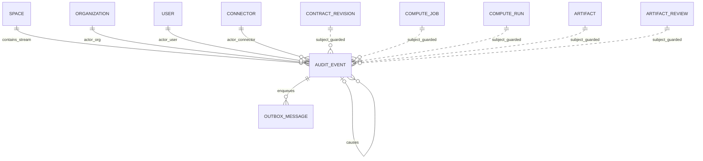
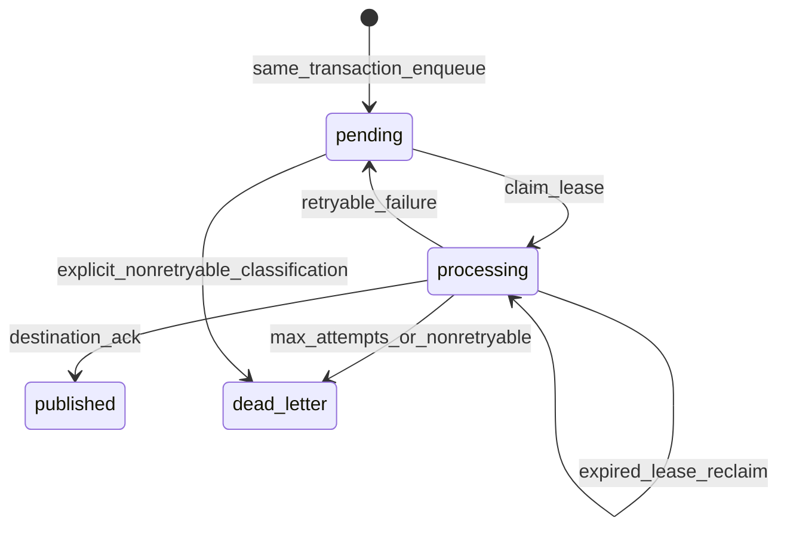

# MedTrust Space Phase 2 数据库冻结设计 v8

> 阶段：Phase 2-B.7-B — AuditEvent + Transactional Outbox 数据库冻结同步  
> 日期：2026-07-22  
> 状态：设计冻结候选（本阶段不生成 ORM、migration、Dispatcher、API、执行器或前端代码）  
> 依据：`Phase2-B7-audit-outbox-model.md`、`Phase2-database-design-v7.md` 及现行 0013 数据库结构

---

## 1. 冻结结论

v8 冻结两张新表：

```text
audit_events
outbox_messages
```

不新增：

```text
audit_stream_heads
audit_hash_chain
idempotency_keys
outbox_delivery_attempts
```

核心结论：

1. `AuditEvent` 是不可变业务证据；
2. `OutboxMessage` 是可变的可靠投递状态，不是业务事实；
3. 业务状态、AuditEvent 和必要 OutboxMessage 必须在同一 PostgreSQL 事务提交；
4. 审计链按 Space 分链，以现有 `spaces` 行作为序号分配锁，不建立第二个链头真相源；
5. Outbox 采用至少一次投递，消费者按事件/消息幂等，不承诺端到端 exactly-once；
6. 0014 只建表与数据库守卫，不解除现行 ComputeRun 启动和 Artifact release 的 fail-closed 门；
7. 关键业务命令的事务型接入留给 0015，Dispatcher 再后置。

### 1.1 对 B7-A 初稿的必要修正

B7-A 曾列出候选：

```text
UNIQUE (idempotency_key)
```

v8 **明确拒绝该单列唯一约束**。同一领域命令可能原子产生多条事件，例如一次 Run 预留可能形成运行事实以及后续受控编排事实；这些事件应共享同一个命令幂等摘要，但不能互相冲突。

v8 冻结为：

```text
command_id       = 同一领域命令及其重试的稳定UUID
idempotency_key  = 原始命令幂等键的sha256摘要；同一命令的多事件共享

UNIQUE (
  space_id,
  idempotency_key,
  event_type,
  subject_type,
  subject_id
)

UNIQUE (
  space_id,
  command_id,
  event_type,
  subject_type,
  subject_id
)
```

V1 不允许一条命令为同一 Subject 重复产生两条同类型事实；如果未来确有这种业务需求，必须显式增加事件 ordinal 或拆为子命令，不能静默放松唯一性。

---

## 2. 基线、表数与范围

### 2.1 当前已验证基线

| 项目 | 当前值 |
| --- | --- |
| PostgreSQL | 16 |
| Alembic head | `20260722_0013` |
| `medtrust` 实表 | 34 |
| Audit 模块 | 仅占位包，无 ORM、服务或 Dispatcher |
| ComputeRun 启动 | Audit 缺失时 fail-closed |
| Artifact release | Audit 缺失时 fail-closed |

### 2.2 v8 目标表数

| 阶段 | 新增 | 实表总数 |
| --- | --- | ---: |
| 当前 0013 | — | 34 |
| 0014 | `audit_events`、`outbox_messages` | 36 |
| 0015 | 仅命令事务接入与守卫，不新增表 | 36 |

旧规划中的第 37 张 `idempotency_keys` 属于未来平台 API 响应重放能力。本阶段不以凑表数为理由创建它，也不让 AuditEvent 冒充 API response cache。

### 2.3 本阶段非目标

- 不修改现有 ORM；
- 不创建或修改 Alembic migration；
- 不修改 0010、0011、0012、0013；
- 不修改 Contract、Connector、Compute、Artifact 表；
- 不实现 Dispatcher、Broker、Kafka 或 RabbitMQ；
- 不实现真实 Run 执行或 Artifact 交付；
- 不修改 API 或前端；
- 不接入病理数据、模型、WSI 路径或对象存储凭据。

---

## 3. 权威边界

| 对象 | 回答的问题 | 是否事实源 | 允许变化 |
| --- | --- | --- | --- |
| 业务表 | 当前业务状态是什么 | 是 | 由领域命令按状态机变化 |
| AuditEvent | 谁在何时基于什么证据完成了什么命令 | 是，不可变证据 | 只追加 |
| OutboxMessage payload | 要投递哪一份事件信封 | AuditEvent 的不可变投影 | 不允许修改 |
| OutboxMessage delivery state | 消息投递到了哪一步 | 仅运维投递状态 | 按冻结状态机变化 |
| 普通应用日志 | 调试和运行诊断 | 否 | 可滚动、可丢失 |
| 哈希链 | 篡改检测线索 | 不是第三方存证 | 随事件追加 |

不得以以下方式制造双重真相源：

- 用 Outbox `published` 推导 Contract、Run 或 Artifact 的业务状态；
- 用普通日志替代 AuditEvent；
- 用 `audit_receipt_digest` 非空替代真实 AuditEvent/Outbox 关系；
- 在业务表新增平行的“已审计”布尔字段；
- 在独立链头表重复保存最后事件摘要。

---

## 4. 总体 ER 图



虚线 Subject 关系由固定 Event Catalog 数据库函数验证，不为多态 Subject 创建五个可空外键列。

---

## 5. `audit_events` 表冻结

### 5.1 字段

| 字段 | PostgreSQL 类型 | NULL | 默认/来源 | 冻结语义 |
| --- | --- | --- | --- | --- |
| `event_id` | `uuid` | 否 | 受控追加函数生成 | 全局事件主键。 |
| `space_id` | `uuid` | 否 | 命令上下文 | FK 到 `spaces.id`，RESTRICT；审计流边界。 |
| `stream_sequence` | `bigint` | 否 | 数据库原子分配 | Space 内从 1 开始的连续已提交序号。 |
| `event_type` | `varchar(96)` | 否 | Event Catalog | 首批 10 类稳定事件名。 |
| `schema_version` | `smallint` | 否 | `1` | 事件 Evidence schema 版本。 |
| `canonicalization_version` | `varchar(40)` | 否 | `medtrust-jsonb-c14n/v1` | 摘要规范版本。 |
| `occurred_at` | `timestamptz` | 否 | 锁链后 `clock_timestamp()` | 业务事实写入时间；不接受客户端时间。 |
| `actor_type` | `varchar(16)` | 否 | 命令上下文 | `user`、`connector`、`system`。 |
| `actor_organization_id` | `uuid` | 是 | 命令上下文 | user/connector Actor 的组织。 |
| `actor_user_id` | `uuid` | 是 | 命令上下文 | user Actor。 |
| `actor_connector_id` | `uuid` | 是 | 命令上下文 | connector Actor。 |
| `actor_service_code` | `varchar(64)` | 是 | 内部服务词表 | system Actor，如 `medtrust.compute`。 |
| `subject_type` | `varchar(32)` | 否 | Event Catalog | 固定 Subject 类型。 |
| `subject_id` | `uuid` | 否 | 领域命令 | 具体业务对象。 |
| `result` | `varchar(16)` | 否 | Event Catalog | `success`、`failure`、`denied`、`interrupted`、`cancelled`。 |
| `correlation_id` | `uuid` | 否 | 协作链入口 | 关联跨命令业务链；不唯一。 |
| `causation_id` | `uuid` | 是 | 前置 AuditEvent | 同 Space 的直接原因事件。 |
| `command_id` | `uuid` | 否 | 命令边界 | 同一领域命令及其重试保持稳定；可对应多事件。 |
| `idempotency_key` | `varchar(71)` | 否 | 原始键摘要 | `sha256:<64 lowercase hex>`；不保存原始客户端键。 |
| `evidence_snapshot` | `jsonb` | 否 | 最小证据 | 规范化、脱敏、最大 64 KiB。 |
| `evidence_digest` | `varchar(71)` | 否 | 数据库计算 | Evidence canonical bytes 的 SHA-256。 |
| `previous_event_digest` | `varchar(71)` | 是 | 上一事件 | Genesis 为空，其余必须等于前一事件摘要。 |
| `event_digest` | `varchar(71)` | 否 | 数据库计算 | 当前事件 manifest 的 SHA-256。 |
| `created_at` | `timestamptz` | 否 | 数据库 | 物理插入时间；和 occurred_at 同事务生成。 |

不增加 `updated_at`、`deleted_at` 或 `row_version`：AuditEvent 不允许更新，也不参与软删除。

### 5.2 主键、外键和候选键

```text
PRIMARY KEY (event_id)

FOREIGN KEY (space_id)
  REFERENCES spaces(id)
  ON DELETE RESTRICT

FOREIGN KEY (actor_organization_id)
  REFERENCES organizations(id)
  ON DELETE RESTRICT

FOREIGN KEY (actor_user_id)
  REFERENCES users(id)
  ON DELETE RESTRICT

FOREIGN KEY (actor_connector_id)
  REFERENCES connectors(id)
  ON DELETE RESTRICT

UNIQUE (event_id, space_id)
UNIQUE (space_id, stream_sequence)
UNIQUE (space_id, event_digest)
```

`causation_id` 使用同 Space 复合自引用：

```text
FOREIGN KEY (causation_id, space_id)
  REFERENCES audit_events(event_id, space_id)
  DEFERRABLE INITIALLY IMMEDIATE
```

受控追加函数还必须验证 causal event 的 `stream_sequence` 小于当前事件，不能指向未来事件或自身。

### 5.3 幂等唯一性

冻结两个事件事实唯一约束：

```text
UNIQUE (
  space_id,
  idempotency_key,
  event_type,
  subject_type,
  subject_id
)

UNIQUE (
  space_id,
  command_id,
  event_type,
  subject_type,
  subject_id
)
```

并增加：

```text
INDEX (space_id, command_id, stream_sequence)
INDEX (space_id, idempotency_key, stream_sequence)
```

语义：

1. 原始 API/内部命令幂等键在进入数据库前先做长度限制和秘密清洗；
2. 数据库存储 `sha256:<hex>`，不保存原始键；
3. 同一命令产生的多事件共享 `command_id` 与 `idempotency_key`；
4. 事件通过 event type + subject type + subject id 区分；
5. 同一 Space 内，一个 idempotency key 只能映射到一个 command id；数据库追加函数发现不一致时拒绝；
6. 一个 command id 也只能映射到一个 idempotency key 和 correlation id；
7. schema version 不进入唯一键，防止同一命令在部署升级后被重复写成新事实。

幂等冲突处理：

```text
若组合唯一键不存在：追加新事件。

若已存在：
  比较 actor、subject、result、correlation、causation、schema_version、
  evidence_digest 与必需Outbox目标集合；
  全部一致 -> 返回既有 event_id/event_digest/message_ids；
  任一不一致 -> IdempotencyConflict，禁止覆盖。
```

不得通过 `ON CONFLICT DO NOTHING` 无条件吞掉不一致输入。

### 5.4 Actor 形态

| `actor_type` | organization | user | connector | service_code |
| --- | --- | --- | --- | --- |
| `user` | 必填 | 必填 | 空 | 空 |
| `connector` | 必填 | 空 | 必填 | 空 |
| `system` | 可空 | 空 | 空 | 必填 |

数据库函数执行固定校验：

- user 必须是 actor organization 的有效 `organization_member`；
- connector 必须属于 `space_id` 和 actor organization；
- connector Actor 的 Connector 必须存在，不能用名称代替；
- system service code 仅允许 `medtrust.contract`、`medtrust.compute`、`medtrust.artifact`、`medtrust.audit`；
- system Actor 若指定组织，只代表代该组织执行，仍需命令服务校验来源；
- 不允许 user、connector、service code 多轴同时填充。

### 5.5 Subject 多态校验

V1 不增加下列可空列：

```text
contract_revision_id
compute_job_id
compute_run_id
artifact_id
artifact_review_id
```

而由迁移内固定 `CASE` 函数验证：

| event type | subject type | Subject 表 | 同 Space 要求 |
| --- | --- | --- | --- |
| `contract.revision.activated` | `contract_revision` | `contract_revisions` | 通过 Contract 验证 Space |
| `compute.job.created` | `compute_job` | `compute_jobs` | 必须同 Space |
| `compute.run.*` | `compute_run` | `compute_runs` | 必须同 Space |
| `artifact.created` | `artifact` | `artifacts` | 必须同 Space |
| `artifact.review.decided` | `artifact_review` | `artifact_reviews` | 必须同 Space |
| `artifact.released` | `artifact` | `artifacts` | 必须同 Space |

Subject 表名由数据库函数内部固定，不接受客户端表名或动态 SQL。

### 5.6 Result 规则

| 事件 | 允许 result |
| --- | --- |
| `contract.revision.activated` | `success` |
| `compute.job.created` | `success` |
| `compute.run.reserved` | `success` |
| `compute.run.started` | `success` |
| `compute.run.completed` | `success` |
| `compute.run.failed` | `failure` |
| `compute.run.interrupted` | `interrupted` |
| `artifact.created` | `success` |
| `artifact.review.decided` | `success` |
| `artifact.released` | `success` |

Artifact 审核的 approved/rejected 是业务决定，放在 Evidence 内；AuditEvent result 仍为“决定命令成功完成”的 `success`。

### 5.7 其他 CHECK

```text
stream_sequence > 0
schema_version = 1                 -- 首批目录
canonicalization_version = 'medtrust-jsonb-c14n/v1'
idempotency_key ~ '^sha256:[0-9a-f]{64}$'
evidence_digest ~ '^sha256:[0-9a-f]{64}$'
event_digest ~ '^sha256:[0-9a-f]{64}$'
previous_event_digest IS NULL
  OR previous_event_digest ~ '^sha256:[0-9a-f]{64}$'
jsonb_typeof(evidence_snapshot) = 'object'
canonical_json_octet_length(evidence_snapshot) <= 65536
```

Genesis 形态由追加函数/触发器保证：

```text
sequence = 1  <=> previous_event_digest IS NULL
sequence > 1  =>  previous_event_digest IS NOT NULL
```

### 5.8 查询索引

```text
INDEX (space_id, stream_sequence DESC)
INDEX (space_id, occurred_at DESC, event_id)
INDEX (subject_type, subject_id, occurred_at DESC)
INDEX (correlation_id, occurred_at, event_id)
INDEX (event_type, occurred_at DESC)
INDEX (actor_organization_id, occurred_at DESC)
  WHERE actor_organization_id IS NOT NULL
```

V1 不做表分区。达到真实容量阈值后，先以查询和锁等待数据决定是否按 Space/time 分区，不能在没有运行证据时提前复杂化。

---

## 6. Canonical JSON 与摘要冻结

### 6.1 与现行摘要格式兼容

现行后端使用：

```python
json.dumps(
    document,
    ensure_ascii=False,
    sort_keys=True,
    separators=(",", ":"),
    allow_nan=False,
).encode("utf-8")
```

并输出：

```text
sha256:<64 lowercase hex>
```

Audit v1 保持相同输出格式，但数据库必须拥有版本化权威实现，不能信任调用方提供的 digest。

### 6.2 `medtrust-jsonb-c14n/v1`

冻结规则：

1. 根必须是 JSON object；
2. object key 按 UTF-8 字节序排序；
3. array 保持输入顺序；集合型数组必须由领域服务按冻结键排序；
4. 保留显式 `null`；
5. 允许 string、boolean、integer、null、object、array；
6. V1 禁止非整数 number，避免 Python/JSONB 浮点格式差异；
7. 禁止 NaN 和 Infinity；
8. 时间必须在写入 JSON 前转换为 RFC3339 UTC 微秒字符串；
9. UUID 必须为小写连字符字符串；
10. 输出 UTF-8，无多余空白，`ensure_ascii=false`；
11. 摘要使用 PostgreSQL 16 内置 `sha256(bytea)`，不强制引入 pgcrypto 扩展。

0014 应提供版本化数据库 helper，概念接口：

```text
canonicalize_jsonb_v1(value jsonb) -> text
sha256_canonical_jsonb_v1(value jsonb) -> text
```

数据库 helper 必须递归验证 number 边界并生成与 Python helper 相同的 canonical bytes。

### 6.3 跨实现固定测试向量

0014 实现前必须把以下类别固化为 Python/PostgreSQL 共用测试向量：

| 向量 | 验证点 |
| --- | --- |
| 空对象 | `{}` |
| key 逆序对象 | key 排序稳定 |
| 中文和 emoji | UTF-8、非 ASCII 不转义 |
| 嵌套对象 | 递归排序 |
| 数组 | 顺序不被重排 |
| 显式 null | 不丢弃 |
| UUID/UTC字符串 | 格式保持 |
| 非整数 number | 数据库与应用共同拒绝 |
| NaN/Infinity | 应用入口拒绝 |

测试只比较 canonical bytes 和最终 digest，不以 PostgreSQL `jsonb::text` 直接作为规范化结果。

### 6.4 Evidence Digest

```text
evidence_digest =
  'sha256:' || hex(
    SHA256(UTF8(canonicalize_jsonb_v1(evidence_snapshot)))
  )
```

调用方可预计算用于早失败，但数据库重算值是权威值；不一致时整笔命令失败。

### 6.5 Event Digest

Event manifest 固定包含：

```json
{
  "event_id": "uuid",
  "space_id": "uuid",
  "stream_sequence": 1,
  "previous_event_digest": null,
  "event_type": "compute.run.reserved",
  "schema_version": 1,
  "canonicalization_version": "medtrust-jsonb-c14n/v1",
  "occurred_at": "2026-07-22T10:30:00.123456Z",
  "actor_type": "user",
  "actor_organization_id": "uuid-or-null",
  "actor_user_id": "uuid-or-null",
  "actor_connector_id": null,
  "actor_service_code": null,
  "subject_type": "compute_run",
  "subject_id": "uuid",
  "result": "success",
  "correlation_id": "uuid",
  "causation_id": "uuid-or-null",
  "command_id": "uuid",
  "idempotency_key": "sha256:...",
  "evidence_digest": "sha256:..."
}
```

Outbox 状态、attempt、lease、error 和 published time 不进入 Event Digest。

### 6.6 schema 演进

- 同一 `event_type + schema_version` 对应一份冻结 Evidence schema；
- 新增非兼容字段时增加 schema version，不原地改变 v1；
- 老事件永远按其自身 schema/canonicalization version 验证；
- Event Catalog 的新版本通过后续 migration 扩充数据库 CASE/CHECK；
- 不更新历史 Event payload，也不重算旧 digest。

---

## 7. 按 Space 分链与并发控制

### 7.1 为什么不用全局链

单一全局链会让所有空间竞争同一链头，把整个系统的审计写入变成单行热点和单点故障域，因此 V1 拒绝。

### 7.2 为什么不建 `AuditStreamHead`

`spaces` 已是稳定、不可物理删除的业务边界。V1 直接锁对应 Space：

```sql
SELECT id
FROM medtrust.spaces
WHERE id = :space_id
FOR UPDATE;
```

该锁只用于串行化该 Space 的审计追加：

- 不更新 `spaces.updated_at`；
- 不增加 `spaces.row_version`；
- 不改变 Space 状态；
- 不创建另一张可与最后 AuditEvent 不一致的链头表。

### 7.3 原子追加流程

冻结组合函数语义：

```text
append_audit_bundle_v1(
  event_input,
  required_outbox_targets[]
)
```

在调用方业务事务内：

```text
1. SELECT spaces row FOR UPDATE；
2. 校验 command/idempotency 既有事件；
3. 若为严格幂等重试，返回既有事件和消息；
4. 查询该 Space 最大 stream_sequence 及 event_digest；
5. next_sequence = 1 或 last + 1；
6. previous_digest = NULL 或 last.event_digest；
7. 生成数据库 occurred_at/event_id；
8. 规范化 evidence，计算 evidence_digest；
9. 规范化 event manifest，计算 event_digest；
10. 插入 AuditEvent；
11. 为全部 required topic/destination 插入 OutboxMessage；
12. 返回不可变事件与消息标识；
13. 由外层事务统一 COMMIT/ROLLBACK。
```

如果一次命令需要多条 AuditEvent，函数在同一个 Space 锁下按调用方冻结的事件顺序连续追加；每条事件仍各自拥有 event id、sequence、digest 和 Outbox。

### 7.4 并发语义

| 场景 | 数据库行为 |
| --- | --- |
| 两个事务写同一 Space | 第二个等待 Space 行锁，提交后读取新链尾，序号不冲突。 |
| 两个事务写不同 Space | 锁不同 Space 行，可并行。 |
| 同一命令并发重试 | Space 锁后由组合唯一键识别，一个追加，一个返回既有或报冲突。 |
| 事务回滚 | 业务状态、Event、Outbox全部回滚；没有已提交断号。 |
| 序号分配后外部投递失败 | 外部投递不在本事务；业务和事件已提交，Outbox后续重试。 |

`stream_sequence` 不使用 PostgreSQL sequence/identity。PostgreSQL sequence 回滚不归还号，会产生断号，不符合本链语义。

### 7.5 链验证

0014 应提供只读验证函数或查询规范，返回：

```text
space_id
checked_from_sequence
checked_to_sequence
event_count
first_invalid_sequence
expected_digest
actual_digest
verified_at
```

验证：

1. 序号从 1 连续；
2. genesis previous digest 为空；
3. 每个 previous digest 等于前一 event digest；
4. evidence digest 可复算；
5. event digest 可复算。

它提供篡改检测线索，不代表第三方时间戳、WORM 或法律意义不可篡改。数据库 Owner 若能重写所有历史并重算整条链，仍处于 V1 运维信任边界内。

### 7.6 吞吐边界

同一 Space 的事件写入会串行，这是单链严格顺序的成本。只有在实际锁等待和吞吐数据证明成为瓶颈后，才在 v9+ 评估按聚合分链或独立链头；不能在 v8 同时维护两套链。

---

## 8. `outbox_messages` 表冻结

### 8.1 字段

| 字段 | PostgreSQL 类型 | NULL | 默认 | 冻结语义 |
| --- | --- | --- | --- | --- |
| `message_id` | `uuid` | 否 | 受控入队函数生成 | 主键。 |
| `audit_event_id` | `uuid` | 否 | — | 对应 AuditEvent。 |
| `space_id` | `uuid` | 否 | — | 必须与 AuditEvent 同 Space。 |
| `topic` | `varchar(96)` | 否 | — | 稳定消息主题。 |
| `destination` | `varchar(96)` | 否 | — | 逻辑消费者。 |
| `message_schema_version` | `smallint` | 否 | `1` | 投递信封版本。 |
| `payload_snapshot` | `jsonb` | 否 | — | 不可变事件信封快照。 |
| `payload_digest` | `varchar(71)` | 否 | 数据库计算 | payload canonical SHA-256。 |
| `idempotency_key` | `varchar(71)` | 否 | 数据库派生 | 消息投递幂等摘要。 |
| `status` | `varchar(16)` | 否 | `pending` | `pending`、`processing`、`published`、`dead_letter`。 |
| `attempt_count` | `integer` | 否 | `0` | 每次成功领取/接管租约时原子加 1。 |
| `available_at` | `timestamptz` | 否 | `clock_timestamp()` | 下次可领取时间。 |
| `locked_at` | `timestamptz` | 是 | — | 最近一次领取时间。 |
| `lock_owner` | `varchar(96)` | 是 | — | Dispatcher 实例非秘密标识。 |
| `lease_expires_at` | `timestamptz` | 是 | — | 租约过期时间。 |
| `last_error` | `varchar(1024)` | 是 | — | 清洗后的错误码/短摘要。 |
| `published_at` | `timestamptz` | 是 | — | 外部目标确认时间。 |
| `created_at` | `timestamptz` | 否 | 数据库 | 与 AuditEvent 同事务创建。 |
| `updated_at` | `timestamptz` | 否 | 数据库 | 最近投递状态更新时间。 |
| `row_version` | `integer` | 否 | `1` | 投递状态并发控制。 |

### 8.2 主键、外键与唯一约束

```text
PRIMARY KEY (message_id)
UNIQUE (message_id, space_id)

FOREIGN KEY (audit_event_id, space_id)
  REFERENCES audit_events(event_id, space_id)
  ON DELETE RESTRICT

UNIQUE (audit_event_id, topic, destination)
UNIQUE (idempotency_key)
```

一条事件允许多个 OutboxMessage，但必须面向不同的 topic/destination 组合。V1 不允许同一 event/topic/destination 存在多个“代际”消息。

消息幂等键：

```text
sha256(event_id | topic | destination | message_schema_version)
```

它与 AuditEvent 的命令 idempotency key 是两个不同边界。

### 8.3 Payload 选择

v8 选择保存不可变 `payload_snapshot`，而不是仅保存 AuditEvent 引用。原因：外部 Dispatcher/消费者不应依赖可变查询投影，且必须能按当时信封重试。

payload 是 AuditEvent 的最小投影，不是新的事实源：

```json
{
  "message_schema": "medtrust-event-envelope/v1",
  "message_id": "uuid",
  "event_id": "uuid",
  "space_id": "uuid",
  "event_type": "artifact.released",
  "event_schema_version": 1,
  "occurred_at": "2026-07-22T10:30:00.123456Z",
  "subject_type": "artifact",
  "subject_id": "uuid",
  "result": "success",
  "correlation_id": "uuid",
  "event_digest": "sha256:...",
  "evidence": {}
}
```

数据库入队函数必须核对 payload 中的 event id、space、type、version、subject、result、correlation 和 event digest。Payload 遵守相同 64 KiB 限制和隐私规则。

### 8.4 不可变字段

创建后禁止 UPDATE：

```text
message_id
audit_event_id
space_id
topic
destination
message_schema_version
payload_snapshot
payload_digest
idempotency_key
created_at
```

Dispatcher 仅可通过受控函数改变投递字段：

```text
status
attempt_count
available_at
locked_at
lock_owner
lease_expires_at
last_error
published_at
updated_at
row_version
```

普通业务应用不能直接把消息标记为 published 或 dead-letter。

### 8.5 CHECK 与状态形态

```text
status IN ('pending', 'processing', 'published', 'dead_letter')
attempt_count BETWEEN 0 AND 10
row_version > 0
message_schema_version = 1
payload_digest ~ '^sha256:[0-9a-f]{64}$'
idempotency_key ~ '^sha256:[0-9a-f]{64}$'
jsonb_typeof(payload_snapshot) = 'object'
canonical_json_octet_length(payload_snapshot) <= 65536
```

形态：

| status | lease fields | published_at | 说明 |
| --- | --- | --- | --- |
| `pending` | 全空 | 空 | 等待领取。 |
| `processing` | 全部非空 | 空 | 持有有效或可过期租约。 |
| `published` | 全空 | 非空 | 投递成功终态。 |
| `dead_letter` | 全空 | 空 | 不再自动重试终态。 |

`last_error` 可在 pending/dead-letter 保留；published 时必须清空，避免成功消息仍显示旧错误。

### 8.6 索引

```text
INDEX (available_at, created_at, message_id)
  WHERE status = 'pending'

INDEX (lease_expires_at, message_id)
  WHERE status = 'processing'

INDEX (destination, status, available_at)
INDEX (space_id, created_at DESC)
INDEX (audit_event_id)
INDEX (status, updated_at)
```

---

## 9. Outbox 状态机与 Dispatcher 合同

### 9.1 状态机



`published` 和 `dead_letter` 是 V1 终态；禁止 UPDATE/DELETE。

### 9.2 运行参数冻结

| 参数 | V1默认 | V1边界 |
| --- | ---: | --- |
| batch size | 50 | 最大 100 |
| lease duration | 60 秒 | 15–300 秒配置范围 |
| max attempts | 10 | 数据库 CHECK 上限 10 |
| base retry delay | 5 秒 | 指数退避 |
| max retry delay | 15 分钟 | 不再增长 |
| jitter | 0–20% | 以 message id 派生，避免群体重试 |

参数属于 Dispatcher 运行配置，但不得突破数据库冻结边界。

### 9.3 领取算法

短事务领取：

```sql
SELECT message_id
FROM medtrust.outbox_messages
WHERE (
        status = 'pending'
        AND available_at <= clock_timestamp()
        AND attempt_count < 10
      )
   OR (
        status = 'processing'
        AND lease_expires_at <= clock_timestamp()
        AND attempt_count < 10
      )
ORDER BY available_at, created_at, message_id
FOR UPDATE SKIP LOCKED
LIMIT :batch_size;
```

同一事务：

```text
status = processing
attempt_count = attempt_count + 1
locked_at = clock_timestamp()
lock_owner = dispatcher_instance_id
lease_expires_at = clock_timestamp() + 60 seconds
last_error = null
row_version = row_version + 1
updated_at = clock_timestamp()
```

领取事务立即提交，网络调用不得持有数据库行锁。

同一领取函数在选择新租约前，还必须先把“租约已过期且 `attempt_count >= 10`”的 processing 消息原子转为 dead-letter；否则第 10 次尝试后崩溃的消息会永久停留在不可领取的 processing。该终态化步骤不再增加 attempt。

### 9.4 成功、失败和崩溃

- 只有当前 lease owner 且租约未被他人接管的 Worker 可确认 published；
- retryable failure：processing → pending，清空租约，设置退避后的 available_at；
- nonretryable 或第 10 次失败：processing → dead_letter；
- Worker 在外部发布成功、写 published 前崩溃：消息会重投，这是至少一次语义；
- processing 租约过期后可被其他 Worker 接管，attempt 再加 1；
- processing 在第 10 次尝试后租约过期时直接进入 dead-letter，不允许第 11 次领取；
- 外部发布失败不会回滚已经提交的业务事实；
- 消费者必须按 `event_id` 或 Outbox `idempotency_key` 去重。

退避：

```text
delay = min(5s * 2^(attempt_count - 1), 15m) + deterministic_jitter
```

### 9.5 dead-letter 与 redrive

V1 **不允许管理员把 dead-letter 原地改回 pending**。理由：两表设计没有逐次 attempt 历史表，原地重排会掩盖终态处置边界。

V1 保留：

- 累计 `attempt_count`；
- 最后一次清洗后的 `last_error`；
- created/updated/lease 时间；
- 不可变 payload 和 digest。

它不宣称保存每一次投递的完整历史。若未来必须受控 redrive，应：

1. 新增运维审计命令和 AuditEvent；
2. 创建新的消息代际，而不是修改原 dead-letter；
3. 通过新 migration 将唯一键扩展为包含 delivery generation，或增加独立 attempt 表；
4. 保留原消息终态。

该能力明确不属于 0014/0015。

### 9.6 至少一次而非恰好一次

系统承诺：

```text
业务事务原子入队
+ Outbox至少一次投递
+ 消费端幂等
```

系统不承诺：

```text
PostgreSQL提交
+ Broker确认
+ Connector执行
+ 对象存储交付
```

构成一个分布式 exactly-once 事务。

---

## 10. 事务边界

### 10.1 标准命令事务

```text
BEGIN
  -> 锁定并重验业务对象
  -> 执行业务状态变更
  -> append_audit_bundle_v1
       -> 锁Space
       -> 插入AuditEvent
       -> 插入全部必需OutboxMessage
  -> 0015延迟守卫验证业务状态与事件/消息匹配
COMMIT
```

以下任一失败必须整体回滚：

- 业务授权或当前有效性校验失败；
- Actor/Subject/Event Catalog 校验失败；
- canonicalization/digest 失败；
- 链序号或 previous digest 失败；
- AuditEvent 插入失败；
- 任一必要 Outbox 插入失败；
- 幂等冲突；
- 0015 硬门找不到同 command id 的匹配证据。

### 10.2 外部投递边界

COMMIT 后 Dispatcher 才进行外部投递。外部投递失败：

- 不回滚业务状态；
- 不删除/修改 AuditEvent；
- 不反向修改 Artifact 或 Run；
- 只更新 Outbox delivery state 并重试/告警。

### 10.3 0014 与 0015 的区别

| migration | 作用 | 是否解除门禁 |
| --- | --- | --- |
| 0014 | 两表、canonical helper、链追加、不可变、Outbox状态守卫 | 否 |
| 0015 | 关键命令同事务接入、业务状态延迟守卫、直接SQL防绕过 | 仍需运维就绪开关；不因仅有表而自动开放 |

0015 可以替换固定 `AuditEvidenceUnavailable` 为真实事务检查，但在 Dispatcher/消费者尚未验证前，外部 Run 启动与真实 Artifact 交付入口仍保持 fail-closed。不得把“数据库已能可靠入队”误称为“外部执行/交付已经可靠运行”。

---

## 11. 首批 Event Catalog

### 11.1 Topic 与 destination 冻结

| topic | destination | 用途 |
| --- | --- | --- |
| `medtrust.audit.v1` | `audit.timeline` | 审计查询/投影。 |
| `medtrust.compute.dispatch.v1` | `compute.dispatch` | 后续受控执行调度。 |
| `medtrust.artifact.review.v1` | `artifact.review-routing` | 隔离制品审核路由。 |
| `medtrust.artifact.release-evaluation.v1` | `artifact.release-evaluation` | 审核后发布资格评估。 |
| `medtrust.artifact.delivery.v1` | `artifact.delivery-notification` | 已授权发布后的可靠交付通知。 |

每个首批事件至少生成 `medtrust.audit.v1 / audit.timeline` 消息；表中列出的附加目标也必须同事务入队。

### 11.2 事件目录

| event_type | Actor | Subject | result | 最小 Evidence | 幂等事实组合 | 必需 topic/destination | 硬门 |
| --- | --- | --- | --- | --- | --- | --- | --- |
| `contract.revision.activated` | user/system | contract_revision | success | content、eligibility、activation guard、signature/policy/binding digests | key + type + revision | audit/audit.timeline | 是 |
| `compute.job.created` | user | compute_job | success | revision/object、algorithm、input、creation authorization digests | key + type + job | audit/audit.timeline | 是 |
| `compute.run.reserved` | user/system | compute_run | success | job、quota scope、ordinal、reservation/start authorization/binding digests | key + type + run | audit/audit.timeline；compute.dispatch/compute.dispatch | 是 |
| `compute.run.started` | connector/system | compute_run | success | dispatch receipt、execution environment、capability/binding digests | key + type + run | audit/audit.timeline | 是 |
| `compute.run.completed` | connector/system | compute_run | success | completion receipt、result summary、last authorization digest | key + type + run | audit/audit.timeline | 是 |
| `compute.run.failed` | connector/system | compute_run | failure | stable failure code、receipt digest、last valid guard digest | key + type + run | audit/audit.timeline | 是 |
| `compute.run.interrupted` | connector/system | compute_run | interrupted | stable interruption code、revoked/failed guard digest | key + type + run | audit/audit.timeline | 是 |
| `artifact.created` | connector/system | artifact | success | run、content、output-policy、classification、opaque storage-ref digest | key + type + artifact | audit/audit.timeline；artifact.review/artifact.review-routing | 是 |
| `artifact.review.decided` | user | artifact_review | success | target content、decision、reason code、decision digest | key + type + review | audit/audit.timeline；release-evaluation/artifact.release-evaluation | 是 |
| `artifact.released` | user/system | artifact | success | approved review、current guard、content、release evidence digests | key + type + artifact | audit/audit.timeline；artifact.delivery/artifact.delivery-notification | 是 |

表中 `key + type + subject` 表示最终数据库唯一键仍包含 `space_id`、`subject_type`、`subject_id`；不是字符串拼接自由约定。

### 11.3 Evidence 最小示例

`compute.run.reserved`：

```json
{
  "contract_revision_id": "uuid",
  "compute_job_id": "uuid",
  "compute_run_id": "uuid",
  "quota_policy_id": "uuid",
  "reservation_ordinal": 1,
  "quota_reservation_digest": "sha256:...",
  "start_authorization_evaluation_digest": "sha256:...",
  "execution_environment_digest": "sha256:...",
  "binding_ids": ["uuid", "uuid", "uuid"]
}
```

`artifact.released`：

```json
{
  "artifact_id": "uuid",
  "content_digest": "sha256:...",
  "artifact_review_id": "uuid",
  "review_decision_digest": "sha256:...",
  "output_policy_evaluation_digest": "sha256:...",
  "release_evidence_digest": "sha256:..."
}
```

禁止放入文件路径、下载 URL、患者记录、凭据或令牌。

---

## 12. 关键命令接入映射

### 12.1 Contract 激活

```text
重验签署、Eligibility、Policy、Binding、Connector能力
-> revision = active
-> contract.revision.activated
-> audit.timeline outbox
-> COMMIT
```

### 12.2 ComputeJob 创建

```text
重验active revision和申请范围
-> create job
-> compute.job.created
-> audit.timeline outbox
-> COMMIT
```

### 12.3 ComputeRun 预留

```text
重验授权
-> 原子占用run_count
-> run = reserved
-> compute.run.reserved
-> audit.timeline + compute.dispatch outbox
-> COMMIT
```

缺少任一 Event/Outbox 时，不得消耗额度或进入 reserved。

### 12.4 Run started / terminal

```text
Connector幂等回执
-> Run状态变化
-> matching compute.run.* event
-> audit.timeline outbox
-> COMMIT
```

当前没有生产执行器；v8 只冻结事务契约。PostgreSQL 不能假装与外部进程启动原子提交。Connector 回调失败时必须以同 command id/idempotency key 重试。

### 12.5 Artifact 创建、审核、发布

```text
succeeded Run
-> quarantined Artifact
-> artifact.created
-> audit + review-routing outbox

review command
-> terminal ArtifactReview
-> artifact.review.decided
-> audit + release-evaluation outbox

release command
-> current guards pass
-> Artifact released
-> artifact.released
-> audit + delivery-notification outbox
```

`artifact.review.decided` approved 不等于 released。`artifact.released` 表示发布授权和可靠交付消息已经原子提交，不表示接收方已下载。

---

## 13. 数据库函数、触发器与权限计划

### 13.1 0014 应创建的函数

概念名称：

```text
canonicalize_jsonb_v1(jsonb)
sha256_canonical_jsonb_v1(jsonb)
validate_audit_event_shape_v1(...)
validate_audit_subject_v1(...)
append_audit_bundle_v1(...)
claim_outbox_batch_v1(...)
settle_outbox_published_v1(...)
settle_outbox_failure_v1(...)
verify_audit_space_chain_v1(space_id, from_sequence, to_sequence)
```

具体函数签名在 0014 ORM 前检查中冻结；命名可以调整，但职责不得合并为客户端可绕过的自由 SQL。

### 13.2 触发器

0014：

1. AuditEvent UPDATE 拒绝；
2. AuditEvent DELETE 拒绝；
3. AuditEvent 直接 INSERT 拒绝或要求受控函数设置事务内私有标记；
4. Outbox payload/identity 字段不可变；
5. Outbox 状态形态和合法转换；
6. published/dead-letter 终态不可变；
7. Outbox DELETE 拒绝；
8. 摘要、链和 Actor/Subject 防直接 SQL 绕过。

0015 才增加/替换：

1. Contract active 必须有匹配事件与必要 Outbox；
2. ComputeJob 创建必须有匹配事件；
3. ComputeRun reserved/running/terminal 必须有匹配事件与目标消息；
4. Artifact 创建、Review决定、release 必须有匹配事件与目标消息；
5. COMMIT 前 DEFERRABLE 业务硬门。

### 13.3 权限

生产目标权限：

| 角色 | AuditEvent | Outbox |
| --- | --- | --- |
| app command role | 只能执行受控 append bundle | 不直接DML |
| dispatcher role | 只读Event必要信封 | 只能执行claim/settle函数 |
| audit reader | 只读所属Space事件 | 不需要delivery更新 |
| ordinary app user | 无直接表权限 | 无直接表权限 |
| database owner | 技术上可绕过 | 明确属于运维信任边界 |

当前开发环境若统一使用 owner 连接，不能据此宣称生产最小权限已经验证。0014 实现时应根据实际数据库角色是否存在决定 GRANT/REVOKE 的可执行方式，并提供生产部署检查。

---

## 14. 删除、保留与归档

### 14.1 AuditEvent

- 不物理删除；
- 不软删除；
- 不更新；
- 所有外键 `ON DELETE RESTRICT`；
- 归档必须保留链验证能力，未来单独设计；
- 误写秘密时走安全事件响应，不能直接 UPDATE 擦除。

### 14.2 OutboxMessage

- V1 不物理删除 published 或 dead-letter；
- published/dead-letter 不更新；
- future archival 必须不影响 AuditEvent，并以单独 migration/运维策略设计；
- 不使用 ORM delete cascade；
- downgrade 仅限开发/迁移验证环境，不能当成业务删除渠道。

---

## 15. 安全与隐私边界

AuditEvent/Outbox 禁止保存：

- 患者姓名、证件号、住院号、病理号或患者级原始记录；
- WSI/PACS/LIS/EMR 真实路径；
- 对象存储 bucket/key 的可直接访问组合；
- 预签名 URL；
- Connector 私钥、证书、密码、令牌；
- MinIO access key/secret key；
- 算法镜像拉取凭据；
- 未截断 SQL、堆栈、HTTP body 或外部错误正文。

允许：

- UUID；
- 已有不可变 digest；
- opaque storage reference 的摘要；
- 稳定错误码；
- 状态前后值；
- policy/binding/capability IDs 和摘要；
- 规则/schema/canonicalization 版本。

`last_error` 仅保存稳定错误分类和不超过 1024 字符的清洗摘要；不能成为秘密泄露侧门。

---

## 16. 迁移计划

### 16.1 0014

建议 migration：

```text
20260722_0014_audit_events_outbox
```

只创建：

- `audit_events`；
- `outbox_messages`；
- canonical/digest helper；
- AuditEvent append-only、链、Actor、Subject、幂等守卫；
- Outbox payload不可变、状态、租约、终态守卫；
- 链验证函数；
- 必需索引和权限入口。

不修改：

- Contract/Compute/Artifact 表或其历史迁移；
- 现行 Audit fail-closed 门；
- API/前端；
- 外部执行/交付逻辑。

0014 完成后：

```text
Alembic head = 20260722_0014
medtrust实表 = 36
Run/Artifact真实入口 = 仍fail-closed
```

### 16.2 0014 downgrade

顺序：

1. 撤销权限；
2. 删除 0014 触发器；
3. 删除 Outbox 函数；
4. 删除 Audit 函数；
5. 删除 `outbox_messages`；
6. 删除 `audit_events`；
7. 恢复 0013 head 和 34 表。

不得触碰 0013 及更早对象。

### 16.3 0015

建议 migration：

```text
20260722_0015_audit_command_gates
```

职责：

- 将现有关键命令改为“业务状态 + AuditEvent + Outbox”同事务；
- 增加 COMMIT 前业务硬门；
- 防止直接 SQL 绕过；
- 将固定 Audit 不可用异常替换成真实证据校验；
- 不新增新表；
- 不实现 Dispatcher。

若 Dispatcher/消费者尚未通过运行验证，外部功能开关仍保持关闭。

### 16.4 固定后续顺序

```text
v8数据库冻结（本阶段）
-> 0014 AuditEvent/Outbox ORM与数据库守卫
-> 0015关键命令事务接入
-> Outbox Dispatcher
-> 解锁Run真实启动与Artifact可靠发布
-> 内置模拟执行器
-> Compute API
-> 前端接真实API
-> 公开病理数据与既有模型
```

---

## 17. 0014 验证矩阵

### 17.1 Schema 与迁移

1. 0013 → 0014；
2. 0014 → 0013 → 0014；
3. 空库完整 upgrade 到 0014；
4. 34 → 36 表；
5. 历史 migration 文件哈希/内容不变；
6. downgrade 后恢复 34 表。

### 17.2 Canonical 与摘要

1. Python/PostgreSQL 固定向量 canonical bytes 一致；
2. digest 输出 `sha256:<64 lowercase hex>`；
3. key顺序不影响摘要；
4. array顺序改变会改变摘要；
5. 非整数 number、过大 payload 拒绝；
6. 调用方伪造 digest 拒绝。

### 17.3 链与并发

1. genesis 为 sequence 1 / previous null；
2. 同 Space 两事务并发得到 1、2；
3. 不同 Space 可并发；
4. 回滚事务不留下 Event/Outbox 或已提交断号；
5. previous digest 错误拒绝；
6. 直接 INSERT/UPDATE/DELETE 拒绝；
7. 链验证函数能定位首个错误序号。

### 17.4 幂等

1. 同一命令同一事件重试返回既有事件；
2. 同一命令可产生不同 event type/subject 的多事件；
3. 同一 key 但 evidence 不同报 IdempotencyConflict；
4. 同一 command id 配不同 key 拒绝；
5. 同一 key 配不同 command id 拒绝；
6. schema部署变化不产生重复事实；
7. 并发重试只提交一份事实。

### 17.5 Actor 与 Subject

1. user Actor 必须是有效组织成员；
2. connector Actor 必须同 Space/组织；
3. system Actor 必须使用冻结 service code；
4. 非法 Actor 组合拒绝；
5. event type/subject type 不匹配拒绝；
6. Subject 不存在或跨 Space 拒绝；
7. causal event 跨 Space/指向未来拒绝。

### 17.6 Outbox

1. Event 与全部必需 Outbox 原子写入；
2. 同一 event/topic/destination 重复拒绝或严格幂等返回；
3. payload 与 Event 不一致拒绝；
4. payload不可变；
5. 两个 Worker `SKIP LOCKED` 不领取同一消息；
6. attempt 领取时原子加 1；
7. lease 过期可接管；
8. 非 owner 不能 settle；
9. retry退避正确；
10. 第10次失败进入 dead-letter；
11. published/dead-letter 不可修改/删除；
12. 外部发布成功但确认前崩溃可重投，消费者幂等。

### 17.7 范围回归

1. Contract active COMMIT hotfix 继续通过；
2. Compute run_count 并发继续通过；
3. Artifact/Review守卫继续通过；
4. 0014 仅落表时真实 Run 启动仍 fail-closed；
5. 0014 仅落表时 Artifact release 仍 fail-closed；
6. 全后端回归通过。

---

## 18. ORM 前冻结检查清单

进入 0014 ORM 前必须逐项确认：

- [ ] 两表字段、类型和 NULL 形态无未决项；
- [ ] `idempotency_key` 不再使用单列唯一；
- [ ] 多事件命令组合唯一与冲突行为已测试设计；
- [ ] subject 固定 CASE 校验不使用客户端动态表名；
- [ ] Actor 组织/用户/Connector 一致性可由现有候选键或触发器验证；
- [ ] canonical helper 与 Python 固定向量一致；
- [ ] JSON 64 KiB 限制在数据库可执行；
- [ ] 按 Space 锁不更新 Space 字段；
- [ ] 回滚无已提交断号；
- [ ] Outbox 允许一事件多 topic/destination；
- [ ] Outbox payload和delivery字段边界明确；
- [ ] lease、attempt、backoff、dead-letter参数已冻结；
- [ ] V1 dead-letter 不支持原地 redrive；
- [ ] app/dispatcher/audit-reader权限路径可落地；
- [ ] 0014 不解除 Run/Artifact 门；
- [ ] 0015 不被误写成 Dispatcher；
- [ ] 现行 ORM、0010–0013、head、34表和前端未改变。

---

## 19. 风险与后续决策

| 风险 | 当前处理 | 何时重评 |
| --- | --- | --- |
| 单 Space 链锁热点 | 接受严格顺序成本 | 以真实锁等待/吞吐数据触发 v9+ |
| 数据库 Owner 可重写历史 | 明确信任边界，不夸大哈希链 | 接第三方存证/WORM时 |
| 无逐次Outbox attempt表 | 只保留累计与最终错误；不宣称完整历史 | 有合规运维需求时 |
| dead-letter不能redrive | V1终态，避免覆盖历史 | 新增审计化redrive设计时 |
| subject无物理多态FK | 固定数据库CASE校验 | Subject类型显著扩展时 |
| 0014有表但无命令接入 | 继续fail-closed | 0015真实事务接入通过后 |
| 0015有可靠入队但无Dispatcher | 外部功能开关继续关闭 | Dispatcher/消费者验证后 |
| 至少一次会重复投递 | 消费端按 event/message key 幂等 | 不承诺exactly-once |

---

## 20. 最终冻结摘要

```text
当前：
  head 20260722_0013
  34张实表
  Run启动与Artifact release因Audit缺失fail-closed

0014：
  + audit_events
  + outbox_messages
  = 36张实表
  + canonical/hash/chain/immutability/outbox guards
  - 不解除业务门禁

0015：
  + 关键命令同事务写业务状态、AuditEvent、Outbox
  + COMMIT前直接SQL防绕过
  - 不新增表
  - 不实现Dispatcher

之后：
  Dispatcher
  -> 受控解锁Run与Artifact交付
  -> 模拟执行器
  -> API/前端
  -> 公开病理数据与既有模型
```

v8 的核心不是“增加两张日志表”，而是冻结一个可执行的不变量：

> 关键业务状态只有在同一 PostgreSQL 事务中成功形成不可变 AuditEvent，并为全部必要消费者形成可靠 OutboxMessage 后，才允许提交；外部投递采用至少一次语义，不能反向篡改已经提交的业务事实。
