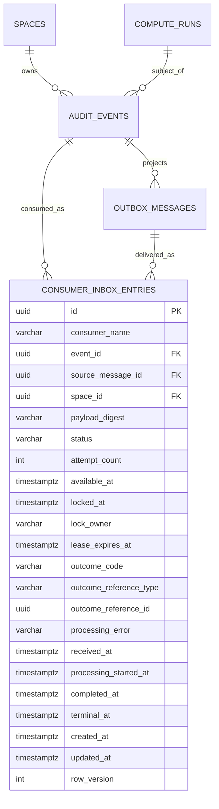
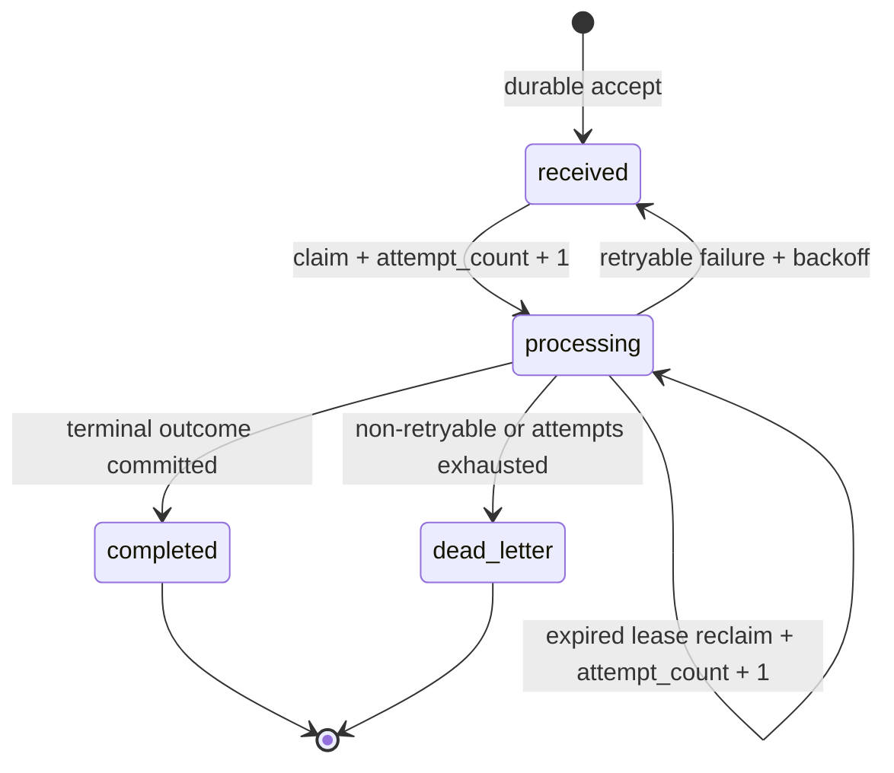
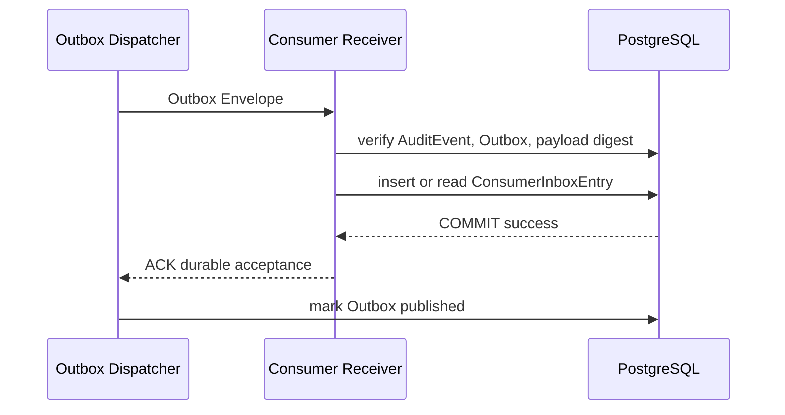

# MedTrust Space Phase 2 数据库冻结设计 v9

> 阶段：Phase 2-B.8-B1 Consumer Inbox 数据库冻结同步  
> 当前基线：Alembic `20260722_0015`，36 张实表  
> 后续目标迁移：`20260722_0016_consumer_inbox`，37 张实表  
> 文档状态：设计冻结；本阶段不生成 ORM、migration、Consumer、Coordinator 或 Executor 代码

---

## 1. 冻结结论

v9 新增且只新增一个逻辑表：

```text
consumer_inbox_entries
```

它有明确业务必要性：Outbox 提供至少一次投递，Consumer Inbox 提供“同一消费者对同一业务事件只形成一次消费结果”的持久幂等与处理租约。它不是为了补足表数，也不与通用 `idempotency_keys` 表并存。

本次冻结作出四项关键决定：

1. Inbox 只记录消费接收、租约、重试和处理结果，不复制 Compute、Audit 或 Outbox 的权威状态；
2. 0016 首期只接收现有不可变 `AuditEvent + OutboxMessage` 来源，不提前为尚未实现的 Executor Callback 建立可空多态结构；
3. 物理表保存接收时的 `payload_digest`，但不重复保存可由不可变来源读取的 `event_type`、事件 schema 版本和消息 schema 版本；
4. 0016 增量加入 `compute.run.dispatched` 数据库事件词表，但不解除 0015 对 `reserved -> dispatched` 及后续真实执行状态的硬门禁。

因此，0016 完成后仍然成立：

```text
Inbox durable accept
!= Executor accepted
!= ComputeRun running
```

---

## 2. 基线、范围与表数

### 2.1 当前已验证基线

| 项目 | 当前值 |
| --- | --- |
| PostgreSQL | 16 |
| Alembic head | `20260722_0015` |
| 实表数 | 36 |
| AuditEvent / Outbox | 已落库并通过 PostgreSQL 验证 |
| Outbox Dispatcher | 已实现至少一次投递、租约、重试和 ACK 后 published |
| ComputeRun | `reserved -> dispatched -> running` 已冻结，但真实 dispatched/running 仍 fail-closed |
| Execution Coordinator | 仅协议设计，未实现 |
| Executor | 未实现 |

### 2.2 v9 目标

```text
36 张现有实表
+ consumer_inbox_entries
= 37 张实表
```

当前文档只冻结目标结构；在 0016 真正实现前，数据库仍是 36 张实表。

### 2.3 本阶段明确不做

- 不创建 `idempotency_keys`；
- 不生成 ORM 或 Alembic 文件；
- 不修改 Dispatcher；
- 不实现 Consumer、Coordinator 或 ExecutorAdapter；
- 不推进 ComputeRun 到 `dispatched` 或 `running`；
- 不接入 Executor Callback；
- 不实现 API、前端、病理数据或模型运行；
- 不修改历史 0010 至 0015 migration。

---

## 3. 四个权威事实源

| 对象 | 权威回答 | 明确不回答 |
| --- | --- | --- |
| `audit_events` | 什么业务事实已形成、谁在何时基于什么证据形成 | 消息是否已送达、Consumer 是否完成、Run 当前状态 |
| `outbox_messages` | 某事件发往某目标的投递状态 | 消费者业务处理结果、Executor 状态 |
| `compute_runs` | 一次执行尝试当前处于什么业务状态 | 消息投递或 Consumer 租约状态 |
| `consumer_inbox_entries` | 某消费者是否可靠接收、领取并处理过某事件 | 模型是否完成、Artifact 是否发布、事件本身是否存在 |

Inbox 的 `completed` 只表示：

> 该 Consumer 已完成对这个输入事件的处理，并持久化了处理结果。

它不表示模型执行完成。对 `compute.run.reserved` 而言，`completed + outcome_code=executor_submitted` 最多说明 Executor 已接受并且平台已把 Run 写回 `dispatched`。

---

## 4. 总体关系



关系方向只从 Inbox 指向现有不可变来源：

```text
AuditEvent <- OutboxMessage
     ^              ^
     |              |
ConsumerInboxEntry--+
```

不得从 AuditEvent 或 OutboxMessage 反向增加 Inbox 外键，避免循环依赖与删除顺序污染。

---

## 5. `consumer_inbox_entries` 字段冻结

### 5.1 物理字段

| 字段 | PostgreSQL 类型 | NULL | 默认 | 语义 |
| --- | --- | ---: | --- | --- |
| `id` | UUID | 否 | 应用生成 UUID | Inbox Entry 身份 |
| `consumer_name` | VARCHAR(96) | 否 | 无 | 稳定消费者代码，不使用进程实例名 |
| `event_id` | UUID | 否 | 无 | 被消费的不可变 AuditEvent |
| `source_message_id` | UUID | 否 | 无 | 本次输入对应的 OutboxMessage，用于来源追踪 |
| `space_id` | UUID | 否 | 无 | 业务空间；用于复合 FK 和隔离查询 |
| `payload_digest` | VARCHAR(71) | 否 | 无 | 接收时 Envelope payload 摘要及冲突证据 |
| `status` | VARCHAR(16) | 否 | `received` | 仅表示消费处理生命周期 |
| `attempt_count` | INTEGER | 否 | `0` | 成功领取次数；claim/reclaim 时递增 |
| `available_at` | TIMESTAMPTZ | 否 | 接收时间 | 下一次可领取时间 |
| `locked_at` | TIMESTAMPTZ | 是 | NULL | 当前领取时间 |
| `lock_owner` | VARCHAR(96) | 是 | NULL | 当前 Coordinator Worker 实例标识 |
| `lease_expires_at` | TIMESTAMPTZ | 是 | NULL | 当前处理租约到期时间 |
| `outcome_code` | VARCHAR(48) | 是 | NULL | Consumer 终态处理结果，不是 Run 状态 |
| `outcome_reference_type` | VARCHAR(32) | 是 | NULL | V1 仅允许 `compute_run` |
| `outcome_reference_id` | UUID | 是 | NULL | 结果关联的 ComputeRun |
| `processing_error` | VARCHAR(1024) | 是 | NULL | 清洗后的最近错误或 dead-letter 原因 |
| `received_at` | TIMESTAMPTZ | 否 | 接收时间 | 首次可靠接收时间，不因重投改变 |
| `processing_started_at` | TIMESTAMPTZ | 是 | NULL | 当前租约的处理开始时间；接管时更新 |
| `completed_at` | TIMESTAMPTZ | 是 | NULL | 仅 `completed` 使用 |
| `terminal_at` | TIMESTAMPTZ | 是 | NULL | `completed` 或 `dead_letter` 进入终态时间 |
| `created_at` | TIMESTAMPTZ | 否 | 接收时间 | 记录创建时间 |
| `updated_at` | TIMESTAMPTZ | 否 | 接收时间 | 最近合法状态变化时间 |
| `row_version` | INTEGER | 否 | `1` | 所有权和并发更新辅助版本 |

### 5.2 不物理重复保存的字段

附件要求至少评估 `event_type` 和 schema 版本。v9 冻结结论是：它们属于 Inbox 的逻辑投影，但不作为物理列重复保存。

| 逻辑字段 | 读取来源 | 不重复保存的原因 |
| --- | --- | --- |
| `event_type` | `audit_events.event_type` | AuditEvent append-only；复制会形成并行事实和一致性触发器负担 |
| `event_schema_version` | `audit_events.schema_version` | 同上 |
| `message_schema_version` | `outbox_messages.message_schema_version` | Outbox 核心字段不可变，可由来源消息读取 |
| `topic` / `destination` | `outbox_messages` | 0016 首期只允许固定 dispatch 目标，复制没有收益 |
| `payload_snapshot` | `outbox_messages.payload_snapshot` | 避免复制最多 64 KiB 的完整 Envelope；处理时重读权威来源 |

`payload_digest` 必须保留，因为它参与“相同 Consumer + Event 的重复接收是否为同一请求”的冲突判断。它是接收证据，不是新的 payload 权威来源。

### 5.3 禁止保存

Inbox、outcome 和 processing_error 均不得包含：

- 患者级数据或患者标识；
- 完整 ExecutionRequest；
- WSI、PACS、LIS、EMR 或对象存储真实路径；
- 预签名 URL；
- Connector 凭据；
- MinIO access key / secret key；
- 数据库连接串；
- OAuth/JWT/执行令牌；
- Executor 请求或回执的完整敏感正文。

---

## 6. 主键、外键与唯一约束

### 6.1 主键

```sql
PRIMARY KEY (id)
```

### 6.2 复合外键

复用现有 0014 候选键，不反向修改 Audit/Outbox：

```sql
FOREIGN KEY (event_id, space_id)
REFERENCES medtrust.audit_events(event_id, space_id)
ON DELETE RESTRICT

FOREIGN KEY (source_message_id, space_id)
REFERENCES medtrust.outbox_messages(message_id, space_id)
ON DELETE RESTRICT
```

### 6.3 消费幂等唯一键

```sql
UNIQUE (consumer_name, event_id)
```

这是唯一消费身份。`source_message_id` 不参与幂等身份，因为：

- Dispatcher 至少一次重投时，消息身份可能只是来源追踪信息；
- 同一事件可拥有多个合法 Outbox 目标；
- 消费语义是“这个 Consumer 是否处理过该 Event”，不是“是否看过这条投递记录”。

同一 `event_id` 允许不同 `consumer_name` 分别处理。

### 6.4 来源一致性触发器

普通 FK 只能证明 Event 与 Message 分别存在于同一 Space，不能证明 Message 投影的正是该 Event。0016 应用 `BEFORE INSERT OR UPDATE OR DELETE` 守卫验证：

1. `outbox_messages.message_id = source_message_id`；
2. `outbox_messages.audit_event_id = event_id`；
3. AuditEvent、OutboxMessage 和 Inbox 的 `space_id` 相同；
4. `payload_digest = outbox_messages.payload_digest`；
5. Outbox 的 topic/destination 为 `medtrust.compute.dispatch.v1 / compute.dispatch`；
6. AuditEvent 为 `compute.run.reserved`、subject=`compute_run`、result=`success`；
7. 来源 Outbox 在首次接收时必须处于 Dispatcher 已领取的 `processing` 状态；
8. outcome reference 存在时，必须是同一 Space、同一 subject 的 ComputeRun。

第 7 条不影响正常重复接收：若 Inbox 已存在，接收服务直接读取已有 Entry 并比较摘要，不再次 INSERT。已 published 的来源消息不能凭空创建一条此前不存在的 Inbox 记录。

---

## 7. 幂等接收与冲突语义

接收服务以 `(consumer_name, event_id)` 做原子 insert-or-replay：

### 7.1 首次接收

```text
INSERT status=received, attempt_count=0
-> COMMIT
-> 返回 durable ACK
```

### 7.2 同事件、同摘要重投

若唯一键冲突，则在同一事务重新读取已有 Entry：

- `payload_digest` 一致：返回已有 Entry；
- 已 completed：返回已有 outcome，不再次提交 Executor；
- 正在 processing：只表示消息已可靠接收，仍可 ACK；不得夺取未过期租约；
- received/dead_letter：仍可 ACK，因为 durable acceptance 已经成立；后续处理或人工处置与 Dispatcher 投递解耦。

### 7.3 同事件、不同摘要

```text
same consumer_name + event_id
different payload_digest
-> IdempotencyConflict
-> 不返回成功 ACK
-> 记录不含敏感信息的安全告警
```

已有 Inbox Entry 不得被新 payload 覆盖。

### 7.4 并发首次接收

两个事务并发 INSERT 时，唯一约束决定只有一个创建成功。另一个事务等待约束结果后重新读取并比较摘要。不得先 SELECT 再无约束 INSERT。

---

## 8. Inbox 状态机



允许的状态流转只有：

```text
received   -> processing
processing -> processing      # 仅租约已过期的原子接管
processing -> received        # 可重试失败
processing -> completed
processing -> dead_letter
```

禁止：

- `completed -> *`；
- `dead_letter -> received/processing`；
- `received -> completed/dead_letter`；
- 使用 Inbox 状态表达 `accepted/running/failed` 等执行状态。

### 8.1 outcome 词表

V1 冻结：

```text
executor_submitted
already_dispatched
authorization_revoked
ignored_terminal_run
non_retryable_rejection
```

其中 `executor_submitted` 和 `already_dispatched` 要求 outcome reference 指向同一来源 Event subject 的 ComputeRun。其余结果是否保留 reference 由处理服务决定，但如果保存也必须通过同一 Run/Space 校验。

### 8.2 状态形态 CHECK

| 状态 | 必需形态 |
| --- | --- |
| `received` | 无锁；无 outcome；`completed_at/terminal_at` 为空；可保留清洗后的最近 `processing_error` |
| `processing` | `locked_at/lock_owner/lease_expires_at/processing_started_at` 均非空；无 outcome；无终态时间 |
| `completed` | 无锁；`outcome_code`、`completed_at`、`terminal_at` 非空；`processing_error` 为空 |
| `dead_letter` | 无锁；无 outcome；`processing_error` 和 `terminal_at` 非空；`completed_at` 为空 |

`processing_started_at` 表示当前租约开始时间，不保存逐次尝试历史。V1 只保存累计次数和最近清洗错误，不宣称拥有完整尝试日志。

---

## 9. 领取、租约、重试与所有权

### 9.1 领取算法

领取事务采用：

```sql
SELECT id
FROM medtrust.consumer_inbox_entries
WHERE status = 'received'
  AND available_at <= clock_timestamp()
ORDER BY available_at, received_at, id
FOR UPDATE SKIP LOCKED
LIMIT :batch_size;
```

然后在同一短事务内：

```text
status = processing
attempt_count = attempt_count + 1
locked_at = now
lock_owner = worker instance id
lease_expires_at = now + lease duration
processing_started_at = now
row_version = row_version + 1
COMMIT
```

领取事务内禁止调用 ExecutorAdapter。

### 9.2 参数冻结

| 参数 | V1 值 |
| --- | --- |
| 最大处理次数 | 10 |
| 默认租约 | 60 秒 |
| 初始退避 | 5 秒 |
| 退避倍率 | 2 |
| 最大退避 | 15 分钟 |
| 抖动 | 基于 Entry ID + attempt 的确定性 0% 至 20% |

退避公式：

```text
delay = min(5s * 2^(attempt_count-1), 15m) + deterministic_jitter
```

### 9.3 租约接管

租约到期后，另一 Worker 可在锁定 Entry 后执行：

```text
processing(old owner, expired)
-> processing(new owner)
+ attempt_count
+ new lease
```

若 `attempt_count >= 10`，不得再接管；维护命令把它原子转为 `dead_letter` 并保存清洗原因。

### 9.4 旧 Worker 防覆盖

所有 settle 操作必须同时满足：

```text
status = processing
AND lock_owner = :caller_worker
AND lease_expires_at > clock_timestamp()
AND row_version = :claimed_row_version
```

任一不满足即返回 ownership lost，不得覆盖新 Worker 的结果。外部 Executor 已接受但旧 Worker 丢失所有权时，新 Worker 必须通过 Executor 幂等查询恢复，不允许再次产生不同执行。

### 9.5 次数语义

- 首次 durable receive 不增加 attempt；
- 每次成功 claim 增加一次；
- 过期租约 reclaim 也增加一次；
- processing -> received 不再次增加；
- completed/dead_letter 保留最终累计数；
- dead_letter V1 不原地 redrive；若将来需要重放，必须新增显式、可审计的运维命令设计。

---

## 10. Consumer ACK 边界



冻结顺序：

```text
收到 Envelope
-> 校验 Envelope / AuditEvent / Outbox
-> 原子 INSERT 或读取 Inbox Entry
-> COMMIT
-> 才返回 ACK
```

若 Inbox 事务失败：

- 不返回 ACK；
- Dispatcher 不得把 Outbox 标记为 published；
- Dispatcher 按现有 lease/retry 机制重投。

若 Inbox 已存在且摘要一致，可以安全 ACK。ACK 只确认 durable acceptance，不确认业务处理或 Executor acceptance。

接收校验至少包含事件 digest、payload digest、Event/Message/Space/target 一致性。完整 Space 哈希链可周期性或在高保证模式验证；不得把每次接收的全链扫描变成全局吞吐瓶颈。

---

## 11. Coordinator 处理事务

### 11.1 事务 A：领取

```text
claim Inbox Entry
-> status=processing + lease
-> COMMIT
```

### 11.2 数据库事务外：授权重验与 Executor 调用

1. 重新读取 Inbox 来源 Event/Outbox；
2. 锁外重读 Run、Active ContractRevision、Policy、Constraint、Binding、Connector 和 Capability；
3. 校验 Run 仍为 `reserved`，或已是相同提交形成的 `dispatched`；
4. 构造不含路径和凭据的固定 ExecutionRequest；
5. 先用 `submission_idempotency_key` 查询已有提交；
6. 未找到时才调用 `ExecutorAdapter.submit`。

稳定提交键冻结为：

```text
submission_idempotency_key = sha256("medtrust:compute-run:" + run_id)
```

Executor 必须保证同一 key + 同一 request digest 返回同一 `external_execution_id`；同一 key + 不同 digest 必须冲突。

### 11.3 事务 B：Accepted 写回

Executor 返回 Accepted 后，在一个新事务内完成：

```text
lock Inbox Entry and verify owner + unexpired lease
lock ComputeRun
re-check current authorization
ComputeRun reserved -> dispatched
+ opaque execution_reference
+ dispatch_receipt_digest
+ dispatched_at
+ compute.run.dispatched AuditEvent
+ required OutboxMessage
+ Inbox completed
+ outcome_code=executor_submitted
+ outcome_reference_type=compute_run
+ outcome_reference_id=run_id
COMMIT
```

任何数据库写入失败时，事务整体回滚，不得伪造 Inbox completed。由于 Executor 外部调用已经可能成功，重试必须先按提交幂等键查询并恢复已有 `external_execution_id`。

### 11.4 已有 dispatched 重放

若重试时发现 Run 已为 `dispatched`，且 execution reference 和 receipt digest 与 Executor 幂等查询一致：

```text
Inbox processing -> completed
outcome_code = already_dispatched
```

不得再次创建 `compute.run.dispatched` 事件。

若 Run 已进入 running/终态，Consumer 可完成为 `ignored_terminal_run`，但必须验证它确由同一提交链形成；不允许仅凭状态跳过摘要核对。

---

## 12. Executor 故障窗口与恢复

| 故障窗口 | 恢复规则 | 禁止行为 |
| --- | --- | --- |
| Executor 接受后、平台写回事务前崩溃 | 重试先 `get_by_idempotency_key`，恢复同一 external ID，再执行事务 B | 直接再次 submit 新请求 |
| submit 超时、结果未知 | 先查询幂等键；只有明确不存在时才重试 submit | 把超时直接当拒绝或再次启动 |
| 同一 run/key 返回不同 request digest | fail-closed，进入人工调查 | 选择任一结果继续 |
| Executor 明确临时拒绝 | processing -> received，按退避重试 | 修改原 ExecutionRequest |
| Executor 明确永久拒绝 | processing -> completed/non_retryable_rejection，Run 是否失败留给后续权威命令设计 | 用 Inbox dead_letter 冒充 Run failed |
| Worker 租约在外部调用中失效 | 旧 Worker 不写回；新 Worker 幂等恢复 | 旧 Worker 覆盖新 Worker |
| Dispatcher 重复投递 | 返回已有 Inbox；若已 completed 返回已有结果 | 重复提交 Executor |

基础设施重试耗尽进入 Inbox dead_letter，只代表消费处理需要人工处置，不自动把 ComputeRun 改为 failed。

---

## 13. `compute.run.dispatched` 事件冻结

### 13.1 事件目录

| 项目 | 冻结值 |
| --- | --- |
| event_type | `compute.run.dispatched` |
| actor_type | `system` |
| actor_service_code | `medtrust.compute` |
| subject_type | `compute_run` |
| subject_id | ComputeRun ID |
| result | `success` |
| correlation_id | 继承 `compute.run.reserved` |
| causation_id | 对应 `compute.run.reserved` AuditEvent ID |
| topic | `medtrust.audit.v1` |
| destination | `audit.timeline` |
| 执行硬门禁 | 是；必须与 Run dispatched 同事务形成 |

该事件不得再次投向 `compute.dispatch`，否则会形成自触发循环。

### 13.2 evidence_snapshot 最小边界

```json
{
  "schema_version": 1,
  "compute_run_id": "uuid",
  "compute_job_id": "uuid",
  "contract_revision_id": "uuid",
  "contract_object_id": "uuid",
  "source_reserved_event_id": "uuid",
  "consumer_inbox_entry_id": "uuid",
  "execution_request_digest": "sha256:...",
  "dispatch_receipt_digest": "sha256:...",
  "external_execution_reference_digest": "sha256:...",
  "submission_idempotency_digest": "sha256:...",
  "accepted_at": "UTC timestamp"
}
```

只保存 external execution reference 的摘要到 Audit evidence；ComputeRun 现有 `execution_reference` 可保存受控、无凭据、非 URL 的不透明执行 ID。

### 13.3 命令幂等

稳定命令上下文由以下事实派生：

```text
consumer_name
+ source reserved event_id
+ compute_run_id
+ action=dispatch_accept
```

重试必须返回同一 Run dispatched 事实，不得产生第二个同类型事件或第二次 Executor 提交。

---

## 14. 0016 数据库函数与触发器计划

### 14.1 Inbox 守卫

后续 0016 建议创建：

```text
guard_consumer_inbox_entry_v9()
trg_guard_consumer_inbox_entry_v9
```

职责：

- INSERT 初始形态；
- Event/Outbox/Space/payload/target 一致性；
- 核心字段不可变；
- 状态机；
- attempt/row_version；
- lease owner 与过期接管；
- outcome reference 同一 Run/Space；
- completed/dead_letter 不可 UPDATE/DELETE；
- 全表 V1 禁止 DELETE。

### 14.2 事件目录增量更新

当前 0014 的数据库对象明确包含：

- `ck_audit_events_event_type` 固定 CHECK；
- `guard_audit_event_v8()` 固定 CASE 事件形态；
- `outbox_target_allowed_v8()` 允许所有事件到 `audit.timeline`，并只允许 `compute.run.reserved` 到 `compute.dispatch`。

因此 0016 需要：

1. 以新 CHECK 替换 `ck_audit_events_event_type`，增加 `compute.run.dispatched`；
2. 通过 `CREATE OR REPLACE FUNCTION` 增量更新 AuditEvent 形态守卫，使 dispatched 要求 subject=`compute_run`、result=`success`、同 Space Run 存在；
3. 应用层后续同步 `EVENT_SHAPES` 和 `EVENT_TARGETS`；
4. `outbox_target_allowed_v8()` 无需为 dispatch 添加第二目标，因为其通用 `audit.timeline` 分支已经允许，且其他目标应继续拒绝。

不得编辑 0014 历史 migration。

### 14.3 0015 硬门禁保持

0015 只解除 `prepared -> reserved` 的审计门禁；其余状态仍调用 `assert_compute_audit_ready_v7()` 并抛出 `AuditEvidenceUnavailable`。

0016 不得替换这一剩余硬门。原因是 Inbox ORM 和 Coordinator 尚未实现。未来 Coordinator 实现阶段应另增迁移，把 `reserved -> dispatched` 替换为“同事务存在 `compute.run.dispatched` AuditEvent + audit.timeline Outbox + 匹配 Inbox completed”的数据库守卫；running 与终态仍分别等待可信 Executor callback 接入。

该未来守卫应采用可延迟到 COMMIT 的约束触发器，或等价的事务终态校验；不能要求调用方为了迎合立即触发顺序，先伪造某一项已完成。COMMIT 时必须同时看到 Run dispatched、对应 AuditEvent、必需 Outbox 和同一来源 Inbox completed，缺一项则整个事务回滚。

---

## 15. CHECK、不可变与删除策略

### 15.1 CHECK 计划

- `status IN ('received','processing','completed','dead_letter')`；
- `attempt_count BETWEEN 0 AND 10`；
- `row_version >= 1`；
- `payload_digest ~ '^sha256:[0-9a-f]{64}$'`；
- `consumer_name ~ '^[a-z0-9][a-z0-9._-]{2,95}$'`；
- `outcome_code` 属于冻结词表或为空；
- outcome reference type/id 同空同非空；
- outcome reference 非空时 type=`compute_run`；
- `lease_expires_at > locked_at`；
- 四种状态满足第 8.2 节形态；
- `received_at = created_at`；
- `updated_at >= created_at`。

### 15.2 核心不可变字段

创建后禁止变化：

```text
id
consumer_name
event_id
source_message_id
space_id
payload_digest
received_at
created_at
```

`outcome_code/reference` 一旦进入 completed 也不可变化；processing_error 在重试期间可更新为清洗后的最近错误，终态后冻结。

### 15.3 删除与保留

V1 禁止 Inbox DELETE，包括 completed 和 dead_letter。删除来源 AuditEvent/Outbox 本身也已被现有守卫禁止或限制。

长期归档必须在未来设计中同时保证：

- 幂等事实仍可查询；
- event/message/source 证据链不断裂；
- 保留期满足审计和合同要求；
- 不以清表方式重置幂等身份。

---

## 16. 索引冻结

```sql
-- 幂等
UNIQUE (consumer_name, event_id)

-- 待处理领取
CREATE INDEX ... ON consumer_inbox_entries
  (available_at, received_at, id)
  WHERE status='received';

-- 过期租约扫描
CREATE INDEX ... ON consumer_inbox_entries
  (lease_expires_at, id)
  WHERE status='processing';

-- Consumer 队列监控
CREATE INDEX ... ON consumer_inbox_entries
  (consumer_name, status, available_at);

-- Space 时间线
CREATE INDEX ... ON consumer_inbox_entries
  (space_id, received_at DESC, id);

-- 来源追踪
CREATE INDEX ... ON consumer_inbox_entries (event_id);
CREATE INDEX ... ON consumer_inbox_entries (source_message_id);
```

不为 `outcome_reference_id` 建通用多态索引以外的大量可空 FK。V1 只有 compute coordinator 消费者，若实际查询证明需要，可增加部分索引：

```sql
... (outcome_reference_id)
WHERE outcome_reference_type='compute_run';
```

---

## 17. 安全与权限边界

建议数据库角色分离：

| 角色 | 权限 |
| --- | --- |
| Dispatcher/Publisher | 读取自己的 Outbox；不得直接写 Inbox |
| Consumer Receiver | 读取目标 Event/Outbox；INSERT 或读取 Inbox；不得推进 Run |
| Coordinator Worker | claim/settle Inbox；通过受控命令服务推进 Run；不得改 AuditEvent |
| Audit writer | 通过 append 服务写 AuditEvent/Outbox；不得修改既有事件 |
| Audit reader | 只读 Audit/Event/Inbox 投影 |
| Migration owner | 创建/替换函数、触发器和约束；不作为运行时业务角色 |

运行时角色不得：

- 禁用触发器；
- 直接 UPDATE completed/dead_letter；
- 直接把 Run 改为 dispatched/running；
- 读取或写入对象存储密钥；
- 用普通日志替代 AuditEvent。

`processing_error` 写入前必须执行与 Outbox `last_error` 同等级的脱敏：拒绝 Authorization、Bearer、token、secret、password、access key、签名参数和带 query 的 URL。

---

## 18. 迁移计划

### 18.1 `20260722_0016_consumer_inbox`

0016 预计负责：

1. 创建 `consumer_inbox_entries`；
2. 创建主键、复合 FK、消费唯一键和状态 CHECK；
3. 创建 claim、lease、监控和来源追踪索引；
4. 创建 Inbox 来源一致性、不可变、状态和所有权触发器；
5. 增量替换 Audit event type CHECK，加入 `compute.run.dispatched`；
6. 增量替换 Audit event shape guard，加入 dispatched 形态；
7. 保持 0015 真实执行硬门禁不变；
8. upgrade 后实表从 36 变为 37。

### 18.2 0016 不负责

- Coordinator 命令；
- Executor submit/query；
- Dispatcher 接收适配器修改；
- ComputeRun 状态推进；
- callback ingestion；
- `compute.run.started/completed/failed/interrupted` 接入；
- API、前端、数据或模型运行。

### 18.3 downgrade

降级顺序：

1. 恢复 0015 时的 Audit event CHECK 和 `guard_audit_event_v8()` 事件目录；
2. 删除 Inbox trigger/function；
3. 删除 Inbox 索引和表；
4. 验证 head 回到 0015、实表回到 36；
5. 若数据库中已存在 `compute.run.dispatched` 事件，downgrade 必须 fail-fast，不得静默删除审计事实。

### 18.4 后续固定顺序

```text
v9数据库冻结（本阶段）
-> 0016 Inbox ORM / migration
-> Coordinator Consumer
-> Future gate migration: audited reserved -> dispatched
-> FakeExecutor submit + idempotent recovery
-> started/completed/failed/interrupted callback Inbox freeze and implementation
-> Local Built-in Executor
-> 少量公开数据与预登记模型测试
```

---

## 19. PostgreSQL 验证计划

### 19.1 接收与幂等

1. 首次接收创建 Inbox，COMMIT 后才 ACK；
2. 同 Consumer/Event/摘要重投返回已有 Entry；
3. 同 Consumer/Event 不同摘要抛出 `IdempotencyConflict`；
4. 不同 Consumer 可分别处理同一 Event；
5. 两个并发首次接收只产生一条 Entry；
6. source Message 不属于 Event、跨 Space 或摘要不一致时直接 SQL 也被拒绝；
7. 非 `compute.dispatch` 目标不能创建本期 Inbox。

### 19.2 领取、租约与终态

8. 两个 Worker 使用 `SKIP LOCKED` 不能领取同一 Entry；
9. claim 原子增加 attempt，未过期租约不能接管；
10. 租约过期可接管并再次增加 attempt；
11. 旧 Worker 不能覆盖新 Worker 结果；
12. retry 正确设置 available_at 和清洗错误；
13. 第 10 次失败进入 dead_letter；
14. completed 不可 UPDATE/DELETE；
15. dead_letter 不可重领、UPDATE/DELETE；
16. 事务回滚不留下 processing 幽灵租约。

### 19.3 ACK 与故障注入

17. Inbox INSERT 失败时 Receiver 不 ACK，Outbox 不进入 published；
18. Inbox COMMIT 成功、ACK 丢失时重投安全返回已有 Entry；
19. payload digest 冲突不返回成功 ACK；
20. Dispatcher published 不可作为 Consumer completed 的替代事实。

### 19.4 Coordinator 恢复场景（后续实现验收）

21. Executor Accepted 后平台写回失败，重试按幂等键恢复同一 external ID；
22. submit 超时先 query，不盲目二次提交；
23. 同一 run_id + 不同 request digest fail-closed；
24. 重复 Outbox 投递不重复提交 Executor；
25. Run dispatched、AuditEvent、Outbox 和 Inbox completed 同事务；
26. 任一写入失败全部回滚；
27. 租约丢失的旧 Worker 即使拿到 Executor 回执也不能写回。

### 19.5 事件目录与迁移

28. `compute.run.dispatched` 合法形态可写，错误 subject/result/Space 被拒绝；
29. dispatched 只能生成 audit.timeline Outbox，不能生成 compute.dispatch；
30. 0016 后 0015 的 dispatched/running 硬门仍然抛出 `AuditEvidenceUnavailable`；
31. 0015 -> 0016 -> 0015 -> 0016 真实循环；
32. 空数据库完整 upgrade 到 0016；
33. 36 -> 37 -> 36 表数正确；
34. downgrade 遇到 dispatched 审计事实时 fail-fast；
35. 历史 0010 至 0015 文件未修改。

### 19.6 回归

36. Audit Space 哈希链连续；
37. Outbox Dispatcher lease/retry/dead-letter 回归；
38. Contract active COMMIT hotfix 回归；
39. Compute run_count 并发回归；
40. Artifact 不可变与 Review 终态回归；
41. 全后端回归；
42. 无 Consumer/Coordinator/Executor 代码时 Run 仍不能进入 dispatched/running。

---

## 20. ORM 前冻结检查

- [ ] 只新增 `consumer_inbox_entries`，不新增通用幂等表；
- [ ] 物理字段不复制 event type/schema/payload snapshot；
- [ ] `(event_id, space_id)` 和 `(source_message_id, space_id)` 复用现有候选键；
- [ ] `UNIQUE(consumer_name,event_id)` 是唯一消费身份；
- [ ] payload 摘要冲突语义已实现为显式异常；
- [ ] source Outbox/Event/Space/target 一致性有数据库守卫；
- [ ] 状态形态、transition、attempt、lease owner 和 row version 有数据库守卫；
- [ ] terminal Entry 不可变且不可删除；
- [ ] claim 不持有外部 Executor 调用；
- [ ] ACK 只发生在 Inbox COMMIT 后；
- [ ] 外部 submit 使用稳定幂等键并支持 query recovery；
- [ ] `compute.run.dispatched` 只发 audit.timeline；
- [ ] 0016 不解除 0015 剩余真实执行硬门；
- [ ] callback 多态来源推迟到 callback 协议冻结；
- [ ] 无患者数据、路径、凭据、密钥或令牌字段；
- [ ] downgrade 对既有 dispatched 事件 fail-fast；
- [ ] head/table/migration cycle 和全量回归测试已设计。

---

## 21. 风险与后续决策

| 风险 | v9 处理 | 后续触发点 |
| --- | --- | --- |
| Consumer completed 被误解为执行完成 | 权威边界和 outcome 明确分离 | Coordinator/API 命名评审 |
| ACK 后 Consumer 崩溃 | durable Inbox + lease reclaim | 0016/Coordinator 并发测试 |
| Executor 接受后写回失败 | 双层幂等 + query recovery | FakeExecutor 实现 |
| 复制 Event/schema 形成漂移 | 物理表不重复保存，联表投影 | 查询性能数据证明需要物化时 |
| 回调与 Outbox 来源混在一表 | 0016 只做 Event/Outbox 来源 | callback 鉴权和去重协议冻结后 |
| Inbox dead_letter 被当成 Run failed | 明确不同事实源 | 运维界面和告警设计 |
| 0016 提前解锁 Run | 保持 0015 硬门 | Coordinator 同事务写回完成后另迁移 |
| 一次消费尝试历史不完整 | V1只存累计次数/最近错误，不夸大能力 | 合规要求逐次尝试证据时另建追加式事件 |
| 37 表目标驱动设计 | 只承认本表的业务必要性，不再凑表 | 新对象必须重新证明权威边界 |

---

## 22. 最终冻结摘要

```text
当前：
  head 20260722_0015
  36张实表
  Dispatcher至少一次投递已实现
  无Consumer Inbox、Coordinator或Executor
  Run dispatched/running仍fail-closed

0016计划：
  + consumer_inbox_entries
  + UNIQUE(consumer_name,event_id)
  + Event/Outbox/Space/payload一致性守卫
  + received/processing/completed/dead_letter租约状态机
  + compute.run.dispatched事件CHECK与形态目录
  = 37张实表
  - 不解除真实执行硬门
  - 不实现Coordinator/Executor/callback

后续：
  Inbox ORM/migration
  -> Coordinator Consumer
  -> audited dispatched gate
  -> FakeExecutor幂等提交与恢复
  -> callback闭环
  -> Local Built-in Executor
  -> 少量公开病理数据与预登记模型
```

v9 的核心不变量是：

> Dispatcher 只有在 Consumer Inbox 已经可靠提交后才能收到 ACK；同一消费者对同一 AuditEvent 只能形成一份持久消费结果；Executor 外部调用必须在数据库事务外以稳定幂等键执行，Accepted 写回时 Run、AuditEvent、Outbox 和 Inbox 结果必须同事务提交。仅建立 Inbox 表和 dispatched 事件词表，不等于真实执行已经被解锁。
