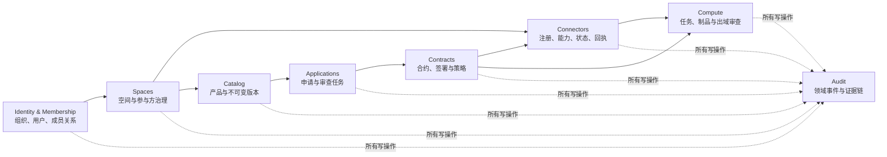
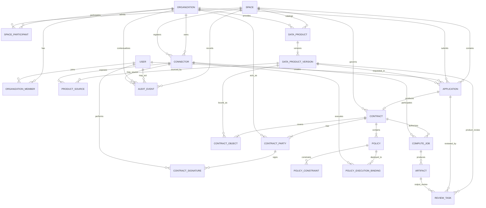
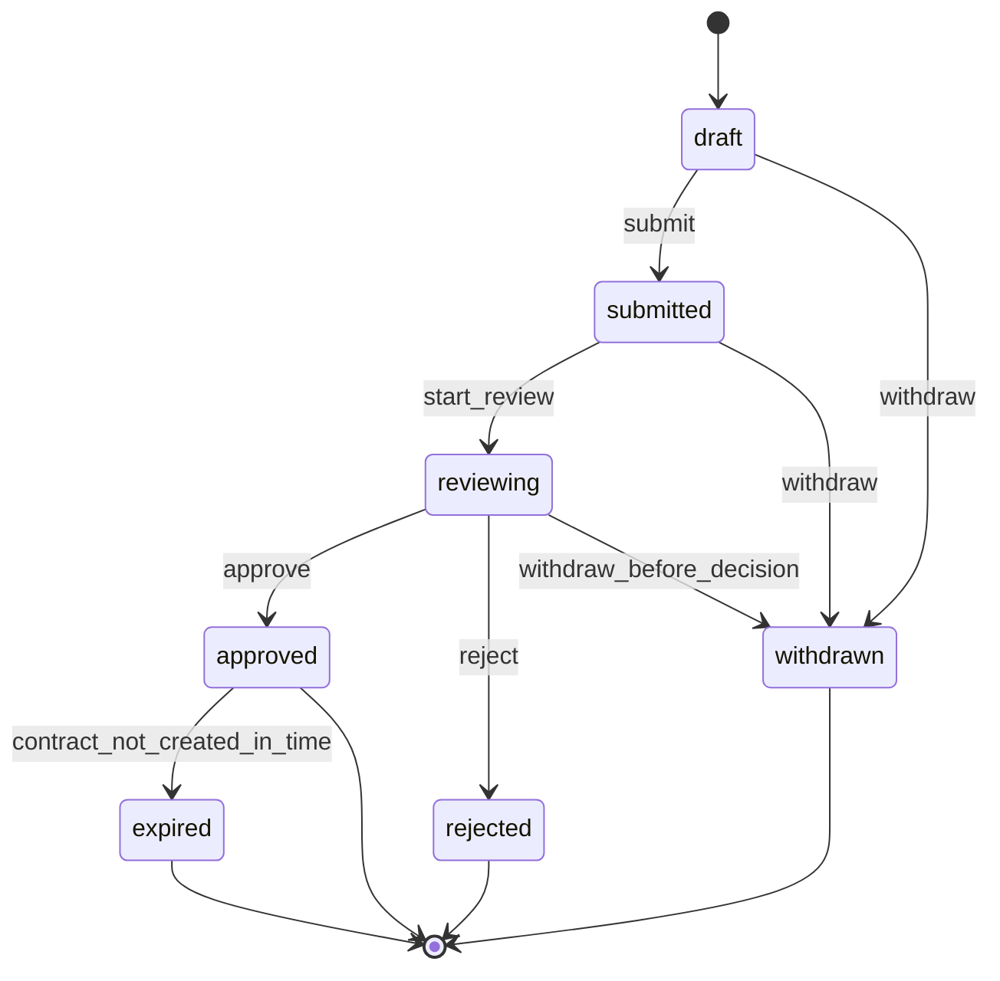
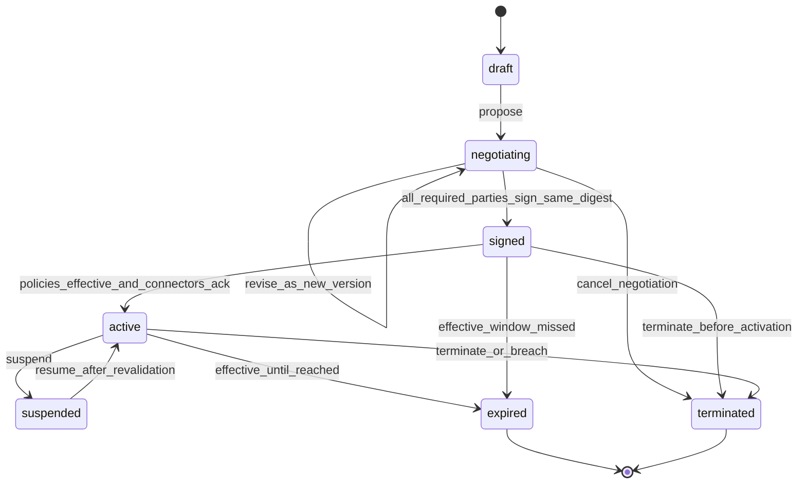
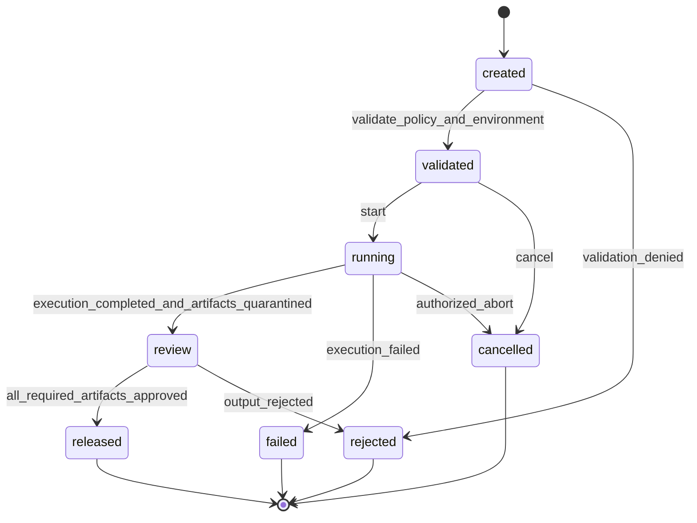

# MedTrust Space Phase 2-A 领域模型设计

文档版本：v0.1  
日期：2026-07-22  
状态：设计基线，待评审  
范围：领域对象、关系、状态机、业务不变量和数据库概念模型；不包含后端、迁移脚本或前端实现。

## 0. 结论先行

Phase 1 的 `DemoStage` 适合演示，但不能直接演进为数据库字段。Phase 2 的核心变化不是“增加 FastAPI”，而是把一个全局故事线拆成多组织、多数据产品、多申请、多合约、多任务可以并行存在的业务模型。

本设计采用 13 个核心领域对象：

1. `Organization`
2. `User`
3. `Space`
4. `Connector`
5. `DataProduct`
6. `DataProductVersion`
7. `Application`
8. `ReviewTask`
9. `Contract`
10. `Policy`
11. `ComputeJob`
12. `Artifact`
13. `AuditEvent`

同时引入少量关系实体，例如组织成员、空间参与方、合约签署方和策略执行节点。这些不是额外业务中心，而是为了避免把多对多关系压成字符串或 JSON，导致 Phase 2-B 再次改库。

设计主线保持不变：

```text
DataProductVersion
        ↓
Application + ReviewTask
        ↓
Contract + Policy
        ↓
Connector 执行策略
        ↓
ComputeJob
        ↓
Artifact + ReviewTask
        ↓
AuditEvent
```

关键结论：

- 数据产品是可被发现的逻辑身份，真正被申请和签约的是不可变的 `DataProductVersion`。
- 用户角色不能是全局枚举；权限来自“用户—组织关系”和“组织—空间关系”。
- 申请批准不等于获得数据使用权；只有合约生效且策略可执行，才能创建任务。
- 任务运行完成不等于结果可见；计算输出先形成 `Artifact`，经独立审查后才能发布。
- 审计事件不是普通可编辑日志，而是业务动作产生的追加式证据记录。
- 服务平台默认保存元数据、状态、策略和证据，不默认保存医院原始 WSI。

---

## 1. 设计依据与适用边界

### 1.1 架构依据

可信数据空间的现行技术架构把服务平台和接入连接器作为关键组成，并以数据产品、数字合约、使用控制、空间治理和审计追溯组织业务能力。

本领域模型据此作出以下映射：

| 架构能力 | 领域对象 |
|---|---|
| 身份与参与主体 | `Organization`、`User`、组织成员、空间参与方 |
| 可信数据空间管理 | `Space` |
| 连接器管理 | `Connector` |
| 数据产品目录 | `DataProduct`、`DataProductVersion` |
| 使用申请与审核 | `Application`、`ReviewTask` |
| 数字合约 | `Contract`、合约签署方、`Policy` |
| 使用控制 | `Policy`、策略执行节点、`ComputeJob` |
| 结果控制 | `Artifact`、`ReviewTask` |
| 使用存证与审计 | `AuditEvent` |

### 1.2 本阶段不做

- 不创建 FastAPI 项目。
- 不创建 PostgreSQL 表或迁移脚本。
- 不改造 Phase 1 React 页面和 Mock。
- 不设计真实患者数据表，不把患者、切片、病理报告作为平台中心数据库实体。
- 不声称已实现连接器、隐私计算、数字签名、可信执行环境或不可篡改存证。
- 不在本轮决定具体 ORM、消息队列、对象存储或身份提供商。

### 1.3 术语约定

| 术语 | 本文含义 |
|---|---|
| 服务平台 | MedTrust Space 中央业务平台，管理元数据、规则、状态和审计证据。 |
| 连接器 | 组织接入空间并执行或反馈使用控制策略的节点。 |
| 数据产品 | 可被目录发现、申请和签约的逻辑产品身份。 |
| 产品版本 | 某一时点不可变的数据范围、质量、来源和默认使用规则快照。 |
| 合约 | 多方对特定产品和用途形成的数字化约定。 |
| 策略 | 合约中可由执行节点解释的允许、禁止或义务规则。 |
| 制品 | 计算任务产生的输出对象，如聚合报告、指标文件或模型制品。 |
| 发布 | 制品通过审查后，按合约允许的方式向指定使用方开放。 |

---

## 2. 领域上下文与模块边界

Phase 2-B 仍应采用模块化单体，不需要提前拆微服务。模块边界用于约束依赖、事务和代码职责。



| 上下文 | 自己拥有的数据 | 不应直接修改的数据 |
|---|---|---|
| Identity | 组织、用户、组织成员 | 空间角色、产品、申请 |
| Spaces | 空间、空间参与方、空间规则版本 | 组织核验结果、产品版本 |
| Connectors | 连接器身份、能力、状态、心跳、策略回执 | 合约正文、产品元数据 |
| Catalog | 数据产品、产品版本、来源映射 | 申请和合约状态 |
| Applications | 申请、申请材料、申请审查任务 | 产品版本内容、合约签名 |
| Contracts | 合约、签署方、签名、策略和策略绑定 | 任务运行状态 |
| Compute | 计算任务、制品、输出审查任务 | 合约正文和产品版本 |
| Audit | 追加式领域事件和证据摘要 | 任何业务对象状态 |

跨模块不通过“直接改另一张表”协作，而通过明确命令和领域事件衔接。例如：

```text
application.approved
  → Contracts 创建合约草稿

contract.activated
  → Compute 获得创建任务的必要条件之一

compute_job.completed
  → 创建 Artifact 和 output_review ReviewTask

artifact.released
  → Audit 记录发布证据并通知使用方
```

---

## 3. 聚合边界

| 聚合根 | 聚合内部或关系对象 | 边界说明 |
|---|---|---|
| `Organization` | `OrganizationMember` | 组织负责成员准入和组织内角色，但不决定空间角色。 |
| `User` | 无 | 用户身份独立存在，可加入多个组织。 |
| `Space` | `SpaceParticipant`、空间规则版本引用 | 空间运营方控制组织准入和空间级角色。 |
| `Connector` | 能力声明、心跳、认证信息 | 连接器独立更新状态，不内嵌到组织或产品。 |
| `DataProduct` | 当前发布版本引用 | 产品只管理逻辑身份与目录生命周期，避免每次新增版本都扩大同一聚合。 |
| `DataProductVersion` | `ProductSource` | 版本具有独立审核和发布生命周期，并被申请、合约直接引用，因此作为独立聚合根。 |
| `Application` | `ApplicationItem`、申请材料引用 | 一次申请固定产品版本和请求范围。 |
| `ReviewTask` | 决定和意见 | 审查任务独立进入待办队列，可针对申请、产品或制品。 |
| `Contract` | `ContractParty`、`ContractSignature` | 合约正文和签署快照不可原地覆盖。 |
| `Policy` | `PolicyConstraint`、`PolicyExecutionBinding` | 策略需结构化且可下发至一个或多个执行节点。 |
| `ComputeJob` | 运行摘要、策略校验快照 | 任务必须固定引用生效合约和策略快照。 |
| `Artifact` | 发布记录引用 | 制品生命周期与任务运行生命周期分开。 |
| `AuditEvent` | 无 | 只追加，不参与业务对象的状态写回。 |

为什么 `ReviewTask` 和 `Artifact` 是独立对象：

- 一次申请可能有平台预审、提供方审核、合规审核等多个任务。
- 一个计算任务可能产生多个制品，每个制品的敏感级别和发布决定不同。
- 审查队列需要单独分配处理人、截止时间、意见和决定，不能只在 Application 或 ComputeJob 上放一个 `approved` 布尔值。

---

## 4. 核心对象详细设计

以下字段为概念模型。`id` 建议使用不可枚举的公共标识；数据库内部实现可在 Phase 2-B 决定。

所有可变业务对象默认包含：

- `id`
- `created_at`
- `created_by`
- `updated_at`
- `row_version`：用于乐观并发控制
- `demo`：演示数据标识

### 4.1 Organization

#### 定义

参与可信数据空间的法律或业务主体，例如医院、科研机构、AI 企业、数据服务方或空间运营方。

#### 关键字段

| 字段 | 含义 |
|---|---|
| `id` | 组织唯一标识。 |
| `legal_name` | 法定名称；演示环境使用虚构名称。 |
| `display_name` | 页面展示名称。 |
| `organization_type` | `hospital`、`research_institute`、`ai_company`、`service_provider`、`operator` 等。 |
| `verification_status` | `unverified`、`pending`、`verified`、`failed`。 |
| `status` | `active`、`suspended`、`withdrawn`。 |
| `external_identity_ref` | 未来对接统一身份或区域/行业节点的外部标识。 |
| `contact_metadata` | 联系信息；生产环境需最小化并加密敏感字段。 |

#### 关系

- 与 `User` 通过 `OrganizationMember` 多对多关联。
- 通过 `SpaceParticipant` 加入一个或多个 `Space`。
- 拥有零到多个 `Connector`。
- 可作为数据产品提供方、申请方、合约签署方或服务方。

#### 业务不变量

- 组织类型不是永久角色；一家医院也可能在另一场景作为数据使用方。
- 未核验或被暂停的组织不能发布产品、提交申请、签署合约或运行任务。
- 真实统一社会信用代码等敏感标识不应以明文出现在日志和普通 API 响应中。

### 4.2 User

#### 定义

代表自然人的登录主体。用户通过组织成员关系和空间参与关系获得权限，不保存一个全局 `role`。

#### 关键字段

| 字段 | 含义 |
|---|---|
| `id` | 用户唯一标识。 |
| `identity_subject` | 身份提供商中的稳定主体标识。 |
| `display_name` | 展示姓名；演示环境使用虚构姓名。 |
| `email` | 登录或通知地址，生产环境需验证和保护。 |
| `status` | `invited`、`active`、`suspended`、`disabled`。 |
| `last_authenticated_at` | 最近认证时间。 |
| `mfa_status` | 未来多因素认证状态。 |

#### 关系对象：OrganizationMember

| 字段 | 含义 |
|---|---|
| `organization_id` | 所属组织。 |
| `user_id` | 用户。 |
| `organization_roles` | 组织管理员、数据管理员、研究人员、合规人员等组织内角色。 |
| `status` | `invited`、`active`、`suspended`、`removed`。 |
| `valid_from` / `valid_until` | 成员资格有效期。 |

#### 业务不变量

- 用户可以属于多个组织，但一次业务操作必须携带明确的当前组织上下文。
- `provider_admin` 等角色只能在指定组织和空间内生效，不能做成用户全局属性。
- 用户被禁用后，历史审计事件仍保留原始主体快照。

### 4.3 Space

#### 定义

围绕特定共识规则、参与主体和应用场景形成的逻辑可信数据空间，例如“数字病理 AI 协作空间”。

#### 关键字段

| 字段 | 含义 |
|---|---|
| `id` | 空间唯一标识。 |
| `code` | 稳定业务编码。 |
| `name` | 空间名称。 |
| `space_type` | `industry`、`enterprise`、`city` 或项目内部分类。 |
| `operator_organization_id` | 空间运营组织。 |
| `status` | `draft`、`active`、`suspended`、`closed`。 |
| `ruleset_version` | 当前共识规则版本。 |
| `classification_scheme_version` | 数据分类分级规则版本。 |
| `default_retention_policy` | 默认保留与销毁规则。 |

#### 关系对象：SpaceParticipant

| 字段 | 含义 |
|---|---|
| `space_id` | 空间。 |
| `organization_id` | 参与组织。 |
| `participant_roles` | `provider`、`consumer`、`service_provider`、`operator`，可多选。 |
| `admission_status` | `applied`、`reviewing`、`admitted`、`rejected`、`suspended`、`exited`。 |
| `admitted_at` | 准入时间。 |
| `ruleset_accepted_version` | 已接受的共识规则版本。 |

#### 业务不变量

- 任何产品、申请、合约、任务和审计事件都必须属于明确的 `Space`。
- 组织必须已准入并接受当前有效规则，才能在空间内执行业务动作。
- 空间暂停时不允许创建新申请、合约或任务，但历史查询和审计仍可用。

### 4.4 Connector

#### 定义

组织接入空间、发布产品、接收策略、执行使用控制或回传履约证据的规范化节点。

#### 关键字段

| 字段 | 含义 |
|---|---|
| `id` | 平台内连接器标识。 |
| `external_connector_id` | 数据基础设施或外部注册体系中的标识。 |
| `space_id` | 所属逻辑空间。 |
| `owner_organization_id` | 所有组织。 |
| `connector_roles` | `provider`、`consumer`、`service`；允许多角色。 |
| `capability_profile` | 产品封装、策略解析、行为校验、任务执行、使用存证等能力声明。 |
| `endpoint_metadata` | 连接地址和协议元数据；不存私钥。 |
| `certificate_fingerprint` | 证书指纹或外部凭证引用。 |
| `verification_status` | `pending`、`verified`、`failed`、`revoked`。 |
| `runtime_status` | `unknown`、`online`、`degraded`、`offline`、`maintenance`。 |
| `last_heartbeat_at` | 最近心跳。 |
| `last_policy_ack_at` | 最近策略回执时间。 |

#### 状态

连接器身份状态与运行状态分开管理，不能用一个 `status` 同时表达“已认证”和“在线”。

#### 关系

- 属于一个组织并注册到一个空间。
- 可作为一个或多个产品版本的数据来源或封装节点。
- 可作为 Policy 的执行节点。
- 可作为 ComputeJob 的提供方、使用方或服务方节点。

#### 业务不变量

- 只有 `verified` 且运行状态满足策略要求的连接器，才能参与策略下发和任务执行。
- 平台保存连接器元数据、能力和回执，不保存连接器私钥。
- 同一物理连接器未来可接入多个空间，但每个空间的能力适配和准入状态必须独立记录。

### 4.5 DataProduct

#### 定义

在目录中长期存在、可被发现和引用的数据产品逻辑身份。它不是原始数据库，也不直接代表某次固定的数据快照。

#### 关键字段

| 字段 | 含义 |
|---|---|
| `id` | 产品稳定标识。 |
| `space_id` | 发布所在空间。 |
| `provider_organization_id` | 产品责任主体。 |
| `name` | 产品名称。 |
| `product_type` | 文件、API、受控计算服务、模型服务等。 |
| `domain` | 数字病理、医学影像等领域。 |
| `status` | `draft`、`reviewing`、`published`、`suspended`、`expired`、`archived`。 |
| `current_published_version_id` | 当前目录展示版本。 |
| `catalog_visibility` | 空间内、指定组织、受邀可见等。 |

#### 关系

- 拥有多个 `DataProductVersion`。
- 一个逻辑产品只能有一个当前默认发布版本，但历史版本必须可追溯。
- 申请固定引用版本，不能只引用此逻辑产品。

#### 业务不变量

- `published` 产品必须存在一个已发布版本。
- 下架或到期不删除历史版本，也不影响已生效合约对固定版本的追溯。
- 产品状态和版本状态分开，避免发布新版本时覆盖旧合约依据。

### 4.6 DataProductVersion

#### 定义

某一时点的数据范围、质量、来源、分类分级和默认使用条件的不可变快照，是 Application 和 Contract 的实际业务标的。

#### 关键字段

| 字段 | 含义 |
|---|---|
| `id` | 版本唯一标识。 |
| `data_product_id` | 所属逻辑产品。 |
| `version` | 业务版本号。 |
| `status` | `draft`、`reviewing`、`published`、`retired`。 |
| `content_summary` | 数据内容和用途摘要。 |
| `schema_metadata` | 字段、模态和格式描述。 |
| `scope_metadata` | 病种、时间范围、样本规模等，不包含个体记录。 |
| `quality_report` | 完整性、一致性、偏倚和适用边界。 |
| `classification_level` | 分类分级结果。 |
| `default_use_mode` | 受控计算、API 查询等。 |
| `default_policy_template_ref` | 默认策略模板引用。 |
| `provenance_summary` | 来源和加工过程摘要。 |
| `snapshot_digest` | 版本内容摘要。 |
| `published_at` | 发布时间。 |

#### 关系对象：ProductSource

| 字段 | 含义 |
|---|---|
| `data_product_version_id` | 产品版本。 |
| `connector_id` | 提供方连接器。 |
| `local_resource_alias` | 连接器本地资源别名；不是中央平台文件路径。 |
| `source_digest` | 来源快照摘要。 |

#### 业务不变量

- `published` 后关键字段不可原地修改；任何范围、质量、来源或策略变化都生成新版本。
- 申请、合约和任务必须保存版本 ID 和摘要，防止“同名产品内容变化”。
- 中央平台不保存患者级清单或真实 WSI 路径，只保存目录和来源证明所需元数据。

### 4.7 Application

#### 定义

使用方针对一个明确产品版本提出的使用请求，描述用途、算法、期限、次数和期望输出。

#### 关键字段

| 字段 | 含义 |
|---|---|
| `id` | 申请标识。 |
| `space_id` | 所属空间。 |
| `applicant_organization_id` | 申请组织。 |
| `applicant_user_id` | 发起用户。 |
| `data_product_version_id` | 固定申请的产品版本。 |
| `purpose` | 具体用途。 |
| `legal_or_ethics_basis` | 合规、伦理或授权依据摘要与附件引用。 |
| `algorithm_name` / `algorithm_version` / `algorithm_digest` | 预登记算法身份。 |
| `requested_actions` | 请求执行的操作。 |
| `requested_duration` | 请求期限。 |
| `requested_run_limit` | 请求次数。 |
| `requested_output_types` | 请求出域制品类型。 |
| `status` | `draft`、`submitted`、`reviewing`、`approved`、`rejected`，扩展 `withdrawn`、`expired`。 |
| `submitted_at` / `decided_at` | 提交和最终决定时间。 |
| `decision_summary` | 审查任务汇总出的最终结论。 |

#### 关系

- 属于一个申请组织和一个空间。
- 初期一次申请只申请一个产品版本，降低审批语义复杂度。
- 拥有一个或多个 `ReviewTask`。
- 获批后可以生成零或一个有效合约草案；重复命令必须幂等。

#### 业务不变量

- 提交后申请正文不可直接覆盖；重大变更应撤回后新建申请。
- 申请方不能审批自己的提供方审核任务。
- `approved` 只说明申请获批，不代表数据可访问，也不能直接创建 ComputeJob。
- 产品版本未发布、已撤销或申请方未准入时不能提交。

### 4.8 ReviewTask

#### 定义

需要明确处理主体、处理时限和决定的审查工作项。它统一承载产品上架审查、申请预审、提供方审核和制品出域审查。

#### 关键字段

| 字段 | 含义 |
|---|---|
| `id` | 审查任务标识。 |
| `space_id` | 所属空间。 |
| `review_type` | `product_review`、`application_precheck`、`provider_review`、`output_review` 等。 |
| `application_id` | 申请审查时引用 Application，否则为空。 |
| `data_product_version_id` | 产品上架审查时引用 DataProductVersion，否则为空。 |
| `artifact_id` | 结果出域审查时引用 Artifact，否则为空。 |
| `assignee_organization_id` | 负责处理的组织。 |
| `assignee_user_id` | 可选的具体处理人。 |
| `status` | `pending`、`claimed`、`approved`、`rejected`、`cancelled`。 |
| `decision` | `approve`、`reject`、`request_changes`。 |
| `reason_code` | 结构化原因。 |
| `comment` | 人工意见。 |
| `due_at` / `decided_at` | 截止和决定时间。 |
| `sequence` | 多阶段审查顺序。 |

#### 业务不变量

- 三个被审对象外键必须且只能有一个非空；不使用无法建立外键约束的通用 `target_type + target_id` 作为 Phase 2-B 主表设计。
- 只有被授权组织中的合适角色可以领取和决定任务。
- 决定一旦提交不可原地修改；纠错需创建新的补充审查任务并保留历史。
- 被审对象状态由领域服务根据全部必要 ReviewTask 结果推进，不由审查页面直接 PATCH。

### 4.9 Contract

#### 定义

数据提供方、使用方和可选服务方围绕一个或多个数据产品标的达成的数字化约定。Contract 保存合约信息和版本快照，Policy 保存机器可解释的规则。

#### 关键字段

| 字段 | 含义 |
|---|---|
| `id` | 合约稳定标识。 |
| `space_id` | 所属空间。 |
| `application_id` | 来源申请；初期一份合约对应一份获批申请。 |
| `contract_number` | 业务编号。 |
| `name` / `summary` | 合约标题和摘要。 |
| `version` | 合约版本。 |
| `status` | `draft`、`negotiating`、`signed`、`active`、`expired`，扩展 `suspended`、`terminated`。 |
| `signing_mode` | 点对点、平台协调或多方签署。 |
| `content_digest` | 合约信息、标的和策略集合的摘要。 |
| `effective_from` / `effective_until` | 生效区间。 |
| `signed_at` / `activated_at` | 完成签署和激活时间。 |
| `supersedes_contract_id` | 变更时指向上一版本。 |

#### 关系对象

`ContractParty`：

- `contract_id`
- `organization_id`
- `party_role`：`provider`、`consumer`、`service_provider`、`operator_witness`
- `signing_order`
- `required`

`ContractSignature`：

- `contract_id`
- `contract_party_id`
- `signer_user_id`
- `signature_type`
- `signature_value_ref`
- `signed_content_digest`
- `signed_at`
- `verification_status`

`ContractObject`：

- `contract_id`
- `data_product_version_id`
- `product_snapshot_digest`

Phase 2-B 主流程仍只创建一个 ContractObject，但关系表允许未来支持多产品合约，无需重构 Contract 主表。

#### 业务不变量

- 只有 `approved` Application 可以生成合约草稿。
- `signed` 要求所有必需签署方已对同一 `content_digest` 完成签署。
- `active` 除完成签署外，还要求生效时间已到、策略有效、必需执行连接器已确认可执行。
- 合约签署后正文、标的和策略不可原地覆盖；变更创建新版本并重新签署。
- 合约到期、暂停或终止后，不允许创建新任务；已运行任务按终止规则处理。

### 4.10 Policy

#### 定义

数字合约中可机器解释的使用控制规则。Policy 与 Contract 分离，是因为一份合约可包含多条允许、禁止和义务策略，并下发到多个执行节点。

#### 关键字段

| 字段 | 含义 |
|---|---|
| `id` | 策略标识。 |
| `contract_id` | 所属合约。 |
| `version` | 策略版本。 |
| `policy_type` | `permission`、`prohibition`、`obligation`。 |
| `subject_party_id` | 受约束的合约签署方。 |
| `contract_object_id` | 被控制的数据产品标的。 |
| `action` | 访问、读取、计算、转换、匿名化、导出、删除、日志记录等。 |
| `status` | `draft`、`effective`、`superseded`、`revoked`。 |
| `priority` | 冲突判定优先级。 |
| `effect` | 允许、拒绝或要求执行。 |
| `policy_digest` | 规范化策略摘要。 |
| `effective_from` / `effective_until` | 策略有效期。 |

#### 关系对象

`PolicyConstraint`：

- `policy_id`
- `constraint_name`：时间、地点、网络地址、执行环境、安全等级、次数、数据字段、输出类型等
- `operator`：`eq`、`in`、`lte`、`gte`、`before`、`after` 等
- `value`
- `unit`

`PolicyExecutionBinding`：

- `policy_id`
- `connector_id`
- `execution_role`
- `deployment_status`：`pending`、`accepted`、`rejected`、`revoked`
- `deployed_at`
- `acknowledged_at`
- `receipt_digest`

#### 业务不变量

- 关键约束必须可查询和校验，不能只保存一段不可解释的自然语言。
- 可以使用 JSONB 保存扩展语义，但主体、标的、动作、策略类型、有效期、次数、环境、输出和执行节点必须结构化。
- 同一动作同时命中允许和禁止规则时，默认“禁止优先”，除非空间规则明确规定其他冲突策略。
- 任务创建时保存策略集合的不可变快照摘要，避免运行过程中合约解释漂移。

### 4.11 ComputeJob

#### 定义

在生效合约和可执行策略约束下，对指定产品版本执行一次算法或分析的业务任务。它不是容器本身，而是平台对一次受控使用行为的编排和追踪记录。

#### 关键字段

| 字段 | 含义 |
|---|---|
| `id` | 任务标识。 |
| `space_id` | 所属空间。 |
| `contract_id` | 生效合约。 |
| `requester_organization_id` / `requester_user_id` | 发起主体。 |
| `provider_connector_id` | 提供方执行节点。 |
| `consumer_connector_id` | 使用方执行节点，可选。 |
| `service_connector_id` | 第三方计算服务节点，可选。 |
| `algorithm_name` / `algorithm_version` / `algorithm_digest` | 预登记算法身份。 |
| `product_version_snapshot` | 输入产品版本和摘要。 |
| `policy_snapshot_digest` | 本次执行采用的策略快照。 |
| `status` | `created`、`validated`、`running`、`review`、`released`，扩展 `failed`、`cancelled`、`rejected`。 |
| `validation_result` | 合约、期限、次数、节点和环境校验结果。 |
| `runtime_limits` | CPU、内存、时长、网络和存储限制。 |
| `execution_ref` | 外部执行环境引用，不存患者数据。 |
| `started_at` / `completed_at` | 运行时间。 |
| `failure_code` / `failure_summary` | 失败原因。 |

#### 业务不变量

- 只有 `active` Contract 才能创建任务。
- 创建和启动前必须校验合约有效期、剩余次数、策略、算法摘要、连接器健康状态和执行能力。
- `validated` 是一次带时间和策略快照的校验结果；条件变化后启动前应重新校验。
- `running` 结束后进入 `review`，不能直接进入 `released`。
- 运行计数应使用原子操作，避免并发任务绕过次数上限。

### 4.12 Artifact

#### 定义

ComputeJob 产生的输出制品，例如聚合评估报告、统计指标、日志摘要或模型制品。制品与原始数据不同，但仍可能包含敏感或可重识别信息。

#### 关键字段

| 字段 | 含义 |
|---|---|
| `id` | 制品标识。 |
| `compute_job_id` | 来源任务。 |
| `artifact_type` | `aggregate_report`、`metrics`、`model`、`log_bundle` 等。 |
| `classification_level` | 制品敏感级别。 |
| `storage_ref` | 隔离区或对象存储引用。 |
| `content_digest` | 内容摘要。 |
| `size_bytes` | 大小。 |
| `review_status` | `pending`、`reviewing`、`approved`、`rejected`。 |
| `release_status` | `quarantined`、`released`、`revoked`、`destroyed`。 |
| `release_scope` | 获准查看的组织、用户或接口范围。 |
| `retention_until` | 保留期限。 |
| `released_at` / `released_by` | 发布信息。 |

#### 关系

- 属于一个 ComputeJob。
- 可对应一个或多个 `output_review` ReviewTask。
- 发布动作必须引用最终审查决定和合约允许的输出策略。

#### 业务不变量

- 新制品默认位于 `quarantined`，不可见、不可下载。
- 审查批准只针对特定 `content_digest`；制品内容变化后必须重新审查。
- `model` 制品和聚合指标可采用不同审查规则，不能用任务级一个布尔值统一放行。
- 合约禁止的输出类型即使人工点击批准也不能发布，后端必须拒绝。

### 4.13 AuditEvent

#### 定义

对已发生业务事实的追加式记录，支持追溯“谁在何时基于什么权限，对什么对象做了什么，结果如何，并由哪个节点产生证据”。

#### 关键字段

| 字段 | 含义 |
|---|---|
| `id` | 全局事件标识。 |
| `space_id` | 所属空间。 |
| `event_type` | 如 `application.submitted`、`contract.activated`。 |
| `actor_type` / `actor_id` | 用户、组织、连接器或系统服务。 |
| `actor_organization_id` | 动作所属组织上下文。 |
| `subject_type` / `subject_id` | 主要业务对象。 |
| `action` | 标准化动作。 |
| `outcome` | `succeeded`、`denied`、`failed`。 |
| `reason_code` | 结构化原因。 |
| `payload` | 最小化事件元数据，不记录患者级内容。 |
| `correlation_id` | 串联一次业务流程。 |
| `causation_id` | 指向触发本事件的前一事件。 |
| `source_connector_id` | 可选的证据来源连接器。 |
| `occurred_at` / `recorded_at` | 发生和入库时间。 |
| `previous_hash` / `event_hash` | 可选的演示或后续存证摘要。 |
| `signature_ref` | 可选签名或可信时间戳引用。 |

#### 业务不变量

- 事件只追加，不通过普通业务接口修改或删除。
- 业务写入和事件写入必须采用同一事务或事务性 Outbox，避免“状态已变但没有审计事件”。
- 拒绝和失败的敏感操作同样应记录，例如无权审批、策略校验失败、连接器离线。
- 哈希链只能作为完整性机制的一部分；没有可信签名、时间戳和独立验证时，不应宣称绝对不可篡改。

---

## 5. 数据库 ER 关系图

下图是概念 ER 图，不代表最终表名或物理分区方案。



### 5.1 关系基数摘要

| 关系 | 基数和约束 |
|---|---|
| Organization—User | 多对多，通过 OrganizationMember。 |
| Organization—Space | 多对多，通过 SpaceParticipant；同一组织可承担多个空间角色。 |
| Organization—Connector | 一对多；连接器还必须独立注册到 Space。 |
| DataProduct—DataProductVersion | 一对多；至少一个已发布版本才能发布产品。 |
| DataProductVersion—Connector | 多对多，通过 ProductSource，支持多节点联合产品。 |
| DataProductVersion—Application | 一对多；每个申请固定一个版本。 |
| Application—ReviewTask | 一对多；支持平台预审和提供方审核。ReviewTask 通过真实外键绑定被审对象。 |
| Application—Contract | 初期零或一；拒绝或撤回申请不能生成合约。 |
| Contract—ContractParty | 一对多；不把合约固定为只有提供方和使用方两列。 |
| Contract—Policy | 一对多；允许、禁止、义务策略独立存在。 |
| Policy—Connector | 多对多，通过 PolicyExecutionBinding 记录下发与回执。 |
| Contract—ComputeJob | 一对多；受有效期和次数策略约束。 |
| ComputeJob—Artifact | 一对多；不同制品独立审查。 |
| Artifact—ReviewTask | 一对多；首期通常一个人工出域审查任务。 |
| 业务对象—AuditEvent | 逻辑一对多，通过 `subject_type + subject_id` 关联。 |

---

## 6. 状态机设计

状态变化必须通过显式业务命令完成，不能提供任意 `PATCH status` 接口。

### 6.1 Application 状态机

用户要求的主状态：

```text
draft → submitted → reviewing → approved / rejected
```

为真实生命周期补充 `withdrawn` 和 `expired`，但 Phase 2-B 可以先不在界面展示。



| 命令 | 执行主体 | 前置条件 | 结果事件 |
|---|---|---|---|
| `submit_application` | 申请组织成员 | 产品版本已发布；组织已准入；必填材料完整 | `application.submitted` |
| `start_application_review` | 平台或授权审查人 | 状态为 submitted；ReviewTask 已建立 | `application.review_started` |
| `approve_application` | 必需审查任务的授权处理人 | 所有必需审查均批准；无利益冲突 | `application.approved` |
| `reject_application` | 授权审查人 | 状态为 reviewing；填写原因 | `application.rejected` |
| `withdraw_application` | 申请方 | 尚未作出最终决定 | `application.withdrawn` |

关键约束：

- 页面不能直接把 Application 从 `submitted` 改成 `approved`；审批命令先完成 ReviewTask，再由领域服务汇总推进。
- `approved` 后生成 Contract 必须使用幂等键，重试不能生成多份活跃草稿。

### 6.2 Contract 状态机

用户要求的主状态：

```text
draft → negotiating → signed → active → expired
```

生产模型建议保留 `suspended` 和 `terminated`，解决异常暂停、违规终止和提前解除。



| 命令 | 执行主体 | 前置条件 | 结果事件 |
|---|---|---|---|
| `propose_contract` | 平台或授权合约管理员 | 来源 Application 已批准 | `contract.proposed` |
| `revise_contract` | 协商方 | 状态为 negotiating；生成新版本和新摘要 | `contract.revised` |
| `sign_contract` | 合约签署方授权用户 | 签署方身份有效；签署相同 content_digest | `contract.party_signed` |
| `mark_contract_signed` | 合约领域服务 | 全部必需签署完成 | `contract.signed` |
| `activate_contract` | 合约领域服务 | 时间有效；Policy effective；必需 Connector 已确认 | `contract.activated` |
| `expire_contract` | 定时领域任务 | 达到 effective_until | `contract.expired` |
| `suspend_contract` | 提供方或运营方授权角色 | 风险、违规或节点故障原因明确 | `contract.suspended` |

关键约束：

- `signed` 和 `active` 必须分开；签完但策略尚未下发成功时不能运行任务。
- 每个签名绑定合约内容摘要，任何内容变化都使旧签名不再适用于新版本。

### 6.3 ComputeJob 状态机

用户要求的主状态：

```text
created → validated → running → review → released
```

其中 `review` 明确表示“输出制品审查”，不是代码评审。补充 `failed`、`cancelled` 和 `rejected` 处理失败与拒绝发布。



| 命令 | 执行主体 | 前置条件 | 结果事件 |
|---|---|---|---|
| `create_compute_job` | 使用方授权用户 | Contract active；产品和算法匹配；幂等键有效 | `compute_job.created` |
| `validate_compute_job` | 策略服务 | 合约有效；次数充足；节点健康；策略可执行 | `compute_job.validated` 或 `compute_job.rejected` |
| `start_compute_job` | 编排服务 | 最近校验仍有效；原子占用一次运行额度 | `compute_job.started` |
| `complete_compute_job` | 执行节点/编排服务 | 运行完成；输出先写入隔离区 | `compute_job.completed`、`artifact.created` |
| `release_artifacts` | Artifact 领域服务 | 所有必需 ReviewTask 批准且 Policy 允许 | `artifact.released`、`compute_job.released` |

关键约束：

- ComputeJob 的 `released` 是其获准制品已发布的汇总状态；每个 Artifact 仍保存独立发布状态。
- 连接器回传“运行完成”不能直接导致 `released`。

### 6.4 其他对象状态摘要

| 对象 | 主状态流 |
|---|---|
| Space | `draft → active → suspended → active / closed` |
| Connector verification | `pending → verified / failed → revoked` |
| Connector runtime | `unknown → online ↔ degraded/offline/maintenance` |
| DataProduct | `draft → reviewing → published → suspended/expired → archived` |
| DataProductVersion | `draft → reviewing → published → retired` |
| ReviewTask | `pending → claimed → approved/rejected/cancelled` |
| Policy | `draft → effective → superseded/revoked` |
| Artifact review | `pending → reviewing → approved/rejected` |
| Artifact release | `quarantined → released → revoked/destroyed` |

---

## 7. 核心业务不变量

这些规则比字段列表更重要，应在 Phase 2-B 变成领域服务和自动化测试。

### 7.1 身份与空间

1. 每次写操作必须携带用户、组织和空间上下文。
2. 用户必须是当前组织的有效成员。
3. 组织必须是当前空间的有效参与方，并具备完成该动作的空间角色。
4. 菜单或按钮隐藏不是权限控制；服务端必须重新校验。

### 7.2 产品与版本

5. Application 和 Contract 必须固定引用已发布的 DataProductVersion。
6. 已发布版本不可原地覆盖；变更生成新版本。
7. 产品下架不删除历史版本和已签合约证据。
8. 平台目录保存元数据，不默认汇聚原始 WSI。

### 7.3 申请与审查

9. 申请方不能代替提供方批准申请。
10. 最终批准必须由必需 ReviewTask 的决定汇总产生。
11. 申请批准不产生数据访问权。
12. 同一提交、审批或撤回命令必须幂等。

### 7.4 合约与策略

13. 所有必需签署方必须签署相同合约摘要。
14. 合约签署完成不等于生效；Policy 和 Connector 执行条件也必须满足。
15. 合约和 Policy 生效后不可原地修改。
16. Policy 必须明确主体、标的、动作、约束和执行节点。
17. 禁止策略默认高于允许策略。

### 7.5 计算与制品

18. 非 active Contract 不能创建或启动 ComputeJob。
19. 任务启动必须原子占用运行额度，避免并发超限。
20. 任务完成后 Artifact 默认隔离，不向使用方可见。
21. 人工批准不能越过 Contract/Policy 明确禁止的输出类型。
22. 审查决定绑定 Artifact 摘要，内容改变必须重新审查。

### 7.6 审计与一致性

23. 业务状态变化和 AuditEvent 必须原子提交或通过事务性 Outbox 保证最终写入。
24. 审计事件只追加，不允许普通 CRUD 修改或删除。
25. 审计载荷不得包含患者级数据、原始图像或算法输入。
26. 所有拒绝、失败、撤回、暂停和策略不兼容同样产生事件。

---

## 8. 权限模型

采用 RBAC + ABAC，而不是只依赖四个前端角色。

### 8.1 RBAC：谁通常可以做什么

| 组织/空间角色 | 典型权限 |
|---|---|
| `space_operator` | 空间准入、规则治理、跨对象审计；不能替提供方批准数据用途。 |
| `provider_data_admin` | 管理本组织产品和版本、处理使用申请。 |
| `provider_output_reviewer` | 审查本组织产品产生的 Artifact。 |
| `consumer_researcher` | 发现产品、起草申请、查看获准结果。 |
| `consumer_ai_developer` | 登记算法、创建合约允许的任务。 |
| `contract_signer` | 代表指定组织签署合约；需独立授权。 |
| `connector_operator` | 管理本组织连接器，不自动获得业务审批权。 |
| `auditor` | 只读审计和证据导出。 |

### 8.2 ABAC：每次动作还要检查什么

- 当前组织是否拥有目标产品或连接器。
- 当前组织是否是申请方、提供方或合约签署方。
- 空间、组织和用户是否有效。
- 产品分类级别与申请用途是否匹配。
- 合约与策略是否有效。
- 执行连接器是否已核验、在线并具备所需能力。
- 当前时间、次数、算法摘要、输出类型和运行环境是否符合约束。
- 处理人是否存在利益冲突或职责分离要求。

---

## 9. 审计事件目录

Phase 2-B 至少应覆盖以下事件：

| 上下文 | 事件 |
|---|---|
| Identity | `organization.verified`、`member.added`、`member.suspended` |
| Spaces | `space.activated`、`participant.admitted`、`participant.suspended` |
| Connectors | `connector.registered`、`connector.verified`、`connector.offline`、`policy.acknowledged` |
| Catalog | `product.created`、`product_version.published`、`product.suspended` |
| Applications | `application.submitted`、`review.assigned`、`review.decided`、`application.approved`、`application.rejected` |
| Contracts | `contract.proposed`、`contract.revised`、`contract.party_signed`、`contract.signed`、`contract.activated`、`contract.expired` |
| Compute | `compute_job.created`、`compute_job.validated`、`compute_job.started`、`compute_job.failed`、`compute_job.completed` |
| Artifacts | `artifact.created`、`artifact.review_requested`、`artifact.approved`、`artifact.rejected`、`artifact.released`、`artifact.destroyed` |
| Security | `authorization.denied`、`policy.validation_failed`、`connector.receipt_invalid` |

每个事件至少能够回答：

```text
谁（用户/组织/连接器）
在什么空间
对什么业务对象
执行了什么动作
为什么允许或拒绝
结果是什么
发生在何时
与哪次申请、合约或任务相关
证据来自哪个节点
```

---

## 10. 从 Phase 1 到 Phase 2 的迁移映射

本阶段不修改前端，但需要明确未来替换关系。

| Phase 1 实现 | Phase 2 领域来源 |
|---|---|
| `DemoRole` | User + OrganizationMember + SpaceParticipant 动态权限。 |
| 单一 `DemoStage` | Application、Contract、ComputeJob、Artifact 各自独立状态。 |
| `products[]` | DataProduct + DataProductVersion + ProductSource。 |
| `connectors[]` | Connector 的核验状态、运行状态和能力声明。 |
| `auditEvents[]` | 业务事务产生的 AuditEvent 查询结果。 |
| 申请页按钮直接 `setStage` | Application 命令 + ReviewTask 决定 + 领域事件。 |
| 合约页按钮直接生效 | ContractParty 签署 + Policy 生效 + Connector 回执。 |
| 任务页直接运行 | ComputeJob 创建、策略校验、额度占用、执行回执。 |
| 任务完成后展示指标 | Artifact 隔离 + output_review + 发布授权。 |
| `localStorage` | 服务端持久化；前端仅保存会话和界面偏好。 |

迁移原则：

1. Phase 1 Mock 保留为前端演示模式和后端种子数据参考，不在本轮删除。
2. Phase 2-B 先实现领域命令和查询 API，再逐页替换 Mock。
3. 前端不再根据一个 stage 推导全部对象，而是分别查询申请、合约、任务和制品状态。
4. 后端返回“可执行动作”或权限判定结果，前端据此展示按钮；后端仍做最终校验。

---

## 11. Phase 2-B 建库前必须冻结的决策

以下决策若不先确认，数据库仍可能返工：

### 11.1 必须在开工前确认

1. **首期空间数量**：领域模型按多空间设计，演示种子只创建一个空间。
2. **申请标的数量**：首期一次申请只包含一个产品版本；ContractObject 预留多标的。
3. **签署模式**：演示签署还是真实电子签名；真实签名需独立供应商和法律方案。
4. **身份方案**：首期本地演示账号或 OIDC；领域模型不绑定具体身份厂商。
5. **制品存储**：只存模拟 JSON/报告，还是需要对象存储；任何真实敏感制品需独立安全评估。
6. **审计可信等级**：普通追加日志、签名日志、可信时间戳或第三方存证，不应混为同一能力。

### 11.2 可以延后

- 微服务拆分。
- 区块链。
- 真正隐私计算或可信执行环境。
- 跨空间身份与目录互认。
- 多产品联合合约的完整 UI。
- 收益分配与审计清算。

---

## 12. Phase 2-B 建议实施顺序

本节只定义顺序，不在本阶段执行。

1. Identity + Spaces：组织、用户、成员和空间准入。
2. Catalog + Connectors：连接器登记、产品和不可变版本。
3. Applications + ReviewTask：申请、审查和合法状态转换。
4. Contracts + Policy：合约版本、签署方、结构化策略和激活条件。
5. Compute + Artifact：模拟任务、隔离制品和结果审查。
6. Audit：采用事务性 Outbox 汇总全部领域事件。
7. 再将 React 从 Mock 逐模块切换到 API，而不是一次性替换全部页面。

Phase 2-B 的最低验收条件：

- 可以同时存在多个组织、产品、申请、合约和任务，互不共享全局 stage。
- 非法状态跳转被后端拒绝。
- 跨组织越权被后端拒绝并产生审计事件。
- 申请和合约固定到产品版本。
- 未激活合约不能创建任务。
- 任务完成后制品默认不可见，审批后才能发布。
- 重复提交、审批、签署和任务创建不会产生重复业务对象。
- 任一核心对象都能查询其关联审计时间线。

---

## 13. 本设计的已知边界

- 本文是软件领域模型，不替代医疗伦理审查、数据合规评估、网络安全设计或正式标准符合性评估。
- 公开可查的数字合约与使用控制详细文本包含 2025 年征求意见稿；相关技术文件后续已宣布发布并进入验证应用。Phase 2-B 实施前应取得届时有效的正式文本，再校准字段、接口和测评证据。
- `Policy` 的结构借鉴主体、标的、动作、约束和执行节点模式，但具体策略语言、冲突算法和接口格式尚未冻结。
- `AuditEvent` 中的哈希字段只是预留，不能单独构成“不可篡改”结论。
- 医院原始病理数据的实际保存、脱敏、授权和计算边界需由合作医疗机构、法务、伦理和安全团队共同确定。

---

## 14. 参考资料

1. 国家数据局：《可信数据空间发展行动计划（2024—2028年）》  
   https://www.nda.gov.cn/sjj/xxgk/gknr/ghjh/1125/20241125103832267789867_mobile.html
2. 全国数据标准化技术委员会：《可信数据空间 技术架构》发布通知及附件，2025-04-30  
   https://www.nda.gov.cn/sjj/ywpd/szkjyjcss/0430/20250430181352183912672_pc.html
3. 国家数据局：第一批可信数据空间方向标准/技术文件验证试点典型单位发布，包含数字合约、使用控制和技术能力评价相关文件发布信息，2025-09-03  
   https://www.nda.gov.cn/sjj/ywpd/sjzg/0922/20250903171136230874443_pc.html
4. 全国数据标准化技术委员会：《可信数据空间 数字合约技术要求（征求意见稿）》，用于结构性参考  
   https://www.nda.gov.cn/sjj/zwgk/tzgg/0812/ff808081-96b466bd-0198-9da8198d-12f3.pdf
5. 全国数据标准化技术委员会：《可信数据空间 使用控制技术要求（征求意见稿）》，用于结构性参考  
   https://www.nda.gov.cn/sjj/zwgk/tzgg/0812/ff808081-96b465bf-0198-9da82d76-1388.pdf
6. 全国数据标准化技术委员会：2026 年数据基础设施等方向标准及技术文件验证试点通知  
   https://www.nda.gov.cn/sjj/ywpd/szkjyjcss/0402/20260402185936591334673_pc.html

---

## 15. 评审清单

进入 Phase 2-B 前，评审者应确认：

- [ ] 是否接受“用户角色绑定组织和空间，而非全局角色”。
- [ ] 是否接受“申请和合约固定到不可变产品版本”。
- [ ] 是否接受“Contract、Policy、签署和执行节点分离”。
- [ ] 是否接受“ComputeJob 和 Artifact 分离，结果默认隔离”。
- [ ] 是否接受“ReviewTask 统一承载多类人工审查”。
- [ ] 是否接受“连接器身份状态与运行状态分离”。
- [ ] 是否接受“审计采用追加事件和事务性 Outbox，而非普通日志表”。
- [ ] 是否接受“服务平台默认不保存原始 WSI”。
- [ ] 是否冻结 Phase 2-B 的身份、签署、制品存储和审计可信等级。

只有这些决策达成共识后，才应开始 FastAPI、PostgreSQL 和 React API 改造。
