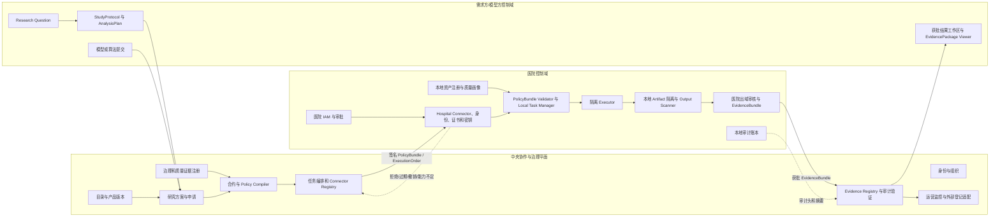

# Phase 5.13 目标架构

## 三个控制域

## 流的定义

- **控制流**：申请与协议冻结后，中央编译 PolicyBundle，并引用它签发 ExecutionOrder；Connector 独立验签、查撤销和本地审批。
- **数据流**：原始数据只在医院存储到本地 Executor；中央不接收原始数据、患者级中间结果或本地路径。
- **证据流**：治理、质量、协议、环境、执行回执、输出审核和医院审计头形成 EvidenceBundle，获批后进入中央 Evidence Registry。
- **撤销流**：组织、合约、证书、Connector、PolicyBundle 或本地审批撤销均传播为拒绝；已签发未执行订单失效。
- **错误与拒绝流**：签名、摘要、版本、资源、质量、审批、安全姿态或能力不满足时，Connector 返回稳定错误码，不回传敏感内部细节。

## 架构不变量

1. 中央不是医院 Connector 的超级管理员，不能绕过本地审批和出域门。
2. PolicyBundle 是政策权威；ExecutionOrder 只能引用，不能放宽。
3. 输入默认只读，运行默认禁网，输出默认拒绝，例外必须显式列入策略。
4. 本地 Artifact 在医院批准前不出域；中央只能看到状态和非敏感摘要。
5. 双侧审计独立存在，任一侧链断裂都阻断正式证据交付。
6. Phase 5.13B 仅实现节点身份、注册、证书骨架、心跳、能力、暂停和撤销，不传数据、不传模型、不执行任务。

